Register Factory

Der Register Factory Standard beinhaltet auch den Styleguide für die Erstellung von Informationssystemen, die eigenständig oder in einem Portal-Kontext betrieben werden.

zum Styleguide ...

https://wiki.accso.de/display/BVA/2017/07/31/Umstellung+der+Wiki-URLs+bei+Accso[Umstellung der Wiki-URLs bei Accso]

Rickert, Marcus Beitrag am Jul 31, 2017

________________________________________________________________________________________________________________________________________________________________________________________________________________________________________________________________
Die URL der Wikis bei Accso ist umgestellt worden.
Das führt dazu, dass gespeicherte Lesezeichen der Form https://dsi.accso.de/confluence/IRGENDWAS nicht mehr funktionieren.
Stattdessen muss auf das Format https://wiki.accso.de/IRGENDWAS umgestellt werden.

https://wiki.accso.de/pages/editblogpost.action?pageId=39982263[Bearbeiten]
________________________________________________________________________________________________________________________________________________________________________________________________________________________________________________________________

BVA Style Guide

Der vorliegende Style Guide definiert den Rahmen für die interaktive und visuelle Gestaltung eines universell einsetzbaren Bedienkonzeptes für das Bundesverwaltungsamt.

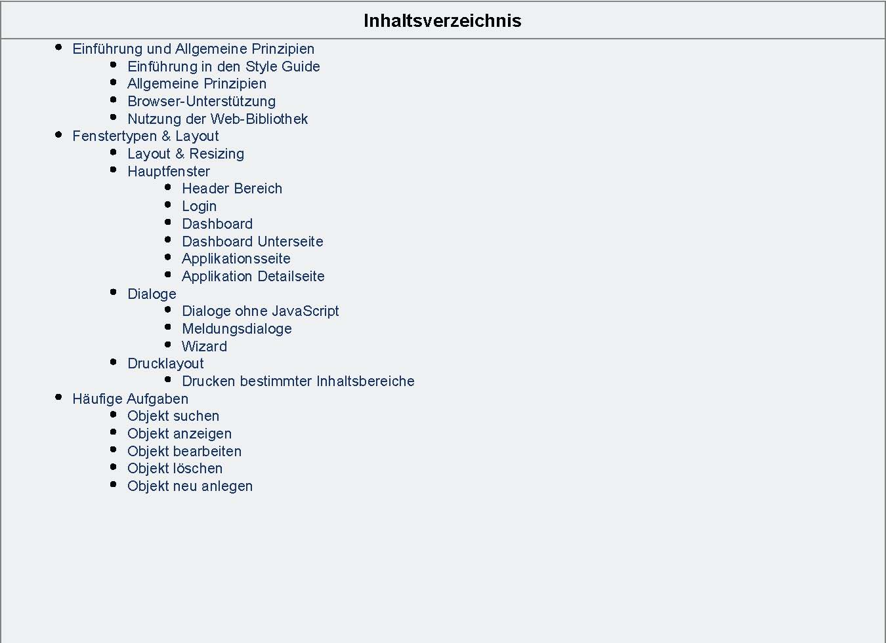

Bedienelemente

Button

a.  ______________
Toolbar Button
______________
+
___________
Menü Button
___________
+
_____________
Toggle Button
_____________
+
___________
Icon Button
___________
+
_________
Hyperlink
_________
+
_____
Label
_____
+
Eingabefelder
+
__________________
Aktionseingabefeld
__________________
+
___________________________
Eingabefeld für Geldbeträge
___________________________
+
______
Upload
______
+
________
Text Box
________
+
_____________
Dropdown Menü
_____________
+
Tabs
+
Taboverflow Menü
+
_____
Liste
_____
+
Tabelle
+
___________________________
Sortierung in einer Tabelle
___________________________
+
____________________________________
Selektionsverhalten in einer Tabelle
____________________________________
+
_________________________
Aktionen in einer Tabelle
_________________________
+
__________________________________
Große Datenmengen in einer Tabelle
__________________________________
+
_________
Check Box
_________
+
____________
Radio Button
____________
+
__________________________
Status von Bedienelementen
__________________________
+
Design Patterns
+
Navigation
+
______________________
Horizontale Navigation
______________________
+
_______________
Linksnavigation
_______________
+
__________
Quicklinks
__________
+
_________
Paginator
_________
+
Eingabe
+
Wertehilfen
+
___________
Date Picker
___________
+
___________
Time Picker
___________
+
_________________
Buchstaben Picker
_________________
+
___________________________
List Picker (Objektauswahl)
___________________________
+
____________
Editable Row
____________

Selektion

a.  Suche
+
Filter
+
Toggle-Filter
+
Filter-Zeile
+
Browse & Collect

Ausgabe

a.  Datentabelle
+
Datenvorschau

___________________________________________________________
Master-Detail
___________________________________________________________

Gruppierung

_______________________________________________________________________________
Expander (Progressive Disclosure)
_______________________________________________________________________________

image:images/image9.jpeg[image]Gruppierungs-Container

________________________________________________________________________________
Toolbar

Seiten-Toolbar

Tabellen-Toolbar

Gruppierungs-Container mit Toolbar
________________________________________________________________________________

image:images/image9.jpeg[image]Formulare

a.  Virtuelles Raster
+
Gruppierungen in Formularen
+
Layout Verhalten
+
Hinweise zur Implementierung

image:images/image9.jpeg[image]Benutzerhilfe & Unterstützung

a.  Autosuggestion
+
Platzhalter
+
Tooltips
+
Fortschrittsanzeige
+
Anzeige von Pflichtfeldern und optionalen Pflichtfeldern
+
Validierung
+
Fehlerprävention

Benutzereingaben

_______________________________________________________________
Tastatursteuerung
_______________________________________________________________

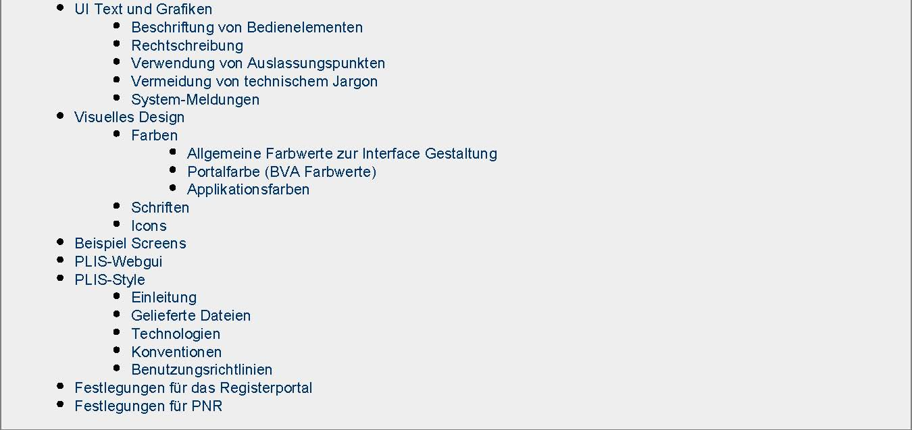

*Einführung und Allgemeine Prinzipien*

____________________________________________________________________________________________________________________________________________
Dies ist ein einführendes Kapitel und beinhaltet allgemeine Hinweise zur Benutzung des vorliegenden Style Guides. 

Des Weiteren werden allgemeingültige Prinzipien erläutert, die bei der Konzeption und Gestaltung von Software berücksichtigt werden sollten.

Abschliessenden werden die Vorgaben für die zu unterstützenden Browser festgehalten.
____________________________________________________________________________________________________________________________________________

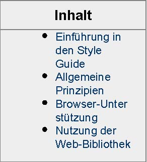

*Einführung in den Style Guide*

_*Anwendungsbereich und Abgrenzung*_

Da in einem Style Guide generische Regeln und nicht detaillierte GUI-Spezifikationen für jeden Screen einer Applikation festgelegt werden, ist es beim Screen Design notwendig, große Sorgfalt walten zu lassen.
Das vorliegende Dokument definiert einen Standard.
Wann immer die Notwendigkeit zur Nichtbefolgung eines Standards auftauchen sollte, muss über Art und Umfang der Abweichung entschieden werden.
Das heißt, der in diesem Dokument definierte Standard wird empfohlen, ist aber nicht in jedem Einzelfall als Restriktion zu verstehen.

_*Gültigkeit und Versionierung*_

Der Style Guide ist in dem hier vorzufindenen Stand gültig, der jedoch fortlaufend weiterentwickelt wird.
Wenn für ein Projekt ein festgelegter Versionsstand erforderlich ist, kann dieser bei dem unten stehenden Ansprechpartner angefragt werden.
Es wird dann ein PDF-Export zur Verfügung gestellt.

Ansprechpartner: Lena Schend, lena.schend@bva.bund.de, Telefon: 022899-358-3573

Stellv.
Ansprechpartner: Ralf Leonhard, ralf.leonhard@bva.bund.de, Telefon: 022899-358-1534

_*Begriff der Usability*_

Die Benutzerfreundlichkeit (Usability) einer Anwendung gilt heute als entscheidendes Qualitätsmerkmal und trägt nachhaltig zur breiten Akzeptanz eines Systems bei.
Der Begriff der Usability verweist auf ein qualitatives Konzept, welches das Ausmaß beschreibt, in dem ein Produkt von einem bestimmten Benutzer verwendet werden kann, um konkrete Arbeitsziele in einem vorgegebenen Kontext effektiv, effizient und zufriedenstellend zu erreichen.
Die Usability eines Produktes kann damit nicht unabhängig von einem zuvor festgelegten Benutzer bestimmt werden, sondern bezieht ausdrücklich ein umschriebenes Benutzerprofil im Sinne von gegebenen oder fehlenden Vorkenntnissen, Ausbildungen und Fertigkeiten mit ein.
Mit dem Attribut effektiv wird die Genauigkeit und Vollständigkeit angesprochen, mit der ein Benutzer sein Arbeitsziel erreicht und hierbei durch das System unterstützt wird.

Der Begriff effizient bezeichnet den im Verhältnis zur Genauigkeit und Vollständigkeit der Arbeitsdurchführung eingesetzten Ressourcenaufwand.
Für das System bestimmt die Effektivität das Qualitätsniveau der systemseitigen Arbeitsunterstützung; die Effizienz hingegen, mit welchem Lernaufwand bzw.
mit welchem mittleren Zeitaufwand eine Arbeitsaufgabe bewältigt wird.
Mit dem Attribut zufriedenstellend wird schließlich die (positive) Einstellung und das emotionale Erleben (Joy of Use) eines Benutzers gegenüber der Nutzung einer Applikation charakterisiert.

_*Prospektive Benutzergruppen und generelle Aufgabenbeschreibung*_

Als Benutzerzielgruppe werden die bisherigen Anwender (Sachbearbeiter, Polizisten, interne Anwender des Bundesverwaltungsamtes) der Bundesverwaltungsamt-Produkte ins Auge gefasst.
Bei dieser Gruppe werden elementare Kenntnisse im Bereich von Standard-Office-Applikationen vorausgesetzt.
Bei der konkreten Ausgestaltung (Spezifikation) der einzelnen Anwendungen sind die Eigenschaften der jeweiligen Benutzergruppen in Bezug auf Vorkenntnisse, Fähigkeiten, IT-Affinität usw.
zu berücksichtigen.

_*Zielgruppe des Style Guides*_

Der Style Guide richtet sich in erster Linie an Produktverantwortliche, Software-Entwickler und User Interface Designer.
Einen Überblick über die gestalterischen Grundlagen des Systems liefert der Style Guide aber auch für Marketing-Experten und die Verantwortlichen des Corporate Design.
Alle Teile des Style Guides sind erweiterbar und sollten über die Zeit hinweg fo rtgeschrieben und ergänzt werden.

_*Zielsetzung des Styleguides*_

Konsistenz, Einheitlichkeit und visuelle Attraktivität sind entscheidende Qualitätskriterien für die Benutzerfreundlichkeit eines User Interfaces.
Style Guides gewährleisten ein einheitliches Look & Feel von Applikationen und schaffen so die Voraussetzungen dafür, dass Benutzern eine schnelle Einarbeitung in Logik, Ablauf und Funktionsweise einer Anwendung und eine befriedigende Arbeit ermöglicht wird.
Neben der Vereinheitlichung und der damit verbundenen Erhöhung der Benutzerfreundlichkeit liegt ein wesentlicher wirtschaftlicher Vorteil eines Style Guide in der Steigerung der Effizienz, da er Lösungen für wiederkehrende Aufgabenstellungen innerhalb einer Applikation bzw.
eines Applikationspakets bietet.
Der vorliegende Style Guide definiert den Rahmen für die interaktive und visuelle Gestaltung eines universell einsetzbaren Bedienkonzeptes für das Bundesverwaltungsamt.
Es gibt Richtlinien und Regeln für die detaillierte Ausgestaltung einzelner Screens.
Um eine breite Generalisierbarkeit der in diesem Dokument vorgestellten Entwurfsgrundlagen zu ermöglichen, jedoch gleichzeitig eine konkrete Hilfestellung für die Gestaltung der Schnittstelle zu bieten, werden vorgestellte Designrichtlinien durch Musterlösungen in Form von Beispiel-Screens ergänzt.

*Allgemeine Prinzipien*

Zur Konzeption und Gestaltung von benutzerfreundlicher Software können einige generelle Prinzipien zu Rate gezogen werden.
Diese Prinzipien werden hier beschrieben.

*Regeln zur Gestaltung eines User Interfaces*

Um die Benutzer-System-Interaktion in ihrer Effizienz sowohl in der Einarbeitungsphase als auch im Routinebetrieb zu steigern, müssen das Bildschirmlayout, die visuelle Ausgestaltung des Graphical User Interfaces (GUI) und die Grundlage der Interaktion mit dem System der Anwendung einer beschränkten Auswahl konsistenter, applikationsübergreifender Designprinzipien entsprechen.
Die im Folgenden ausführlich beschriebenen Prinzipien basieren sowohl auf wissenschaftlichen Erkenntnissen als auch auf Erfahrungen und können in diesem Sinne als Best-Practice-Regeln zur Ableitung konkreter Hinweise für den Entwurf der Benutzerschnittstelle verstanden werden.

*Unterstützung kontextabhängiger Interaktion*

Die zu einem Objekt (z.B. Listeneintrag) verfügbaren Funktionen sollen dort auffindbar sein, wo sie angewendet werden können.
Der Benutzer sollte möglichst nicht gezwungen werden, nach kontextabhängigen Standardfunktionen in globalen Menüs zu suchen.
Als Beispiel kann die Verwendung von Kontextmenüs genannt werden, durch die Funktionen genau dort angeboten und unterstützt werden, wo sie aktuell gebraucht werden und anwendbar sind.

*Vermeidung unnötigen Interaktionsaufwands*

Das System darf vom Benutzer nur möglichst wenige Eingaben und Interaktionen fordern.
Beispiel: Wenn der Benutzer oft gezwungen ist, Fenster zu verschieben oder zu skalieren, um einfache Ziele zu erreichen, ist dies ein Indikator für vermeidbaren Interaktionsaufwand.
Dieser Aufwand kann z.B. auch durch sinnvolle Standardwerte reduziert werden.

*Vermeiden einer Vielzahl gleichzeitig geöffneter Fenster*

Die Eingabe von Parametern darf sich nicht über eine Vielzahl von verschachtelten Fenstern erstrecken.
Stattdessen werden die unterschiedlichen Parameter mit Hilfe von Tabs, Listen oder Bäumen innerhalb eines Fensters so gruppiert, dass der Überblick gewahrt bleibt.

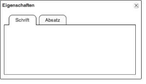

[[fig-1]]
.: Gliederung mittels Tabreiter

*Verwendung von visuell reichhaltigem und amodalem Feedback*

Die Unterbrechung des Arbeitsflusses sollte vermieden werden.
Der Nutzer ist visuell (und optional akustisch) und ohne eigene Aktion über zentrale Systemzustände zu informieren.
Amodal bedeutet, dass Feedback unmittelbar gegeben werden sollte, ohne den Benutzer zur Navigation oder Interaktion (z.B. mit Meldungsdialogen) zu zwingen.
Modale Meldungsdialoge sind nur dann zu verwenden, wenn eine Eingabe des Benutzers unmittelbar benötigt wird oder nur so schwerwiegende Probleme (z.B. Datenverlust) verhindert werden können.

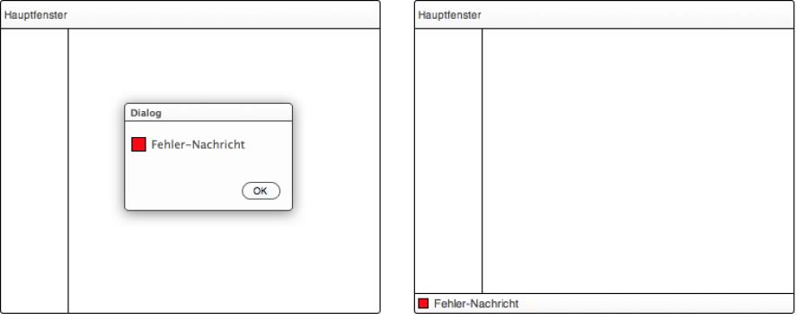

[[fig-2]]
.: Modales und amodales Feedback im Vergleich

*Nutzung von Aufgabenkohärenz*

Die Aufgaben und die Objekte, mit denen ein Benutzer arbeitet, werden mit hoher Wahrscheinlichkeit wiederverwendet.
Dem Benutzer sind deshalb Möglichkeiten für einen vereinfachten Zugriff auf sich wiederholende Vorgänge und wiederverwendete Objekte anzubieten.
Dies ist auch die zugrunde liegende Idee bei der Verwendung von Favoriten-Listen.
Ein Beispiel für die Berücksichtigung der Aufgabenkohärenz ist das Anbieten von Vorlagen, welche die Auswahl von einzelnen Parametern zu schnell auswählbaren Gruppen zusammenfassen.

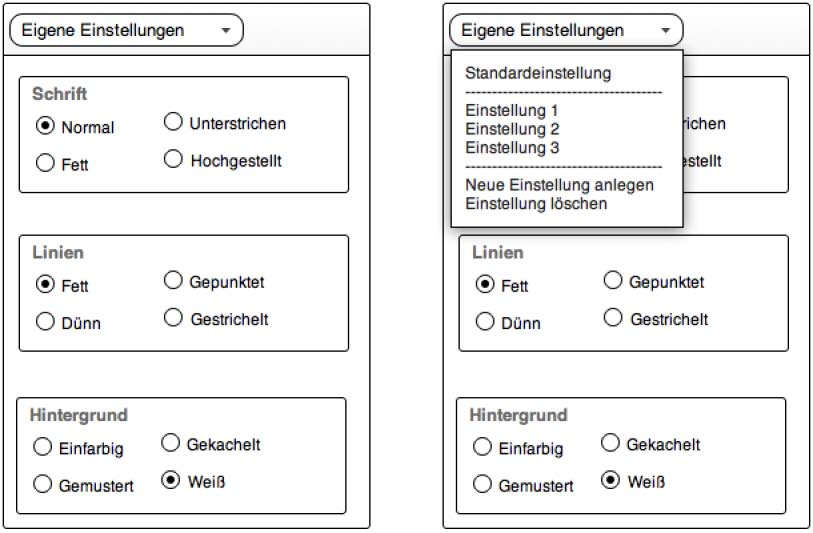

[[fig-3]]
.: Bereitstellung von Vorlagen

*Ausgleich zwischen Mächtigkeit und Komplexität eines Interfaces*

*Bereitstellen nützlicher Standardwerte*

Wo es möglich ist, müssen Eingabeelemente (z.B. Dropdown Menüs) sinnvolle Standardwerte aufweisen, die idealerweise vom Benutzer direkt übernommen werden können.

*Förderung der Herausbildung von Gewohnheiten*

Die Benutzerschnittstelle muss konsistent gestaltet sein, um leicht bedient werden zu können.
Funktionen müssen auch in verschiedenen Ansichten immer an der gleichen Stelle auffindbar sein.
Interaktionsmuster müssen dieselbe Syntax aufweisen (z.B. 1. Wähle Objekt, 2. Wende Funktion darauf an).

*Nutzung von Information Hiding ("Progressive Disclosure")*

Anzeige- und Eingabebereiche müssen nicht immer die gesamten Möglichkeiten anzeigen, sondern sollten nur die häufig benötigten Elemente direkt darstellen.
Zusätzliche Interaktionsmöglichkeiten können in Bereiche gelegt werden, die erst auf Anforderung des Benutzers zugänglich werden.

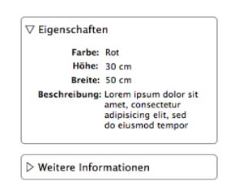

[[fig-4]]
.: Progressive Disclosure

*Präferenz des Wiedererkennens gegenüber dem Erinnern*

Es fällt Menschen leichter, ein Objekt oder eine Aktion wieder zu erkennen, als sich aktiv an diese zu erinnern.
Wo es möglich ist, muss dem Benutzer deshalb ein visueller Hinweis auf abrufbare Objekte und Prozeduren gegeben werden.
Funktionen und Informationen müssen dort angezeigt werden, wo sie benötigt werden.

*Problembeschreibung*

Das Bedürfnis von Benutzern, jeweils alle situativ notwendigen Informationen präsent zu haben, steht oft der Erfordernis gegenüber, Novizen (Benutzer, die sich gerade in das System einarbeiten) nicht mit zu viel Information zu konfrontieren.
Zur Reduktion dieses Spannungsfeldes bieten sich für den Entwurf des User Interfaces die im Folgenden genannten Methoden an.

*Reduktion der Belastung des Arbeitsgedächtnisses*

Die Arbeitsgedächtnisbelastung des Benutzers ist zu minimieren.
Es sollten möglichst viele Informationseinheiten visualisiert werden, die der Benutzer dann leichter verarbeiten kann.

image:images/image16.jpeg[image,width=399,height=197]

[[fig-6]]
.: Negativ-Beispiel - Arbeitsgedächtnis wird unnötig belastet

*Thematische Gruppierung von Parametern*

Thematisch Zusammengehöriges muss auch visuell als Gruppe erkennbar sein.
Zusammengehörige Parameter werden beispielsweise in visuell separierte Bereiche gefasst.

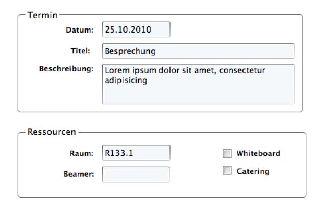

[[fig-5]]
.: Gruppierung zusammengehöriger Bereiche

*Verfassen von adäquaten Texten*

Verständlicher und präziser Text ist ein ausschlaggebendes Kriterium für die Produktivität einer Software.
Gleichwohl ist technischer Jargon weit verbreitet, der für Endanwender letztlich nur schwer verständlich ist.
Zudem ist es sehr wichtig, applikationsübergreifend konsistente Begrifflichkeiten zu verwenden.
Weiterhin ist bei der Erstellung von Texten darauf zu achten, die Benutzer nicht mit unangemessen langen Texten zu demotivieren.

a.  Sprechen Sie die Sprache des Benutzers
+
Vermeiden Sie unnötig lange Texte

*Angemessener Einsatz von Farben, Fonts und Icons*

Große Teile des Look & Feel eines User-Interface werden mit dem Einsatz von , , Grafiken und Icons definiert.
Daher ist es äußerstFarben Fonts

bedeutsam, diese Elemente angemessen und konsistent zu verwenden.
So sollen nicht zu viele unterschiedliche Schriftarten innerhalb einer Applikation verwendet werden.
In der Regel führen bereits mehr als zwei verschiedene Schriftarten zu einem unruhigen Erscheinungsbild.
Auch der Einsatz von Farben soll systematisch und behutsam erfolgen.
Die im Kapitel Farben definierten Farbwerte, sollten hierbei als Vorgabe gesehen werden.
Bei der semantischen Verwendung von Farben dürfen diese niemals als alleiniger Indikator genutzt werden.
Es sind verschiedene Formen der Farbenfehlsichtigkeit in der Bevölkerung weit verbreitet.
Es empfiehlt sich daher eine Form der redundanten Kodierung, so kann die Bedeutung einer Farbe z.B. mittels einer Form oder eines Icons unterstützend transportiert werden.

*Vermeidung von Fehlern*

Ein benutzerfreundliches User-Interface versucht das Auftreten von Fehlern im Voraus zu unterbinden.
Dazu zählt u. a. das Bereitstellen eines angemessenen Bedienelementes für einen bestimmten Use-Case.
Der Einsatz nicht angemessener Bedienelemente erhöht die Fehler-Anfälligkeit eines User-Interface.
Temporär nicht verfügbare Bedienelemente werden deaktiviert und der Einsatz von Eingaberestriktionen muss von Fall zu Fall betrachtet werden.
So soll z.B. ein Drop-down-Menü anstelle eines Freitext-Feldes eingesetzt werden, wenn nur bestimmte Eingabewerte erlaubt sind.
Fehleingaben durch den Benutzer werden somit implizit ausgeschlossen.

*Bereitstellung eines effektiven Fehlermanagements*

Selbstverständlich lässt sich das Auftreten von Fehlern niemals gänzlich vermeiden.
Daher ist eine einfache und effektive Fehlerbehandlung von großer Bedeutung.
Eine wenig effiziente Fehlerbehandlung kann einerseits eine dramatische Reduzierung der User-Experience zur Folge haben sowie gleichzeitig die Support-Kosten in die Höhe treiben.
Unnötige Dialog-Fenster müssen dringend vermieden werden.
Vielmehr empfiehlt sich der Einsatz amodalen Feedbacks, wie z.B. durch Status-Leiste-Nachrichten.
Modale Dialoge werden nur dann verwendet, wenn kritische Probleme auftreten oder direkte Eingaben des Benutzers benötigt werden.

*Barrierefreiheit*

Die Barrierefreiheit einer Anwendung beschreibt das Ausmaß, inwieweit die Anwendung für möglichst viele Menschen zugänglich ist, unabhängig

vom Alter und von möglichen Einschränkungen durch Behinderungen.
Im englischsprachigen Raum wird hierfür der Begriff „Accessibility" (Zugänglichkeit) verwendet.

Das Ziel der barrierefreien Gestaltung liegt vor allem darin, eine verbesserte Zugänglichkeit für Menschen mit Behinderung und ältere Menschen zu erreichen.
Hiervon ist ein großer Anteil der Bevölkerung betroffen, zumal es neben Menschen mit permanenter Behinderung auch viele Menschen gibt, die nur zeitweise hinsichtlich der Bedienung eingeschränkt sind.
Barrierefreie Gestaltung ermöglicht nicht nur Zugänglichkeit für mehr Menschen, sondern verbessert auch deren Einbeziehung in die Anwendung.
Darüber hinaus bewirkt eine erhöhte Barrierefreiheit allgemein für Benutzer auch eine Verbesserung der Usability.
In vielen Ländern wird Barrierefreiheit (insbesondere für Webseiten) durch Gesetze bzw.
Richtlinien geregelt, um einen allgemeinen Zugang zu öffentlichen Internetdiensten zu erreichen.

*Richtlinien und Prinzipien*

Im Rahmen des World Wide Web Consortium (W3C) wurden die sogenannten „Web Content Accessibility Guidelines" (WCAG) verfasst, um einen gemeinsamen Standard für die Barrierefreiheit von Webinhalten zu schaffen.
Dabei handelt es sich um Richtlinien für die barrierefreie Gestaltung von Webinhalten im Hinblick auf drei Erfüllungsgrade (Conformance Levels A, AA und AAA). Diese Richtlinien basieren auf den folgenden vier Prinzipien für eine barrierefreie Anwendung:

_____________________________________________________________________________________________________________________________________________________________________________________________
**Wahrnehmbar** – Präsentation der Benutzerschnittstelle, so dass diese für Benutzer wahrnehmbar ist (mittels Sehkraft, Gehör oder Berührung).
_____________________________________________________________________________________________________________________________________________________________________________________________

a.  *Bedienbar* – Benutzerschnittstelle muss bedienbar bzw.
navigierbar sein und kompatibel mit Tastatur oder Maus.
+
*Verständlich* – Informationen und Bedienung müssen verständlich sein.
+
*Robust* – Die Benutzerschnittstelle funktioniert zuverlässig mit verschiedenen Browsern, assistiven Technologien (z.B. Screen Reader), mobilen Geräten, alten Geräten/Browsern.

In Deutschland gilt das Behindertengleichstellungsgesetz (BGG), welches eine Benachteiligung von behinderten Menschen verhindern soll.
Als Teil dieses Gesetzes wurde die sogenannte Barrierefreie-Informationstechnik-Verordnung (BITV) verfasst.
Diese gilt verbindlich für Bundesbehörden im Hinblick auf deren Internetauftritte und öffentlich zugängliche Terminals.
Die BITV wendet als Grundlage die Prinzipien und Richtlinien der WCAG an.

*Browser-Unterstützung*

Bei der Erstellung der Webseiten nach diesem Styleguide muss die korrekte Darstellung und Funktionsweise der Webseiten geprüft werden.
Dazu muss für jedes Projekt der Nutzerkreis ermittelt und geprüft werden, welche Browser und Versionen hauptsächlich eingesetzt werden.
Der Styleguide gibt nur ein minimales Set von zu unterstützenden Browserversionen vor, die projektspezifisch nach Bedarf erweitert werden sollten.

Es müssen mindestens folgende Browser und Konstellationen in SXGA- und UXGA-Auflösung (s. Layout & Resizing) getestet werden:

a.  Internet Explorer 11
+
Microsoft Edge (für Windows 10 / Bundesclient)
+
Firefox ESR, jeweils aktuelle Version (Stand Juli 2016 ESR 45 - s. https://www.mozilla.org/en-US/firefox/organizations/faq/[Firefox-ESR-Roadmap])

_______________________________________________________________________________________
Chrome, jeweils aktuelle stabile Version
_______________________________________________________________________________________

Die Unterstützung dieser Browser in der jeweils aktuellen supporteten Version entspricht auch der Empfehlung des BSI (Stand August 2016).

*Nutzung der Web-Bibliothek*

Der vorliegende Styleguide ist in einer Java Bibliothek (PLIS-Web) umgesetzt.
Diese Bibliothek enthält notwendige Abhängigkeiten (Maven), Spring-Konfigurationen, CSS-Dateien, JSF-Komponenten (Composite Components) sowie zugehörige JSF-Templates (.xhtml). Die Bibliothek PLIS-Web setzt wiederum die Bibliothek PLIS-Style ein.
In der PLIS-Style werden die CSS-, JavaScript- und Bilddateien des Styleguides abgelegt und für die Nutzung komprimiert und kompiliert.

In diesem Abschnitt werden die Grundlagen zur Nutzung der PLIS-Web erläutert.
Details zur Architektur und weitere Vorgaben finden sich im Register Factory Detailkonzept Komponente Web GUI (TODO: Link ergänzen).

*Einbindung in Anwendung*

Bei Einsatz der PLIS-Web werden viele Konfigurationen bereits vorgenommen.
Die Anwendung muss nur noch wenige Einstellungen vornehmen.
Nachfolgend werden diese Schritte erläutert.

*Maven Abhängigkeit*

Die Maven Abhängigkeit für die PLIS-Web lautet:

<dependency>

<groupId>de.bund.bva.pliscommon</groupId> <artifactId>plis-web</artifactId> <version>x.y.z</version>

</dependency>

Die Bibliothek bringt alle notwendigen Abhängigkeiten mit (Spring, Spring-Webflow, JSF, etc.). Anpassungen an den Abhängigkeiten können direkt in der Abhängigkeitsdefinition der Anwendung durchgeführt werden.

*Konfiguration web.xml*

Die web.xml der Anwendung muss entsprechend den Vorgaben konfiguriert werden (siehe Detailkonzept). Aus Sicht der Styleguide-Umsetzung ist vor allem die Konfiguration des ApplicationIntialisierungFilter wichtig.
Dieser Filter ist zuständig für die JavaScript Erkennung und die damit verbunden Konfiguration der globalen Einstellungen für die Session des Nutzers.
Beispiel:

<filter> <filter-name>applicationInitialisierungFilter</filter-name>

<filter-class>de.bund.bva.isyfact.common.web.servlet.filter.ApplicationInitialisierungFilter</filter-class>

<!-- Optionaler Parameter: Der Parameter "urlsToSkip" dient zur Aufnahme von Url-Pfaden, relativ zum ApplicationContext-Pfad, die von der Filterung ausgenommen werden.
Mehrere Url-Pfade sind kommasepatiert anzugeben.
Es ist

pro Url ein fuehrendes "/" anzugeben. -->

__________________________________________________________________________________________
<init-param> <param-name>urlsToSkip</param-name> <param-value>/app/resources</param-value>

</init-param>
__________________________________________________________________________________________

<!-- Plicht-Parameter: Der Parameter "urlApplicationInitialisierung" enthaelt die Url zur Application-Initialisierungsseite.
Es ist ein fuehrendes "/" anzugeben. -->

________________________________________________________________________________________________________________________________________________
<init-param> <param-name>urlApplicationInitialisierung</param-name> <param-value>/app/common/init/applicationInitialisierung.xhtml</param-value>
________________________________________________________________________________________________________________________________________________

</init-param> </filter>

*Konfiguration Spring*

Folgende Konfiguration müssen in die anwendungsspezifische Spring-Konfiguration übernommen werden:

a.  Für die GUI/Spring-Webflow: <import resource="classpath:resources/plis-web/spring/webflow.xml"/>
+
Für die Widgets und Controller: <import resource="classpath:resources/plis-web/spring/controller.xml"/>
+
Konfiguration ("konfiguration") Die Konfigurationsschnittstelle aus der plis-konfiguration.
+
MessageSource ("messageSource") Die MessageSource (aus Spring Core) der Anwendung.
+
AufrufKontextVerwalter ("aufrufKontextVerwalter") Den AufrufKontextVerwalter aus der plis-aufrufkontext zum Zugriff auf Nutzerinformationen.
+
AufrufKontextFactory ("aufrufKontextFactory") Die AufrufKontextFactory aus der plis-aufrufkontext zum Erzeugen von AufrufKontext-Objekten.
+
Sicherheit ("sicherheit") Die Sicherheit aus der plis-sicherheit.
+
AusnahmeIdMapper ("ausnahmeIdMappper") Ein konkreter Ausnahme-ID-Mapper.
Zuständig für die Fehlerbehandlung in der GUI.

____________________________________________________________________________________________________________________________________________________
Für Spring-Security: <import resource="classpath:resources/plis-web/spring/plis-sicherheit-web.xml"/>
____________________________________________________________________________________________________________________________________________________

Die eingebundenen Spring-Konfigurationen erwarten folgende Beans unter dem angegebenen Namen vorzufinden:

*Konfiguration JSF-Renderer*

Derzeit muss noch folgende Konfiguration in die faces-config.xml der Anwendung aufgenommen werden:

<!-- Spezifische Renderer müssen hier erneut angegeben werden, um die existierenden Renderer aus der Tomahawk Bibliothek zu überschreiben --> <render-kit> <!-- Spezieller Renderer für t:radio Elemente, welcher kein Label rendert. --> <renderer> <component-family>org.apache.myfaces.Radio</component-family> <renderer-type>org.apache.myfaces.Radio</renderer-type> <renderer-class>de.bund.bva.isyfact.common.web.jsf.renderer.NoLabelHtmlRadioRenderer</renderer-class> </renderer>

<!-- Spezieller Renderer für Checkboxen, welcher kein Label rendert. --> <renderer> <component-family>org.apache.myfaces.Checkbox</component-family> <renderer-type>org.apache.myfaces.Checkbox</renderer-type> <renderer-class>de.bund.bva.isyfact.common.web.jsf.renderer.NoLabelHtmlCheckboxRenderer</renderer-class> </renderer> </render-kit>

*Zugriff auf das Framework*

Zur Steuerung des Frameworks werden Controller und Models definiert, welche durch Einbindung der Spring-Konfiguration automatisch über Spring verfügbar sind, bzw.
per EL-Expressions in XHTML und Flows benutzt werden können (siehe Bean-Name in Klammern). Dies sind folgende:

a.  GlobalConfigurationController ("globalConfigurationController") mit GlobalConfigurationModel ("globalConfigurationModel" -ConversationScope) Enthält die globale Konfiguration der Nutzer-Session (z.B. Informationen über JavaScript Status)
+
GlobalFlowController ("globalFlowController") mit GlobalFlowModel ("globalFlowModel" - FlowScope) Kontrolliert Zustände für einen konkreten Flow und bietet Zugriff auf querschnittsfunktionalität wie den MessageController und ValidationController (siehe unten)
+
BasisController ("basisController") mit BasisModel ("basisModel" - FlowScope) Vereinigt die gemeinsamen Elemente und die Steuerung des Layouts für alle Seitentypen innerhalb der Anwendung.
Konfiguriert z.B. den Zugriff auf den Informationesbereich und auf die Seitentoolbar.
Stell Funktionen für die Druckansicht und für die Anzeige von modalen Dialogen zur Verfügung.
+
ApplikationseiteController ("applikationseiteController") mit ApplikationseiteModel ("applikationseiteModel" - FlowScope) bzw.
DetailseiteController ("detailseiteController") mit DetailseiteModel ("detailseiteModel" - FlowScope) Konkrete Controller für die derzeit existierenden Seitentypen (siehe Applikationsseite und Applikation Detailseite).

Weiterhin existieren Controller für Teilbereiche:

a.  ErrorController ("errorController") mit ErrorModel ("errorModel" - FlowScope) Spezieller Controller und Model für die Darstellung der Fehlerseite.
+
ValidationController ("validationController") mit ValidationModel ("validationModel" - FlashScope) Zuständig für die Verarbeitung von ValidationMessages (siehe auch Validierung).
+
MessageController ("messageController") Verwaltet den Zugriff auf die FacesMessages im aktuellen FacesContext.
Stellt Methoden zur Ausgabe von Nachrichten bereit (siehe Vali dierung).
+
LinksnavigationController ("linksnavigationController") und LinksnavigationModel ("linksnavigationModel" - FlowScope). Steuert die Linksnavigation.
Bietet Methoden zum manuellen Überschreiben der Linksnavigation (siehe Linksnavigation)
+
QuicklinksController ("quicklinksController") und QuicklinksModel ("quicklinksModel - FlowScope). Steuert die Quicklinks.
Bietet Methoden zum Anlegen und Entfernen von Quicklinks (siehe Quicklinks).

*Zugriff auf das Layout*

Die Vorgabetemplates können über die JSF-Template Mechanismen eingebunden werden.
Das Framework stellt die Templates /WEB-INF/gui/common/layout/applikation.xhtml (Applikationseite) und /WEB-INF/gui/common/layout/applikationDetailseite.xhtml (Detailseite) zur Verfügung.
Diese erben wiederum von /WEB-INF/gui/common/layout/basis.xhtml, welches das grundlegende Layout vorgibt und alle notewendigen Skripte und Ressourcen einbindet.

Die Templates bieten folgende Schnittstellen über den ui:define/ui:insert Mechanismus von JSF an:

_______________________________________________________________________________________________________________________________________________________________________________________________________________________________________________________________
inhaltsbereich: Der eigentliche Inhaltsbereich der Seite.

headIncludes: Zum Einbinden von weiteren Ressourcen in den HTML Header.

script: Zum Einbinden von seitenspezifischen JavaScript.

modalDialogPlaceholder: Zum Einbinden von modalen Dialogen.

printMetaInformation: Die Stelle um Meta-Informationen für Druckausgaben zu hinterlegen.

form: Zusätzliche Form-Elemente können hier eingebunden werden.
Normalerweise stellt das Layout ein Form bereit.
Für spezifische Anpassungen (z.B. AJAX-Listpicker) müssen jedoch eigene Forms definiert werden.
_______________________________________________________________________________________________________________________________________________________________________________________________________________________________________________________________

Das CSS für den Styleguide wird automatisch geladen und eingebunden.
Zur anwendungsspezifischen Anpassung des CSS können folgende Dateien in der Anwendung verwendet werden:

________________________________________________________________________________________________________________________________
/css/custom-styles.css - Spezielle CSS Klassen für die Anwendung.

/css/custom-print.css - Spezielle CSS Klassen für die Druckansicht der Anwendung.
________________________________________________________________________________________________________________________________

*Beispiel - Erzeugen einer neuen Maske*

Im folgenden werden die Schritte aufgezeigt, welche durchgeführt werden müssen, um eine neue Maske mit der Nutzung des Styleguides anzulegen:

*Erzeugen eines Controllers und eines MaskenModels*

a.  Controller muss von AbstractGuiController erben.
+
Controller muss in Spring als Bean konfiguriert werden.
+
Model muss von AbstractMaskenModel erben.

*Erzeugen der Flow-Definition für Spring-Webflow*

Beispiel:

<?xml version="1.0" encoding="UTF-8"?> <flow xmlns="http://www.springframework.org/schema/webflow" xmlns:xsi="http://www.w3.org/2001/XMLSchema-instance" xsi:schemaLocation="http://www.springframework.org/schema/webflow[http://www.springframework.org/schema/webflow http://www.springframework.org/schema/web]http://www.springframework.org/schema/webflow/spring-webflow-2.0.xsd[flow/spring-webflow-2.0.xsd]"

____________________________________
parent="applikationseiteParentFlow">
____________________________________

<secured attributes="..."/>

______________________________________________________________________________________
<var name="beispielseiteMaskenModel" class="de.bund.bva....BeispielseiteMaskenModel"/>
______________________________________________________________________________________

<on-start> <evaluate expression="beispielseiteMaskenController.initialisiereModel(beispielseiteMaskenModel)"/> </on-start>

<view-state id="beispielseiteViewState" model="beispielseiteMaskenModel"> ... </view-state>

__________________________
<end-state id="beendet" />
__________________________

</flow>

Je nach Seitentyp muss entweder der detailseiteParentFlow oder der applikationseiteParentFlow als Parent-Flow angegeben werden.
Das Model wird als Variable definiert und damit im Flow erzeugt ("beispielseiteMaskenModel"). In der on-start Definition wird der Controller aufgerufen, um das Model zu initialisieren.
Dieser Schritt ist optional.

*Erzeugen des View-States*

Beispiel:

<!DOCTYPE composition PUBLIC "-//W3C//DTD XHTML 1.0 Transitional//EN" "http://www.w3.org/TR/xhtml1/DTD/xhtml1-transitional.dtd[http://www.w3.org/TR/xhtml1/DTD/xhtm]http://www.w3.org/TR/xhtml1/DTD/xhtml1-transitional.dtd[l1-transitional.dtd]"> <ui:composition xmlns="http://www.w3.org/1999/xhtml"

______________________________________________________________________________________________________________________________________________________________________________________________________________________________________________________________________________________________
 xmlns:ui="http://java.sun.com/jsf/facelets" xmlns:h="http://java.sun.com/jsf/html" xmlns:f="http://java.sun.com/jsf/core" xmlns:sf="http://www.springframework.org/tags/faces" xmlns:isy="http://java.sun.com/jsf/composite/isyfact" template="/WEB-INF/gui/common/layout/applikation.xhtml">
______________________________________________________________________________________________________________________________________________________________________________________________________________________________________________________________________________________________

 <!-- Zusätzliches JS einbinden --> <ui:define name="script"> <script type="text/javascript" src=".../beispielseite.js" /> </ui:define>

<!-- Form für AJAX-Seiteninhalt definieren --> <ui:define name="form"> <h:form id="listpickerAjaxForm"> <isy:formListpickerAjaxContent ... /> </h:form> </ui:define>

<!-- Metainformationen für die Druckausgabe --> <ui:define name="printMetaInformation"> <ui:include src="...xhtml"/> </ui:define>

<!-- Der Inhaltsbereich --> <ui:define name="inhaltsbereich"> ... </ui:define> </ui:composition>

Je nach Seitentyp muss entweder /WEB-INF/gui/common/layout/applikationDetailseite.xhtml oder /WEB-INF/gui/common/layout/applikation.xhtml als Template angegeben werden.

*Fehlerbehandlung*

siehe auch System-Meldungen und Validierung.

Die Darstellung von technischen Ausnahmefehlern wird bereits automatisch von der Bibliothek übernommen.
Für Fehler beim Zugriff auf den Anwendungskern kann zusätzlich eine Fehlerbehandlung im Controller eingeführt werden (try/catch). So können checked und unchecked Exceptions abgefangen werden.
Der MessageController bietet hierzu Methoden (writeException, writeAndLogException) zum Loggen und Erzeugen von Fehlern/Warnungen im Nachrichtenbereich an.

Es gelten folgende Regelen:

a.  Fachliche Fehler (PlisBusinessException) werden als Warnmeldungen im Nachrichtenbereich der GUI angezeigt
+
Andere Fehler (Laufzeitfehler, PlisTechnicalException, PlisTechnicalRuntimeException) werden mit einer technische Fehlermeldung im Nachrichtenbereich der GUI angezeigt.

*Fenstertypen & Layout*

____________________________________________________________________________________________________
Im Folgenden werden die Fenstertypen und das allgemeine Layoutverhalten der Applikation beschrieben.
____________________________________________________________________________________________________

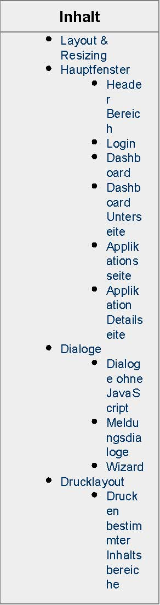

*Layout & Resizing*

*Bildschirmauflösung & Resizing*

Die Layouts sind für eine Bildschirmauflösung von *1280x1024 px* (SXGA) zu optimieren.
Es muss jedoch sichergestellt sein, dass auch niedrigere und größere Bildschirmauflösungen unterstützt werden.
Einige Bereiche des Layouts können ihre Größe, entsprechend der Auflösung, flexibel anpassen.
Das genaue Verhalten der einzelnen Bereiche und Elemente wird in den entsprechenden Kapiteln näher beschrieben.

*Richtlinien zur Anwendung*

a.  Wird das Browserfenster bei einer Größenveränderung kleiner als 1024x768 px und die Inhalte lassen sich nicht mehr sinnvoll darstellen, so wird das Browserfenster scrollbar.
+
Generell sollte beim Layout eines Screens darauf geachtet werden horizontale Scrollbalken möglichst zu vermeiden.
+
Ab einer gewissen Fenstergröße werden die Mauswege zu lang und die Benutzung der Anwendung wird dadurch erschwert.
Bei Auflösungen größer als *1600x1200 px* (UXGA) sollten deshalb die Inhalte nicht mehr größer skaliert werden.
In solchen Fällen wird die Applikation links auf dem Bildschirm ausgerichtet und rechts entsteht Whitespace.
+
Da es sich bei den Inhalten der Anwendungen des Bundesverwaltungsamtes hauptsächlich um Formulare handelt, soll sich die Position der Inhalte nicht ändern.
Die Spaltenanzahl bleibt bei Größenveränderung gleich und wird nicht dynamisch z.B. von 3 spaltig auf 4 spaltig angepasst.
+
Bei Größenveränderungen von Inhalten sollte immer darauf geachtet werden, dass der Lesefluss des Benutzers nicht negativ beeinflusst wird.

*Screen Layout*

Ein einfaches und klares Screen-Layout sowie die korrekte Gestaltung von Formularen sind von größter Bedeutung für ein einfaches, leicht zu bedienendes User Interface.
Komplexe Layouts können die Bedieneffizienz nachhaltig negativ beeinflussen, und somit die Benutzerzufriedenheit

sowie die Produktivität senken.
Die nachfolgenden Richtlinien dienen der Erstellung effizienter, leichtgewichtiger Layouts.

*Richtlinien zur Anwendung*

a.  Es sollte jeweils nur ein angemessenes Maß an Informationen auf einem Screen oder Formular angezeigt werden.
Ein zu hohes Maß an Information erhöht die Komplexität und reduziert die Verarbeitungsgeschwindigkeit.
+
Logische Informationseinheiten sollten gruppiert werden.
+
Die präsentierten Informationen sollten entsprechend den Bedürfnissen und Erwartungen des Benutzers angeordnet sein.
+
Mauswege sollten so kurz wie möglich gehalten werden.
+
Die Notwendigkeit zwischen Maus und Tastatur zu wechseln sollte auf ein Minimum reduziert werden.
+
Eine adäquate und konsistente Ausrichtung der Beschriftung von Bedienelementen unterstützt den Benutzer beim Erfassen der präsentierten Informationen und erhöht die Verarbeitungsgeschwindigkeit.
+
Komplexe Screens können mit Hilfe verschiedener Methoden vereinfacht werden:
a.  __________________________________________________________________________
Liberaler Einsatz von Whitespace (freie Zwischenräume zwischen Elementen).
__________________________________________________________________________
+
_____________________________________________________________
Strukturierung von Informationen mit Hilfe von Gruppierungen.
_____________________________________________________________
+
___________________________________________________________________________________
Verteilen der Informationen auf verschiedene Views, z. B. mit Hilfe von Tabreitern.
___________________________________________________________________________________
+
Elemente auf einem Screen sollten entlang eines einfachen virtuellen Rasters ausgerichtet werden, um die Lesbarkeit zu erhöhen.
+
Alle Informationen auf einem Screen sollten möglichst gleichmäßig ausbalanciert werden.
Ungleich gewichtete Screens wirken unharmonisch und wirken sich negativ auf das Gesamterscheinungsbild aus.

*Einsatz eines virtuellen Rasters*

Alle Elemente eines Screens sollten an den Führungslinien eines (nicht sichtbaren) Rasters ausgerichtet werden, die dem Auge des Benutzers als Orientierung dienen können.
Dadurch wird ein wesentlich schnelleres Erfassen und Verarbeiten der dargestellten Informationen ermöglicht.

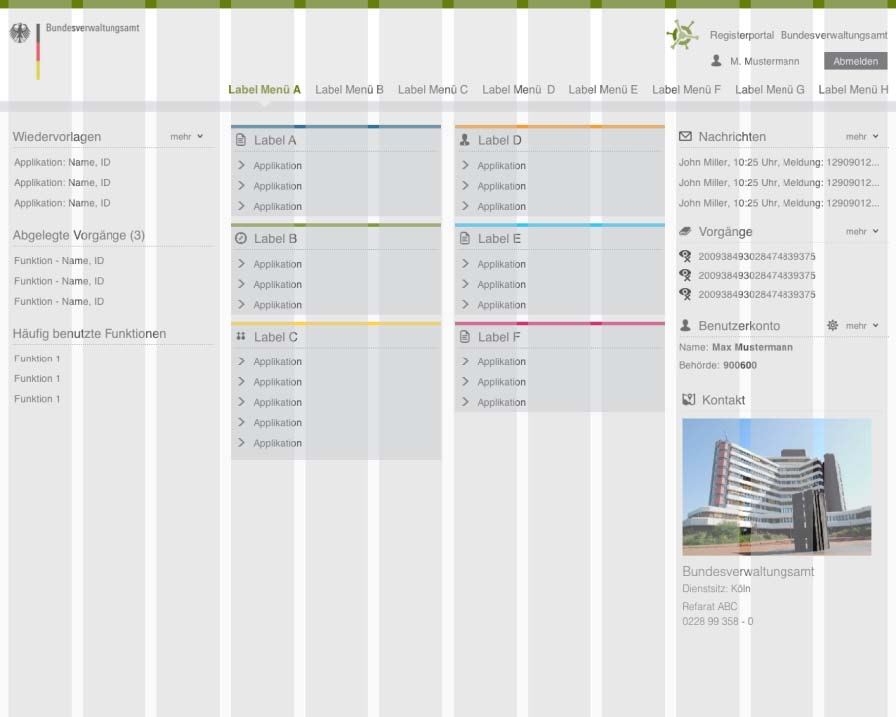

[[fig-7]]
.: Virtuelles Raster – Beispiel Dashboard

*Richtlinien zur Anwendung*

a.  Sofern möglich und sinnvoll sind alle Layout-Bereiche und Objekte auf einem Screen mit ihrer linken Kante an dem virtuellen Raster auszurichten.
+
In Dialogen kann ein eigenes Raster benutzt werden.
Dieses wird an der linken Kante des Dialoges angelegt und die Objekte im Dialog orientieren sich an diesem Raster.

*Einsatz von Gruppierungen*

Eine Gruppierung logisch zusammengehöriger Screen-Elemente erhöht die Effizienz bei der Benutzung der Anwendung.
Der Benutzer kann schneller bestimmte Informationen scannen bzw.
solche Informationen ausblenden, die für ihn zur Bearbeitung einer Aufgabe nicht notwendig sind.

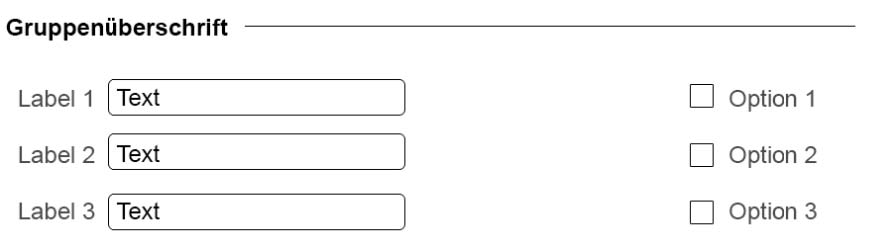

[[fig-8]]
.: Gruppierungen mit Hilfe von Überschriften

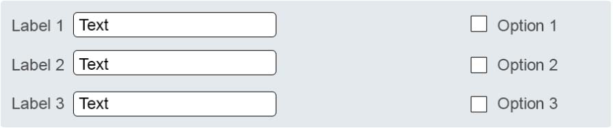

[[fig-9]]
.: Gruppierungen mit Hilfe von Hintergründen

[[fig-10]]
.: Gruppierungen mit Hilfe von Abständen

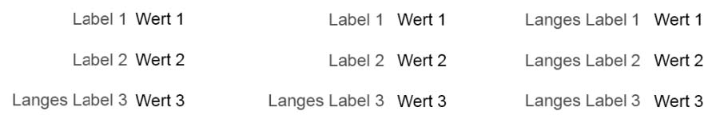

*Richtlinien zur Anwendung*

Visuelle Gruppierungen

a.  _______________________________________________________________________________________________________________________________
Objekte mit gemeinsamer Hintergrundfarbe oder visueller Umrandung werden als Gruppe wahrgenommen (Beispiel siehe Abbild ung 9).
_______________________________________________________________________________________________________________________________
+
______________________________________________________________________________________________________________________________________________________________________
Gesetz der Nähe (Gestaltpsychologie) - Objekte die näher zusammenstehen und ein Abstand zu anderen Gruppen haben, werden als Gruppe wahrgenommen (siehe<<fig-10>>).
______________________________________________________________________________________________________________________________________________________________________

a.  Auch textuelle Überschriften (siehe<<fig-8>>) können zur Gruppierung verwendet werden.
Bei Verwendung in Formularen ergibt sich so eine logische Struktur, welche für den Benutzer einfacher zu erfassen ist.
+
Der Einsatz von Gruppierungs-Überschriften sollte sparsam erfolgen, bei vielen Gruppen sollte der Einsatz eines Tab Controls in Erwägung gezogen werden.
+
Für die Master- und Detail-Bereiche sollte immer jeweils ein visueller Container / Umrandung verwendet werden.

*Hauptfenster*

Das im Folgenden beschriebene UI-Design gilt in erster Linie für browserbasierte Anwendungen des Bundesverwaltungsamtes.
Da der Benutzer nicht durch die Verwaltung mehrerer geöffneter Browserfenster oder Browsertabs belastet werden soll, arbeitet er innerhalb der Applikation mit nur einem Hauptfenster.
Im Wesentlichen besteht das Hauptfenster aus einem Header und einem Inhaltsbereich dessen Inhalt je nach Seitentyp und Applikation variieren kann.

[[fig-11]]
.: Allgemeiner Aufbau des Hauptfensters

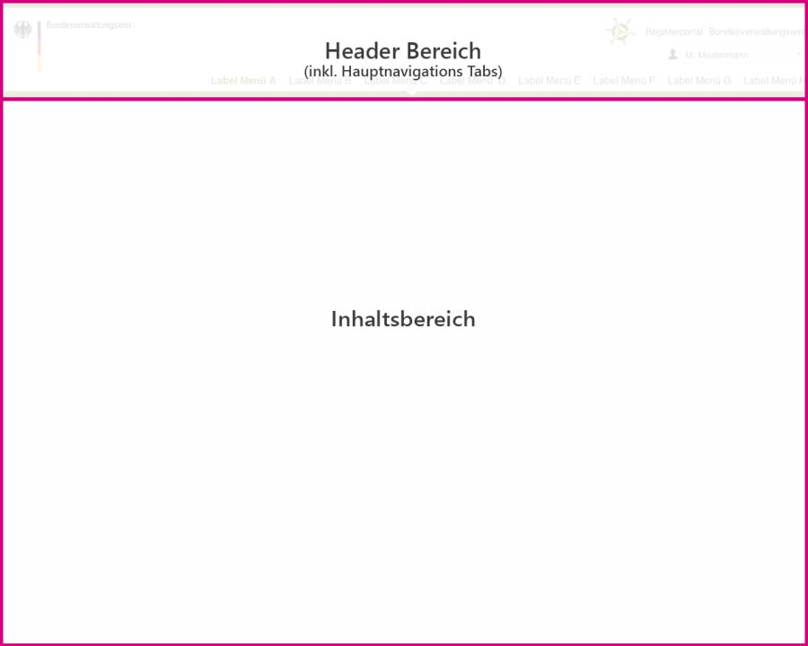

*Aufbau des Hauptfensters*

Header Bereich

Der Aufbau des Headers ist immer konsistent und ändert sich nicht.

Inhaltsbereich

a.  ________________________________________________________________________________________________________________
Inhalt und Layout wechselt je nach Seitentyp.
Die Beschreibung der Seitentypen erfolgt in den nächsten Kapiteln.
________________________________________________________________________________________________________________
+
Seitentypen
+
_____
Login
_____
+
______________________________
Dashboard (Applikationsportal)
______________________________
+
____________________
Dashboard Unterseite
____________________
+
___________
Applikation
___________
+
_______________________
Applikation Detailseite
_______________________

*Richtlinien zur Anwendung*

a.  Es existiert nur ein Hauptfenster.
+
Im Hauptfenster kann jeweils nur ein Seitentyp angezeigt werden entweder das Dashboard oder eine Applikation.
+
Das Hauptfenster kann durch Schließen des Browserfensters oder Browsertabs geschlossen werden.
+
Da sich das Hauptfenster im Browser befindet lässt es sich durch Größenänderung des Browsers in Breite und Höhe verändern.
+
Die optimale Darstellung wird ab einer Bildschirmauflösung von *1280x1024 px* (SXGA) erzielt.
+
Das Verhalten des Hauptfensters bei Größenänderungen ergibt sich aus dem Layout Verhalten der angezeigten Bereiche und Elemente innerhalb des Fensters.
Genauere Informationen finden sich bei den jeweiligen Elementen.

*Header Bereich*

Der Header Bereich enthält allgemeine Informationen der Applikation.

[[fig-12]]
.: Header

[[fig-13]]
.: Aufbau des Header-Bereiches

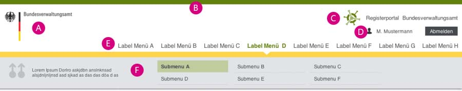

*Aufbau*

a.  *A* Logo des Portalanbieters
+
*B* Farbmarkierung des Applikationsportals
+
*C* Logo des Applikationsportals
+
*D* Login-Information
+
*E + F* Hauptnavigation und Subnavigation als Flyout (siehe Kapitel Horizontale Navigation)

*Richtlinien zur Anwendung*

a.  Der Header ist für alle Seiten innerhalb eines Applikationsportals gleich.
+
Die aktuelle Position des Benutzers (aktueller Navigationspunkt) ist immer deutlich hervorgehoben.
+
Die Login-Informationen zeigen den Namen des eingeloggten Benutzers.
Direkt daneben ist der Abmeldebutton positioniert.
+
Beim Resizing bleiben linksausgerichtete Objekte links und rechtsausgerichtete Objekte rechts und der Raum dazwischen verändert seine Größe.

*Hinweise zur Implementierung*

_Allgemeines_

Derzeit wird die Navigationsleiste im Header Bereich noch statisch geladen.
Jede Anwendung muss daher die Ressource /WEB-INF/gui/comm on/seitenelemente/navigation.xhtml mit einer spezifischen Anpassung überschreiben.

_Nutzerbereich (Name + Abmelden Button)_

Der Nutzerbereich wird nicht von der plis-web zur Verfügung gestellt, da sich z.B. das Verhalten des Logout Buttons in verschiedenen Betriebsumgebungen unterscheiden kann (unterschiedliche HTTP Parameter, etc.). Konkrete Anwendungen müssen über die Konfigurationseinstellung gui.header.nutzerbereich.xhtml.src das XHTML angeben, welches den Nutzerbereich definiert.
Die Angabe der Konfiguration ist verpflichtend.

_Titel_

Den Titel gibt es nur auf Applikations-Detailseiten (s. Implementierungshinweise dort).

_Maskentexte_

Maskentexte, die nur innerhalb eines bestimmten Flows verwendet werden, können in der Konfigurationsdatei <Flow-Name>.properties im Ordner resources/nachrichten/maskentexte definiert werden.
Wenn die jeweilige Konfigurationsdatei vorhanden ist, werden die Maskentexte automatisch geladen und in die Variable msg_currentflow abgespeichert.
Die Maskentexte des jeweiligen Flows können dann beispielsweise wie folgt ausgelesen werden:

<h:outputText value="#\{msg_currentflow.MAS_Ueberschrift}" />

Auf übergreifende Maskentexte aus der Konfigurationsdatei resources/nachrichten/maskentexte.properties kann über die Variable m sg zugegriffen werden.

*Login*

Auf dem Login Screen kann der Benutzer sich mit seinem Namen und Passwort einloggen, anschließend wird er zum Dashboard (falls vorhanden) der jeweiligen Anwendung weiter geleitet.

[[fig-14]]
.: Login Screen

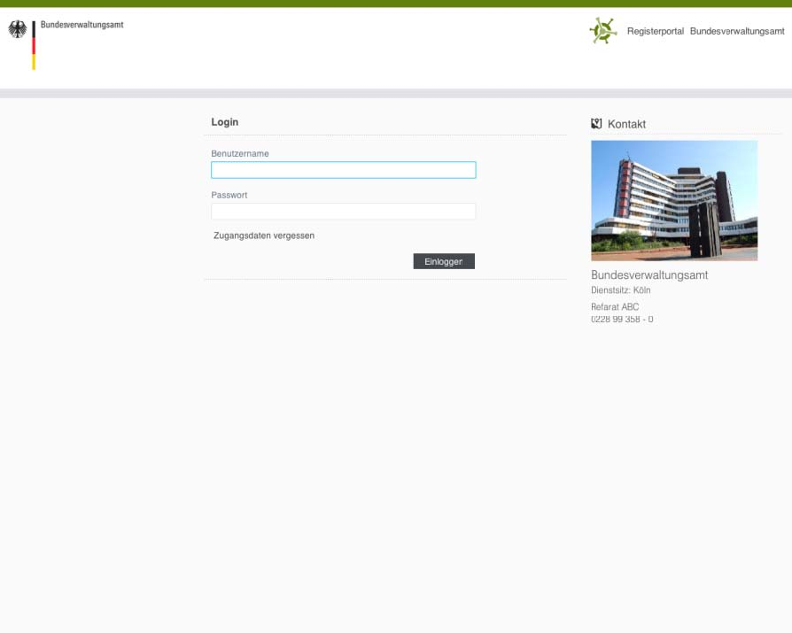

*Richtlinien zur Anwendung*

Die generelle Aufteilung der Login Seite entspricht die dem Dashboard der Applikation.

Header

3-spaltiger Inhaltsbereich

a.  Der Header-Bereich wird ohne die Hauptnavigation dargestellt.
In der Höhe bleibt der Header allerdings unverändert.
+
Inhaltsbereich
a.  _____________________________
Die linke Spalte bleibt leer.
_____________________________
+
______________________________________________________
Im mittleren Bereich befindet sich das Login-Formular.
______________________________________________________

In der rechten Spalte findet der Benutzer Kontaktinformationen.
Während des Logins sollte eine Validierung stattfinden.
Feedback wird im Meldungsbereich (zwischen Überschrift und Benutzername) und an den Eingabefeldern dargestellt.
Genauere Informationen hierzu können in Kapitel Validierung nachgelesen werden.

*Dashboard*

Das Dashboard ist der zentrale Startpunkt nach dem Login.
Es stellt eine Sammlung mehrerer Applikationen dar.
Von hier aus kann der Benutzer in die einzelnen Applikationen abspringen.

[[fig-15]]
.: Dashboard

[[fig-16]]
.: Aufbau Dashboard

image:images/image44.jpeg[image,width=629,height=526]

*Aufbau*

a.  Header Bereich
+
Inhaltsbereich = dreispaltiges Layout
a.  _________________________________
Quicklinks (Wichtige Objekte) (A)
_________________________________
+
_________________________
Widgets Applikationen (B)
_________________________
+
_________________
Informationen (C)
_________________

*Ist dies der richtige Fenstertyp?*

a.  Das Dashboard wird als zentraler Sammelpunkt aller Applikationen einer Anwendung genutzt.
+
Das Dashboard ist der Startpunkt für den Benutzer nach dem Login.

*Richtlinien zur Anwendung*

a.  Das Dashboard hat eigene Layout-Regeln, die ausschließlich für das Dashboard verwendet werden.
+
Auf dem Dashboard werden für den Benutzer wichtige Funktionen und Informationen dargestellt.
+
Es sollten nur Funktionen und Objekte angezeigt werden, die
a.  _______________________________________________
für den jeweiligen Benutzer von Interesse sind.
_______________________________________________
+
____________________________________________________
den Arbeitsablauf des Benutzers vereinfachen können.
____________________________________________________
+
Zusammengehörige Funktionen oder Objekte werden als logische Gruppen zusammengefasst, sogenannte Widgets.
+
Die Containerhöhe eines Widgets passt sich dessen Inhalt an.
+
Anordnung von Informationen/Widgets
a.  ____________________________________________________________________________
Die Widgets und Informationen werden in drei Bereiche (Spalten) einsortiert.
____________________________________________________________________________
+
______________________________________________________________________________________________________________________________________________
Jeder Inhaltsbereich sollte nur eine Art an Informationen/Widgets enthalten.
Die Beschreibung der Inhaltsbereiche erfolgt direkt im Anschluss.
______________________________________________________________________________________________________________________________________________
+
_____________________________________________________________________________________________________________________
Enthält ein Bereich keine Inhalte, was im Regelfall nicht vorkommen sollte, so bleibt der entsprechende Bereich leer.
_____________________________________________________________________________________________________________________
+
**Quicklinks (A)**
+
____________________________________________________________________________________________________________________________
In der ersten Spalte können Links zu häufig genutzten Funktionen oder Objekten einzelner Applikationen untergebracht werden.
____________________________________________________________________________________________________________________________
+
_________________________________________________________________________________________________________________________________________________________________
Die Querverweise sind immer in logisch zusammenhängenden Gruppen (Widgets) angeordnet, z.B. „Wiedervorlagen", „Abgelegte Vorgänge", „Häufig benutzte Funktionen".
_________________________________________________________________________________________________________________________________________________________________
+
___________________________________________________________________________
Die Anzahl der Links in einer Gruppe sollte auf 5 pro Gruppe begrenzt sein.
___________________________________________________________________________
+
_______________________________________________________________________________________________________________________________________________________________________________
Klickt der Benutzer auf einen dieser Querverweise, so wird die zugehörige Applikation aufgerufen und die entsprechende Funktionen oder das entsprechende Objekt wird angezeigt.
_______________________________________________________________________________________________________________________________________________________________________________
+
**Widgets Applikationen (B)**
+
________________________________________________________________________
In der mittleren Spalte werden alle Applikationen des Portals angezeigt.
________________________________________________________________________
+
Der Bereich für die Widgets wird nochmals in 2 Spalten aufgeteilt.
+
_____________________________________________________________________
Es sollte auf eine ausgewogene Befüllung der Spalten geachtet werden.
_____________________________________________________________________
+
______________________________________________________________
Die Spalten können immer von links nach rechts befüllt werden.
______________________________________________________________
+
___________________________________________________________________________________________________________________
Existiert nur ein Applikations-Widget, so wird dieses in der linken Spalte platziert die rechte Spalte bleibt leer.
___________________________________________________________________________________________________________________
+
_____________________________________________________________________________________
Ein Applikationsportal sollte immer über mindestens ein Applikations-Widget verfügen.
_____________________________________________________________________________________
+
__________________________________________________________________________________________________________________________________________________________________
Sofern möglich und sinnvoll, besteht ein Applikations-Widget aus einer Gruppe von Applikationen.
Die Verlinkungen im Widget führen zu den einzelnen Applikationen.
__________________________________________________________________________________________________________________________________________________________________
+
__________________________________________________________________________________________________________________________________________________________________________________________________________
Lässt sich eine Applikation keiner Gruppe zuordnen, so kann sie ein eigenes Widget erhalten.
In diesem Fall würden die Links direkt zu den Funktionen (Unterkategorien) der jeweiligen Applikation führen.
__________________________________________________________________________________________________________________________________________________________________________________________________________
+
_______________________________________________________________________________________________________
Generell sollten die Verlinkungen im Widget mit den Verlinkungen der Navigationsebene 2 übereinstimmen.
_______________________________________________________________________________________________________
+
________________________________________________________________________________________________________________________
Es sollten nur Applikationen und Gruppen sichtbar sein die für den Benutzer und seine entsprechende Rolle relevant sind.
________________________________________________________________________________________________________________________
+
________________________________________________________________________________________
Bei Klick auf eine Applikation oder eine Funktion wird diese im selben Fenster geöffnet.
________________________________________________________________________________________
+
____________________________________________________________________________________________________________________________________________________________________________________________________________
Jede Applikationsgruppe bzw.
alleinstehende Applikation wird durch eine farbliche Markierung (Richtlinien zur Farbwahl siehe Kapitel Applikationsfarben) und ein optionales Applikationsicon gekennzeichnet.
____________________________________________________________________________________________________________________________________________________________________________________________________________
+
**Informationen (C)**
+
_________________________________________________________________________________________________________________________________________________
In der dritten Spalte werden für den Benutzer relevante Informationen angezeigt, die nicht in direktem Zusammenhang mit den Applikationen stehen.
_________________________________________________________________________________________________________________________________________________
+
______________________________________________________________________________________________________
Dies können zum Beispiel Benachrichtigungen, Details zum Benutzerkonto oder Kontaktinformationen sein.
______________________________________________________________________________________________________
+
________________________________________________________________________________________________________________________________________________________________________________________________________________________________________________________________________________________________________________________________________________________
Existieren weiterführende Inhalte zu einem Bereich, die nicht initial auf dem Dashboard angezeigt werden, werden diese auf eine Dashboard Unterseite ausgelagert (siehe Kapitel Dashboard Unterseite). Die Unterseiten können über einen entsprechenden Link (z.B. „Mehr anzeigen") oder durch Klick auf ein entsprechendes Subobjekt aufgerufen werden.
________________________________________________________________________________________________________________________________________________________________________________________________________________________________________________________________________________________________________________________________________________________
+
Resizing
+
____________________________________________________________________________________________________________________________________________________________________________________________________________________________________________________________________________________________________________________________________________________________________________________________
Wird das Browserfenster vergrößert, so wird der zusätzliche Platz gleichmäßig auf alle Spalten aufgeteilt.
Ab einer bestimmten Größe werden die Mauswege zu lang und die Benutzung wird dadurch negativ beeinflusst.
Deshalb skalieren die Inhalte nur bis zu einer Auflösung von 1600x1200 px, oberhalb dieser Grenze wird die Anwendung links ausgerichtet und rechts entsteht Whitespace.
____________________________________________________________________________________________________________________________________________________________________________________________________________________________________________________________________________________________________________________________________________________________________________________________
+
______________________________________________________________________________________________________________________________________________________________________________________________
Wird das Browserfenster über eine kritische Größe (auf der die Daten nicht mehr sinnvoll dargestellt werden können) hinaus verkleinert, so wird das Fenster horizontal und vertikal scrollbar.
______________________________________________________________________________________________________________________________________________________________________________________________

[[fig-17]]
.: Dashboard Elemente

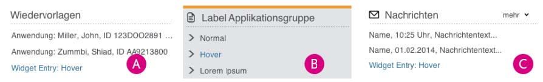

*Aufbau der Widgets*

______________________________________________________________
Typ *A* und *C*

Überschrift
______________________________________________________________

a.  Icon (optional)
+
Text Label

_____________________________________________________________________
„mehr"-Link (optional)

Widget-Links
_____________________________________________________________________

a.  Icon (optional)
+
Text Label
+
Besteht ein Link der Gruppe aus Icon und Text, so sollten der Konsistenz halber alle anderen Links dieser Gruppe auch aus Icon und Text bestehen.

__________________________________________________________
Typ *B*

Überschrift
__________________________________________________________

a.  Icon Applikationsgruppe/Applikation (optional) - Hat eine Applikationsgruppe/Applikation ein Icon, sollten die anderen Gruppen der Konsistenz halber auch eins erhalten.
+
Name Applikationsgruppe/Applikation
+
Farbmarkierung für die Applikationsgruppe/Applikation

___________________________________________________________
Widget-Links
___________________________________________________________

a.  Icon
+
Text Label

*Dashboard Unterseite*

[[fig-18]]
.: Aufbau Dashboard Unterseite

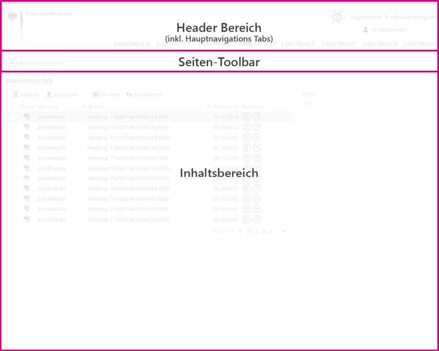

*Ist dies der richtige Seitentyp?*

_____________________________________________________________________________________________________________________________
Dieser Seitentyp wird ausschließlich für Unterseiten des Dashboards verwendet.
_____________________________________________________________________________________________________________________________

*Aufbau*

_____________________________________________________________
Header Bereich

Seiten-Toolbar

Inhaltsbereich
_____________________________________________________________

*Richtlinien zur Anwendung*

a.  Eine Dashboard Unterseite enthält weiterführende Informationen, die nicht vollständig auf dem Dashboard angezeigt werden wie z.B. Nachrichten, Benutzerkonto-Verwaltung.
+
Die Inhalte und deren Layout können variieren.
+
Die Inhalte sollen sich am allgemeinen Layout-Raster ausrichten.
+
Die Seite enthält eine Seiten-Toolbar, deren Funktion es ermöglicht zurück zur Dashboard Hauptseite zu navigieren.

*Applikationsseite*

[[fig-19]]
.: Applikationsseite

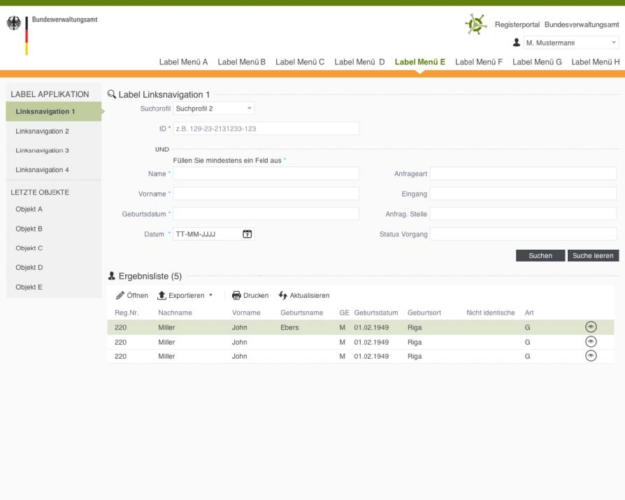

[[fig-20]]
.: Aufbau einer Applikationsseite

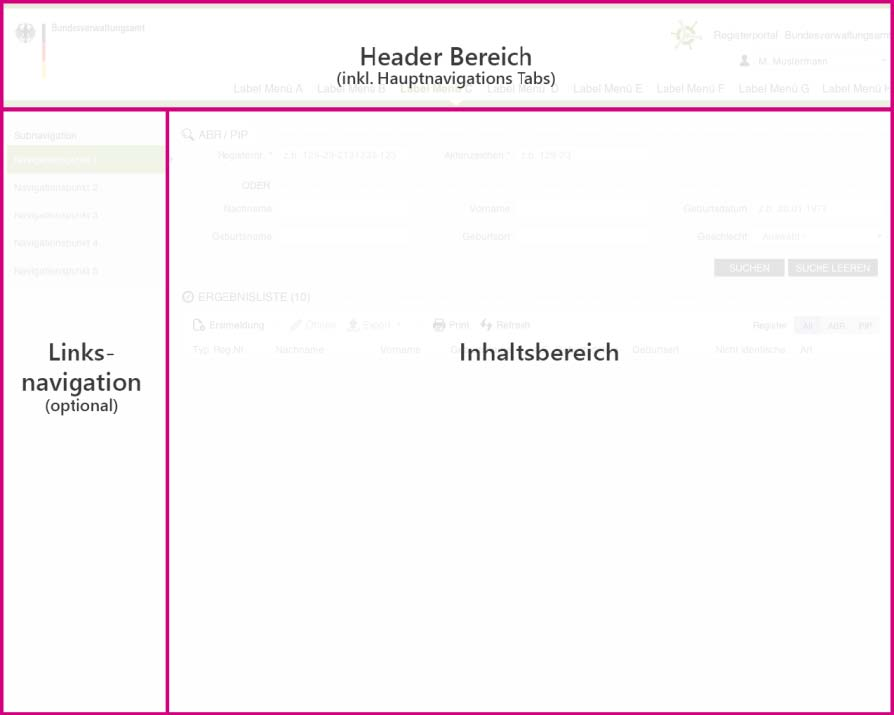

*Aufbau*

a.  Header Bereich
+
Linksnavigation (optional)
+
Inhaltsbereich

*Ist dies der richtige Seitentyp?*

_____________________________________________________________________________________________________________________________________
Dieser Seitentyp wird eingesetzt, um eine Übersicht über eine Applikation zu erhalten.
_____________________________________________________________________________________________________________________________________

*Richtlinien zur Anwendung*

a.  Jede Applikation hat eine eigene Seite.
+
Die Inhalte können je nach Applikation variieren.
+
Die Applikationsseite kann eine optionale Linksnavigation (siehe Kapitel Linksnavigation) enthalten.
+
Entfällt die Linksnavigation, nimmt der Inhaltsbereich den gesamten Platz ein.
+
Befindet sich der Benutzer in einer Applikation, so sollte entweder in der Linksnavigation oder in der ersten Gruppierungsüberschrift im Inhaltsbereich der Name der Applikation erscheinen.
Dies schafft einen Widererkennungswert für den Benutzer.

*Kennzeichnung von Applikationsgruppen/Applikationen*

Sofern möglich und sinnvoll werden Applikationen in Gruppen zusammengefasst.
Lässt sich eine Applikation keiner Gruppe zuordnen, so kann sie auch für sich allein stehen.
Applikationsgruppen oder für sich stehende Applikationen werden über Applikationsfarben und Applikationsicons gekennzeichnet.
Auf dem Dashboard erhält jede Applikationsgruppe oder alleinstehende Applikation ein eigenes Widget.

[[fig-21]]
.: Dashboard Widget – Farbmarkierung und Applikationsicon

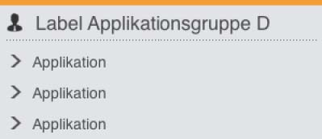

[[fig-22]]
.: Farbmarkierung Detailseite und Dialog

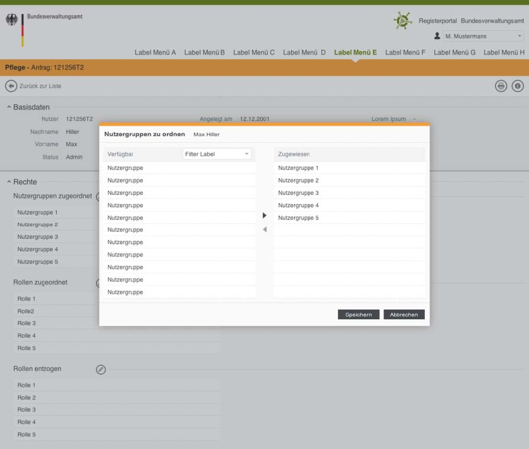

[[fig-23]]
.: Applikationsicon auf Applikationsseite

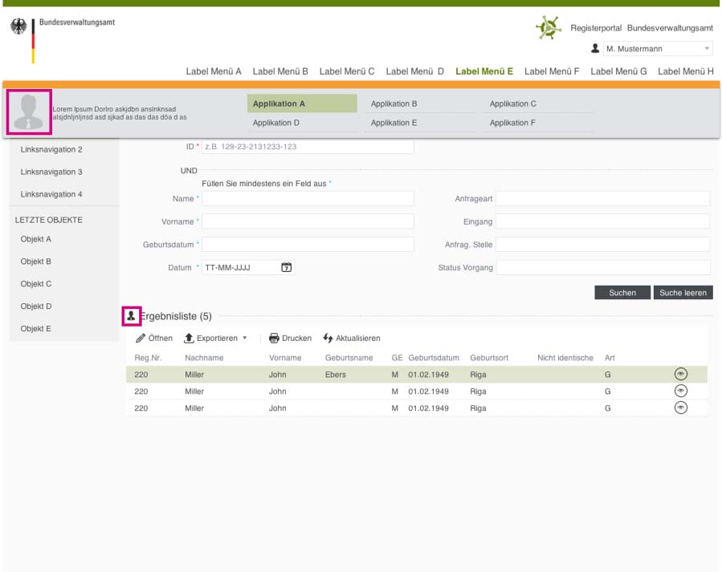

*Richtlinien zur Anwendung*

a.  Jede Applikationsgruppe bzw.
alleinstehende Applikation wird durch eine farbliche Markierung und ein optionales Applikationsicon gekennzeichnet.
+
Farbcodierung (Farbdefinition siehe Kapitel Applikationsfarben)
a.  __________________________________________________
Hauptnavigation – Farbbalken unterhalb des Headers
__________________________________________________
+
______________________________________________________
Submenü (Flyout) – Farbbalken am oberen Rand des Menüs
______________________________________________________
+
____________________________________________________________________________________________________________
Applikations-Widget auf Dashboard – Farbbalken am oberen Rand
____________________________________________________________________________________________________________
+
_____________________________________________________________
Titelzeile von Detailseiten – Hintergrundfarbe der Titelzeile
_____________________________________________________________
+
____________________________________________________________
Dialoge der Applikation – Farbbalken oberhalb der Titelzeile
____________________________________________________________
+
Applikationsicon
+
_______________________
Verwendung ist optional
_______________________
+
_________________________________________________________________________________________________________
Wird ein Applikationsicon benutzt, sollte es konsistent an allen vorgesehenen Stellen eingebunden werden.
_________________________________________________________________________________________________________
+
Einsatz des Applikationsicons
+
____________________________________________
Dashboard Applikations-Widget (Abbildung 21)
____________________________________________
+
_____________________________________
Subnavigation (Flyout) (Abbildung 23)
_____________________________________
+
______________________________________________________________________________
In Gruppenüberschriften auf Übersichten einer Applikationsseite (Abbildung 23)
______________________________________________________________________________

*Hinweise zur Implementierung*

Applikationsseiten werden über den Controller ApplikationseiteController und das Model ApplikationseiteModel realisiert.

Wenn eine Applikationsseite erstellt werden soll, dann muss der Flow der Applikationsseite vom Flow applikationseiteParentFlow erben.
Es muss weiterhin ein Controller erstellt werden, der vom AbstractGuiController erbt und ein Model, das vom AbstractMaskenModel erb

\t. Die XHTML-Seiten der ViewStates müssen alle vom Template /WEB-INF/gui/common/layout/applikation.xhtml erben.

Der ApplikationseiteController stellt sicher, dass alle layoutspezifischen Funktionen (z.B. der Linksnavigation) einer Applikationsseite initialisiert und zur Verfügung gestellt werden.
Abweichungen vom Standardvorgehen (z.B. Linksnavigation ausblenden) können durch Zugriff auf den Controller und Model in spezifischeren Controllern beim Initialisieren durchgeführt werden.

Neben dem ApplikationseiteController existiert auch der BasisController.
Dieser bietet Zugriff auf seitentypunabhängige Layoutfunktionen (z.B. modalen Dialog anzeigen).

Siehe weiterhin die Hinweise in den Seiten Header Bereich, Linksnavigation und Quicklinks.

*Applikation Detailseite*

[[fig-24]]
.: Applikation Detailseite – Beispiel

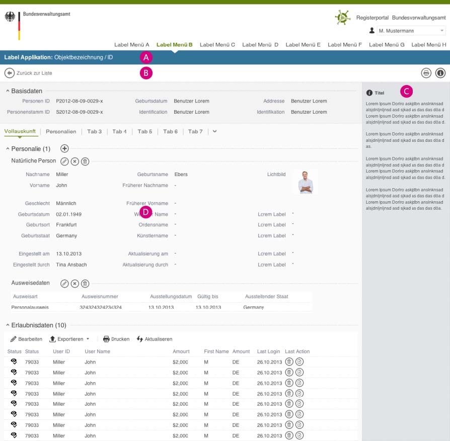

[[fig-25]]
.: Aufbau Applikation Detailseite

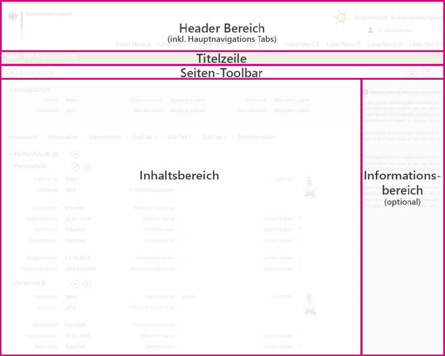

*Aufbau*

a.  Header Bereich
+
Titelzeile

_____________________________________________________________
Seiten-Toolbar
_____________________________________________________________

Inhaltsbereich

a.  _____________________
Basisdaten (optional)
_____________________
+
_____________
Objektdetails
_____________

a.  Informationsbereich (optional)

*Ist dies der richtige Seitentyp?*

_______________________________________________________________________________________________________________________________________
Dieser Seitentyp wird eingesetzt, um Details zu Objekten einer Applikation darzustellen.
_______________________________________________________________________________________________________________________________________

*Richtlinien zur Anwendung*

a.  Objekte einer Applikation können Detailinformationen enthalten, diese werden auf der Detailseite dargestellt.
+
Titelzeile *(A)*

________________________________________________________________________________________________________________________________________________________________________________________________________________________________________________________________________________________________________________________________________________________________________________________________________________________________________________________________________________________
Jede Detailseite hat eine Titelzeile in einer der drei Ausprägungen Titel, Headline oder Breadcrumb.
Ohne Text in der Titelzeile soll eine Detailseite nicht verwendet werden.

**Titel**: Darstellung des Seitentitels

**Headline**: Darstellung von zusätzlichem Text neben einem Seitentitel

**Breadcrumb** (ähnlich einer https://de.wikipedia.org/wiki/Brotkr%C3%BCmelnavigation[Location Breadcrumb]): In dieser werden der Objekttitel und der zum Objekt gehörige „Ort" angezeigt (siehe<<fig-24>>). Dieser Ort kann je nach Anzahl der Hierarchieebenen variieren.
An dieser Stelle ist es wichtig dem Benutzer eindeutig zu kommunizieren, welches Objekt er gerade betrachtet und zu welcher Applikation das Objekt gehört.
________________________________________________________________________________________________________________________________________________________________________________________________________________________________________________________________________________________________________________________________________________________________________________________________________________________________________________________________________________________

a.  Hier wird *nicht* der vom User gegangene Weg zum angezeigten Objekt dargestellt.
+
Ein Rücksprung auf die Liste der Objekte soll nicht enthalten sein, da es dafür den Button "Zurück zu Liste" in der Seiten-Toolbar gibt.
+
Beispiel 1 Titelstruktur für 2 Hierarchieebenen
+
image:images/image67.jpeg[image]__Label Hierarchieebne 2: Objektname / ID__
+
Beispiel 2 Titelstruktur für 3 Hierarchieebenen

____________________________________________________________________________________________________________________________________________________________________________________________________________________
__Label Hierarchieebne 2 – Label Hierarchieebne 3: Objektname / ID__

Seiten-Toolbar *(B)*

Die Seiten-Toolbar zeigt Funktionen, welche für die gesamte Seite gelten z.B. „Zurück zur Liste", „Seite drucken", „Hilfe", mehr Informationen siehe Kapitel Toolbar.
____________________________________________________________________________________________________________________________________________________________________________________________________________________

Informationsbereich *(C)*

a.  ______________________________________________________________________________________________________________________________
Der Informationsbereich ist initial ausgeblendet und kann über einen entsprechenden Button in der Toolbar eingeblendet werden.
______________________________________________________________________________________________________________________________
+
_________________________________________________________________________________________________________________________
Dieser Bereich sollte hilfreiche und ergänzende Informationen zum angezeigten Objekttyp und dessen Bearbeitung enthalten.
_________________________________________________________________________________________________________________________
+
_____________________________________________________________________________________________________________________________________________________________________________________________________________________
Der Informationsbereich und der entsprechende Button in der Seiten-Toolbar sollten nur vorhanden sein, wenn der Informationsbereich mit sinnvollen und für den Benutzer nützlichen Informationen gefüllt werden kann.
_____________________________________________________________________________________________________________________________________________________________________________________________________________________
+
_______________________________________________________________________________________
Ist der Informationsbereich eingeblendet, so wird der Inhaltsbereich zusammengeschoben.
_______________________________________________________________________________________
+
Inhaltsbereich *(D)*
+
_____________________________________________________
Im Inhaltsbereich werden die Objektdetails angezeigt.
_____________________________________________________
+
Der Inhaltsbereich kann Kopfdaten enthalten.
+
___________________________________________________________________________________________________________________________________________________
Die Kopfdaten können optional eingebunden werden.
Sie können dem Benutzer helfen wichtige Daten von komplexen Objekten auf einen Blick zu erkennen.
___________________________________________________________________________________________________________________________________________________
+
_________________________________________________________________________________________________________________________________________________________________
Es kann sinnvoll sein die Kopfdaten mit einem Expander zu kombinieren.
So hat der Benutzer die Möglichkeit, diese Daten auszublenden, wenn er sie nicht benötigt.
_________________________________________________________________________________________________________________________________________________________________
+
_______________________________________________________________________________________________________________________________________________________________________________
Zur Strukturierung umfangreicher Informationen werden Gruppierungs-Container und Expander (Progressive Disclosure) eingesetzt.
Hierbei werden Informationen sinnvoll gruppiert.
_______________________________________________________________________________________________________________________________________________________________________________
+
__________________________________________________________________________________________________________________________
Zur weiteren Strukturierung und um langes vertikales Scrollen auf einer Seite zu vermeiden können Tabs zum Einsatz kommen.
__________________________________________________________________________________________________________________________

*Hinweise zur Implementierung*

Applikationsdetailseiten werden über den Controller DetailseiteController und das Model DetailseiteModel realisiert.

Wenn eine Applikationsdetailseite erstellt werden soll, dann muss der Flow der Applikationsdetailseite vom Flow detailseiteParentFlow erb en.
Es muss weiterhin ein Controller erstellt werden, der vom AbstractGuiController erbt und ein Model, das vom AbstractMaskenModel

 erbt.
Die XHTML-Seiten der ViewStates müssen alle vom Template /WEB-INF/gui/common/layout/applikationDetailseite.xhtmler ben.

Der DetailseiteController stellt sicher, dass alle layoutspezifischen Funktionen (z.B. der Seitentoolbar sowie Buttons in der Toolbar) einer Detailseite initialisiert und zur Verfügung gestellt werden.
Abweichungen vom Standardvorgehen (z.B. Seitentoolbar ausblenden, Druckbutton einblenden, Informationsbereich einblenden) können durch Zugriff auf den Controller und Model in spezifischeren Controllern beim Initialisieren durchgeführt werden.

Neben dem DetailseiteController existiert auch der BasisController.
Dieser bietet Zugriff auf seitentypunabhängige Layoutfunktionen

(z.B. modalen Dialog anzeigen).

_Titel_

Der TitlesListener (Listener für Spring-Webflow) ermöglicht es, dass konfigurierte Nachrichten anhand von Namenskonventionen automatisch als Title (Title-Tag), Headline (Titelzeile) oder Breadcrumb verwendet werden.
Der TitlesListener ist automatisch eingebunden und muss nicht explizit aktiviert werden.

Folgende Angaben sind zulässig:

MAS_\{FlowName}_Title MAS_\{FlowName}_\{ViewState}_Title MAS_\{FlowName}_Headline MAS_\{FlowName}_\{ViewState}_Headline MAS_\{FlowName}_Breadcrumb MAS_\{FlowName}_\{ViewState}_Breadcrumb

Die Angaben müssen sich in den Anwendungsressourcen (analog zu anderen Nachrichten) befinden und über eine MessageSource-Bean ("messageSource") der PLIS-Web zur Verfügung gestellt werden.

Wenn vorhanden, werden stets die Angaben mit ViewState verwendet, ansonsten die Angaben ohne ViewState.
In der Flowdefinition können die zu verwendenden Texte überschrieben werden, indem die Attribute titleKey , breadcrumbKey und headlineKey gesetzt werden.
Wenn für

den Title keine Angabe gefunden werden kann, dann wird der Wert von MAS_Global_Title verwendet.
Weiterhin kann mit MAS_Global_Titl e_Prefix ein globaler Präfix für den Title gesetzt werden.

Weiterhin kann über eine Angabe von <ui:define name="titel"/> in Seiten definiert werden, welche Inhalte rechts neben dem bereits definierten Title (Title-Tag) ausgegeben werden (seit Version 3.1.x der plis-web). Im Folgenden ein Beispiel:

<ui:define name="titel"> 

<h:outputText value="zusätzlicher Text" /> </ui:define> Über die Angaben <ui:define name="titelzeileInfoLinks"/> bzw. <ui:define name="titelzeileInfoRechts"/> kann

weiterhin definiert werden, welche Inhalte zusätzlich direkt rechts neben der Headline (Titelzeile) angezeigt werden bzw.
ganz am rechten Rand der Headline angezeigt werden (seit Version 3.1.x der plis-web). Im Folgenden ein Beispiel: 

<ui:define name="titelzeileInfoLinks"> 

<h:outputText value="zusätzlicher Text" /> </ui:define> <ui:define name="titelzeileInfoRechts"> 

<h:outputText value="zusätzlicher Text" /> </ui:define>

_Hinweis:_ Die Breadcrumbfunktionalität ist derzeit noch nicht vollständig umgesetzt.

*Dialoge*

Dialoge sind sekundäre Fenster die oberhalb des Hauptfensters angezeigt werden.
Dies ist nur unter der Benutzung von JavaScript möglich.
Die Darstellung von Dialogen ohne JavaScript wird im

Kapitel Dialoge ohne JavaScript näher beschrieben.
Dialoge dienen der Auswahl und Eingabe von Daten.
Sie dienen nicht dazu, komplexe Datenmengen innerhalb eines Objekts zu strukturieren.
Beispiele für die Nutzung von sekundären Fenstern sind:

a.  Erweiterte Funktionalitäten zur Bearbeitung von Prozessen und Aktionen (z.B. Daten editieren)
+
Komplexe Optionen, die aus Platzmangel im Arbeitsbereich nicht angezeigt werden sollten.
+
Meldungsdialoge zur Anzeige von z. B. Fehlernachrichten.

[[fig-26]]
.: Dialog

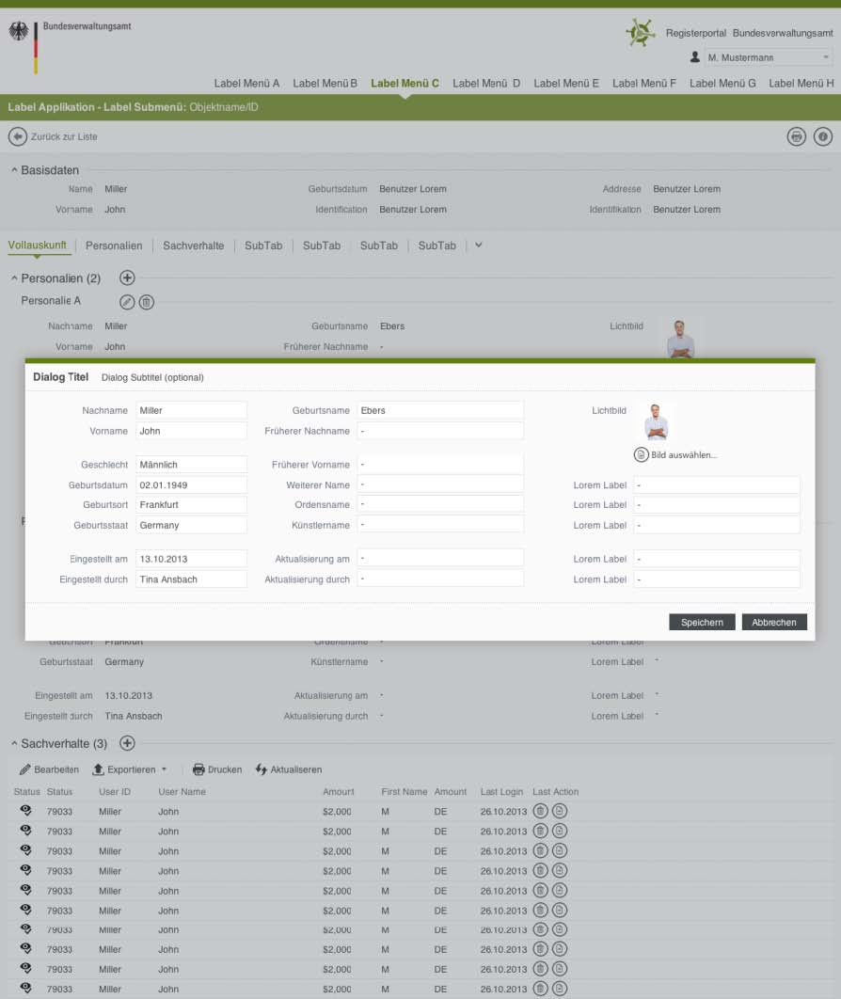

[[fig-27]]
.: Dialog (Wizard) – Beispiel Validierung

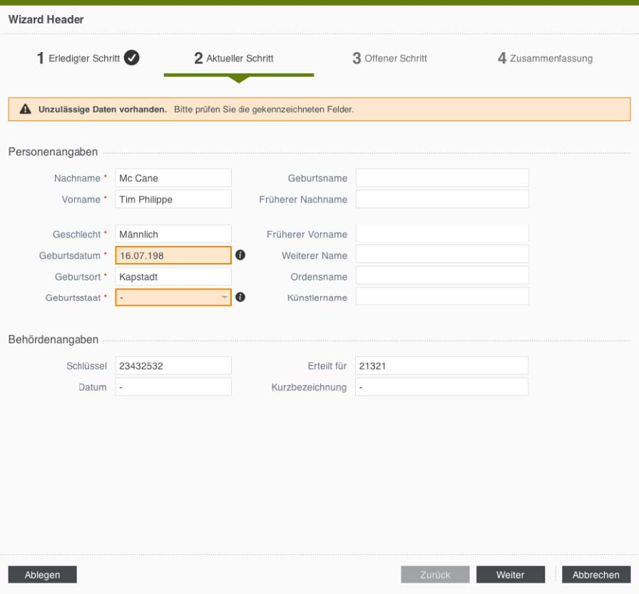

[[fig-28]]
.: Aufbau Dialog

image:images/image74.jpeg[image,width=627,height=249]

*Aufbau*

a.  Titelzeile *(A)*
+
Inhaltsbereich *(B)*
+
Dialogbuttons *(C)*

*Richtlinien zur Anwendung*

a.  Dialoge sind sekundäre Fenster, die über dem primären Fenster liegen.
+
Dialoge sind modal, d. h. das aufrufende Fenster kann nicht erreicht werden, so lange der Dialog geöffnet ist.
+
Die Überlagerung mehrerer Dialogfenster sollte vermieden werden.
+
Ist die Überlagerung von Dialogen nicht zu vermeiden, müssen die Dialoge immer in der Reihenfolge geschlossen werden, in der sie geöffnet wurden.
+
Dialoge passen ihre Größe dem gezeigten Inhalt an. (Ausnahme Wizard)
+
Größe von Dialogen
a.  ___________________________________________________________________________________________________________________________________________________________________________________________________________________________________________________________________
Die Dialoge sollten möglichst ein Seitenverhältnis von 4:3 haben.
Dialoge in denen Formulardaten bearbeitet werden, können hier eine Ausnahme bilden.
Hier sollte das Layout der Elemente im Dialog dem Layout im Read-Only Modus entsprechen (i.d.R. dreispaltig).
___________________________________________________________________________________________________________________________________________________________________________________________________________________________________________________________________
+
_____________________________________________________________________________________________________________________________
Das Layout der Inhalte sollte so gestaltet sein, dass die Dialogbuttons bei der Zielauflösung ohne zu scrollen sichtbar sind.
_____________________________________________________________________________________________________________________________
+
__________________________________________________________________
Dialoge sollten möglichst nicht mehr als 2/3 des Screens bedecken.
__________________________________________________________________
+
Vertikales und horizontales Scrollen sollte innerhalb von Dialogen vermieden werden.

___________________________________________________________________________________________________________________________________________
Resizing: Dialoge behalten bei einer Größenveränderung des Browsers ihre Ursprungsgröße bei.
___________________________________________________________________________________________________________________________________________

**Titelzeile (A)**

a.  _________________________________________________________________________________________________________________________________________________________________________________________________________________________________________
Der Titel des Dialogs sollte aussagekräftig sein und dem Benutzer genau zeigen, welche Interaktionen er für welche Objekte in diesem Dialog durchführt.
Der Dialogtitel kann aus einem Haupttitel und einem optionalen Subtitel bestehen.
_________________________________________________________________________________________________________________________________________________________________________________________________________________________________________
+
__________________________________________________________________________________________________________
Der Haupttitel sollte die Art der Interaktion und den Objektnamen enthalten, z.B. „Personalie XY löschen".
__________________________________________________________________________________________________________
+
_____________________________________________________________________________________________________________________________________________________________________________________________________________________________
Der Subtitel ist optional und kann zur genaueren Spezifizierung genutzt werden, z.B. „Personalie hinzufügen - Registerdatensatz XY" wobei „Personalie hinzufügen" ein Hauptitel wäre und „Registerdatensatz XY" ein Subtitel.
_____________________________________________________________________________________________________________________________________________________________________________________________________________________________
+
___________________________________________________________________________
Der Titel enthält die Farbmarkierung der entsprechenden Applikationsgruppe.
___________________________________________________________________________

a.  Im *Inhaltsbereich (B)* kann an oberster Stelle ein Hinweis- oder Validierungstext angezeigt werden.
Der Inhalt rutscht dann um die entsprechende Höhe nach unten.
Das Dialogfenster kann sich gegebenenfalls um diese Höhe vergrößern (siehe<<fig-27>>).
+
Der Bereich der *Dialogbuttons (D)* präsentiert je nach Kontext verschiedene Buttons.

*Hinweise zur Implementierung*

Modale Dialoge werden mit dem Tag <isy:modalDialogContent> definiert.
Der Dialog besitzt folgende Facets:

______________________________________________________________________________
modalHeader: Der Header-Bereich

modalBody: Der Body-Bereich

modalFooter: Der Footer-Bereich
______________________________________________________________________________

Beispiel:

<ui:define name="modalDialog"> <isy:modalDialogContent> <f:facet name="modalHeader">\{msg.MEL_Lichtbild_anzeigen_Titel}</f:facet> <f:facet name="modalBody"> 
 ... 
 </f:facet> <f:facet name="modalFooter"> 
 ... 
 </f:facet> </isy:modalDialogContent> </ui:define>

Das Tag <isy:modalDialogContent> wird über den UI-Platzhalter modalDialog eingefügt.
Dieser Platzhalter sorgt dafür, dass je nach JavaScript Verfügbarkeit, der Inhalt des modalen Fensters entweder als Inhalt oder als eigenständiger Dialog gerendert wird.
Die Funktionsweise des modalen Dialogs ist in das Basis-Layout eingebunden.
Um einen Dialog zu öffnen muss dieser als eigener View-State (in Spring-Webflow) definiert werden.
Beim Eintreten in den Flow wird das modale Fenster über einen Aufruf des BasisController geöffnet.
Beim Verlassen des View-States wird dieser wieder geschlossen.
Beispiel:

<view-state id="lichtbildAnzeigenViewState" model="maskenModel">

<on-entry>

<evaluate expression="basisController.showModalDialog()"/>

</on-entry>

...

<transition on="schliesseModalenDialog" to="gesamtauskunftAnzeigenViewState">

<evaluate expression="basisController.hideModalDialog()"/>

</transition>

</view-state>

Um im Hintergrund weiterhin das aktuelle Fenster anzuzeigen, genügt es den bisherigen View-State entsprechend zu vererben.

*Dialoge ohne JavaScript*

Hat ein Benutzer kein JavaScript, werden Dialoge in das Hauptfenster integriert.

[[fig-29]]
.: Kein JavaScript – Dialog

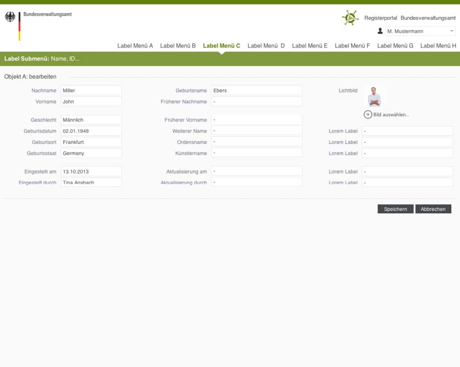

[[fig-30]]
.: Kein JavaScript – Meldungsdialog

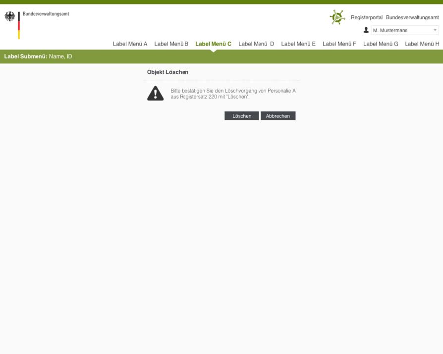

[[fig-31]]
.: Kein JavaScript – Wizard

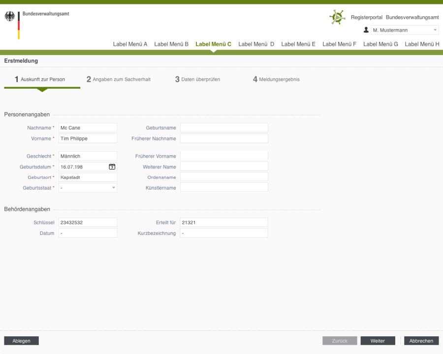

*Richtlinien zur Anwendung*

a.  Diese Art der Darstellung wird ausschließlich verwendet, wenn kein JavaScript verfügbar ist.
+
Die Dialoge überlagern das primäre Fenster nicht, sondern sind in dieses integriert.
+
Der Header Bereich der Anwendung bleibt sichtbar.
Die Dialoge werden unterhalb des Headers angezeigt.
+
In den Dialogen werden die gleichen Inhalte und Funktionalitäten wie im entsprechenden JavaScript-Dialog (z.B. Wizards, Objekte editieren, Objekte löschen etc.) dargestellt.
+
Die Dialoge behalten die gleichen Größen wie in der JavaScript-Variante bei.
+
Die Dialoge werden horizontal zentriert platziert, Beispiel siehe<<fig-30>> .
+
Hat der Nutzer im Dialog Daten eingegeben oder verändert und klickt ohne zu speichern auf einen Navigationspunkt im Header, sollte eine Abfrage zur Datensicherung erfolgen.
Ist dies aus technischen Gründen nicht möglich, gehen die eingegebenen Daten verloren.
+
Das Layout der Inhalte sollte so gestaltet sein, dass die Dialogbuttons bei der Zielauflösung ohne zu scrollen sichtbar sind.
+
**Besonderheiten in der Darstellung**
a.  ________________________________________________________________________________________________________________________________________________________________________
Werden Dialoge und Meldungsdialoge direkt von einer Detailseite aufgerufen, so wird der Dialog unterhalb der Titelzeile der Detailseite dargestellt (vgl.
[[fig-29]]
.).

________________________________________________________________________________________________________________________________________________________________________
+
__________________________________________________________________________________________________________________________________________________________________________________________________________________________________________________
Die Höhe des Wizards richtet sich (wie auch bei der JavaScript-Variante) nach dem Größten Inhalt.
Die Höhe eines Wizards sollte während der einzelnen Schritte nicht verändert werden, so wird ein Positionswechsel der Dialog-Buttons verhindert.
__________________________________________________________________________________________________________________________________________________________________________________________________________________________________________________

______________________________________________________________________________________________________________________________________________________
Resizing: Generell sollte das Layout Verhalten dem der JavaScript-Variante (siehe Dialoge) entsprechen.
______________________________________________________________________________________________________________________________________________________

*Hinweise zur Implementierung*

Die modalen Dialoge werden automatisch in das Layout integriert sofern kein JavaScript verfügbar ist.

*Meldungsdialoge*

Meldungsdialoge werden eingesetzt, wenn der Benutzer in seinem Arbeitsablauf unterbrochen werden muss.
Dies ist z. B. der Fall,

a.  wenn ein Vorgang ohne weitere Auswahl einer Möglichkeit nicht beendet werden kann (z. B. Nachfrage vor dem Löschen eines Objektes).
+
wenn ein Datenverlust droht (z. B. Änderungen speichern und beenden oder Änderungen verwerfen und beenden).
+
wenn der Benutzer über einen (unvorhergesehenen) nicht durchführbaren Vorgang informiert werden muss (z. B. Abbruch der Internetverbindung).

[[fig-32]]
.: Meldungsdialog – Objekt löschen

image:images/image82.jpeg[image,width=329,height=163]

[[fig-33]]
.: Aufbau Meldungsdialog

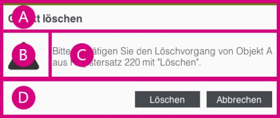

*Aufbau*

_____________________________________________________________________
Titelzeile *(A)*

Meldungsart-Icon *(B)*
_____________________________________________________________________

a.  Beschreibung und zusätzliche Informationen *(C)*
+
Dialogbuttons *(D)*
+
Es sollte geprüft werden, ob der Benutzer den Dialog bei repetitiven Vorgängen ausstellen kann – dies geschieht mit Hilfe einer Check Box „Diesen Dialog in Zukunft nicht mehr anzeigen".

*Richtlinien zur Anwendung*

a.  Meldungsdialoge werden als Modaler Dialog aus einem primären Fenster geöffnet.
+
Ein Meldungsdialog kann nicht aus einem anderen Meldungsdialog geöffnet werden.
+
Die *Titelzeile (A)* des Meldungsdialogs dient in der Regel dazu, die Funktion zu identifizieren, die den Dialog getriggert hat.
Versucht der Benutzer z.B. ein Objekt zu löschen, so erscheint ein Meldungsdialog mit der Überschrift „Objekt löschen". Die Überschrift dient nicht dazu, eine Beschreibung des Problems oder konkrete Anweisungen zu liefern.
+
Das *Icon (B)* dient der Identifizierung der Meldungsart und muss daher der jeweiligen Meldungsart angepasst werden.
Es wird links von der Beschreibung angezeigt.
+
Die *Beschreibung (C)* hingegen sollte in einem Satz kurz und prägnant die Kernaussage des Dialoges präsentieren.
Detail-Informationen wie z. B. Pfadangaben oder URLs sollten in der Beschreibung nicht angezeigt werden.
+
Sollten *zusätzliche Informationen (C)* notwendig sein, so können diese unterhalb der Beschreibung eingeblendet werden.
Zusätzliche Informationen können z. B. sein:
+
Schritte zur Behebung eines Problems.
+
Hinweise, wie ein Problem in Zukunft vermieden werden kann.
+
Fehlercodes.
+
Pfad-oder URL-Angaben.
+
Sollten ausführliche zusätzliche Informationen notwendig sein, wie z. B. ein Exception Text, der für Support-Anfragen benötigt wird, so können diese mit Hilfe eines Expanders (Progressive Disclosure) zunächst ausgeblendet und bei Bedarf vom Benutzer eingeblendet werden.
+
Der Bereich der *Dialogbuttons (D)* präsentiert je nach Meldungsart und Kontext verschiedene Buttons.
Folgende Richtlinien für die Handhabung der Buttons sollten befolgt werden:
a.  __________________________________________________________________________________________________________________________________________________________________________________________________________________________________________________________________________________________________________________________________________________________________________________
Wird vom Benutzer eine Entscheidung gefordert, so ist die Nennung der entsprechenden Aktion (z.B. _Löschen, Entfernen_ usw.) den generischen Begriffen _Ja/Nein_ vorzuziehen.
Niemals sollte jedoch _OK/Abbrechen_ verwendet werden.
_Ja/Nein_ fordert vom Benutzer ein Reflektieren der Entscheidung, während _OK_ häufig geklickt wird, ohne über die Entscheidung nachzudenken.
__________________________________________________________________________________________________________________________________________________________________________________________________________________________________________________________________________________________________________________________________________________________________________________
+
____________________________________________________________
Der Button zum Abbruch der Aktion heißt immer __Abbrechen__.
____________________________________________________________
+
___________________________________________________________________________________________________________________________________________________________________________________________________________
Buttons zum Quittieren von Fehlermeldungen oder Informationen sollten statt mit einem generischen _OK_ mit Schließen bezeichnet werden.
_OK_ würde implizieren, dass der Fehler als solcher in Ordnung ist.
___________________________________________________________________________________________________________________________________________________________________________________________________________
+
_______________________________________________________________________________________________________________________________________________________________________
Es sollte immer einen Default-Button geben, der mit der Enter/Return-Taste betätigt werden kann.
Der Abbrechen-Button sollte stets mit der Escape-Taste bedienbar sein.
_______________________________________________________________________________________________________________________________________________________________________
+
___________________________________________________________________________________
Es muss auf eine korrekte und konsistente Beschriftung der Buttons geachtet werden.
___________________________________________________________________________________
+
_____________________________________________________________________________________________________________________________________________________________________________________________
Hat der Benutzer eine Entscheidung zu treffen, ist es sehr wichtig darauf zu achten, die korrekte Kombination von Buttons anzuzeigen.
Folgende Kombinationen werden typischerweise verwendet:
_____________________________________________________________________________________________________________________________________________________________________________________________

___________________________________________________________________________________________________________________________________________________________________________________________________________________________________________________________________
Spezifische Beschreibungen: _<Aktion ausführen> / <Aktion nicht ausführen><Aktion ausführen> / <Abbrechen><Aktion ausführen> / <Aktion nicht ausführen> / Abbrechen_

Ja-Nein-Kombinationen: _Ja / NeinJa / Nein / Abbrechen_

Ein häufig auftretendes Usability-Problem ist die Anzeige einer Ja/Nein/Abbrechen-Kombination, wobei Nein und Abbrechen dieselbe Funktion haben.
Die Anzeige einer solchen Kombination *muss* ausgeschlossen werden.
___________________________________________________________________________________________________________________________________________________________________________________________________________________________________________________________________

*Hinweise zur Implementierung*

Für Meldungsdialoge gibt es derzeit keine Umsetzung.
Bei Bedarf können diese über die normalen modalen Dialoge umgesetzt werden (Dialoge).

*Wizard*

Mit „Wizard", auch Assistent genannt, wird eine geführte Abfolge von Interaktionsschritten bezeichnet.
Das Konzept eignet sich für Anwendungsfälle, bei denen eine starke Führung des Benutzers erforderlich ist oder um z. B. sehr komplexe Objekte anzulegen.
Die Einzelschritte stellen hier jeweils einzelne Teilaufgaben dar.
Durch die Aufteilung der Interaktion auf separate Schritte und Inhaltsseiten verringert sich die Gesamtkomplexität für den Benutzer.

[[fig-34]]
.: Dialog Wizard

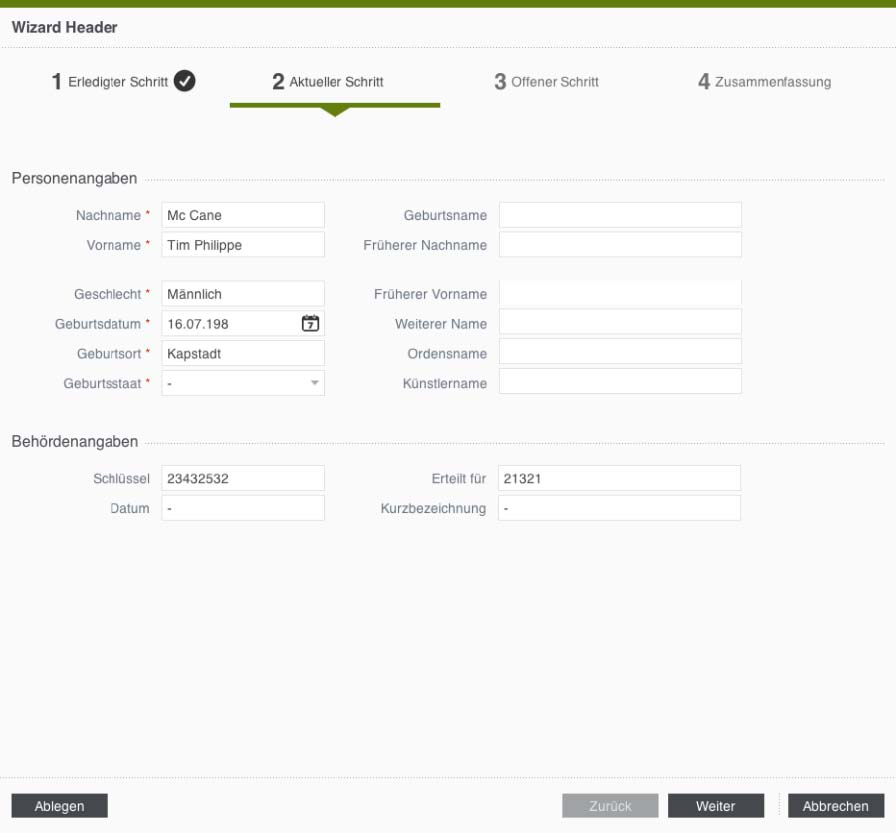

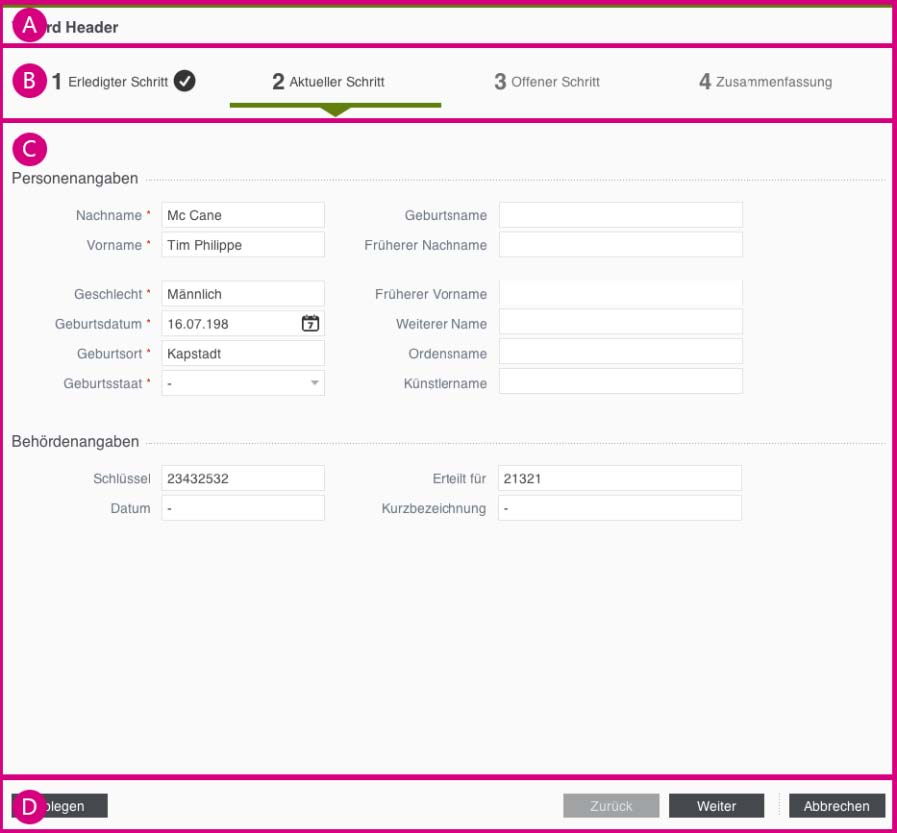

*Aufbau*

a.  Titelzeile *(A)*
+
Schrittanzeige *(B)*
+
Inhaltsbereich *(C)*
+
Dialogbuttons *(D)*

*Ist dies der richtige Dialog Typ?*

a.  Wizards werden für komplexe Aufgaben verwendet, die in Einzelschritte eingeteilt werden können.
+
Ein Wizard sollte verwendet werden, wenn zwischen einzelnen Schritten einer Aufgabe enge Abhängigkeiten bestehen, z. B. wenn ein Schritt erst bearbeitet werden kann, nachdem der vorherige beendet wurde.
+
Besteht kein Zusammenhang zwischen einzelnen Schritten oder Phasen, sollte kein Wizard verwendet werden.

*Richtlinien zur Anwendung*

a.  Wizards werden innerhalb eines modalen Dialogs geöffnet.
+
Größe von Wizards
a.  ______________________________________________________________________
Die Dialoggröße orientiert sich an dem Schritt mit dem größten Inhalt.
______________________________________________________________________
+
____________________________________________________________________
Der Dialog sollte möglichst nicht mehr als 2/3 des Screens bedecken.
____________________________________________________________________
+
__________________________________________________________________________________________________________
Die Dialoggröße sollte möglichst so gewählt werden, dass die Dialogbuttons ohne zu scrollen zu sehen sind.
__________________________________________________________________________________________________________
+
__________________________________________________________________________________________________________________________________________
Das Dialogfenster behält innerhalb einer Schrittfolge immer die gleiche Größe. So wird ein Positionswechsel der Dialog-Buttons verhindert.
__________________________________________________________________________________________________________________________________________
+
Die *Titelzeile (A)* dient dazu die Funktion die Funktion des Wizards zu identifizieren.
Es gelten die gleichen Regeln wie für Titelzeilen von Dialogen.
+
**Schrittanzeige (B)** dargestellt.
a.  _______________________________________________________________________________________________________
Die einzelnen Schritte des Wizards werden unterhalb der Titelzeile in einer Schrittanzeige dargestellt.
_______________________________________________________________________________________________________
+
__________________________________________________________
Der aktuell ausgewählte Schritt ist visuell hervorgehoben.
__________________________________________________________
+
_________________________________________________________________________________
Navigation über die Schrittanzeige ist möglich, wenn die Schritte aktiviert sind.
_________________________________________________________________________________
+
________________________________________________________________________________________________________________________________________________________________________________
Zurücknavigieren: Bereits durchgeführte Schritte können angeklickt werden und der Inhalt des jeweiligen Schrittes wird angezeigt.
________________________________________________________________________________________________________________________________________________________________________________
+
___________________________________________________________________________________________________________________________________________________________________________________________________________
Vornavigieren: Zukünftige Schritte können nur ausgewählt werden, wenn die Eingaben des aktuellen Schrittes die des zukünftigen Schrittes nicht beeinflussen.
___________________________________________________________________________________________________________________________________________________________________________________________________________
+
Im *Inhaltsbereich (C)* werden die eigentlichen Inhalte der einzelnen Schritte angezeigt.
+
**Dialogbuttons (D)**
a.  ___________________________________________________________________________________________________________________
Per Klick auf die Dialog-Buttons kann der Benutzer vor und zurück navigieren sowie den Vorgang im Dialog abbrechen.
___________________________________________________________________________________________________________________
+
______________________________________________________
Im ersten Schritt ist der „Zurück"-Button deaktiviert.
______________________________________________________
+
________________________________________________________________________________________
Im letzten Schritt ändert sich das Text-Label des „Weiter"-Buttons (z.B. „Abschließen").
________________________________________________________________________________________
+
__________________________________________________________________________________________________________________________________________________________________________________________________________________________________________________________________________________________________________________________
Optional kann links unten ein „Ablegen"-Button angezeigt werden.
Diese Funktion kann beim Neu-Anlegen von komplexen Objekten nützlich sein.
Die „Ablegen"-Funktion ermöglicht es dem Benutzer den aktuellen Vorgang zu unterbrechen und zwischen zu speichern.
Die abgelegten Vorgänge werden auf dem Dashboard angezeigt.
__________________________________________________________________________________________________________________________________________________________________________________________________________________________________________________________________________________________________________________________
+
_______________________________________________________________________________________
Beim „Abbrechen" wird der Dialog geschlossen und die eingegebenen Daten gehen verloren.
_______________________________________________________________________________________
+
___________________________________________________________________________________________
Beim „Speichern" wird der Dialog geschlossen und die eingegebenen Daten werden gespeichert.
___________________________________________________________________________________________

*Hinweise zur Implementierung*

Der Wizard ist in der plis-web ab Version 3.1.x verfügbar.
Wizards werden mit dem Tag <isy:wizard> definiert.

Folgende Parameter sind zulässig:

____________________________________________________________________________________________________________________
wizardDialogModel: Das Model des Wizards

width: Die Breite des modalen Dialogs (optionale Angabe)

globalConfig: Eine spezifische globale Konfiguration, falls notwendig
____________________________________________________________________________________________________________________

Der Wizard besitzt folgende Facets:

____________________________________________________________________________________________________________________________________
wizardHeader: Der Header-Bereich

wizardBody: Der Body-Bereich

modalFooter: Der Footer-Bereich

wizardFooterRightButtons: Ergänzungen zu den angezeigten Buttons auf der linken Seite

wizardFooterLeftButtons: Ergänzungen zu den angezeigten Buttons auf der rechten Seite
____________________________________________________________________________________________________________________________________

Beispiel:

<isy:wizard wizardDialogModel="#\{wdm}"> <f:facet name="wizardHeader">Testheader</f:facet> <f:facet name="wizardBody"> <ui:param name="aktuelleWizardSeite" value="#\{wdm.getActiveWizardDialogPage()}" /> <!-- In Abhängigkeit der ID werden die entsprechenden Seiten angezeigt. -->

__________________________________________________________________________
<ui:fragment rendered="#\{wdm.getActiveWizardDialogPageId().equals('1')}">
__________________________________________________________________________

<ui:include src="page1.xhtml" /> </ui:fragment> <ui:fragment rendered="#\{wdm.getActiveWizardDialogPageId().equals('2')}">

<ui:include src="page2.xhtml" /> </ui:fragment> <ui:fragment rendered="#\{wdm.getActiveWizardDialogPageId().equals('3')}">

___________________________________________________________________________________________________________________________
 <ui:include src="page3.xhtml" /> </ui:fragment> <ui:fragment rendered="#\{wdm.getActiveWizardDialogPageId().equals('4')}">
___________________________________________________________________________________________________________________________

 <ui:include src="page4.xhtml" /> </ui:fragment> </f:facet> </isy:wizard>

Eine einzelne Seite eines Wizards wird über ein WizardDialogPage-Objekt definiert.
Eine WizardDialogPage hat u.A. folgende Attribute:

________________________________________________________________________________________________________________________________________________
wizardDialogPageId: Eine ID, welche die Wizardseite eindeutig innerhalb des Wizards identifiziert

pageDone: Seite wurde abgearbeitet

pageSuccessful: Seite wurde erfolgreich oder nicht erfolgreich abgearbeitet

pageDisabled: Seite wurde deaktiviert

buttonCancelActivated: Ob der Button aktiviert ist oder nicht

buttonPreviousActivated: Ob der Button aktiviert ist oder nicht

buttonAbortActivated: Ob der Button aktiviert ist oder nicht

buttonCompleteActivated: Ob der Button aktiviert ist oder nicht

buttonNextActivated: Ob der Button aktiviert ist oder nicht

title: Title der Wizardseite
________________________________________________________________________________________________________________________________________________

Weiterhin muss zu einem Wizard ein WizardDialogModel-Objekt definiert werden.
Ein WizardDialogModel hat folgende Attribute und Methoden:

_______________________________________________________________________________________________________________________________________
activeWizardDialogPageId: Die ID der aktuell aktiven Seite

nextActiveWizardDialogPageId: Die ID der neuen Seite

wizardDialogPages: Liste von den einzelnen Seiten des Wizards (WizardDialogPage-Objekte)
_______________________________________________________________________________________________________________________________________

a.  public boolean isPageDone(String id): Ob die Seite mit der angegebenen ID schon abgearbeitet wurde.
+
public boolean isPageDisabled(String id): Ob die Seite mit der angegebenen ID deaktiviert ist.
+
public WizardDialogPage getActiveWizardDialogPage(): Gibt die momentan aktive Seite zurück.
+
public WizardDialogPage getWizardDialogPage(String wizardDialogPageId): Gibt die Seite zur angegebenen ID zurück.

Für die Verwendung eines Wizards muss ein Controller erstellt werden, der vom WizardDialogController erbt.
Folgende Methoden müssen dabei überschrieben werden:

a.  public boolean finish(WizardDialogModel model): Beendet die Verarbeitung des Wizards
+
public boolean cancel(WizardDialogModel model): Bricht die Verarbeitung ab

Folgende Methoden können genutzt und optional überschrieben werden:

_____________________________________________________________________________________________________________________________________________________________
initializeDefaultPages(WizardDialogModel model): Initialisiert die Pages des Wizards mit dem Standardverhalten
_____________________________________________________________________________________________________________________________________________________________

a.  public boolean next(WizardDialogModel model): Rufe nächste Seite auf
+
public boolean previous(WizardDialogModel model): Rufe vorherige Seite auf

*Drucklayout*

Wenn Daten aus der Applikation gedruckt werden sollen, muss der Inhalt für den Druck optimiert werden.
Die Definitionen des Druck-Layouts können über ein CSS Druck-Stylesheet geregelt werden.
Zum Beispiel sollten nicht benötigte Elemente ausgeblendet und Farben für den Druck optimiert werden.

[[fig-35]]
.: Seitendruck über Druck-Funktion des Browsers

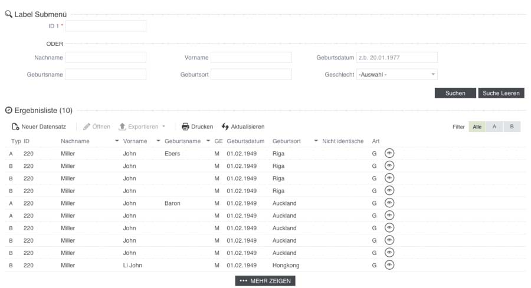

*Richtlinien zur Anwendung*

a.  Es werden nur relevante Inhalte gedruckt.
+
Nicht relevante Daten werden ausgeblendet.
a.  ______
Header
______
+
_______________
Linksnavigation
_______________
+
Um Tinte zu sparen sollten die Farben für das Drucklayout auf das nötige Minimum reduziert werden.
+
_________________________________________________________________________________________________________________________________________________________
Farbige Hintergründe sollten gegen weiß ausgetauscht werden.
Es sei denn sie enthalten wichtige Informationen wie Farbcodierungen für bestimmte Elemente.
_________________________________________________________________________________________________________________________________________________________
+
_______________________________________________________________________________
Die Schriftfarbe behält die für die Webseite definierten Standardgrauwerte bei.
_______________________________________________________________________________
+
Die Inhalte sollten so formatiert sein, dass sie möglichst A4 hochkant ausgedruckt werden können.
+
Auf der gedruckten Seite sollte ein Bereich für Metainformationen bereitgestellt werden.
a.  _______________________________________________________________________
Die Metainformationen werden oben auf jeder gedruckten Seite platziert.
_______________________________________________________________________
+
____________________________________________________________________________________
Der Metabereich kann Informationen wie Datum, Seitenzahl und Benutzername enthalten.
____________________________________________________________________________________
+
Der Benutzer hat zwei Möglichkeiten einen Druckvorgang zu starten.
+
_________________________________________________________________________________________________________________________________________________________________________________________________________
Nutzt der Benutzer die *Druck-Funktion des Browsers* (Datei > Drucken), dann werden die oben beschriebenen Regeln angewendet, es findet keine weitere Optimierung des Layouts statt (siehe<<fig-35>>).
_________________________________________________________________________________________________________________________________________________________________________________________________________
+
______________________________________________________________________________________________________________________________________________________________________________________________________________________________________________________
Einige Inhalte der Anwendung haben eine **explizite Druck-Funktion**. Diese Inhalte werden noch individuell für den Druck optimiert (Beispiel siehe<<fig-37>>). Richtlinien hierfür sind im Kapitel Drucken bestimmter Inhaltsbereiche beschrieben.
______________________________________________________________________________________________________________________________________________________________________________________________________________________________________________________

*Hinweise zur Implementierung*

Für jede Seite besteht die Möglichkeit eine generische Druckansicht anzuzeigen.
Diese Druckansicht kann in einem eigenene View-State definiert werden.
Durch Aufruf des BasisControllers wird sie aktiviert oder deaktiviert.

Beispiel:

<view-state id="auskunftAnzeigenDruckansichtViewState" model="auskunftAnzeigenModel"> <on-entry> <evaluate expression="basisController.showPrintView()"/> </on-entry> </view-state>

Über den Vererbungsmechanismus zwischen XHTML Seiten oder durch Angabe einer spezifischen View kann dadurch die komplette Seite in eine Druckansicht versetzt werden.
In der Druckansicht werden alle Elemente ohne JavaScript angezeigt und das Format entsprechend angepasst.
Mit der Druckfunktion des Browsers kann diese dann ausgedruckt werden.
Ruft man die Druckfunktion des Browsers direkt auf (ohne zuvor auf die Druckansicht geöffnet zu haben), so wird nur das angepasste CSS (print.css) verwendet.
Es erfolgen keine spezifischen Anpassungen von Elementen (z.B. alle Tabs anzeigen).

Das Tag <isy:print-metainformation> kann benutzt werden, um Metainformationen zum Druck anzuzeigen.
Der Inhalt dieses Tags wird nur ausgegeben, sofern die Druckansicht aktiviert ist.
Es enthält folgende Parameter:

_____________________________________________________________________________________________________________________________________________________________________________________________________________________
warning: Ein Text, welcher ausgegeben werden soll, falls ein Nutzer die Druckfunktion des Browsers nutzt, jedoch nicht die Druckansicht aktiviert hat.
Standard: leer.
_____________________________________________________________________________________________________________________________________________________________________________________________________________________

*Drucken bestimmter Inhaltsbereiche*

Neben der allgemeinen Druck-Funktion des Browsers kann der Benutzer über explizite Drucken-Buttons bestimmte Bereiche ausdrucken.

[[fig-36]]
.: Tabelle – Darstellung in Applikation

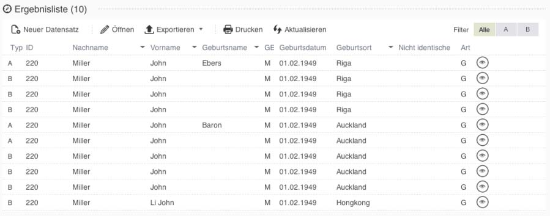

[[fig-37]]
.: Tabelle – Darstellung in Druckvorschau

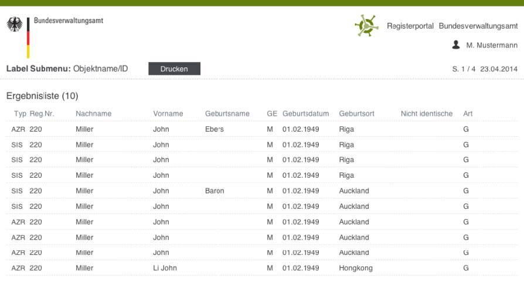

[[fig-38]]
.: Detailseite – Darstellung in Applikation

image:images/image99.jpeg[image,width=629,height=405]

[[fig-39]]
.: Detailseite – Darstellung in Druckvorschau

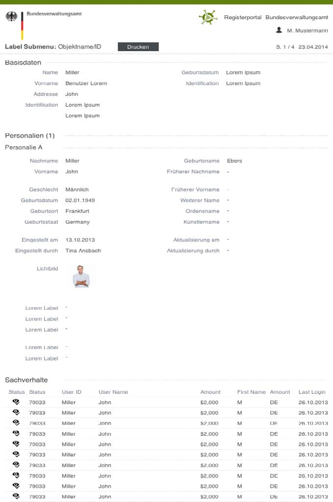

*Richtlinien zur Anwendung*

a.  Es gelten die allgemeinen Druck-Regeln wie oben beschrieben.
+
Soll ein bestimmter Bereich der Anwendung gedruckt werden, wie z.B. eine Tabelle oder eine Detailseite, so werden hierfür erweiterte Druck-Layout-Regeln angewendet.
+
Druckvorschau
a.  _____________________________________________________________________________________________________
Die Daten werden zunächst in einer Druckvorschau aufbereitet und auf einer separaten Seite angezeigt.
_____________________________________________________________________________________________________
+
___________________________________________________________________________________________________________________
In der Druckvorschau ist ganz oben ein Drucken-Button eingebunden. Über diesen kann der Benutzer den Druck starten.
___________________________________________________________________________________________________________________
+
Es werden nur relevante Daten gedruckt.
+
Navigationselemente, Buttons, Toolbars und ähnliche Bedienelemente werden ausgeblendet.
+
__________________________________________________________________________________________________________________________________________________________
Werden Container gedruckt, die nicht dargestellte Informationen enthalten (Tabs, Master-Detail), so werden immer alle Inhalte untereinander wiedergegeben.
__________________________________________________________________________________________________________________________________________________________
+
____________________________________________________________________________________________________________________________________________________________________________________________________________________________________
Dabei sollte für jeden Container eine neue Überschrift eingebunden werden (sofern nicht schon im Layout vorhanden). So kann der Benutzer genau erkennen, an welcher Stelle ein Informationsbereich aufhört und wo ein neuer beginnt.
____________________________________________________________________________________________________________________________________________________________________________________________________________________________________
+
Jede gedruckte Seite enthält Metainformationen
+
__________________________________________________________________________
Die Metainformationen sind auf jeder gedruckten Seite ganz oben platziert.
__________________________________________________________________________
+
Enthält folgende Informationen
+
________________________
Logo des Portalanbieters
________________________
+
______________________________________
Farbmarkierung des Applikationsportals
______________________________________
+
____________________________
Logo des Applikationsportals
____________________________
+
_____
Datum
_____
+
______________
Aktuelle Seite
______________
+
__________________
Gesamtseitenanzahl
__________________
+
_______________________________
Name des eingeloggten Benutzers
_______________________________
+
______________
Drucken Button
______________
+
Drucken von Tabellen
+
____________________________________________________________________________________________________________________
Es sollte darauf geachtet werden, dass die Inhalte der Spalten immer vollständig dargestellt werden und lesbar sind.
____________________________________________________________________________________________________________________
+
___________________________________________________________________________________________
Falls eine Tabelle nicht auf eine Seite passt, wird der Inhalt auf mehrere Seiten verteilt.
___________________________________________________________________________________________
+
image:images/image67.jpeg[image]Drucken von Formularen
+
__________________________________________________________________________________________
Um die Lesbarkeit von Formularinhalten zu gewährleisten, werden diese einspaltig gedruckt.
__________________________________________________________________________________________
+
___________________________________________________________________________________________
Die Spalten der Formulare werden untereinander einspaltig dargestellt (siehe<<fig-39>>).
___________________________________________________________________________________________

*Hinweise zur Implementierung*

Für eine spezifische Druckansicht von Komponenten kann über einen eigenen View-State die generische Druckansicht (siehe Drucklayout) verwendet werden.
Alternativ dazu können die Inhalte der Druckansicht auch selbst definiert und optimiert werden.
Zur Prüfung ob die Druckansicht aktiviert wurde dient das BasisModel.

*Häufige Aufgaben*

_____________________________________________________________________________________________________________________________________________________________________________
Im Folgenden werden häufig durchgeführte Aufgaben beschrieben.
Der Fokus in diesem Kapitel liegt auf den Interaktionen, die während dieser Aufgaben ausgeführt werden müssen.

In den Kapiteln Bedienelemente und Design Patterns können die jeweiligen Spezifikationen der benutzen Elemente nachgelesen werden.
_____________________________________________________________________________________________________________________________________________________________________________

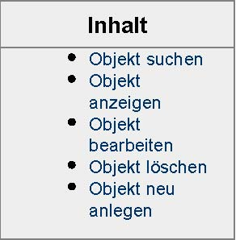

*Objekt suchen*

In den einzelnen Applikationen kann nach existierenden Objekten gesucht werden.
Sofern eine Suche von der Applikation vorgesehen bzw.
für die Applikation sinnvoll ist.

*Suche über Suchformular*

Die Suche erfolgt über ein Suchformular, welches je nach Applikation unterschiedlich komplex sein kann.

[[fig-40]]
.: Objekt suchen

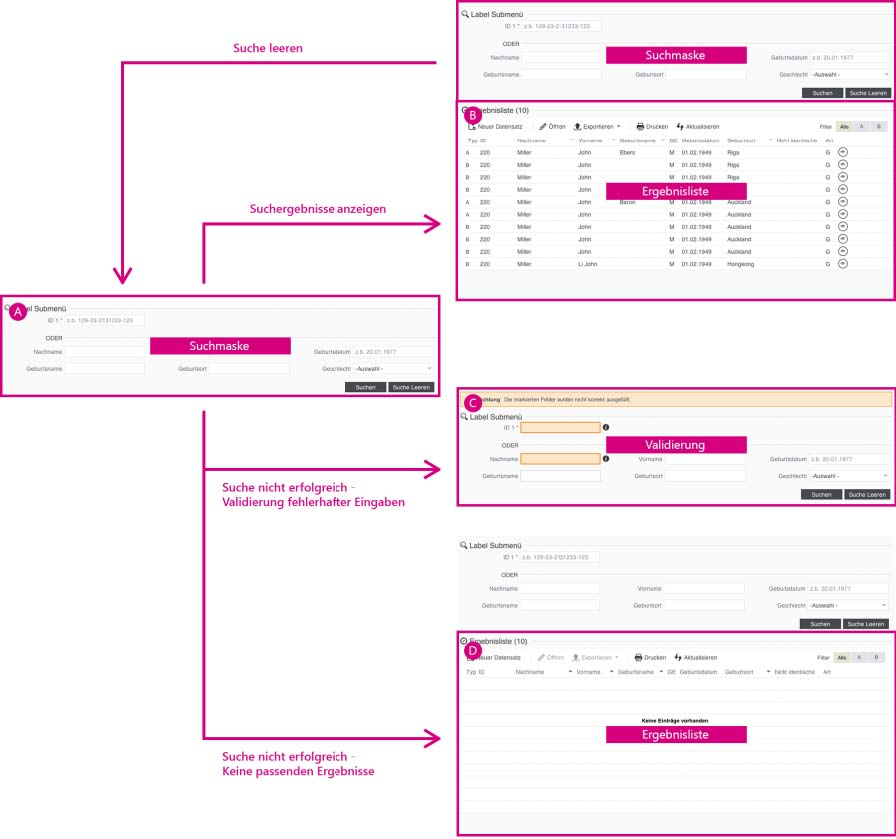

*Richtlinien zur Interaktion*

a.  Die Suche eines Objektes erfolgt über das Ausfüllen und Abschicken eines Formulars *(A)* (siehe<<fig-40>>).
+
Alle Suchfelder können durch Klicken auf „Suche leeren" zurückgesetzt werden.
+
Mit Klick auf Suchen wird die Suche mit den eingegebenen Daten durchgeführt.
+
Die vom System gefundenen Objekte werden in der Ergebnistabelle *(B)* unterhalb des Suchformulars angezeigt.
+
Kann die Suche aufgrund von fehlerhaften Eingaben nicht durchgeführt werden, so wird im Hinweisfeld und an den entsprechenden Eingabefeldern amodales Feedback *(C)* angezeigt (siehe<<fig-40>>).
+
Werden keine Ergebnisse gefunden, wird dem Benutzer entsprechendes Feedback *(D)* in der Ergebnistabelle angezeigt.

______________________________________
Fenstertyp / Pattern Bedienelemente

Formulare Eingabefelder Button Tabelle
______________________________________

*Liste von Objekten filtern*

Benutzer können auch innerhalb einer vorhandenen Liste aus Objekten (z.B. Tabelle) nach einem bestimmten Objekt suchen.
In solchen Fällen wird auch von „filtern" gesprochen.

[[fig-41]]
.: Daten filtern

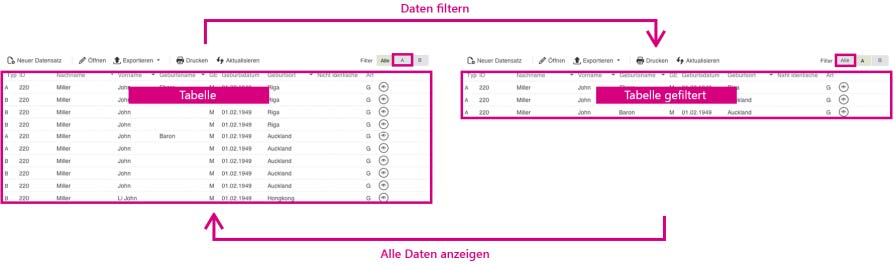

*Richtlinien zur Interaktion*

a.  Der Benutzer kann die angezeigten Objekte mit Hilfe von Filtern einschränken.
+
Wählt der Benutzer eine Filteroption (beispielsweise Toggle-Filter oder Filter-Zeile) so werden alle Objekte ausgeblendet, die nicht dieser Filteroption entsprechen.
+
Der Benutzer hat immer die Möglichkeit sich alle Objekte anzeigen zu lassen.

___________________________________
Fenstertyp / Pattern Bedienelemente

Filter Tabelle

Liste
___________________________________

*Positionierung der Buttons auf der Suchmaske*

Die abschließenden Buttons am unteren rechten Rand sollten wie bei Dialogen durch eine horizontale Linie abgegrenzt werden.
Wichtig ist dabei, dass die horizontale Linie nicht bis zum Rand gehen darf, sondern wie die Controls einen Abstand zu ihrem umgebenden Container einhält.

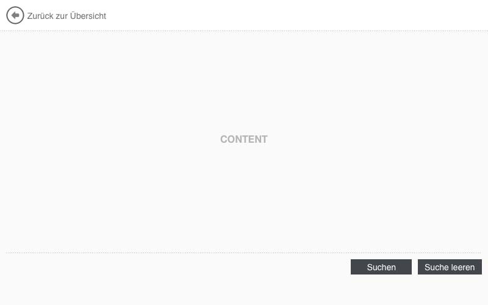

*Objekt anzeigen*

*Vorschau*

In Tabellen kann der Benutzer sich eine Vorschau eines Objektes anzeigen lassen.

[[fig-42]]
.: Vorschau eines Objektes in einer Tabelle anzeigen

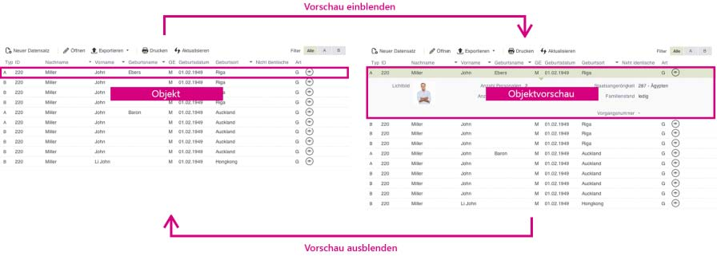

*Richtlinien zur Interaktion*

In einer Tabelle mit Objekten kann der Benutzer die Vorschau eines Objektes einsehen.
Die Vorschau wird mittels Klick auf einen _Vorschau_ Button angezeigt.
Zu einem Zeitpunkt ist jeweils immer nur eine Vorschau sichtbar.

*Detailseite*

Ein Objekt kann eine Detailseite haben.
Auf dieser werden dem Benutzer ausführliche Informationen zu dem Objekt angezeigt.

[[fig-43]]
.: Detailseite eines Objektes anzeigen

image:images/image110.jpeg[image,width=687,height=341]

*Schnellnavigation NOCH NICHT IMPLEMENTIERT*

Optional kann sich zur schnellen Navigation zwischen mehreren Ergebnissen ein Control zentriert in der Seiten-Toolbar befinden.
Es besteht aus Zurück- und Vor-Buttons, die durch die Anzeige der aktuellen Position und der Gesamtmenge getrennt sind.
Die Gesamtmenge entspricht der Anzahl der Objekte in der dahinterliegenden Übersichtsliste.

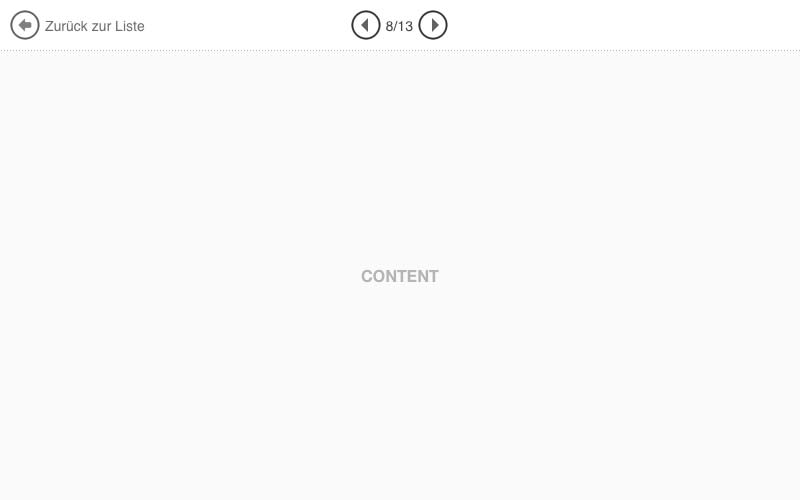

*Richtlinien zur Interaktion*

a.  Durch Klick auf den Bezeichner des jeweiligen Objektes (Nummer, ID, Name etc.), einen Doppelklick auf das gesamte Objekt oder die Toolbar Funktion __Öffnen__, gelangt der Benutzer zu dessen Detailseite.
+
Auf dieser Seite werden dem Benutzer alle Informationen, die zu dem Objekt existieren, zugänglich gemacht.
+
Über einen Link in der Seiten-Toolbar kann der Benutzer jeder Zeit zurück navigieren.

_______________________
Fenstertyp / Pattern

Bedienelemente

Applikation Detailseite

-
_______________________

*Objekt bearbeiten*

[[fig-44]]
.: Objekt editieren

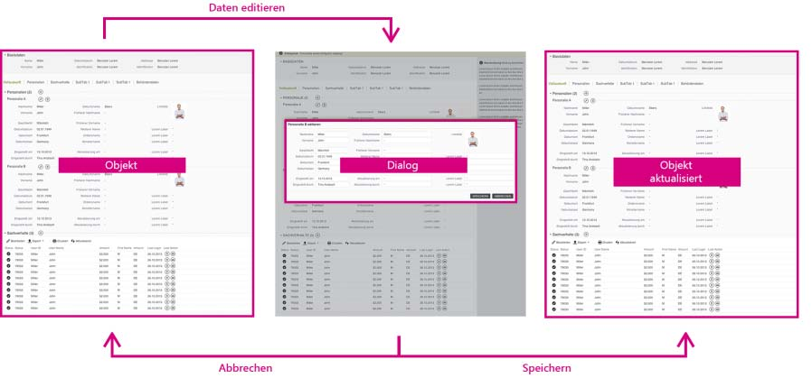

*Richtlinien zur Interaktion*

Das Editieren der Objektdaten erfolgt in einem Modalen Dialog (siehe<<fig-44>>). Der Modale Dialog wird über eine _Bearbeiten_ Funktion aufgerufen.
Die Daten werden über Eingabefelder oder andere Eingabe Patterns angepasst.
Beim Speichern der korrigierten Daten werden diese in das Objekt übernommen und der Dialog wird geschlossen.
Wird die Korrektur abgebrochen, werden die Änderungen verworfen und der Dialog wird geschlossen.
Besteht ein Objekt aus mehreren Teilobjekten, so lässt sich jedes Teilobjekt separat editieren.

*Objekt löschen*

Ein Objekt kann aus mehreren Teilobjekten bestehen.
In diesen Fällen lässt sich jedes Teilobjekt separat löschen.

[[fig-45]]
.: Daten löschen über Meldungsdialog

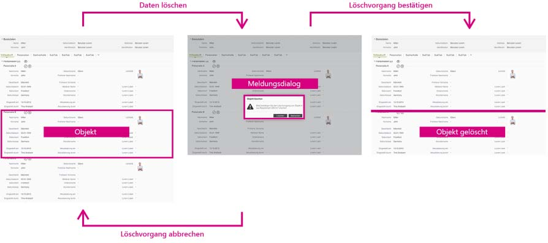

*Richtlinien zur Interaktion*

Das Löschen erfolgt über einen Löschen-Button, der z.B. in der Toolbar eines entsprechenden Objektes positioniert sein kann.
Bei kritischen Daten ist es sinnvoll eine Sicherheitsabfrage dazwischen zu schalten, ehe das Objekt gelöscht wird.
Dies geschieht über einen Meldungsdialog.
Wird der Löschvorgang im Meldungsdialog bestätigt, so wird das Objekt gelöscht und somit auch auf der Detailseite entfernt.
Anschließend wird der Dialog geschlossen.
Wird der Löschvorgang abgebrochen, bleibt das Objekt unverändert.

*Objekt neu anlegen*

*Anlegen eines einfachen Objektes*

[[fig-46]]
.: Anlegen einfacher Objekte über Dialog

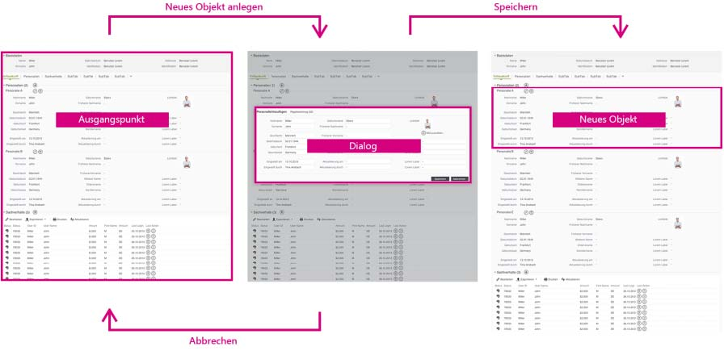

*Richtlinien zur Interaktion*

a.  Die Erstellung eines Objektes erfolgt über einen Dialog.
+
Der Dialog wird über einen Button aufgerufen.
+
Die Daten werden über Eingabefelder oder andere Eingabe Elemente erfasst.
+
Beim Speichern der neuen Daten wird das Objekt angelegt und der Dialog wird geschlossen.
Dabei wird je nach Fall zur aufrufenden Seite oder zur Detailseite des Objektes gesprungen.
Das angelegte Objekt sollte dabei immer im Blickfeld des Benutzers liegen – z.B. neu erstellte Objektzeile sollte selektiert und sichtbar sein.
+
Bei Abbruch des Vorgangs gehen die Daten verloren und der Dialog wird geschlossen.

___________________________________
Fenstertyp / Pattern Bedienelemente

Dialoge -
___________________________________

*Anlegen eines komplexen Objektes*

[[fig-47]]
.: Anlegen komplexer Objekte über Wizard

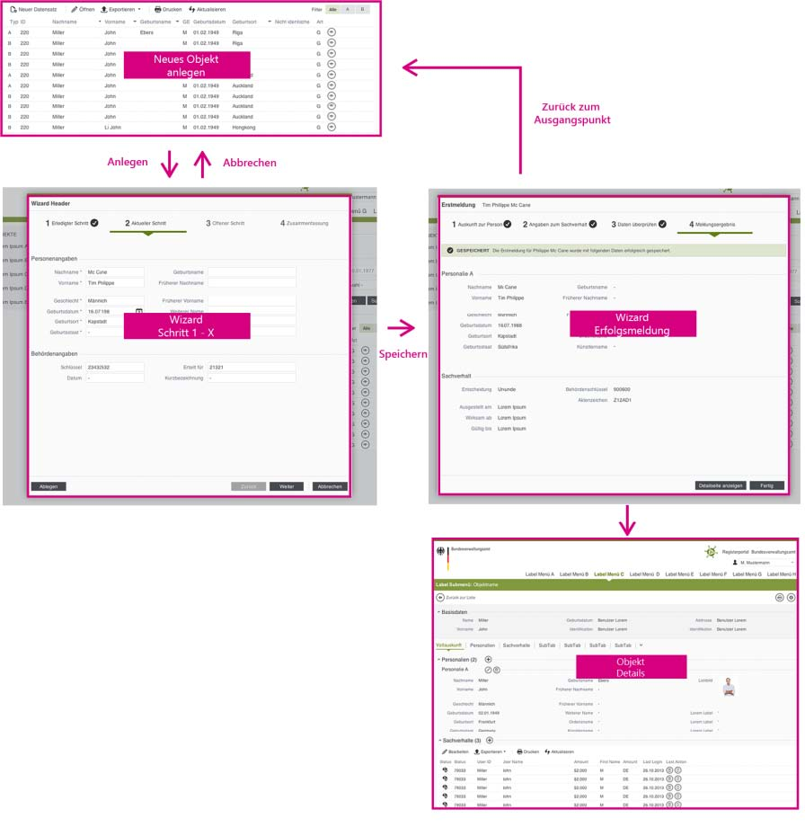

*Richtlinien zur Interaktion*

a.  Komplexe Objekte werden über einen Wizard angelegt.
+
Die Anlage neuer Objekte kann über eine Funktion in der Toolbar von Tabellen oder Gruppierungs-Containern erfolgen.
+
Der Wizard führt den Benutzer Schritt für Schritt durch die Erstellung des neuen Objektes.
+
Um Objekt-Dubletten zu verhindern, sollte innerhalb des Wizards eine Dubletten-Prüfung erfolgen.
+
Über die Buttons _Weiter_ und _Zurück_ als auch über die Wizard Schrittanzeige kann der Benutzer zwischen den Schritten navigieren.
+
Über einen optionalen _Ablage_ Button kann der Benutzer bestimmte Vorgänge für eine bestimmte Zeit ablegen (zwischenspeichern). Die Bearbeitung kann so zu einem späteren Zeitpunkt fortgeführt werden.
Die abgelegten Objekte können an einem zentralen Punkt gesammelt werden.
Beispielsweise auf dem Dashboard in der Spalte „Wichtige Objekte".
+
Der Benutzer hat zu jedem Zeitpunkt die Möglichkeit den Wizard über einen Button abzubrechen.
Der Wizard wird geschlossen und die Daten gehen verloren.
+
Schließt der Benutzer den Vorgang erfolgreich ab, wird das neue Objekt gespeichert.
Der Benutzer erhält immer im letzten Schritt des

_________________________________________________________________________
Wizards eine Erfolgsmeldung und Zusammenfassung der neu angelegten Daten.
_________________________________________________________________________

Nach dem Speichern kann der Benutzer zur Detailseite des neuen Objektes oder zurück zum Ausgangspunkt navigieren.

Springt der Benutzer zurück zum Ausgangspunkt so sollte das neue Objekt im Blickfeld des Benutzers angezeigt werden – z.B. neues Objekt sollte in einer Tabelle selektiert sein.

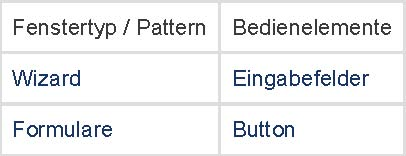

*Bedienelemente*

__________________________________________________________________________
Nachfolgend sind allgemeine Eigenschaften von Bedienelementen beschrieben.
__________________________________________________________________________

a.  Kontextabhängige Darstellung
+
Status
+
Resizing
+
Funktionalität ohne JavaScript
+
Hinweise zur Implementierung

________________________________________________________________________________________________________________________________________________________________________________________________________________________________________________________________________________________________________________________________________________________________________________________________________________________________________________________________________________________________________________________
*Kontextabhängige Darstellung*

Falls bestimmte Elemente im Kontext nicht relevant sind, muss dies im User Interface berücksichtigt werden.
Nicht relevante Komponenten können deaktiviert werden, so dass der Benutzer sie zwar sehen, jedoch nicht bedienen kann.
Alternativ können nicht relevante Informationen und Komponenten ausgeblendet werden, so dass der Benutzer sie nicht sehen kann.

*Ausblenden nicht relevanter Elemente* Elemente, die *dauerhaft* nicht relevant sind, sollten ausgeblendet werden, so dass sie für den Benutzer nicht sichtbar sind.
Hierzu zählen insbesondere Elemente, deren Relevanz auf Benutzer-Rollen basiert.
Benutzer, die aufgrund ihrer Rolle z.B. keinen Zugriff auf bestimmte Funktionen haben, sollten diese auch nicht sehen.
Im Folgenden ist zu sehen wie beispielsweise ein Objekt (hier eine Gruppierung) für Benutzer mit unterschiedlichen Rechten aussehen könnte.
________________________________________________________________________________________________________________________________________________________________________________________________________________________________________________________________________________________________________________________________________________________________________________________________________________________________________________________________________________________________________________________

Abbildung 48 zeigt ein Objekt für das der Benutzer die Rechte zur Bearbeitung besitzt.

Abbildung 49 zeigt ein Objekt für das der Benutzer keine Rechte zur Bearbeitung besitzt.

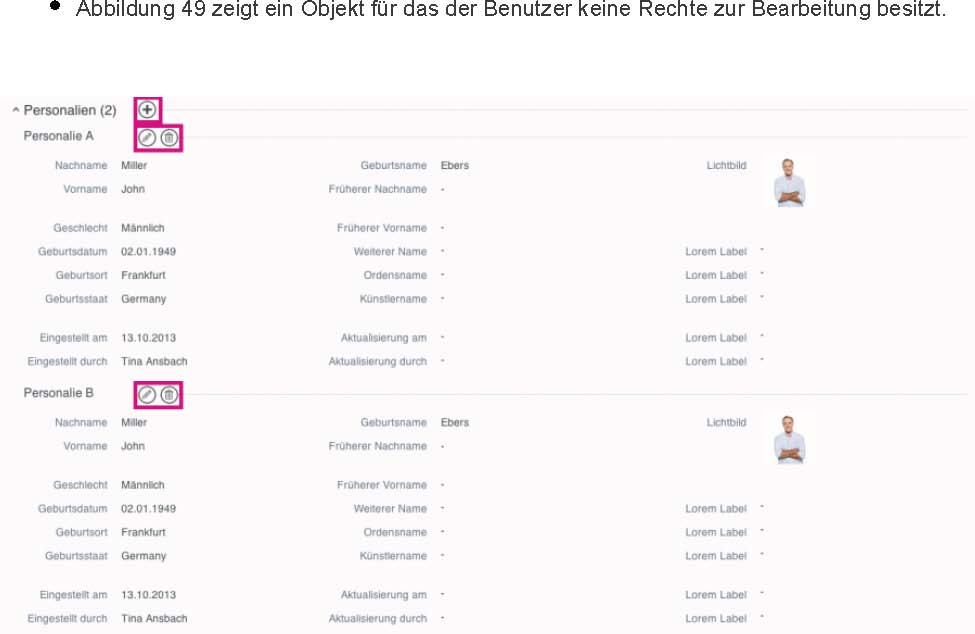

[[fig-48]]
.: Benutzerrechte zum Löschen und Bearbeiten von Objekten vorhanden

[[fig-49]]
.: Benutzerrechte zum Löschen und Bearbeiten von Objekten nicht vorhanden

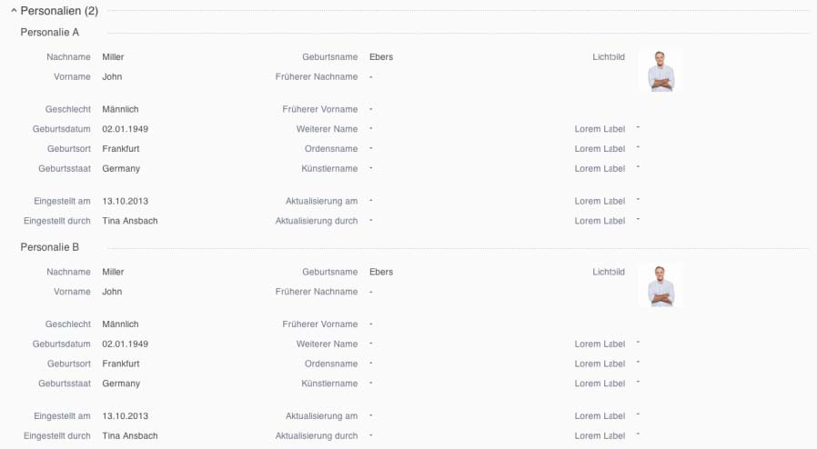

*Deaktivieren nicht relevanter Elemente* Elemente, die nur *temporär* nicht relevant sind, sollten hingegen deaktiviert werden.
Hierzu zählen

\u. a.:

a.  Tool Bar-Funktionen, die z. B. von einer entsprechenden Selektion abhängig sind.
+
Bedienelemente mit Abhängigkeiten, die zunächst von anderen Elementen wie z. B einer Check Box freigeschaltet werden müssen.

______________________________________________________________________________________________________________
image:images/image121.jpeg[image]Komponenten, die nur in einem bestimmten Modus bedienbar sind.
______________________________________________________________________________________________________________

Verschiedene Bedienelemente, in der Regel Eingabeelemente, werden weiterhin zwischen den Zuständen deaktiviert und nur-lesbar unterschieden.
Siehe hierzu das Kapitel Status von Bedienelementen.

*Status von Bedienelementen*

Je nach Kontext können manche Elemente, in der Regel Eingabeelemente, verschiedene Zustände annehmen.

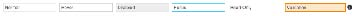

[[fig-50]]
.: Status von Bedienelementen – Beispiel Eingabefeld

*Regeln zur Anwendung*

________________________________________________________________________________________________________________________________________________________________________________________________________________________________________________________________________________________
Die drei häufigsten Zustände sind:

**Normal**

Das Element kann vom Benutzer bedient werden.

**Deaktiviert (Disabled)**

Das Element kann nicht bedient werden.
Es ist z.B. aufgrund der Auswahl einer anderen Option deaktiviert.
Eventuell zuvor eingegebene Werte werden nicht berücksichtigt.
Das Element selbst, dessen Beschriftung sowie eventuell existierende Eingaben, werden „ausgegraut" dargestellt.

**Read-Only (nur lesbar)**

Das Element kann nicht direkt bedient werden.
Eventuell kann es jedoch mittelbar bedient werden, z.B. durch die Änderung eines anderen Wertes.
________________________________________________________________________________________________________________________________________________________________________________________________________________________________________________________________________________________

a.  Wird die Maus über ein Eingabefeld bewegt, ändert sich die Mauszeiger-Darstellung (Maus-Pointer) zu einem Eingabe-Cursor (ähnlich einem großen I). Auch bei read-only Feldern wird der Mauszeiger beibehalten, damit Text markiert und kopiert werden kann.
Bei deaktivierten Eingabe-Feldern ändert sich die Mauszeiger-Darstellung hingegen zu einem „Verbotsschild“, um unmissverständlich darzustellen, dass solche Felder in keiner Weise bedient werden können.
+
Weitere Zustände:

_______________________________________________________________________________________________________________
**Hover (MouseOver)**

Wird die Maus über ein Element bewegt so wird dieses Element mittels eines Hover-Effekts optisch hervorgehoben.
_______________________________________________________________________________________________________________

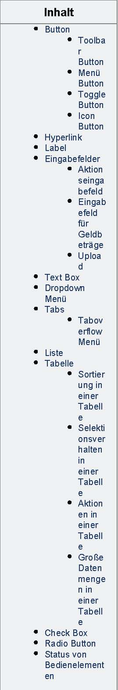

____________________________________________________________________________________________________________________________________
**Pressed**

In dem Moment in dem per Maus oder Tastatur ein Element ausgewählt wird, wird dieses als Pressed dargestellt.

**Focus**

Der Focus liegt auf einem Element.
Der Focus kann per Mausklick oder mit Hilfe der Tabulatortasten der Tastatur geändert werden.

**Selektiert**

Ein Element ist ausgewählt und bleibt in diesem Zustand.

**Validierung**

Elemente die einer Validierung unterzogen werden (vor allem in Formularen) werden bei fehlerhaften Eingaben gesondert hervorgehoben.
____________________________________________________________________________________________________________________________________

*Resizing von Bedienelementen*

Bedienelemente sind in der Regel von Größenänderungen des Browsers nicht betroffen.

Es gibt einige Ausnahmen wie beispielsweise Tabellen.
Diese Ausnahmen werden an den entsprechenden Stellen erläutert.

*Funktionalität ohne JavaScript*

Viele heutzutage übliche Bedienelemente, Gestaltungslösungen und Komfortfunktionen für Webapplikationen setzen die Benutzung von JavaScript voraus.
Ohne die Verwendung von JavaScript sind die Möglichkeiten der Benutzerinteraktion mit Webseiten demzufolge stark eingeschränkt.

a.  Ohne JavaScript ist es dem Browser nicht möglich nach Benutzerinteraktion mit einem Steuerelement andere Teile der Webseite zu beeinflussen oder auszutauschen.
+
Die Webapplikation kann nur Standard-Steuerelemente aus der HTML Spezifikation verwenden, da selbsterstellte Steuerelemente für besondere Anwendungsfälle meist mithilfe von JavaScript gebaut werden.
+
Mit Hilfe von JavaScript lassen sich Benutzeraktionen unmittelbar anzeigen.
Dies wird durch die moderne clientseitige Aktualisierung von Datenmodellen, Zuständen und Darstellungen erreicht.
In einer Nicht-JavaScript Umgebung müssen die Daten mittels komplexeren serverseitigen Request Cycles geladen werden.
Dies bedingt ein häufigeres Neu-Laden der Seite.
+
Ohne JavaScript kann die optische Aufbereitung einiger Bedienelemente variieren.

*Hinweise zur Implementierung*

Bedienelemente werden JSF Composite Components zur Verfügung gestellt.
Durch das Einbinden des JSF Namespace xmlns:isy="http://java.sun.com/jsf/composite/isyfact" könn en die JSF-Komponenten der IsyFact-Web Bibliothek in die Anwendung eingebunden werden.

Komponenten stellen im Grundsatz folgendes sicher:

a.  JavaScript Kompatiblität: Komponenten bieten eine Fallback-Lösung an, falls kein JavaScript aktiviert ist.
+
Druckfunktion Kompatibilität: Komponenten stellen eine Druckansicht zur Verfügung, falls die Druckansicht aktiviert wurde.

_______________________________________________________________________________________________________________________________________________________________________________________________________________________________________________________________________________________________________
Validierung: Die speziellen Formularkomponenten stellen Validierungsfunktionen zur Verfügung, sodass bei Validierungsfehlern automatisch Nachrichten und Tooltips (inkl.
Abwärtskompatibilität falls kein JavaScript aktiviert wurde) gerendert werden.
_______________________________________________________________________________________________________________________________________________________________________________________________________________________________________________________________________________________________________

Abweichungen zu diesen Vorgaben können im Spezialfall möglich sein.

*Button*

Ein Button ist ein Bedienelement, welches per Klick eine direkte Aktion ausführt.
Buttons enthalten entweder ein Textlabel, ein Icon oder eine Kombination aus beidem.

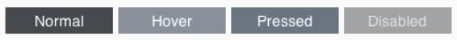

[[fig-51]]
.: Standard Button

*Zustände*

__________________________________________________________________________________________
Ein Button kann mehrere Zustände einnehmen.
__________________________________________________________________________________________

a.  Normal
+
Hover
+
Pressed
+
Deaktiviert

*Ist dies das korrekte Bedienelement?*

a.  Buttons werden für Aktionen verwendet, die direkt ausgeführt werden.
+
Buttons dürfen nicht genutzt werden, um Selektionen aus einer Gruppe von Optionen zu treffen, stattdessen werden Radiobuttons, Checkboxen oder Toggle Buttons verwendet.
+
Wenn das Bedienelement in einem Fließtext angezeigt werden soll, wird kein Button verwendet, sondern ein Link.

*Richtlinien zur Anwendung*

Beschriftung

a.  _______________________________________________
Das Label sollte kurz und selbsterklärend sein.
_______________________________________________
+
_____________________________________________________________________________________________________________________________
Ruft ein Button einen Dialog auf, sollte der resultierende Dialog als Fenster-Titel die Beschriftung des Buttons wiederholen.
_____________________________________________________________________________________________________________________________
+
_________________________________________________________________________________________________
Das Label sollte die auszuführende Aktion widerspiegeln __(Öffnen, Löschen, Speichern, Weiter__).
_________________________________________________________________________________________________

a.  Ein Button sollte nach Möglichkeit so platziert werden, dass eventuelle Beziehungen zu anderen Elementen deutlich werden.
+
Falls nach einem Button-Klick die resultierende Aktion nur verzögert erkennbar ist, sollte dies durch eine System-Rückmeldung kenntlich gemacht werden (z. B. durch eine Fortschrittsanzeige).
+
[[fig-51]]
.zeigt den primären Button-Stil, der eingesetzt wird, wenn keine sonstige Definition vorhanden ist.

+
Buttons sollten dann deaktiviert (disabled) sein, wenn sie durch Interaktion auf dem gleichen Screen – z.B. durch Durchführung der Suche – aktiviert werden können.
+
Wenn die durch den Button hervorgerufene Aktion für den Benutzer nicht selbsterklärend ist, sollte ein Tooltip unterstützend angezeigt werden.

*Hinweise zur Implementierung Button*

Ein einfacher Button wird über das Tag <isy:button> eingebunden.

Folgende Parameter sind zulässig:

_________________________________________________________________________________________________________________________________________________
action: Die auszuführende Aktion.

styleClass: Die zu ergänzenden Style-Klassen.

value: Das Label des Buttons.

disabled: Ob der Button deaktivert ist oder nicht.

ajax: AJAX: Ob die Aktion per AJAX ausgeführt werden soll oder nicht (seit 3.1.x)

execute: AJAX: Welches Form ausgeführt werden soll.

render: AJAX: Welche Elemente gerendert werden sollen.

block: AJAX: Ob ein Klick die GUI blockieren soll bis das Ergebnis eingetroffen ist.

showPrintView: Ein spezifisches Flag zur Erkennung der Druckansicht, falls notwendig (seit 3.1.x).

defaultAction: Ob der Button der Default-Button sein soll. (seit 4.0.x)

globalConfig: Eine spezifische globale Konfiguration, falls notwendig
_________________________________________________________________________________________________________________________________________________

Wenn JavaScript aktiviert ist, dann wird die AJAX-Action durchgeführt.
Andernfalls wird immer ein Full-Page-Reload durchgeführt.
Mehrere Buttons

Mehrere Buttons können in einer Zeile gruppiert werden, indem sie in das Tag <isy:buttonRow> eingeschlossen werden.

Folgende Parameter sind für das Tag <isy:buttonRow> zulässig:

________________________________________________________________________________________________________________________________________________________________________________________________________________________________________________________________________________________________________________________________________
 alignRight: Ob die Button Row eine Alignment nach Rechts besitzen soll oder nicht.
Standard: false (Seit 3.1.x) Die Buttons können weiter über das Tag <isy:buttonGroup> gruppiert werden.
Dadurch können in einer Reihe eine Gruppe an Buttons z.B. links und rechts angezeigt werden.
________________________________________________________________________________________________________________________________________________________________________________________________________________________________________________________________________________________________________________________________________

Folgende Parameter sind für das Tag <isy:buttonRow> zulässig:

_________________________________________________________________________________________________________________________________________________
alignRight: Ob die Button Row eine Alignment nach Rechts besitzen soll oder nicht.
Standard: false
_________________________________________________________________________________________________________________________________________________

alignLeft: Ob die Button Row ein Alignment nach Links besitzen soll oder nicht.
Standard: false Mehrere Aktionen

(Seit 3.1.x) In bestimmten Fällen kann es notwendig sein mehrere Formulare an den Server zu senden, um bestimmte Aktionen auszuführen (z.B. das Formular für den Inhaltsbereich soll auch beim Klick auf Drucken in der Seitentoolbar übermittelt werden). Dies kann durch verwenden des Tags <isy:buttonInjectPost> erreicht werden.
Dadurch lässt sich eine andere Aktion vor der eigentlichen Aktion des Buttons innerhalb des Tags ausführen.

Folgende Parameter sind zulässig:

___________________________________________________________________________________________________________________________________________________________________________________________________________________________________________
postButton: Enthält die ID des Buttons, der die zusätzliche POST-Aktion durchführen soll.

continueAfterPost: Über diesen Wert true/false kann gesteuert werden, ob nach der POST-Aktion auch tatsächlich der eigentliche Button geklickt werden soll (z.B. um Fehlerfälle abzufangen).
___________________________________________________________________________________________________________________________________________________________________________________________________________________________________________

*Toolbar Button*

Toolbar Buttons werden ausschließlich in Toolbars eingesetzt.

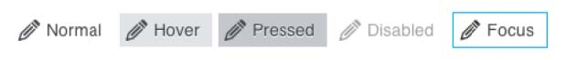

[[fig-52]]
.: Toolbar Button

*Zustände*

a.  Normal
+
Hover
+
Pressed
+
Focus
+
Deaktiviert

*Ist dies das korrekte Bedienelement?*

________________________________________________________________________________________________
Toolbar Buttons werden in der Toolbar eingesetzt.
________________________________________________________________________________________________

*Richtlinien zur Anwendung*

a.  Toolbar Buttons bestehen aus einem Icon und Label.
+
Sie haben im Gegensatz zu Standardbuttons keinen Farbigen Hintergrund.
+
Befinden sich mehrere Buttons in einer Toolbar so können sie durch vertikale Trennlinien zu Gruppen zusammengefasst werden.
+
Mehr allgemeingültige Regeln werden im Kapitel Toolbar beschrieben.

*Hinweis zur Implementierung*

Implementierung in JSF / plis-web

Ein Toolbar Button wird über das Tag <isy:buttonToolbar> eingebunden.

Folgende Parameter sind zulässig:

___________________________________________________________________________________________
action: Die auszuführende Aktion.

value: Das Label des Buttons.
Standard: leer
___________________________________________________________________________________________

disabled: Ob der Button deaktiviert sein soll oder nicht.
Standard: false

__________________________________________________________________________________________________________________________________
icon: Das Icon aus der Icon-Bibliothek (ohne Präfix 'icon-'). Standard: placeholder
__________________________________________________________________________________________________________________________________

showIcon: Ob ein Icon angezeigt werden soll oder nicht.
Standard: true

_______________________________________________________________________________________________________________________________
reverseIconPosition: Ob das Icon rechts angezeigt werden soll.
Standard: false.

execute: AJAX: Welches Felder ausgewertet werden sollen.
Standard: @form

render: AJAX: Welcher Teilbereich aktualisiert werden soll.
Standard: @form

globalConfig: Eine spezifische globale Konfiguration, falls nötig
_______________________________________________________________________________________________________________________________

Wenn JavaScript aktiviert ist, dann wird die AJAX-Action durchgeführt.
Andernfalls wird immer ein Full-Page-Reload durchgeführt.
Folgende Action-Sources werden bereitgestellt:

__________________________________________________________________________________________________
buttonActionEvent: Das Action Event für den Button.
__________________________________________________________________________________________________

*Menü Button*

Menü Buttons können aus Platzgründen zusammengehörige Funktionen zusammenfassen.

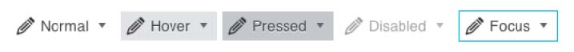

[[fig-53]]
.: Menü Button

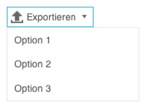

[[fig-54]]
.: Menü Button – Beispiel

*Zustände*

a.  Normal
+
Hover
+
Pressed
+
Focus
+
Deaktiviert

*Ist dies das korrekte Bedienelement?*

a.  Menü Buttons werden hauptsächlich in Toolbars eingesetzt.
+
Menü Buttons müssen mehrere Funktionen beinhalten.
Die Funktionen sollten immer in einem logischen Zusammenhang stehen.
Zum Beispiel kann man unter dem Button „Exportieren" die Funktionen „Exportieren als XLS", „Exportieren als PDF", „Exportieren als PNG" zusammenfassen.

*Richtlinien zur Anwendung*

a.  Der Menü Button besteht aus einem Icon, einem Label und einem Pfeil Icon.
+
Wird der Menü Button geklickt, werden die Funktionen wie in einem Dropdown Menü angezeigt (siehe<<fig-54>>).

*Kein JavaScript*

Ohne JavaScript können die Funktionen die im Menü Button zusammen gefasst sind nicht direkt ausgeführt werden.

a.  Der Menü Button besteht in diesem Fall aus einem Dropdown und einem Submit Button.
+
Über das Dropdown wählt der Benutzer die gewünschte Funktion und über den Klick auf den Submit Button wird die Funktion ausgeführt.
+
Damit das Dropdown und der Submit Button als Einheit wahrgenommen werden, wird eine vertikale Trennlinie zum nächsten Element platziert.
+
Der Submit Button sieht aus wie ein Toolbar Button.

*Hinweise zur Implementierung*

Derzeit noch nicht realisiert.

*Toggle Button*

Toggle Buttons kommen zum Einsatz, wenn eine bestimmte Funktion oder Eigenschaft ein- und ausgeschaltet werden muss.
Die häufigsten Szenarien für den Einsatz von Toggle Buttons sind das schnelle Umschalten von Ansichten oder von Filterkriterien (siehe Kapitel Toggle-Filter).

[[fig-55]]
.: Toggle Button

*Zustände*

a.  Normal
+
Hover
+
Pressed
+
Selektiert

*Ist dies das korrekte Bedienelement?*

a.  Toggle Buttons können genutzt werden, um binäre Zustände innerhalb einer Toolbar umzuschalten.
+
Soll der Toggle Button statt in einer Toolbar in-place verwendet werden, so sollte an dessen Stelle die Nutzung von Checkboxen oder Radio Buttons in Betracht gezogen werden.

*Richtlinien zur Anwendung*

a.  Per Default ist immer ein Wert selektiert.
+
Toggle Buttons können Textlabels oder Icons beinhalten.

*Hinweise zur Implementierung*

Implementierung in JSF / plis-web

(Seit 3.1.x) Ein Toggle-Button wird über das Tag <isy:buttonToggle> eingebunden.

Folgende Parameter sind zulässig:

_____________________________________________________________________________________________________________________
action: Die auszuführende Aktion.

value: Das Label des Buttons.

icon: Das Icon aus der Icon-Bibliothek (ohne Präfix 'icon-').

showIcon: Ob das Icon angezeigt werden soll oder nicht.
Standard: true

disabled: Ob der Button deaktivert ist oder nicht.
_____________________________________________________________________________________________________________________

reverseIconPosition: Ob das Icon rechts angezeigt werden soll.
Standard: false

_____________________________________________________________________________________________________________________________________
active: Ob der Button ausgewählt sein soll, also aktiv ist.
Standard: false

execute: AJAX: Welches Form ausgeführt werden soll.

render: AJAX: Welche Elemente gerendert werden sollen.

showPrintView: Ein spezifisches Flag zur Erkennung der Druckansicht, falls notwendig.

globalConfig: Eine spezifische globale Konfiguration, falls notwendig.
_____________________________________________________________________________________________________________________________________

Folgende Action-Sources werden bereitgestellt:

______________________________________________________________________________________________
toggleButton: Das Action Event für den Button.
______________________________________________________________________________________________

*Icon Button*

Icon Buttons sind Buttons die kein sichtbares Label haben, sondern nur aus einem aussagekräftigen Icon bestehen.

[[fig-56]]
.: Icon Button Quickactions & Toolbar

image:images/image144.jpeg[image,width=277,height=137]

[[fig-57]]
.: Icon Button Pfeile

*Zustände*

a.  Normal
+
Hover
+
Pressed
+
Deaktiviert

*Ist dies das korrekte Bedienelement?*

__________________________________________________________________________________________________________________________________________________________________________________________
Icon Buttons können in der Seiten-Toolbar, der Toolbar von Gruppierungsüberschriften und in der Aktionsspalte einer Tabelle benutzt werden.
__________________________________________________________________________________________________________________________________________________________________________________________

*Richtlinien zur Anwendung*

a.  Da die Buttons nur aus einem Icon bestehen, ist es essentiell, dass das Icon die dahinterstehende Funktionalität ausdrückt.
+
Icon Buttons sollten mit Bedacht eingesetzt werden.
+
Icon Buttons verfügen immer über einen Tooltip, der die entsprechende Funktionalität beschreibt.
+
Im Sinne der Barrierefreiheit sollte bei Bildern und Icons immer ein beschreibendes Label im Quellcode (z.B. Title oder alt Attribut) vorhanden sein.

*Hinweise zur Implementierung*

Ein Button mit Icon wird über das Tag <isy:buttonIcon> eingebunden.

Folgende Parameter sind zulässig:

______________________________________________________________________________________________________________________
action: Die auszuführende Aktion.

value: Das Label des Buttons.
Standard: leer

disabled: Ob der Button deaktivert ist oder nicht.
Standard: false

size: Die Größe des Icons.
Mögliche Werte: small/large.
Standard: large

icon: Der Suffix des zu verwendenden Icons.
Standard: placeholder

showIcon: Ob das Icon angezeigt werden soll oder nicht.
Standard: true

tooltip: Browser-Tooltip, der über dem Icon angezeigt werden soll.

execute: AJAX: Welches Form ausgeführt werden soll.
Standard: @form.

render: AJAX: Welche Elemente gerendert werden sollen.
Standard: @form.

globalConfig: Eine spezifische globale Konfiguration, falls notwendig.
______________________________________________________________________________________________________________________

Folgende Action-Sources werden bereitgestellt:

___________________________________________________________________________________________________
buttonActionEvent: Das Action Event für den Button.
___________________________________________________________________________________________________

Wenn JavaScript aktiviert ist, dann wird die AJAX-Action durchgeführt.
Andernfalls wird immer ein Full-Page-Reload durchgeführt.

*Hyperlink*

Hyperlinks sind verlinkte Texte (oder auch Grafiken), die im Wesentlichen als Navigations-Mechanismus dienen – so z.B. um andere Inhalte wie Fenster zu öffnen.
Ebenso können Hyperlinks dazu eingesetzt werden, Funktionen aufzurufen.

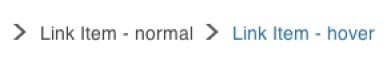

[[fig-58]]
.: Dashboard – Textlink zu Applikation (mit Icon)

image:images/image147.jpeg[image,width=214,height=45]

[[fig-59]]
.: Dashboard – Normaler Textlink

[[fig-60]]
.: Applikation – Textlink in Tabellen

*Zustände*

a.  Normal
+
Hover

*Ist dies das korrekte Bedienelement?*

a.  Hyperlinks werden verwendet, um zu anderen Inhalten zu navigieren.
+
Hyperlinks können aber auch genutzt werden um sekundäre Funktionen aufzurufen.
+
Hyperlinks werden jedoch nicht für das Initiieren primärer, unmittelbarer Aktionen genutzt in diesem Fall sollten Buttons verwendet werden.
+
Würde der Hyperlink eine irreversible Aktion ausführen, sollte kein Hyperlink verwendet werden, da dieses Verhalten nicht erwartungskonform wäre.
+
Hyperlinks sollten nicht in einer Toolbar verwendet werden, hier empfiehlt sich der Einsatz von Toolbar-Buttons oder Icon-Buttons.

*Richtlinien zur Anwendung*

a.  Wird die Maus über einen Hyperlink bewegt, ändert der Mauscursor sich vom Pfeil- zum Hand-Symbol.
+
Werden Hyperlinks auf gesättigten Hintergrundfarben verwendet, sollte die Textfarbe entsprechend angepasst werden, um eine ausreichende Lesbarkeit zu gewährleisten.
+
Hyperlinks sollten einen aussagekräftigen Text zur Verfügung stellen.
Generische Phrasen wie „Hier klicken" sind nicht hilfreich und sollten vermieden werden.
+
Hyperlinks (Textlinks) innerhalb von Applikationen werden blau dargestellt und bei Hover unterstrichen, z.B. Bezeichner (Name/ID) in Tabellen.
+
Hyperlinks auf dem Dashboard
a.  ________________________________________________________________________________________________________________________________________________________________________
Verlinkungen (Textlinks) auf dem Dashboard unterscheiden sich zu Textlinks in Applikationen.
Um einen optischen Overload zu vermeiden, werden sie nicht blau eingefärbt.
________________________________________________________________________________________________________________________________________________________________________
+
______________________________________________________________
Alle Links des Dashboards sind grau und werden bei Hover blau.
______________________________________________________________

______________________________________________________________________________________________________________________________
Links, die zu Applikationen navigieren, haben vor dem Textlabel ein Pfeil-Icon.
______________________________________________________________________________________________________________________________

*Hinweise zur Implementierung*

Links können mit dem Standard-HTML Tag <a...> oder durch Nutzung des JSF Tags <h:outputLink/> erzeugt werden.

_Hinweis:_ Auch die Nutzung des JSF Tags können <h:commandLink /> ist möglich.
Jedoch ist die Funktionalität nur bei aktiviertem JavaScript nutzbar.
Entsprechende Fallbackmaßnahmen müssen also getroffen werden.

(Seit 3.1.x) Falls ein Hyperlink Aktionen im Webflow, bzw.
JSF Ausführen soll, so kann das Tag <isy:hyperlink> verwendet werden.
Dieses Tag stellt sicher, dass falls JavaScript deaktiviert ist, ein Button mit Layout eines Links dargestellt wird.
Das Tag hat folgende Parameter:

______________________________________________________________________________________________________________________________________________________________
action: Die Action, die ausgeführt werden soll.

value: Das Label des Links.

title: Der Alternativtext.

baseStyleClass: Die Basistyleklasse zum Überschreiben.

additionalStyleClass: Zusätzliche Styleklassen.

openInNewTab: Ob der Link in einem neuen Tab geöffnet werden soll.
Funktioniert nur mit aktiviertem JavaScript.
______________________________________________________________________________________________________________________________________________________________

Das Tag stellt folgende ActionSource bereit:

_____________________________________________________________________________________
hyperlink: Die ActionSource des Links.
_____________________________________________________________________________________

*Label*

Ein Label besteht in der Regel aus einem Text.
In manchen Fällen kann es auch eine Kombination aus einem Icon und einem Text sein (z.B. Buttons mit Icon und Text). Es gibt auch Bedienelemente deren Label ausschließlich aus einem Icon bestehen.
Hier gilt es zu beachten, dass das Icon eindeutig und aussagekräftig die dahinterstehende Aktion repräsentieren muss.
Solche Bedienelemente können zusätzlich durch einen Tooltip unterstützt werden.
Elemente wie Eingabefelder, Radiobuttons oder Checkboxen werden typischerweise mit einem Text-Label gekennzeichnet, während auf Schaltflächen häufig auch Icons verwendet werden.

*Ist dies das korrekte Bedienelement?*

a.  Möglichst jedes Bedienelement sollte mit einem Label versehen werden.
+
Zur besseren Strukturierung und Gliederung von formularbasierten Screens werden Labels im Inhaltsbereich in Form einer Überschrift verwendet.

*Richtlinien zur Anwendung*

a.  Labels sind möglichst kurz und prägnant formuliert.
+
Labels für alle Bedienelemente außer Radiobuttons und Checkboxen sollen nach Möglichkeit nicht aus mehr als drei Wörtern bestehen.
+
Es ist auf eine konsistente Groß- und Kleinschreibung der Labels zu achten.
+
Labels beginnen immer mit einem Großbuchstaben, auch Verben z.B. „Drucken", „Exportieren".
+
Für deutschsprachige Anwendungen sollten möglichst deutsche Begriffe benutzt werden.
+
Abkürzungen müssen sparsam verwendet und immer mit einem Tooltip versehen werden, der die Abkürzung erläutert.
+
Zu lange Labels werden mit Auslassungszeichen „..." (eng.
ellipsis) abgetrennt und ein Tooltip zeigt die ausgeschriebene Variante des Labels.
+
Bei Auswahl-Elementen wie Radiobuttons oder Checkboxen setzt ein Klick auf den Wert die entsprechende Option.

*Hinweise zur Implementierung*

Für reine Labels existieren keine spezifischen JSF-Komponenten.
Das Standard-JSF Tag <h:outputText/> kann verwendet werden.

Für formularbasierte Masken werden automatisch Labels für Eingabefelder erzeugt.
Siehe auch Formulareingabefelder.

(Seit 3.1.x) Für das Ausgeben eines Textes (mit zugehörigem Label) in einem Formular kann das Tag <isy:formLabel> verwendet werden.
Es besitzt folgende Parameter:

_____________________________________________________________________________________________________________________________________
reference: Die Referenz des Objekts für die Validierung

value: Der Text für das Ausgabelabel.

label: Der Text für das Label.

labelStyleClass: Die CSS-Klasse für das Label.
Standard: col-lg-6

inputStyleClass: Die CSS-Klasse für den Ausgabebereich.
Standard: col-lg-6

textStyleClass: Die CSS-Klasse für den auszugebenden Text.

tooltip: Der Tooltip für das Ausgabelabel.

breakWords: Erlaubt das Deaktivieren des Wrappings von Text innerhalb der Komponente.

converter: Die JSF-Converter-ID, welche die Ausgabe in einen Text konvertiert.

globalConfig: Eine spezifische globale Konfiguration, falls benötigt.
_____________________________________________________________________________________________________________________________________

*Eingabefelder*

Ein Eingabefeld dient der Eingabe von Text durch den Benutzer.
Ein Eingabefeld ist in der Regel einzeilig.

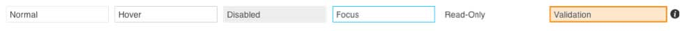

[[fig-61]]
.: Eingabefelder

*Zustände*

a.  Normal
+
Hover
+
Deaktiviert
+
Focus

__________________________________________________________
Read-Only

Validierung
__________________________________________________________

*Ist dies das korrekte Bedienelement?*

a.  Eingabefelder werden für die Eingabe von Freitext genutzt.
+
Falls die einzugebenden Daten Teil einer vordefinierten Menge sind, sollte die Verwendung eines Dropdown Menü oder einer Wertehilfe in Erwägung gezogen werden.

*Richtlinien zur Anwendung*

a.  Die Breite eines Eingabefeldes sollte der Länge des maximal möglichen Inhalts entsprechen.
+
Viele unterschiedliche Größen sollten jedoch vermieden werden, um ein harmonisches Gesamtbild zu erhalten.
Es sollten daher nicht mehr als drei verschiedene Klassen von Feldgrößen verwendet werden.
+
Es kann jedoch auch sinnvoll sein, Eingabefelder exakt auf die zu erwartende Eingabe anzupassen, so z. B. bei der Eingabe von festen Größen wie einer Postleitzahl.
Dies muss von Fall zu Fall entschieden werden.
+
Werden in ein Eingabefeld oftmals gleiche oder ähnliche Daten eingegeben, sollte eine Form von Eingabehilfe wie Autovervollständigung (siehe Kapitel Autosuggestion) zur Verfügung gestellt werden.
+
Um die Bedieneffizienz zu erhöhen, sollten Eingabefelder, deren Eingaben validiert werden, nach Möglichkeit verschiedene Eingabeformate unterstützen (z. B. in Bezug auf führende Nullen bei Datumsformaten: 8.1.09 oder 08.01.09).
+
Alphanumerische Zeichenketten sollten innerhalb eines Eingabefeldes linksbündig ausgerichtet werden.
+
Numerische Eingaben sollen rechtsbündig ausgerichtet werden, wenn optisch Summen gebildet werden sollen.
Numerische Werte in alleinstehenden Eingabefeldern werden nicht rechtsbündig ausgerichtet.
+
Existieren sinnvolle Vorgaben, so kann ein Eingabefeld mit diesen als Platzhalter (siehe Kapitel Platzhalter) vorbelegt sein.
So kann ein Datumsfeld unter bestimmten Umständen z. B. mit dem aktuellen Datum vorbelegt werden.
Falls eine Vorbelegung jedoch potentiell risikobehaftet ist, sollte das Eingabefeld nicht vorbelegt werden.

*Kein JavaScript*

Es gelten die gleichen Regeln und Einschränkungen wie im Kapitel Validierung beschrieben.

*Hinweise zur Implementierung*

Für einzelne Eingabefelder existieren derzeit noch keine einfachen Komponenten.
Um ein einfaches Eingabefeld einzufügen kann das JSF-Tag < h:inputText/> mit den Bootstrap-Klassen form-control verwendet werden.
Für formularbasierte Eingaben existiert das Tag <isy:formInp ut/>, welches ein Eingabefeld in einem Formularlayout mit Label kapselt.
Nähere Informationen hierzu finden sich im Formularkapitel.

Folgende Parameter sind zulässig:

______________________________________________________________________________________________________________________________________________________________________________________________________________________________
reference: Die Referenz des Objekts

value: Der Wert für das Databinding im Eingabefeld

required: Ob die Eingabe ein Pflichteingabe ist

readonly: Ob die Darstellung nur lesend erfolgen soll

label: Der Text für das Label

labelStyleClass: Die CSS-Klasse für das Label

inputStyleClass: Die CSS-Klasse für den Eingabebereich.

placeholder: Der Platzhalter, welcher im Eingabefeld angezeigt wird

inputmask: Die Eingabemaske

inputmaskInsertMode: Die Eingabemaske: ob text soll überschrieben werden beim eintippen

maxlength: Die maximale Länge der Eingabe

width: Die maximale Breite des Eingabefeldes.

showPrintView: Zur aktuellen Druckansicht-Anzeige aus dem BasisModel

tooltip: Tooltip.

validationModel: Ein spezifisches Validation-Model, falls benötigt.

globalConfig: Eine spezifsche globale Konfiguration, falls benötigt.

charpicker: Die Referenz des Objekts.

contentRight: Der Inhalt der rechts vom Listpicker angezeigt wird

type: Der Typ des Eingabefelds, so dass diese Komponente z.B. auch für Passwort-Felder verwendet werden kann.
Mögliche Werte alle Werte für das Feld type des HTML Input Felds

fourEyesMode: 4 Augen Prinzip Mode (locked, unlock)

fourEyesLastValue: 4 Augen Prinzip Mode (locked, unlock)
______________________________________________________________________________________________________________________________________________________________________________________________________________________________

*Aktionseingabefeld*

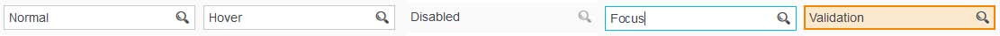

*Zustände*

a.  Normal
+
Hover
+
Deaktiviert
+
Focus
+
Validierung

*Ist dies das korrekte Bedienelement?*

a.  Falls zusätzlich zum Eingabefeld einen dazugehörigen visuellen Hinweis dargestellt werden soll.
+
Falls die Eingabe beigesteurt werden muss oder kann, z.B. in einem modalen Dialog.

*Hinweise zur Implementierung*

Die Implementierung erfolgt über das Tag <isy:actionInput> bzw. <isy:formActionInput>. Folgende Parameter sind für <isy:action Input> zulässig:

__________________________________________________________________________________________________________________________________________________________________________
reference: Die Referenz des Objekts.

value: Der anzuzeigende Wert als String.

placeholder: Der Platzhalter, welcher im Eingabefeld angezeigt wird.

action: Die auszulösende Aktion, beim Klicken aufs Icon.
Wird ignoriert im Falle von mode = input-only.

icon: Das benutzte Icon aus dieser http://getbootstrap.com/components/#glyphicons[Liste], nur der Suffix, z.B. search.

iconColor: Die Farbe des Icons, per Default #45484D.

mode: Eins aus normal für Inputfeld und Icon aktiv, button-only für nur Icon aktiv und input-only für nur Inputfeld aktiv.

tooltip: Einen optionalen Tooltip für das Icon.

disabled: Ob das Inputfeld deaktiviert ist oder nicht.

fourEyesMode: 4 Augen Prinzip Mode (locked, unlock).

fourEyesLastValue: 

inputStyleClass: Die zu ergänzenden Style-Klassen.
__________________________________________________________________________________________________________________________________________________________________________

Folgende Parameter sind zusätzlich zu den eben genannten für <isy:formActionInput> zulässig:

____________________________________________________________________________________________________________________
required: Ob die Eingabe ein Pflichteingabe ist.

label: Der Text für das Label.

labelStyleClass: Die CSS-Klasse für das Label.

maxlength: Die maximale Länge der Eingabe.

validationModel: Ein spezifisches Validation-Model, falls benötigt.

globalConfig: Eine spezifsche globale Konfiguration, falls benötigt.
____________________________________________________________________________________________________________________

*Eingabefeld für Geldbeträge*

Im Vergleich zu <isy:formInput> nimmt diese Komponente nur die Eingabe von Zahlen und Kommas entgegen.

Beim Verlassen des Feldes Wird die eingegebene Zahl in eine Zahl mit zwei Nachkommastellen umgewandelt.

*Zustände*

Wie bei <isy:formInput>.

*Ist dies das korrekte Bedienelement?*

CurrencyInput wird verwendet, wenn ein Währungsbetrag eingegeben werden soll.

*Hinweise zur Implementierung*

Die Implementierung erfolgt über das Tag <isy:formCurrencyInput>. Folgende Parameter sind zulässig:

__________________________________________________________________________________________________________________________________________________________
reference: Die Referenz des Objekts.

value: Der Wert für das Databinding im Eingabefeld.

required: Ob die Eingabe ein Pflichteingabe ist.

readonly: Ob die Darstellung nur lesend erfolgen soll.

label: Der Text für das Label.

labelStyleClass: Die CSS-Klasse für das Label.

inputStyleClass: Die CSS-Klasse für den Eingabebereich.

placeholder: Der Platzhalter, welcher im Eingabefeld angezeigt wird.

maxlength: Die maximale Länge der Eingabe.

validationModel: Ein spezifisches Validation-Model, falls benötigt.

globalConfig: Eine spezifsche globale Konfiguration, falls benötigt.

onblur: onblur JavaScript-Funktion wird aufgerufen, wenn der Cursor das Feld verlässt.

onkeyup: onkeyup JavaScript-Funktion wird aufgerufen, wenn eine Tastatureingabe in dem Feld gemacht wurde.

fourEyesMode: 4 Augen Prinzip Mode (locked, unlock).

fourEyesLastValue:

alignright: Ob der Text innerhalb des Eingabefeldes rechts ausgerichtet sein soll.
Default ist false.
__________________________________________________________________________________________________________________________________________________________

*Upload*

Das Upload-Element dient dem Hochladen von Dateien für verschiedene Medientypen.

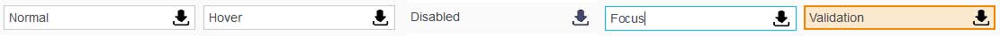

Abbildung: Upload-Felder

*Zustände*

a.  Normal
+
Hover
+
Deaktiviert / Disabled
+
Focus
+
Validierung

*Ist dies das korrekte Bedienelement?*

____________________________________________________________________________________________________________________________________________________________________________________
Upload-Felder werden für das Hochladen von Dateien genutzt.

Wenn der zu verwendende Medientyp darstellbar ist, sollte die Datei über ein entsprechendes Darstellungselement visualisiert werden.
____________________________________________________________________________________________________________________________________________________________________________________

*Richtlinien zur Anwendung*

a.  Dateinamen sollten innerhalb eines Eingabefeldes linksbündig ausgerichtet werden.
+
Wenn das Upload-Feld keinen Inhalt hat, kann es einen Hinweistext dastellen (z.B. Wählen Sie eine Bild-Datei zum Hochladen aus.)
+
Das Upload-Feld und die zugehörige Visualisierung der Datei sollten erkennbar sein.

*Text Box*

Text Boxen sehen optisch aus wie Eingabefelder, es können jedoch mehrzeilige Daten eingegeben werden.

[[fig-62]]
.: Text Box

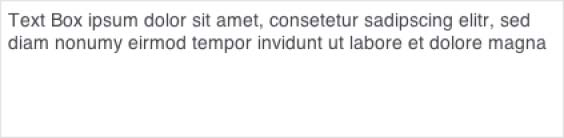

*Zustände*

_________________________________________________________________
Siehe Eingabefeld
_________________________________________________________________

*Ist dies das korrekte Bedienelement?*

a.  Text Boxen werden für die Eingabe von mehrzeiligem Freitext genutzt.
+
Für einzeilige Texte sollte ein Eingabefeld benutzt werden.
+
Falls die einzugebenden Daten Teil einer vordefinierten Menge sind, sollte die Verwendung eines Dropdown Menüs oder einer Wertehilfe in Erwägung gezogen werden.

*Richtlinien zur Anwendung*

a.  Für die Verwendung von Text Boxen gelten die gleichen Richtlinien wie für Eingabefelder.
+
In manchen Fällen kann die Größe der Text Box nicht der Größe des möglichen Inhaltes entsprechen.
Ist die Größe der Text Box kleiner als deren Inhalt, so muss der Benutzer innerhalb der Text Box scrollen können.
Vertikales Scrollen ist horizontalem Scrollen vorzuziehen.

*Hinweise zur Implementierung*

Eine Textbox kann über das HTML <textarea> mit Bootstrap Klasse form-control eingebunden werden.

(Seit 3.1.x) Für Formulare kann das Tag <isy:formTextarea> verwendet werden.
Folgende Parameter sind zulässig:

_____________________________________________________________________________________________________________________________________
reference: Die Referenz des Objekts für die Validierung

value: Der Wert für das Databinding im Eingabefeld

required: Ob die Eingabe ein Pflichteingabe ist.
Standard: false

disabled: Ob die Komponente aktiviert ist oder nicht.
Standard: false

readonly: Ob nur lesend auf das Feld zugegriffen werden kann.
Standard: false

label: Der Text für das Label.

labelStyleClass: Die CSS-Klasse für das Label.
Standard: col-lg-6

inputStyleClass: Die CSS-Klasse für den Eingabebereich.
Standard: col-lg-6

textareaStyleClass: Die CSS-Klasse für die Textarea.

tooltip: Der anzuzeigende Tooltip

rows: Die Anzahl an Zeilen.

cols: Die Anzahl an Spalten.

maxlength: Die maximal Anzahl von Zeichen

showPrintview: Ein spezifisches Flag zur Erkennung der Druckansicht, falls notwendig.

validationModel: Ein spezifisches Validation-Model, falls benötigt

globalConfig: Eine spezifische globale Konfiguration, falls benötigt
_____________________________________________________________________________________________________________________________________

*Dropdown Menü*

Mit einem Dropdown Menü kann der Benutzer per Mausklick oder Tastatur-Bedienung genau einen Wert aus einer Liste von Optionen auswählen.

[[fig-63]]
.: Dropdown Menü

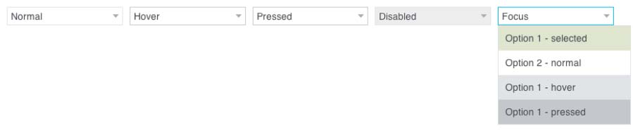

*Zustände*

Button (selektierte Option)

a.  ______
Normal
______
+
_____
Hover
_____
+
_______
Pressed
_______
+
___________
Deaktiviert
___________
+
_____
Focus
_____
+
Menü (Auswahl Menü)
+
______
Normal
______
+
_____
Hover
_____
+
_______
Pressed
_______
+
__________
Selektiert
__________

*Ist dies das korrekte Bedienelement?*

a.  Ein Dropdown Menü wird eingesetzt, wenn der Benutzer genau eine Option aus einer Menge sich gegenseitig ausschließender Optionen wählen kann.
+
Handelt es sich nur um eine sehr kleine Menge (typischerweise weniger als fünf) an Auswahl-Optionen, muss geprüft werden, ob die Verwendung einer Gruppe von Radiobuttons besser geeignet ist, da die möglichen Optionen eines Dropdown Menü erst nach dem Öffnen der Liste ersichtlich werden.
Ist im Layout nicht ausreichend Platz vorhanden kann ein Dropdown Menü auch für kleinere Mengen genutzt werden.
+
Das Dropdown Menü eignet sich aufgrund seiner kompakten Größe dazu, die Betonung auf andere, wichtigere Aspekte eines User-Interface zu lenken.
Sollte die Auswahl des entsprechenden Wertes jedoch explizit hervorgehoben werden, so wird statt eines Dropdown Menüs z.B. eine Gruppe von _Radiobuttons_ verwendet.
+
Kann der Benutzer mehr als eine Option wählen? Falls ja, dann wird statt eines Dropdown Menüs eine Gruppe von _Checkboxen_ verwend et.
+
Wird durch die Auswahl einer Option eine Funktion direkt ausgelöst, so ist ein _Menü Button_ dem Dropdown Menü vorzuziehen.

*Richtlinien zur Anwendung*

a.  Die Liste der Werte sollte nicht zu groß sein (maximal 10-12 Einträge), da der Benutzer sonst innerhalb des Auswahl-Menüs scrollen muss und es zu Usability-Problemen kommen kann.
+
Die Auswahl-Elemente sollten in einer logischen Reihenfolge angezeigt werden, z.B. sortiert nach der Wahrscheinlichkeit des Auftretens oder in zusammengehörigen Gruppen.
Falls keine übergeordnete Logik angewendet wird, sollten die Elemente aufsteigend alphabetisch sortiert werden.
+
Falls es sich bei dem Dropdown Menü nicht um eine Pflichtangabe handelt, sollte eine Meta-Option wie „Keine Auswahl" angezeigt werden, statt das Dropdown Menü im geschlossen Zustand leer anzuzeigen.

_________________________________________________________________________________________________________________________________________
Meta-Optionen wie „Keine Auswahl" oder „Alle" sollten am Anfang der Liste platziert sein.
_________________________________________________________________________________________________________________________________________

a.  Werden mehrere Dropdown Menüs übereinander platziert oder in Kombination mit anderen Bedienelementen wie Eingabefeldern genutzt, so sollten die Breiten der Bedienelemente angeglichen werden.
+
Bei sehr langen Werten sollte eine Maximalbreite definiert werden.
+
Die Werte in einem Dropdown Menü können mit Tastatur gewählt werden, so dass der Benutzer nicht zwischen Maus und Tastatur wechseln muss.
+
Ein Dropdown Menü kann je nach Einsatzkontext unterschiedliche Funktionalitäten aufweisen.
a.  _________________________________________________________________________________________________________________________________________________
Es gibt Dropdown Menüs, bei denen bei der Auswahl eines Wertes aktiv keine anderen Elemente auf dem Screen beeinflusst werden z.B. in Formularen.
_________________________________________________________________________________________________________________________________________________
+
______________________________________________________________________________________________________________________________________________________________________________________________________________________________________________________________________________________
Das Dropdown Menü kann aber auch alleinstehend verwendet werden z.B. zur lokalen Umschaltung einer Ansicht oder beispielhaft bei der Verwendung von vordefinierten Suchprofilen.
Hier ändert sich die Ansicht direkt nachdem der Benutzer eine Auswahl im Dropdown Menü getroffen hat.
______________________________________________________________________________________________________________________________________________________________________________________________________________________________________________________________________________________

*Kein JavaScript*

Da durch das Dropdown Menü keine Funktionen unmittelbar ausgelöst werden, bleibt die Funktionalität auch ohne JavaScript vorhanden.
Es kann allerdings zu optischen Abweichungen kommen.
Da sich das Dropdown Menü ohne JavaScript nicht stylen lässt, entspricht die Darstellung der des Browsers.

*Hinweise zur Implementierung*

Ein Dropdown Menü wird über das Tag <isy:selectOneDropdown> eingebunden.
Für Formulareingaben existiert das Tag <isy:formSelec tOneDropdown>.

Folgende Parameter sind zulässig:

______________________________________________________________________________________________________________________
reference: Die Referenz des Objekts

referenceId: Der Wert der id

value: Der Wert der Auswahl für das Databinding

invalid: Ob die Auswahl invalide ist oder nicht 

disabled: Ob die Auswahl deaktiviert ist oder nicht

title: Das Tooltip über dem SelectOneDropdown

globalConfig: Eine spezifische globale Konfiguration, falls notwendig.

dropdownStyleClass: Die CSS-Klasse für das Dropdownmenü

readonly: Ob die Darstellung nur lesend erfolgen soll

disabled: Ob die Auswahl deaktiviert ist oder nicht

fourEyesMode: 4 Augen Prinzip Mode (locked, unlock)

fourEyesLastValue: 4 Augen Prinzip Mode (locked, unlock)

valueChangeListener: Die Methode, die bei einem ValueChange aufgerufen

converter: Konverter-Bean für die angezeigten Elemente

converterAttribute: Parameter für den Konverter
______________________________________________________________________________________________________________________

Für die Komponente formSelectOneDropdown gibt es zusätzlich die folgenden Paramter:

____________________________________________________________________________________________________________________
label: Der Text für das Label

labelStyleClass: Die CSS-Klasse für das Label

inputStyleClass: Die CSS-Klasse für den Eingabebereich.

validationModel: Ein spezifisches Validation-Model, falls benötigt.

globalConfig: Eine spezifsche globale Konfiguration, falls benötigt.
____________________________________________________________________________________________________________________

Je nach JavaScript Aktivierung wird das Dropdown Menü über ein Bootstrap-Plugin (JavaScript aktiviert) oder als natives Element (JavaScript deaktiviert) dargestellt.

*Tabs*

Tabs dienen der Informationsstrukturierung und Reduktion der Anzahl gleichzeitig sichtbarer Inhaltsbereiche, wenn die Informationen schnell innerhalb des gleichen Fensters zugreifbar sein müssen.
Tabreiter verhalten sich entsprechend dem analogen Vorbild eines Karteireiters, der dazu dient, verschiedene Karteikarten voneinander zu trennen.
Tabs werden häufig dazu verwendet, um Eigenschaften eines Objekts in inhaltliche sinnvolle Gruppen aufzuteilen.

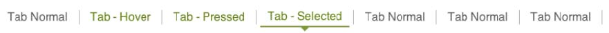

[[fig-64]]
.: Tabs

*Zustände*

a.  Normal
+
Hover
+
Pressed
+
Selektiert

*Ist dies das korrekte Bedienelement?*

________________________________________________________________________________________________________________________________________________________________________________________
Tabs können eingesetzt werden, wenn der zu präsentierende Inhalt nicht ohne massives Scrolling innerhalb eines Screens dargestellt

werden kann.

Wenn die Komplexität des User Interface reduziert werden soll und eine sinnvolle Gruppierung einzelner Bereiche vorgenommen werden kann.
________________________________________________________________________________________________________________________________________________________________________________________

a.  Werden weniger als drei Tabreiter angezeigt, sollte stattdessen die Verwendung von Gruppierungs-Elementen in Betracht gezogen werden.
+
Würden die Tabreiter lediglich verschiedene Sichten auf die gleichen Daten darstellen, sollte stattdessen z. B. ein Dropdown Menü verw endet werden.
+
Falls die Tabreiter einzelne Schritte eines Prozesses abbilden, so sollte die Verwendung eines Wizards in Betracht gezogen werden.
+
Soll der Inhalt mehrerer Tabreiter gleichzeitig einsehbar sein – z. B. für Vergleichszwecke –sollten stattdessen Expander (Progressive Disclosure) Elemente verwendet werden.

*Richtlinien zur Anwendung*

a.  Es sollte niemals ein Tabreiter-Element mit nur einem Tabreiter verwendet werden.
+
Es sollten niemals mehrere Reihen von Tabreitern übereinander angezeigt werden.
Stattdessen sollte ein dediziertes Überlauf-Bedienelement (z.B. Taboverflow Menü) angeboten werden.
+
Abhängigkeiten zwischen verschiedenen Tabreitern sollten möglichst vermieden werden.
+
Eventuelle Pflicht-Eingabefelder werden wenn möglich auf dem ersten Tabreiter angezeigt.

__________________________________________________________________________________________________________________________________________________________________________________________________________________
Buttons, die globale Aktionen für das komplette Tabreiter-Element mit allen einzelnen Reitern anstoßen, müssen außerhalb des Tabreiter-Elements angebracht werden.
__________________________________________________________________________________________________________________________________________________________________________________________________________________

*Hinweise zur Implementierung*

Tabs werden über die Tags <isy:tabGroup>, <isy:tabHeader> und <isy:tabContent> eingebunden.
Im Folgenden ein Beispiel:

<isy:tabGroup tabGroupId="testTab" globalTabContentRefs="A P S" globalTab="A" defaultTab="A" tabGroupModel="#\{jsfSteuerelementeModel.tabGroupModel}">

_____________________________________________________________________________________________________________________________________________________________________
<f:facet name="tabHeader"> <isy:tabHeader value="Auskunft" name="A" /> <isy:tabHeader value="Personalien" name="P" /> <isy:tabHeader value="Sachverhalte" name="S" />

</f:facet> <isy:tabContent name="A">

Dies ist die Auskunft </isy:tabContent> <isy:tabContent name="P">

Dies sind Personalien </isy:tabContent> <isy:tabContent name="S">
_____________________________________________________________________________________________________________________________________________________________________

Dies sind die Sachverhalte </isy:tabContent> </isy:tabGroup>

Zunächst wird die Tabgruppe mit dem Tag <isy:tabGroup> allgemein definiert. Folgende Parameter sind zulässig:

______________________________________________________________________________________________________________________________________________________________________
image:images/image175.jpeg[image]tabGroupModel: Das Model für die Tabgruppe.
Sollte im Maskenmodel liegen.

defaultTab: Der Name des Default-Tabs.
Der Default-Tab ist beim initialen Öffnen aktiv.

globalTab: Der Name des globalen Tabs.

image:images/image67.jpeg[image]globalTabContentRefs: Die Liste an Namen der Tabs, welche beim Anzeigen des globalen Tabs auch angezeigt werden sollen.

execute: AJAX: Welches Form ausgeführt werden soll.
Standard: @form.

image:images/image175.jpeg[image]render: AJAX: Welche Elemente gerendert werden sollen.
Standard: @form.

globalConfig: Eine spezifische globale Konfiguration, falls notwendig.
______________________________________________________________________________________________________________________________________________________________________

Wenn JavaScript aktiviert ist, dann wird die AJAX-Action durchgeführt.
Andernfalls wird beim Wechsel der Tabs ein Full-Page-Reload durchgeführt.

Einzelne Tabheader werden mit dem Tag <isy:tabHeader> definiert. Folgende Parameter sind zulässig:

___________________________________________________________________________________________________________________________________________________________________________________________
name: Der Name des Tabs, für welchen dieser Header definiert ist.

value: Der Titel des Tabs zur Anzeige.

globalConfig: Eine spezifische globale Konfiguration, falls notwendig.

skipAction: Ob die übergebene action ausgelassen werden soll.
Default ist false, die action wird standardmäßig also ausgeführt. (seit 4.0.x)

action: Die action kann überschrieben werden, um z.B. den aktuellen Reiter validieren zu können. (seit 4.0.x)
___________________________________________________________________________________________________________________________________________________________________________________________

Inhalte von Tabs werden mit dem Tag <isy:tabContent> definiert. Folgende Parameter sind zulässig:

_______________________________________________________________________________________________________________________________________________________
image:images/image175.jpeg[image]name: Der Name des Tabs, zu welchem dieser Inhalt gehört.

globalConfig: Eine spezifische globale Konfiguration, falls notwendig.

preload: Ob das Tab im JS-Fall vorgeladen werden soll.
Default ist false, so dass nicht vorgeladen wird.
_______________________________________________________________________________________________________________________________________________________

Erläuterung zu den Attributen preload und skipAction:

a.  Zwischen den beiden Attributen besteht eine Abhängigkeit.
Sie müssen immer den gleichen Wert aufweisen, ansonsten funktioniert der Tab nicht korrekt.
+
Das Attribut preload legt fest, ob der Inhalt des Tabs beim Laden der gesamten Seite vorgeladen werden soll.
Bei einem Wechsel zwischen vorgeladenen Tabs muss dann entsprechend kein Server-Aufruf stattfinden.
In diesem Fall darf aber die action des tabHeader nicht ausgeführt werden, weil sonst doch ein Server-Aufruff stattfinden würde.
Dies würde sowohl unnötigen Netzwerkverkehr -, als auch unerwünschtes Verhalten bei der Tab-Auswahl hervorrufen.
+
Standardmäßig stehen beide Werte auf false.
Wenn das Vorladen gewünscht ist, müssen beide Werte explizit auf true gesetzt werden.

*Taboverflow Menü*

Das Taboverflow Menü dient zur Vermeidung mehrzeiliger Tabreiter-Elemente.
Das Menü enthält alle Tabs, die nicht direkt auf dem Screen angezeigt werden können.

[[fig-65]]
.: Tabs mit Overflow-Menü

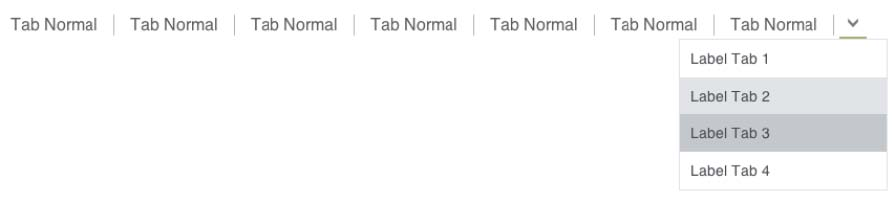

*Zustände* (Auswahl-Menü)

a.  Normal
+
Hover
+
Pressed

*Ist dies das korrekte Bedienelement?*

___________________________________________________________________________________________________________________________________________________________________
Das Taboverflow Menü wird eingesetzt, wenn nicht alle Tabs auf dem Screen in einer Zeile dargestellt werden können.
___________________________________________________________________________________________________________________________________________________________________

*Richtlinien zur Anwendung*

Generell sollte Taboverflow vermieden werden.

a.  ________________________________________________________________________________________________________________________________________________
Die Labels für die Tabreiter sollten kurz und aussagekräftig sein.
Es kann auch mit sinnvollen und verständlichen Abkürzungen gearbeitet werden.
________________________________________________________________________________________________________________________________________________
+
_______________________________________________________________________________________________________
Die darzustellenden Inhalte sollten so gestaltet sein, dass das Taboverflow Menü nicht benötigt warden.
_______________________________________________________________________________________________________

a.  Das Taboverflow Menü wird über einen Button rechts neben der Tabbar aufgerufen.
+
Wählt der Benutzer einen Tab aus dem Taboverflow Menü, so wird der Inhalt dieses Tabs angezeigt.
Und der Tab wird rechts neben dem letzten Tab in der Tabbar dargestellt.
+
Tabs aus dem Taboverflow Menü werden immer ganz rechts in der Tabbar angezeigt.
+
Die Reihenfolge der anderen Tabs wird nicht beeinflusst.
+
Wird das Browserfenster vergrößert, so dass alle Tabs aus dem Overflow-Menü Platz finden, werden die Tabs in das Tab-Menü integriert und das Overflow-Menü wird nicht mehr benötigt.

*Kein JavaScript*

Ohne JavaScript gibt es kein Taboverflow Menü. Die Tabs werden hintereinander dargestellt, notfalls in zwei Zeilen.
Da die Darstellung von Tabs in mehreren Zeilen möglichst zu vermeiden ist, sollte eine Umstrukturierung der Inhalte geprüft werden.

*Hinweise zur Implementierung*

Diese Konzept wurde noch nicht realisiert.

*Liste*

Listen werden benutzt, um eine überschaubare Anzahl an Daten oder Objekten eines Typus übersichtlich und vergleichbar darzustellen.

[[fig-66]]
.: Liste mit Listenkopf

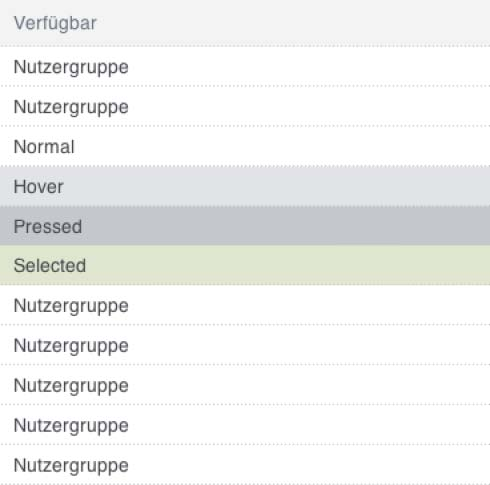

*Zustände*

a.  Normal
+
Hover
+
Pressed
+
Selected

*Ist dies das korrekte Bedienelement?*

a.  Eine Liste wird benutzt, um mehrere Objektdaten von einem Typ anzuzeigen.
+
Eine Liste sollte nicht verwendet werden, wenn sehr viele Objekte dargestellt werden müssen, da es keine Möglichkeit zur Sortierung bietet.
In diesem Fall eignet sich eine Tabelle besser.

*Richtlinien zur Anwendung*

a.  Listen bestehen aus einer Spalte und mehreren Zeilen.
+
Werden mehrere Listen neben- oder untereinander dargestellt, ist auf eine einheitliche Breite zu achten.
+
Listen können scrollbar sein.
+
Listen werden z.B. für das Pattern Browse & Collect genutzt.
+
Eine Liste kann optional einen Kopfbereich haben.
Dieser zeigt ein gemeinsames Label für die aufgelisteten Objekte.
+
Die Breite der Liste orientiert sich an der Länge des längsten Labels.
Sollte dies eine sinnvolle Länge / Breite übersteigen, so kann das Label mit Auslassungszeichen abgekürzt werden.

*Hinweise zur Implementierung*

(seit 4.0.x) Eine Liste mit Einfachauswahl wird mit dem Tag <isy:formSelectOneList> eingebunden.

Folgende Parameter sind zulässig:

______________________________________________________________________________________________________________________________________________________________________________________
reference: Die Referenz des Objekts.

value: Der Wert der Auswahl für das Databinding.

disabled: Ob die Liste deaktiviert ist.

size: Dieses Attribut wird im Sinne von bootstrap-selectlist.js interpretiert, d.h. es gibt die Anzahl der Zeilen die sichtbar sind an.

checkboxed: Falls true werden zusätzlich zum highlighting, auch checkboxes angezeigt.

required: Ob die Eingabe ein Pflichteingabe ist.

label: Der Text für das Label.

labelStyleClass: Die CSS-Klasse für das Label.

inputStyleClass: Die CSS-Klasse für den Eingabebereich.

validationModel: Ein spezifisches Validation-Model, falls benötigt.

globalConfig: Eine spezifsche globale Konfiguration, falls benötigt.
______________________________________________________________________________________________________________________________________________________________________________________

(seit 4.0.x) Eine Liste mit Mehrfachauswahl wird mit dem Tag <isy:formSelectManyList> eingebunden.

Folgende Parameter sind zulässig:

______________________________________________________________________________________________________________________________________________________________________________________
reference: Die Referenz des Objekts.

value: Der Wert der Auswahl für das Databinding.

disabled: Ob die Liste deaktiviert ist.

size: Dieses Attribut wird im Sinne von bootstrap-selectlist.js interpretiert, d.h. es gibt die Anzahl der Zeilen die sichtbar sind an.

checkboxed: Falls true werden zusätzlich zum highlighting, auch checkboxes angezeigt.

required: Ob die Eingabe ein Pflichteingabe ist.

label: Der Text für das Label.

labelStyleClass: Die CSS-Klasse für das Label.

inputStyleClass: Die CSS-Klasse für den Eingabebereich.

validationModel: Ein spezifisches Validation-Model, falls benötigt.

globalConfig: Eine spezifsche globale Konfiguration, falls benötigt.
______________________________________________________________________________________________________________________________________________________________________________________

*Tabelle*

Eine Tabelle dient der übersichtlichen Anzeige von größeren Datenmengen.
Die Tabelle besteht aus mehreren Informationsspalten, die zur Sortie rung verwendet werden können.

[[fig-67]]
.: Tabelle

image:images/image180.jpeg[image,width=687,height=243]

[[fig-68]]
.: Tabelle – Zustände interaktiver Zeilen

image:images/image181.jpeg[image,width=687,height=93]

*Zustände* (nur für interaktive Tabellenzeilen)

a.  Normal
+
Hover
+
Pressed
+
Selektiert

*Ist dies das korrekte Bedienelement?*

a.  Tabellen werden genutzt, um große Mengen von Daten oder Objekten anzuzeigen.
+
Tabellen werden genutzt, um das Vergleichen von Daten zu ermöglichen.
+
Die Tabelle sollte nicht verwendet werden, wenn Objekte nur ein Attribut haben.
In diesem Fall sollte auf eine Liste zurückgegriffen werden.

*Richtlinien zur Anwendung*

a.  Numerische Werte werden rechts ausgerichtet, wenn die Anzahl der Nachkommastellen in allen Zeilen identisch ist.
+
Überlaufende Textlabels sollten mit "…" abgetrennt und mit einem Tooltip ergänzt werden.
+
Die initale oder fixe Breite von Spalten muss sich an der zu erwartenden Maximalwortlänge orientieren.

____________________________________________________________________________________________________________________________________________________________________________________________
In-Place Funktionen (Aktionen) sollten immer in der rechten äußeren Spalte platziert werden (z.B. „Preview Button" zur Vorschau von Details).
____________________________________________________________________________________________________________________________________________________________________________________________

a.  Die Spalten mit den größten Wortlängen sollten den maximal verfügbaren Platz einnehmen (Stretching).
+
Werteinheiten sollten im Spalten-Header angezeigt werden, wenn sie für alle Zeilen der Tabelle identisch sind.
+
Wird für die Zeilen ein Status in Form eines Icons angezeigt, so sollte das entsprechende Icon in der ersten Spalte ganz links dargestellt werden.
So ist sichergestellt, dass der Benutzer schnell erkennt welchen Status ein Objekt hat.
Checkboxen bilden hier eine Ausnahme.
Hat eine Zeile eine Checkbox und ein Statusicon so wird die Checkbox ganz links und das Statusicon in der darauffolgenden Spalte dargestellt.
+
Werden in einer Tabelle eine Vielzahl von Einträgen dargestellt, so kann es sinnvoll sein, dem Benutzer eine Filter-Zeile zur weiteren Einschränkung zur Verfügung zu stellen.
+
Resizing von Tabellen
a.  ____________________________________________________________
Tabellen passen ihre Größe entsprechend der Fenstergröße an.
____________________________________________________________
+
__________________________________________________________________
Die Tabelle nimmt immer die ihr zur Verfügung stehende Breite ein.
__________________________________________________________________
+
_________________________________________________________________________________________________________________________________
Hierbei ist auf ein sinnvolles Resizingverhalten der einzelnen Spalten zu achten.
Dies ist stark vom Inhalt der Tabelle abhängig.
_________________________________________________________________________________________________________________________________
+
__________________________________________________________________________
Die Spalten einer Tabelle können eine feste oder variable Breite besitzen.
__________________________________________________________________________
+
____________________________________________________________________________________________________________________________________________________
Für Spalten deren Inhalte eine abschätzbare Länge haben wie z.B. Datum oder Geschlecht, sollte in der Regel eine feste Spaltenbreite gewählt werden.
____________________________________________________________________________________________________________________________________________________
+
_____________________________________________________________________________________________________________________
Für Inhalte, deren Länge flexibel oder unbestimmt ist wie z.B. Nachnamen, sollte eine flexible Breite gewählt werden.
_____________________________________________________________________________________________________________________

*Hinweise zur Implementierung*

Die Umsetzung der Tabelle unterscheidet sich grundsätzlich zur Widgets wie der von JSF bereitgestellten <h:dataTable>. Die <isy:dataTab le> ist näher am Layout einer eigentlichen Tabelle aufgebaut und dadurch flexibler nutzbar (z.B. dynamische Anzahl an Spalten). Dafür jedoch auch eine größere Konfiguration möglich.

Es existieren folgende Tags zur Konfiguration der <isy:dataTable>:

_____________________________________________________________________________
<isy:dataTable>

<isy:dataTableHeader>

<isy:dataTableRowAllSelection>

<isy:dataTableRows>

<isy:dataTableCell>

<isy:dataTableDetailButton>

<isy:dataTableRowSelection>
_____________________________________________________________________________

Beispiel für die Definition einer <isy:dataTable>:

<isy:dataTable dataTableModel="#\{...}" dataTableController="#\{...}" action="trefferlisteDoppelklick"> <f:facet name="tableToolbar">

<isy:buttonGroup> <isy:buttonToolbar .../> </isy:buttonGroup> </f:facet>

<f:facet name="tableHeader"> <isy:dataTableHeader name="Vorname" /> <isy:dataTableHeader name="Nachname" /> <isy:dataTableHeader name="Aktionen" /> </f:facet> <isy:dataTableRows rowDefinition="/WEB-INF/gui/.../rowDefinition.xhtml" detailDefinition="/WEB-INF/gui/.../detailDefinition.xhtml" />

</isy:dataTable>

Die grundlegende Basis bildet das <isy:dataTable> Tag.
Folgende Parameter sind zulässig:

________________________________________________________________________________________________________________________________________________________________________________________________________________________________
dataTableModel: Das zugehörige, spezifische DataTableModel.
Das Model muss Teil des Maskenmodels sein.
Das Model enthält eine Liste an DataTableItems (die konkreten Datensätze).

dataTableController: Der zugehörige, spezifische DataTableController.
Der Controller stellt z,B. Suchfunktionalität bereit.

image:images/image67.jpeg[image]selectable: Ob die Datatable selektierbar ist oder nicht.
Standard: false.

selectionMode: Der Selektionsmodus der Zeilen (single/multiple). Standard: multiple.

action: Die Aktion, welche beim Doppelklick auf eine Zeile ausgeführt wird.

execute: AJAX: Das Form, welches beim Doppelklick ausgeführt werden soll.
Standard: @form.

render: AJAX: Das Form, welches beim Doppelklick gerendert werden soll.
Standard: @form.

image:images/image67.jpeg[image]globalConfig: Die spezifische globale Konfiguration, falls notwendig.
________________________________________________________________________________________________________________________________________________________________________________________________________________________________

In der JSF-Facet tableToolbar werden Listen von <isy:buttonGroup> Tags erwartet.
Die Listen können jeweils Elemente der Typen <isy:buttonToolbar> (Button in der Toolbar, siehe Toolbar Button) und <isy:buttonToggle> (Toggle-Button in der Toolbar der Tabelle) enthalten. Folgende Parameter sind für das Tag <isy:buttonToggle> zulässig:

__________________________________________________________________________________________________________________________________
action: Die auszuführende Aktion.

value: Das Label des Buttons.
Standard: leer

icon: Das Icon aus der Icon-Bibliothek (ohne Präfix 'icon-'). Standard: placeholder

showIcon: Ob ein Icon angezeigt werden soll oder nicht.
Standard: true

reverseIconPosition: Ob das Icon rechts angezeigt werden soll.
Standard: false.

disabled: Ob der Button deaktiviert sein soll oder nicht.
Standard: false

execute: AJAX: Welches Felder ausgewertet werden sollen.
Standard: @form

render: AJAX: Welcher Teilbereich aktualisiert werden soll.
Standard: @form

globalConfig: Eine spezifische globale Konfiguration, falls nötig
__________________________________________________________________________________________________________________________________

In der JSF-Facet tableHeader wird eine Liste von <isy:dataTableHeader> Tags erwartet.
Ein Tag entspricht dabei einem Titel einer Spalte.
F olgende Parameter sind zulässig:

___________________________________________________________________________________________________________________________________________________________________________
name: Der Header-Name / Spaltenüberschrift.

sortable: Ob der Header sortierbar ist oder nicht.
Standard: false.

sortAttribute: Das zugehörige Sortierattribut, falls der Header sortierbar ist.
_*(Für plis-web Versionen kleiner als 4.0)*_

sortProperty: Das zugehörige Sortierattribut, falls der Header sortierbar ist.
_*(Ab plis-web 4.0)*_

width: Die Breite der Spalte.
___________________________________________________________________________________________________________________________________________________________________________

Die Zeilen der Datentabelle werden mit dem Tag <isy:dataTableRows> definiert. Folgende Parameter sind zulässig:

___________________________________________________________________________________________________________
rowDefinition: Pfad zur XHTML-Seite für Zeilen

detailDefinition: Pfad zur XHTML-Seite für die Detailansicht
___________________________________________________________________________________________________________

Beispiel einer Row-Definition:

<ui:composition ... <isy:dataTableCell> #\{dataTableItem.vorname} </isy:dataTableCell> <isy:dataTableCell> #\{dataTableItem.nachname} </isy:dataTableCell> <isy:dataTableCell> <isy:dataTableDetailButton dataTableModel="#\{...}" dataTableController="#\{...}" /> _*(Für plis-web Versionen kleiner als 4.0)*_ <isy:dataTableDetailButton/> _*(Ab plis-web 4.0)*_ </isy:dataTableCell>

</ui:composition>

Die Row-Definition wird für jeden Datensatz in der Tabelle eingebunden.
Der UI-Parameter dataTableItem weist immer auf den aktuellen Treffer (also eine Objekt mit der Schnittstel DataTableItem). Mit diesem Parameter können dann für jede Spalte die <isy:dataTableCell> Tags eingebunden werden.
Die Inhalte dieser Tags repräsentieren den Inhalt der Tabellenzelle für diese Treffer.
Die Reihenfolge der Spalten werden durch die Headerdefinition festgelegt.
Das Tag <isy:dataTableCell> hat derzeit folgende Parameter:

_______________________________________________________________________________________________________________________
hidden: Ob die Spalte angezeigt werden soll oder nicht.
Standard: true.
_______________________________________________________________________________________________________________________

Die Einbindung der Row-Definition erfolgt mittels dem JSF Tag <ui:repeat>. Als Statusvariable wird dataTableItemRepeatStatus verwendet.
Auch auf diese Variable kann innerhalb der Row-Definition zugegriffen werden.

Zur Vereinfachung des Aufrufs der Detailansicht, wird das Tag <isy:dataTableDetailButton> angeboten.
Dieses Tag rendert einen Button und öffnet die Detailansicht eines Treffers.
Die Detailansicht eines Treffers befindet sich an der im Tag <isy:dataTableRows> angegebenen Stelle.

Beispiel einer Detail-Definition:

<ui:composition ... <td colspan="2"> 
 

 
 <isy:formLabel reference="aktenzeichen" value="#\{dataTableItem.aktenzeichen}" label="#\{msg_currentflow.MEL_Trefferliste_Aktenzeichen}"/> <isy:formLabel reference="ordnungsnummer" value="#\{dataTableItem.ordnungsnummer}" label="#\{msg_currentflow.MEL_Trefferliste_Ordnungsnummer}"/> <isy:formLabel reference="speicherungsdatum" value="#\{dataTableItem.speicherungsdatum}" label="#\{msg_currentflow.MEL_Trefferliste_Speicherungsdatum}"/> 
 
 
 </td> </ui:composition>

Die Detail-Definition enthält beliebigen Inhalt.
Im Beispiel ist dies ein Formular mit der Ausgabe von drei Labeln in der linken Hälfte der Tabelle.
Analog zur Row-Definition kann auf den aktuellen Treffer über die UI-Parameter dataTableItem udn dataTableItemRepeatStatus zugegriffen werden.

Details beispielsweise zur Sortierung oder des Selektionsverhaltens finden sich in den Unterkapiteln dieses Abschnitts.

*Migration von auf plis-web 4.0*

Mit plis-web Version wurde die Tabellenkomponente mit den Funktionen Paginierung, Filterung und Sortierung erweitert.
Die neue Implementierung ist nur bedingt kompatibel.
Folgende Schritte sind für die Migration notwendig.

*In der View:*

DataTable

___________________________________________________________________________________
jsSortFunction: _entfällt._

sortAttributeConverterId.
_entfällt_
___________________________________________________________________________________

DataTableDetailButton

_______________________________________________________________________________________________________________
dataTableModel: _entfällt, wird nun automatisch ermittelt._

dataTableController: _entfällt, wird nun automatisch ermittelt._
_______________________________________________________________________________________________________________

DataTableHeader

_____________________________________________________________________________________________________________________________________
sortAttribute: _entfällt, da nun sortProperty verwendet wird._

sortProperty: __neu__, ersetzt das Attribut sortAttribute und ist nun ein String-Wert
_____________________________________________________________________________________________________________________________________

DataTableRowAllSelection

______________________________________________________________________________________________________
globalConfig: _entällt, wird nun automatisch ermittel._
______________________________________________________________________________________________________

**In der Java Implementierung**:

DataTableModel

_____________________________________________________________________________________________________________________________________________________________________
model.setSortDirection(sortDirection) : _entfällt, wurde in die Klasse SortModel verschoben._

model.getSortModel().setDirection(direction): _neu, ersetzt_ setSortDirection

model.setSortAttribute(sortAttribute): _entfällt, wird in der Klasse SortModel durch die Methode setProperty ersetzt._

model.getSortModel().setProperty(property) : _neu, ersetzt setSortAttribute._
_____________________________________________________________________________________________________________________________________________________________________

DataTableController

_______________________________________________________________________________________________________________________________________________________________________
readItems: _muss überschrieben werden._

getItemById: _muss überschrieben werden_

updateDisplayItems: _muss überschrieben werden.
Aus Kompatibilitätsgründen wird hier search und sortInvoked aufgerufen._

sortInvoked: _entfällt / deprecated, aus Kompatibitätsgründen noch vorhanden._

search: _entfällt / deprecated, aus Kompatibitätsgründen noch vorhanden._

DataTableItem Typ muss als Parameter angegeben werden.
_______________________________________________________________________________________________________________________________________________________________________

*Sortierung in einer Tabelle*

[[fig-69]]
.: Tabelle – Sortierungs-Indikator in Tabellenkopf

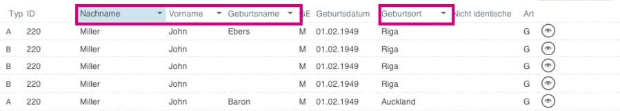

*Richtlinien zur Anwendung*

a.  Der erste Klick in einen Spaltenheader sortiert die Tabelle aufsteigend, der zweite Klick absteigend.
+
Ein Sortierungs-Indikator (Dreieck) neben dem Label zeigt die aktuell eingestellte Sortierung an.
a.  __________________________________________
Dreieck nach unten: Absteigende Sortierung
__________________________________________
+
__________________________________________
Dreieck nach oben: Aufsteigende Sortierung
__________________________________________
+
Eine farbige Fläche im Tabellenkopf hebt die aktuell angewandte Sortierung hervor.

*Kein JavaScript*

Ohne JavaScript kann die Sortierung nur durch das Neu-Laden der Seite bewirkt werden.

*Hinweise zur Implementierung*

Die <isy:dataTable> bietet Möglichkeiten zur Sortierung an.
Dazu müssen die einzelnen Spalten-Header über das <isy:dataTableHeader > Tag entsprechend konfiguriert werden.

*plis-web kleiner als 4.0*

Beispiel:

<isy:dataTableHeader name="#\{msg_currentflow.MEL_Trefferliste_Vorname}" sortable="true" sortAttribute="#\{enumJsfConstants.NUMMERNSUCHE_SORTATTRIBUTE_VORNAME}" />

Durch Angabe von sortable=true werden automatisch Buttons und Symbole zur Sortierung hinzugefügt.
Bei Klick auf den Suchbutton wird im DataTableModel das SortAttribute festgehalten und im spezifischen Trefferlistencontroller die Methode sortInvoked(...) aufgerufen.
Je nach Anwendungsfall kann die Methode dann die Liste sortieren oder aber eine erneute Suche in der Datenquelle durchführen (z.B. bei paginierten Trefferlisten).

Auch die initiale Sortierung muss vom enstprechenden Trefferlistencontroller durchgeführt werden.

*Ab plis-web 4.0*

<isy:dataTableHeader name="#\{msg_currentflow.MEL_Trefferliste_Vorname}" sortable="true" sortProperty="vorname" />

Durch Angabe von sortable=true und der dem Attribut sortProperty werden automatisch Buttons und Symbole zur Sortierung hinzugefügt.
Bei m Initialisieren des Models muss der Operationsmodus (SERVER oder CLIENT) angegegben werden.

model.setMode(DatatableOperationMode.SERVER);

Im Modus CLIENT erfolgt die Sortierung per JavaScript automatisch.
Im SERVER Modus wird die Methode updateDisplayItems des DataTableControllers aufgerufen, die die Tabelleneinträge unter allen Bedingungen (wie z.B. filter, sort und pagination) anzeigt.

*Selektionsverhalten in einer Tabelle*

[[fig-70]]
.: Tabelle – Mehrfachselektion über STRG Taste & Maus

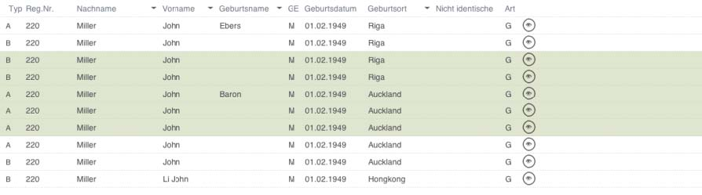

[[fig-71]]
.: Tabelle – Mehrfachselektion über Checkboxen

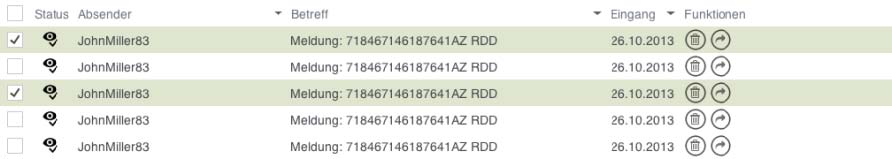

[[fig-72]]
.: Tabelle – Textlink z.B. Kennzeichnung eines Objektes

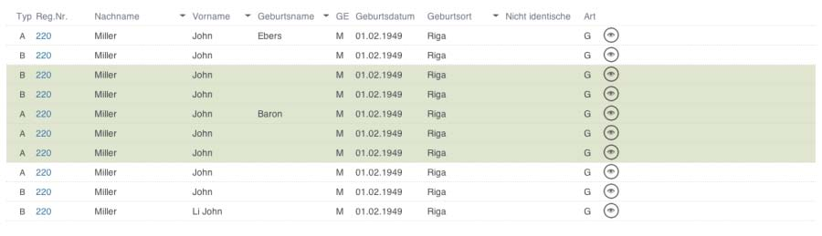

*Richtlinien zur Anwendung*

Selektion

a.  _________________________________________________________________________________________________________________________
Die Kennzeichnung eines Objektes (Name, Bezeichnung, ID) kann als Link zur Navigation zu weiteren Details genutzt werden.
_________________________________________________________________________________________________________________________
+
_____________________________________________________________________________________________
Der Doppelklick auf eine Zeile öffnet ebenfalls die Details eines Objektes, sofern vorhanden.
_____________________________________________________________________________________________
+
___________________________________________________________________________________________________________________________________________________________________________________________________
Durch einfachen Klick in eine Zeile kann diese selektiert werden.
Dies ist überall möglich, außer auf aktiven Bereichen wie z. B. Icons für Aktionen.
Die ausgewählte Zeile wird farbig hinterlegt.
___________________________________________________________________________________________________________________________________________________________________________________________________
+
Mehrfachselektion
+
__________________________________________________________________________________________________________________________________________________________________________________________________________________________________________
Eine Mehrfachselektion kann durch Halten der Taste STRG und das gleichzeitige Klicken auf einzelne Zeilen erfolgen.
Mittels der Umschalt-Taste und Klick auf das erste und letzte Element wird der dazwischen liegende Bereich selektiert.
__________________________________________________________________________________________________________________________________________________________________________________________________________________________________________
+
_____________________________________________________________________________________________________________________________________________________________________________________________________________________________________________________
Sofern der Hauptanwendungsfall in einer Tabelle die Auswahl von einem oder mehreren Objekten ist, sollte zusätzlich eine Check Box Spalte integriert werden. Über eine Checkbox im Header können alle Zeilen gleichzeitig aus- oder abgewählt werden.
_____________________________________________________________________________________________________________________________________________________________________________________________________________________________________________________

________________________________________________________________
Default-Selektion
________________________________________________________________

a.  Bei Tabellen auf deren Objekte (Zeilen) weitere Aktionen angewendet werden können, ist eine Default Selektion sinnvoll.
+
In der Regel wird die erste Zeile per Default selektiert.

*Kein JavaScript*

Ohne JavaScript ist die Selektion von Tabellenzeilen nur über Checkboxen möglich.

*Hinweise zur Implementierung*

Um die Selektion von Zeilen zu ermöglichen, müssen folgende Konfigurationen durchgeführt werden:

\1. In der Header-Definition muss ein <isy:dataTableHeader> Tag an erster Stelle mit folgender Definition aufgenommen werden:

________________________________________________________________________________________________________________________________________________________________________________________
<isy:dataTableHeader> <isy:dataTableRowAllSelection /> </isy:dataTableHeader>

\2. In der Row-Definition muss ein <isy:dataTableCell> Tag an erster Stelle mit folgender Definition aufgenommen werden:

<isy:dataTableCell> <isy:dataTableRowSelection /> </isy:dataTableCell>

\3. In der Table-Definition (<isy:dataTable>) muss das Attribut selectable="true" gesetzt sein.
Der Selektierungsmodus (einzeln,mehrere) wird über das Attribut selectionMode gesteuert.
________________________________________________________________________________________________________________________________________________________________________________________

*Aktionen in einer Tabelle*

[[fig-73]]
.: Tabelle – Aktionen

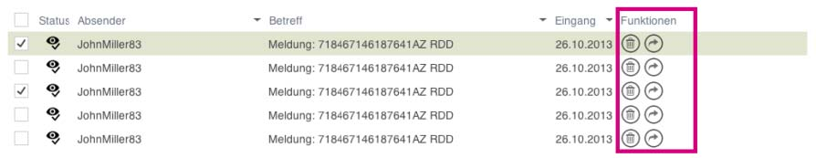

*Richtlinien zur Anwendung*

_________________________________________________________________________________________________________________________________________________________________________________________________________________________________________
Aktionen, die direkt ausführbar sind und sich auf Daten in einer Zeile beziehen, werden in der rechten Spalte einer Tabelle mittels Icon-Buttons angezeigt (z.B. Vorschau für ein Objekt).
_________________________________________________________________________________________________________________________________________________________________________________________________________________________________________

*Hinweise zur Implementierung*

Buttons für Aktionen können in der entsprechenden <isy:dataTableCell> angegeben werden.
Für die Detailansicht existiert auch das Tag < isy:dataTableDetailButton> welcher automatisch einen Button zum Auf- und Zuklappen der Detailansicht einfügt.

*Große Datenmengen in einer Tabelle*

Tabellen können sehr viele Daten enthalten und gegebenenfalls sehr lang werden.
Um dem Benutzer den Umgang mit solchen Tabellen zu vereinfachen, werden zunächst nicht alle Daten initial in der Tabelle angezeigt. Über einen _Mehr anzeigen_ Button oder einen Paginator kann der Benutzer sich bei Bedarf mehr Daten anzeigen lassen.

[[fig-74]]
.: Tabelle ohne Paginator

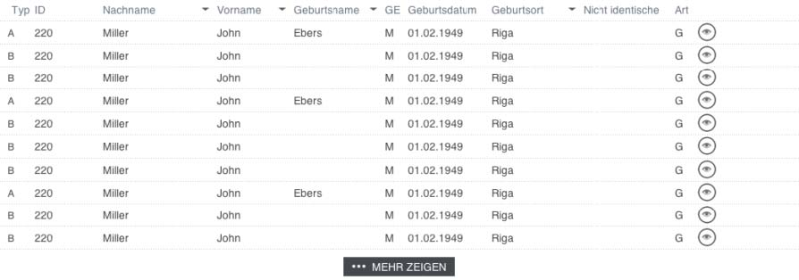

[[fig-75]]
.: Tabelle mit Paginator

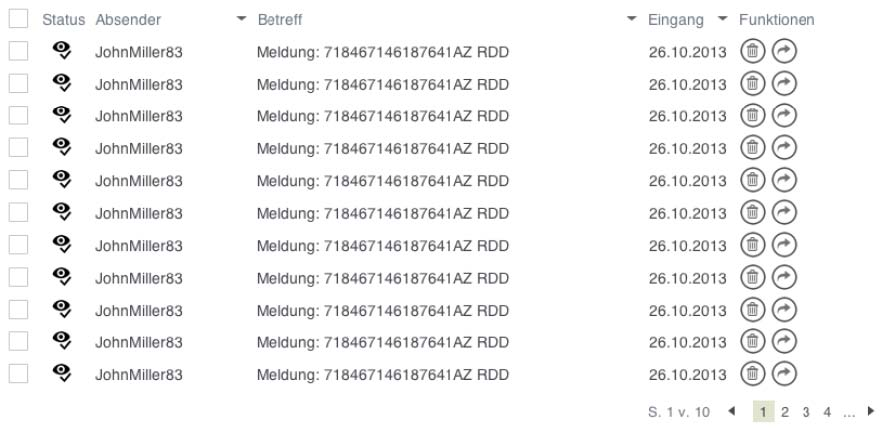

*Richtlinien zur Anwendung*

a.  Der Paginator sollte mit Bedacht eingesetzt werden, Regeln siehe Kapitel Paginator.
+
Die Verwendung des _Mehr anzeigen_ Button ist dem Paginator möglichst vorzuziehen.
+
Funktionalität des _Mehr anzeigen_ Button:
a.  ___________________________________________________________________________________________________________
Zunächst wird dem Benutzer nur eine begrenzte Anzahl (10 oder 20 Zeilen) an Daten in der Tabelle angezeigt.
___________________________________________________________________________________________________________
+
______________________________________________________________________________________________________________________________________________
Unterhalb der Tabelle befindet sich ein _Mehr anzeigen_ Button.
Wird dieser vom Benutzer geklickt so wird der nächste Satz an Daten angezeigt.
______________________________________________________________________________________________________________________________________________
+
_______________________________________________________________________________________________________________________________________
Nach Klick auf den _Mehr anzeigen_ Button verlängert sich die Tabelle nach unten, so dass der Benutzer ggfls.
nach unten scrollen muss.
_______________________________________________________________________________________________________________________________________
+
_____________________________________________________________________________________________________________________________________________________________________________________________________________________________________________________________________________________________________________________
Nach Klick auf den _Mehr anzeigen_ Button sollte die erste Zeile des neu geladenen Datensatzes an der ursprünglichen Position des _Mehr anzeigen_ Buttons erscheinen.
So kann sichergestellt werden, dass der neue Datensatz immer im Blickfeld des Benutzers erscheint.
Die Selektion der Elemente bleibt unberührt.
_____________________________________________________________________________________________________________________________________________________________________________________________________________________________________________________________________________________________________________________
+
__________________________________________________________________________________________
Sind keine weiteren Daten mehr vorhanden, so wird der _Mehr anzeigen_ Button ausgeblendet.
__________________________________________________________________________________________
+
Wenn mehr als 100 Einträge zu erwarten sind, sollte aus technischen Gründen ein Paginator benutzt werden.

*Hinweise zur Implementierung*

Die Implementierung erfolgt über das Facet <<f:tablePagination>, das Tag <t:dataTablePaginator> und den dazugehörigen DataTablePaginationModel

Zum Beispiel im DataTableController

________________________________________________________________________________________________________________________________________________________________________________________
@Override

public void initialisiereModel(DataTableModel model) \{ model.getPaginationModel().setPageSize(3); model.getPaginationModel().setMode(PaginationMode.SIMPLE); updateDisplayItems(model);

}
________________________________________________________________________________________________________________________________________________________________________________________

und in der View:

______________________________________________________________________
<f:facet name="tablePagination"> <isy:dataTablePaginator /> </f:facet>
______________________________________________________________________

*Check Box*

Eine Check Box repräsentiert eine unabhängige, nicht-exklusive Auswahl.
Der Benutzer kann beliebige Optionen auswählen.

[[fig-76]]
.: Check Box – Darstellungsbeispiel IE 9

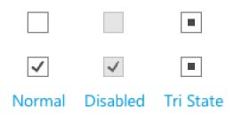

*Zustände*

a.  Normal
+
Hover (Checkbox Label)
+
Pressed (Checkbox Label)
+
Focused
+
Deaktiviert
+
Validierung (Checkbox Label)
+
Tri State
+
Required - Rotes Sternchen an Label (in formCheckbox seit 4.0)
+
Optional - Blaues Sternchen an Label (in formCheckbox seit 4.0)

*Ist dies das korrekte Bedienelement?*

a.  Check Boxen können für das Setzen einer oder mehrerer, sich nicht gegenseitig ausschließender Optionen oder anderer Werte genutzt werden.
+
Falls nur eine Option existiert, die einer „Ein/Aus"-Semantik folgt, kann eine Check Box zum Setzen dieser Option verwendet werden.
+
Eine Check Box darf nicht genutzt werden, um unmittelbar Funktionen auszuführen oder Aktionen auszulösen.
Für diese Zwecke sollten Buttons verwendet werden.
+
Das Ein- oder Ausschalten einer Check Box kann jedoch dazu genutzt werden, um andere Elemente zu aktivieren oder zu deaktivieren.

*Richtlinien zur Anwendung*

a.  Checkboxen werden browserspezifisch dargestellt, dass heißt die Darstellung sieht in jedem Browser anders aus.
Beispielgrafik für den Internetexplorer 9 siehe<<fig-76>>.
+
In der Regel besteht eine Check Box immer aus dem Check Box Button, der gleichzeitig als Indikator für den Checked-State dient und einem zugehörigen Text-Label.
+
Für eine optimierte Usability sollte sowohl der Check Box Button als auch das Text Label geklickt werden können, um den Checked-State zu verändern.
+
Eine Gruppe von Check Boxen sollte immer eine Beschriftung aufweisen, die entsprechend bei einer einzelnen Checkbox entfallen kann.
+
Das Text-Label einer Check Box steht immer hinter dem Bedienelement.
+
Für optimale Lesbarkeit sollten Check Boxes vertikal untereinander angeordnet sein.
+
In Einzelfällen kann die Check Box auch alleinstehend verwendet werden, um eine bestimmte Funktionalität an- und auszuschalten oder um bestimmte Inhaltsbereiche zu aktivieren/deaktivieren
+
Die Beschriftung einer Check Box sollte positiv formuliert sein, z. B. „Objekte einblenden" statt „Objekte ausblenden".
+
Neben den normalen Zuständen „Ein/Aus" kann eine Check Box noch einen dritten Zustand „nicht definiert" annehmen, so z. B. wenn die Check Box in einer Hierarchie zur Selektion aller untergeordneten Elemente verwendet wird.
Man spricht in diesem Fall von einer so genannten „Tri State Check Box"__.__
a.  ______________________________________________________________________________________________________________________________________________________________
Solange die Werte der untergeordneten Optionen gleich sind (alle „Aus" oder alle „An"), zeigt dies die übergeordnete Check Box mit dem entsprechenden Wert an.
______________________________________________________________________________________________________________________________________________________________
+
___________________________________________________________________________________________________________________________________________________________________________________________________________________________________________
Sind die Werte der untergeordneten Optionen jedoch nicht mehr homogen gesetzt, so schaltet die übergeordnete Check Box in den Zustand „nicht definiert". Dieser Zustand wird häufig mit einem Quadrat innerhalb der Check Box symbolisiert.
___________________________________________________________________________________________________________________________________________________________________________________________________________________________________________

_____________________________________________________________________________________________________________________________________________________________________
Sollte eine Gruppe von Checkboxen aus einer großen Anzahl von Optionen bestehen, kann die Gruppe auf mehrere Spalten platzsparend und übersichtlich angezeigt werden.
_____________________________________________________________________________________________________________________________________________________________________

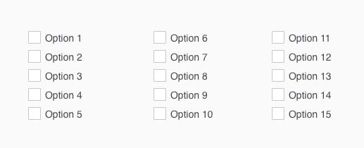

*Kein JavaScript*

Ohne JavaScript ist die Darstellung des Tristates nicht möglich.

*Hinweise zur Implementierung*

Eine einzelne Checkbox wird über das Tag <isy:selectBooleanCheckbox> eingebunden.

Folgende Parameter sind zulässig:

_________________________________________________________________________________________________________________________________________________
value: Der Wert der Checkbox für das Databinding im Model.

label: Das Label der Checkbox.

disabled: Ob die Checkbox deaktiviert ist oder nicht.
Standard: false

showPrintView: Ein spezifisches Flag zur Erkennung der Druckansicht, falls notwendig (seit 3.1.x).

required: Ob die Checkbox zwingend markiert werden muss oder nicht.
Standard: false (seit 3.1.x).

onchange: Das onchange-Event der Checkbox (seit 3.1.x).
_________________________________________________________________________________________________________________________________________________

Mehrere Checkboxen werden über das Tag <isy:selectManyCheckbox> eingebunden.

Folgender Parameter ist zulässig:

_________________________________________________________________________________________________________________________________________________
value: Der Wert für das Data-Binding (Eine Liste an SelectItems)

showPrintView: Ein spezifisches Flag zur Erkennung der Druckansicht, falls notwendig (seit 3.1.x).
_________________________________________________________________________________________________________________________________________________

__Hinweis: __Der Tri-State ist noch nicht umgesetzt.

(Seit 3.1.x) Für Formulare existiert das Tag <isy:formCheckbox> und bietet vor allem eine Integration auf einem Formular.

Folgende Parameter sind zulässig:

_________________________________________________________________________________________________________________________
value: Der Wert der Checkbox für das Databinding im Model.

reference: Die Referenz des Objekts für die Validierung.

label: Der Text für das Label.

labelStyleClass: Die CSS-Klasse für das Label.

required: Ob die Eingabe ein Pflichteingabe ist.
Standard: false

inputStyleClass: Die CSS-Klasse für den Eingabebereich.
Standard: col-lg-6

disabled: Ob die Checkbox deaktiviert ist oder nicht.
Standard: false

validationModel: Ein spezifisches Validation-Model, falls benötigt

globalConfig: Eine spezifische globale Konfiguration, falls benötig
_________________________________________________________________________________________________________________________

Seit 4.0

_____________________________________________________________________________________________________________________________________
required: Ob die Eingabe eine Pflichteingabe ist. (rotes Sternchen)

optional: Ob die Eingabe eine Optionale-Pflichteingabe ist. (blaues Sternchen)

valueChangeListener: Die Listener-Methode, die bei einem Change Event aufgerufen wird.
_____________________________________________________________________________________________________________________________________

*Radio Button*

Radio Buttons dienen der eindeutigen Auswahl von sich ausschließenden Optionen.
Der Benutzer kann also nur eine der Optionen auswählen.

[[fig-77]]
.: Radio Button – Darstellungsbeispiel IE 9

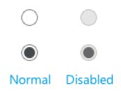

*Zustände*

a.  Normal
+
Hover (Radio Button Label)
+
Pressed (Radio Button Label)
+
Focused (Radio Button Label)
+
Deaktiviert
+
Validierung (Radio Button Label)

*Ist dies das korrekte Bedienelement?*

a.  Wenn der Benutzer genau eine Option aus einer sich gegenseitig ausschließenden Menge wählen kann, wird ein Radio Button genutzt.
+
Kann der Benutzer mehr als eine Option wählen? Falls ja, dann muss statt eines Radio Buttons eine Check Box verwendet werden.
+
Existiert nur eine Option, die einer „Ein/Aus"-Bedeutung entspricht, so muss statt eines Radio Buttons eine Check Box verwendet werden.
+
Die Verwendung von Radio Buttons empfiehlt sich für eine kleinere Anzahl an Optionen.
Ist die Menge der zur Verfügung stehenden Optionen sehr groß oder hat der Platzbedarf eine große Bedeutung, so kann der Einsatz eines Dropdown Menüs in Betracht gezogen werden.
+
Ein Radio Button darf nicht genutzt werden, um unmittelbar Funktionen auszuführen oder Aktionen auszulösen.
Für diese Zwecke sollten Buttons verwendet werden.

*Richtlinien zur Anwendung*

a.  Radio Buttons werden browserspezifisch dargestellt, dass heißt die Darstellung sieht in jedem Browser anders aus.
Beispielgrafik für den Internetexplorer 9 siehe<<fig-77>>.
+
Eine Gruppe von Radio Buttons sollte immer eine Beschriftung aufweisen .
+
Für optimale Lesbarkeit sollten Radio Buttons vertikal untereinander angeordnet sein.
+
Sollte es wahrscheinlich sein, dass keine (oder alle) der angebotenen Optionen zutrifft, sollte eine Meta-Option wie „Keine Option" („Alle") angeboten werden.
+
Das Text-Label des Radio Buttons steht immer hinter dem Bedienelement.

*Hinweise zur Implementierung*

Ein Radio Button wird über das Tag <isy:selectOneRadio> (bzw. <isy:selectOneRadioInline> , seit 3.1.x. und <isy:formSelectO neRadio>, seit 4.0.x) eingebunden.

Folgende Parameter sind für <isy:selectOneRadioInline> zulässig:

_______________________________________________________________________________________________________________________
value: Der Wert der Auswahl für das Data-Binding

selectItems: Die Select-Items.
Jedes Item entspricht einem Radio-Button
_______________________________________________________________________________________________________________________

Für <isy:selectOneRadio> ist zusätzlich folgendes Attribut zulässig:

_________________________________________________________________________________________________________________
disabled: Ob die Darstellung nur lesend erfolgen soll (seit 4.0.x)
_________________________________________________________________________________________________________________

(seit 4.0.x) Für <isy:formSelectOneRadio> sind zusätzlich folgende Attribute zulässig:

_______________________________________________________________________________________________________________________
value: Der Wert der Auswahl für das Data-Binding

inline: Ob die Radio-Buttons inline angezeigt werden sollen oder nicht.

reference: Die Referenz des Objekts.

label: Der Text für das Label

labelStyleClass: Die CSS-Klasse für das Label.

inputStyleClass: Die CSS-Klasse für den Eingabebereich.

required: Ob die Eingabe ein Pflichteingabe ist.

validationModel: Ein spezifisches Validation-Model, falls benötigt.

globalConfig: Eine spezifsche globale Konfiguration, falls benötigt.
_______________________________________________________________________________________________________________________

*Status von Bedienelementen*

Je nach Kontext können manche Elemente, in der Regel Eingabeelemente, verschiedene Zustände annehmen.

[[fig-50]]
.: Status von Bedienelementen – Beispiel Eingabefeld

*Regeln zur Anwendung*

________________________________________________________________________________________________________________________________________________________________________________________________________________________________________________________________________________________
Die drei häufigsten Zustände sind:

**Normal**

Das Element kann vom Benutzer bedient werden.

**Deaktiviert (Disabled)**

Das Element kann nicht bedient werden.
Es ist z.B. aufgrund der Auswahl einer anderen Option deaktiviert.
Eventuell zuvor eingegebene Werte werden nicht berücksichtigt.
Das Element selbst, dessen Beschriftung sowie eventuell existierende Eingaben, werden „ausgegraut" dargestellt.

**Read-Only (nur lesbar)**

Das Element kann nicht direkt bedient werden.
Eventuell kann es jedoch mittelbar bedient werden, z.B. durch die Änderung eines anderen Wertes.

Weitere Zustände:

**Hover (MouseOver)**

Wird die Maus über ein Element bewegt so wird dieses Element mittels eines Hover-Effekts optisch hervorgehoben.

**Pressed**

In dem Moment in dem per Maus oder Tastatur ein Element ausgewählt wird, wird dieses als Pressed dargestellt.

**Focus**

Der Focus liegt auf einem Element.
Der Focus kann per Mausklick oder mit Hilfe der Tabulatortasten der Tastatur geändert werden.

**Selektiert**

Ein Element ist ausgewählt und bleibt in diesem Zustand.

**Validierung**

Elemente die einer Validierung unterzogen werden (vor allem in Formularen) werden bei fehlerhaften Eingaben gesondert hervorgehoben.
________________________________________________________________________________________________________________________________________________________________________________________________________________________________________________________________________________________

*Design Patterns*

_____________________________________________________________________________________________________________________________________________________________
Ein Design Pattern ist eine Kombination aus Standardelementen, welche in dieser Kombination für verschiedene Aufgaben oder Situationen benutzt werden können.
_____________________________________________________________________________________________________________________________________________________________

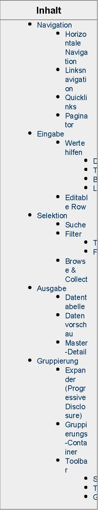

_____________________________________________________________________
Date Picker Time Picker Buchstaben Picker List Picker (Objektauswahl)

Toggle-Filter Filter-Zeile

Seiten-Toolbar Tabellen-Toolbar Gruppierungs-Container mit Toolbar
_____________________________________________________________________

*Navigation*

*Allgemeine Richtlinien*

a.  Aktive Navigationspunkte sollten immer deutlich hervorgehoben werden.
+
Innerhalb eines Applikationsportals oder einer einzelnen Anwendung sollte eine einheitliche Navigationsstruktur angewendet werden.
Wird beispielsweise für die Navigation ein Submenü und eine Linksnavigation eingesetzt, so sollte dies konsistent für alle Applikationen des Anwendungsportals angewandt werden.

*Horizontale Navigation*

Die Hauptnavigation ist eine horizontale Navigation.

[[fig-78]]
.: Hauptnavigation mit Submenü als Flyout

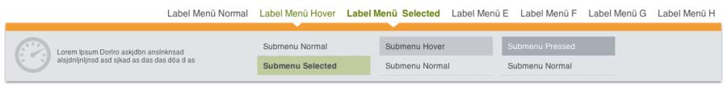

*Ist dies das korrekte Pattern?*

a.  Die horizontale Navigation sollte nur für die Hauptnavigation verwendet werden.
+
Das Submenü (Flyout) kann als 2. Navigationsebene verwendet werden.

*Position und Ausrichtung der horizontalen Navigation*

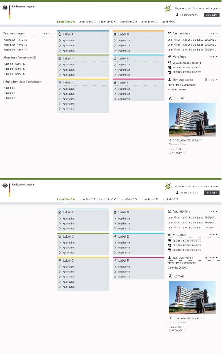

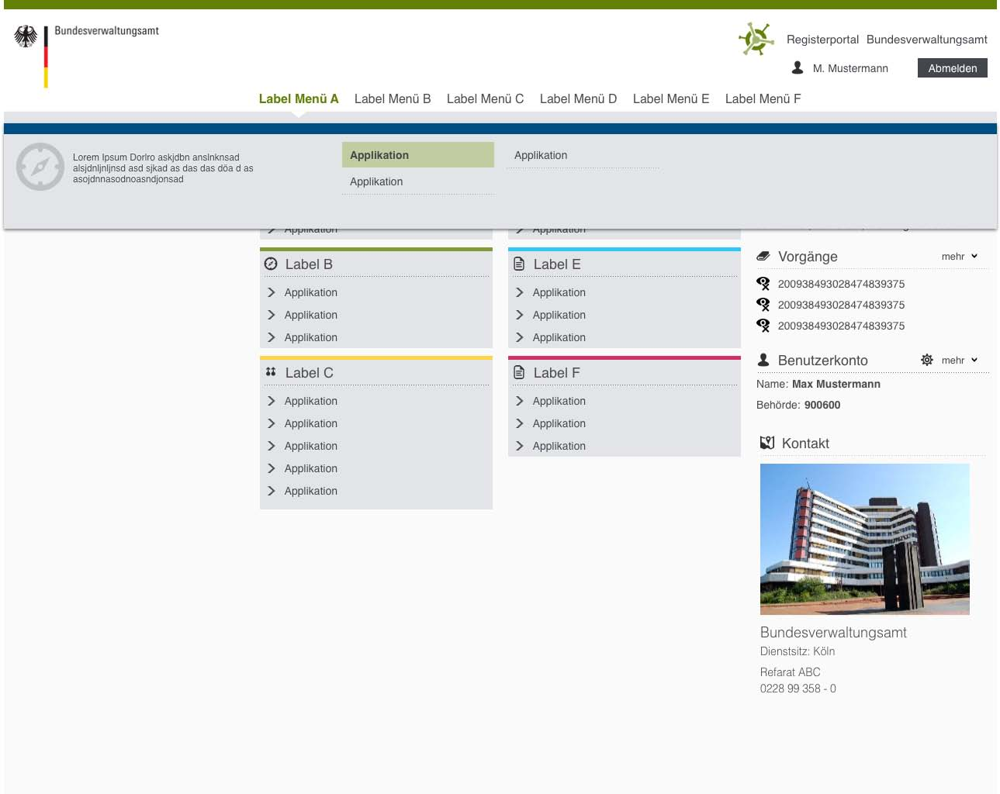

_________________________________________________________________________________________________________________________________________________________________________________________________________________________________________________________________________________________________________________________________
Hauptnavigation wird von links nach rechts befüllt.
Damit die Navigation nicht mit dem Logo kollidiert und weil die zugehörigen Applikationen erst in der zweiten Spalte stehen, beginnt die Hauptnavigation bündig mit der zweiten Spalte.
Ein Entfall der Linksnavigation ist möglich, hat aber keinen Einfluss auf das Layout.
_________________________________________________________________________________________________________________________________________________________________________________________________________________________________________________________________________________________________________________________________

*Richtlinien zur Anwendung*

________________________________________________________________________________________________________________________________________________________________________________________________________________________________________________________________________________________________________________________________________________________________________________________________________________________________________________________________________________________________________________________________________________________________________________________________________________________________________________________________________________________________________________________________________________________________________________________________________________________________________________________________________
In der Hauptnavigation werden Applikationsgruppen platziert.
Kann eine Applikation keiner Gruppe zugeordnet werden, so kann sie einen eigenen Hauptnavigationspunkt darstellen.
Die Anzahl der Navigationspunkte sollte auf ein sinnvolles Minimum reduziert werden (max.
8-10). Die Hauptnavigation ist nicht scrollbar und sollte kein Taboverflow Menü haben.
Ist ein Dashboard vorhanden, so stellt dieses immer den ersten Punkt (ganz links) in der Hauptnavigation dar und ist per Default aktiv.
Es ist immer ein Punkt in der Hauptnavigation selektiert.
Unterhalb der Hauptnavigation wird ein Farbbalken angezeigt.
Die Farbe repräsentiert eine Applikationsgruppe/Applikation.
Sie entspricht immer dem gerade aktiven Hauptnavigationspunkt.
Wird die Maus über einen Hauptnavigationspunkt bewegt (Hover), wird eine Subnavigation als Flyout angezeigt.

Die Subnavigation wird entsprechend der dazugehörigen Applikationsgruppe/Applikation mit einer Farbe gekennzeichnet.
Der erste Navigationspunkt in der Subnavigation beziehungsweise der vom Benutzer zuletzt geöffnete Navigationspunkt ist per Default vorselektiert.

Klickt der Benutzer direkt auf einen Hauptnavigationspunkt wird standardmäßig die erste beziehungsweise die zuletzt geöffnete Applikationsseite aus der Subnavigation geöffnet.
________________________________________________________________________________________________________________________________________________________________________________________________________________________________________________________________________________________________________________________________________________________________________________________________________________________________________________________________________________________________________________________________________________________________________________________________________________________________________________________________________________________________________________________________________________________________________________________________________________________________________________________________________

*Kein JavaScript*

Ohne JavaScript lässt sich das Menü der Subnavigation nicht über die komplette Breite des Screens darstellen.
Hierfür werden die Menüpunkte der Subnavigation vertikal unter dem Menüpunkt der Hauptnavigation angeordnet, Beispiel siehe<<fig-79>>.
Die Beschreibung und das Icon entfallen.

[[fig-79]]
.: Hauptnavigation mit Submenü als Flyout – Ohne JavaScript

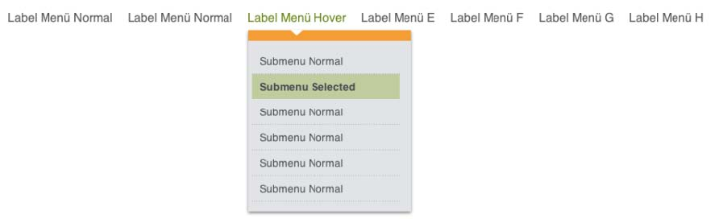

*Hinweise zur Implementierung*

Derzeit wird die Navigationsleiste im Header Bereich statisch geladen.
Jede Anwendung muss daher die Ressource /WEB-INF/gui/common/s eitenelemente/navigation.xhtml mit einer spezifischen Anpassung überschreiben.
Zukünftig soll eine Konfiguration der Links möglich sein.

*Linksnavigation*

*EIN-/AUSKLAPPEN NOCH NICHT IMPLEMENTIERT*

Die Linksnavigation ist ein optionales Element und kann zur weiteren Strukturierung einer Applikation dienen.
Sie kann über ein Icon ein- und ausgeblendet werden. 

[[fig-80]]
.: Linksnavigation

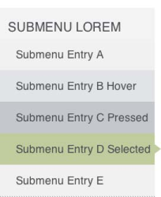

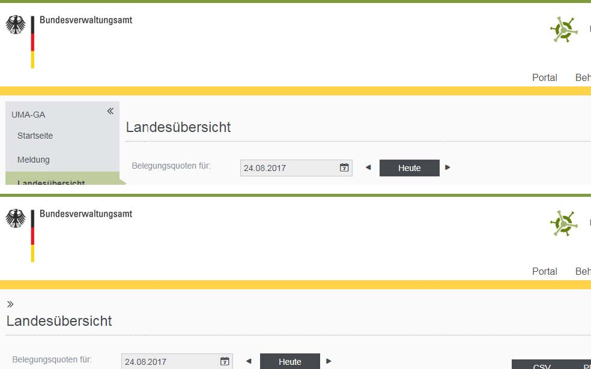

*Ist dies das korrekte Pattern?*

a.  Die Linksnavigation dient der weiteren Strukturierung einer Applikation.
+
Diese kann entweder als 2. Navigationsebene oder bei komplexeren Applikationen als 3. Navigationsebene verwendet werden.

*Aufbau*

a.  Überschrift
+
Navigationspunkte

*Richtlinien zur Anwendung*

a.  Wird die Linksnavigation als Navigationsebene 2 oder 3 benutzt so sollte die Überschrift das Label der übergeordneten Navigationsebene anzeigen z.B. das Label der Applikation.
+
Die Überschrift ist nicht auswählbar, alle anderen Einträge in der Linksnavigation sind mit Inhalten verlinkt.
+
Wählt der Benutzer einen Eintrag aus der Linksnavigation so wird der rechte Inhaltsbereich der Seite ausgetauscht und der gewählte Navigationspunkt als selektiert markiert.
+
Über die Linksnavigation ist kein Applikationswechsel möglich.
Der Benutzer bewegt sich immer innerhalb einer Applikation.
+
Das Icon zum Einklappen der Linksnavigation befindet sich neben der Überschrift.
Bei den Icons handelt es sich um angle-double-left und angle-double-right aus dem Iconset von fontawesome.

*Hinweise zur Implementierung*

Linksnavigationen werden durch den Controller LinksnavigationController und das Model LinksnavigationModel realisiert.
Der Controller ist bereits im ApplikationseiteController eingebunden und muss daher nicht explizit aktiviert werden.

Linksnavigationen werden in der Konfigurationsdatei gui-linksnavigation.properties konfiguriert.
Die Konfigurationsdatei liegt im

Deployment, es handelt sich nicht um eine betriebliche Konfiguration.
Die Konfiguration muss in der Konfigurationsbean "konfiguration" eingebunden werden. Über die Variable gui.linksnavigation.ids wird zunächst eine Liste an IDs für die jeweiligen Linksnavigationen konfiguriert, z. B.:

gui.linksnavigation.ids=linksnavigationbeispiel, jsfSteuerelemente

Für jede vergebene ID wird eine Linksnavigation wie folgt konfiguriert:

gui.linksnavigation.linksnavigationbeispiel.headline=Beispiellinkliste gui.linksnavigation.linksnavigationbeispiel.1.text=Beispielseite A gui.linksnavigation.linksnavigationbeispiel.1.link=beispiellinkaFlow gui.linksnavigation.linksnavigationbeispiel.2.text=Beispielseite B gui.linksnavigation.linksnavigationbeispiel.2.link=beispiellinkbFlow

gui.linksnavigation.jsfSteuerelemente.headline=Überschrift gui.linksnavigation.jsfSteuerelemente.1.text=JSF-Steuerlemente gui.linksnavigation.jsfSteuerelemente.1.link=jsfSteuerelementeFlow

Anhand des aktuell aktiven Flows wird automatisch die korrekte Linksnavigation dargestellt und der enthaltene Link zum aktiven Flow wird entsprechend als ausgewählt dargestellt.
Wenn ein Subflow aktiv ist, dann wird immer der ursprünglich aufrufende Flow als der aktive Flow angesehen. Wenn keine passende Linksnavigation gefunden wird, dann wird keine dargestellt.
Weiterhin kann auf einer Applikationsseite eine individuelle Linksnavigation manuell eingebunden werden.

*Quicklinks*

Muss der Benutzer häufig auf bestimmte Funktionen oder Objekte in einer Anwendung zugreifen, so kann es sinnvoll sein ihm Schnellzugriffe, sogenannte Quicklinks auf diese Funktionen/Objekte zur Verfügung zu stellen.

______________________________________________________
[[fig-81]]
.: Quicklinks unterhalb der Linksnavigation

______________________________________________________

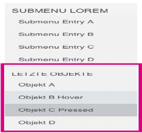

______________________________________
[[fig-82]]
.: Quicklinks auf Dashboard

______________________________________

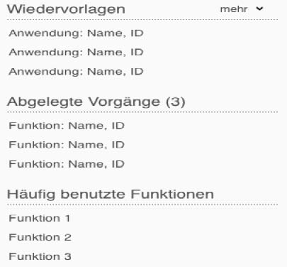

*Ist dies das korrekte Pattern?*

a.  Mittels Quicklinks können dem Benutzer häufig genutzte Funktionen und Objekte zur Verfügung gestellt werden, ohne dass dieser einen kompletten Prozess (z.B. Suche) durchlaufen muss um zu diesem Objekt zu gelangen.
+
Quicklinks sollten nur eingesetzt werden, wenn sie für den Benutzer einen echten Mehrwert darstellen.
+
Die Quicklinks sind eine zusätzliche Komfortfunktion für den Benutzer.
+
Sie stellen keinen Ersatz für eine Navigation dar.

*Aufbau*

a.  Überschrift der Gruppe
+
Links

*Richtlinien zur Anwendung*

a.  Quicklinks können auf dem Dashboard oder im linken Bereich der Inhaltsseiten platziert werden.
+
Es sollten nur Quicklinks zu Funktionen oder Objekten angezeigt werden, die
a.  _______________________________________________
für den jeweiligen Benutzer von Interesse sind.
_______________________________________________
+
____________________________________________________
den Arbeitsablauf des Benutzers vereinfachen können.
____________________________________________________
+
Quicklinks stellen immer eine Gruppierung mehrerer Objekte dar.
+
Die Anzahl der Links in einer Gruppe sollte begrenzt sein.
+
Dashboard: 5 pro Gruppe
+
Letzte Objekte: 8-10
+
Klickt der Benutzer auf einen Quicklink so wird die zugehörige Anwendung aufgerufen und die entsprechende Funktionen oder das entsprechende Objekt wird angezeigt.

*Hinweise zur Implementierung*

Quicklinks werden durch den Controller QuicklinksController und das Model QuicklinksModel realisiert.
Der Controller kann in einen beliebigen Controller eingebunden werden und durch Aufrufe können die darzustellen Quicklinks gesteuert werden.

Quicklinks können hinzugefügt werden, indem im Controller QuicklinksController die Methode fuegeQuicklinkHinzu(QuicklinkselementModel quicklinkselementModel) aufgerufen wird.
Ein einzelner Quicklink (QuicklinkselementModel) besitzt folgende Attribute:

_____________________________________________________________________________________________
id: Die ID eines Quicklinks

anzuzeigenderText: Der Text der angezeigt wird

link: Der dahinterliegende Link
_____________________________________________________________________________________________

Mit der Methode entferneQuicklink(String id) können Quicklinks wieder entfernt werden.
Quicklinks werden in der Session abgespeichert.

Die zuletzt hinzugefügten Quicklinks werden oben dargestellt. Wenn ein Quicklink hinzugefügt wird, der bereits vorhanden ist (Identifikation über seine ID), dann werden der Link und der anzuzeigende Text des Quicklinks aktualisiert und der Quicklink wird nach oben gesetzt. Wenn die maximale Anzahl an Quicklinks erreicht wird (konfigurierbar über den Konfigurationsparameter gui.quicklinks.max.anzahl), dann wird der

älteste Quicklink entfernt.

Seit 3.1.x: Für Quicklinks kann es nun auch mehrere Gruppen geben (z.B. aktuelle Suchanfrage, letzte Suchanfragen)

Seit 4.1.x: Gruppen von Quicklinks können jetzt abhängig vom aktuellen Flow angezeigt werden.
Weiterhin ist es möglich nun die Quicklinksbereiche statisch (analog zur Linksnavigation zu konfigurieren). Hierzu können in der Konfiguration folgende Einstellungen hinterlegt werden:

___________________________________________________________________________________________________________________________________________________________________________________________________________________________________________
gui.quicklinks.gruppenIds: Die kommaseparierte Liste an vorkonfigurierten Quicklinksgruppen.

gui.quicklinks.<gruppeId>.text: Der vorkonfigurierte Text der für die Gruppe angezeigt wird.

gui.quicklinks.<gruppeId>.contextflow: Die kommaseparierte Liste an Startflows, welche die Anzeige der Gruppe erlauben.
Ist keine Konfiguration gesetzt, so wird die Gruppe immer angezeigt.
___________________________________________________________________________________________________________________________________________________________________________________________________________________________________________

Gruppen können auch ohne Konfiguration (wie zuvor) existieren.
Die Konfiguration bietet lediglich einen statischen Weg zur Konfiguration der Quicklinksgruppen.

*Paginator*

Ein Paginator dient der Navigation durch große Mengen von Daten, die auf verschiedene Seiten verteilt sind.
Der Einsatz eines Paginators ist mit wesentlichen Nachteilen verbunden und sollte daher entsprechend gegen Alternativen abgewogen werden.

[[fig-83]]
.: Tabelle mit Paginator

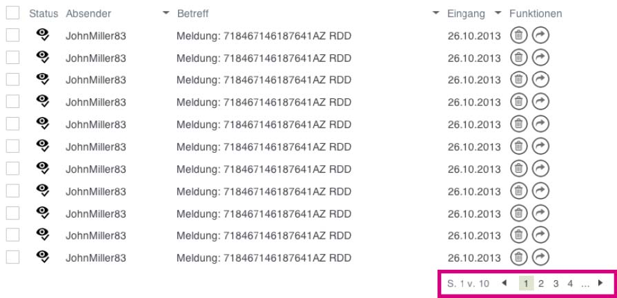

*Ist dies das korrekte Pattern?*

a.  Falls aufgrund begrenzter Ressourcen nicht der komplette Inhalt auf einer Seite geladen werden kann, kann dieser auf mehrere Seiten verteilt werden.
Ein Paginator wird dann zur Navigation zwischen den einzelnen Seiten verwendet.
+
Ein Paginator ist jedoch nur ein Hilfswerkzeug und sollte nicht als Standard genutzt werden.
Bestehen keine systembedingten

_________________________________________________________________________________________________________________________________________________________________________________________________________________________________________________________________________________________________________________________________________
Restriktionen, sollte auch kein Paginator eingesetzt werden.

Der Einsatz eines Paginators bringt einige Nachteile mit sich (siehe unten). Daher sollte geprüft werden, ob die Objekte inhaltlich sinnvoll minimiert werden können oder ob Alternativen wie z. B. _Mehr anzeigen_ Button oder falls erlaubt Dynamisches Scrolling genutzt werden können.
_________________________________________________________________________________________________________________________________________________________________________________________________________________________________________________________________________________________________________________________________________

a.  Der _Mehr anzeigen_ Button erlaubt alle Inhalte auf einer einzigen Seite zu betrachten und umgeht somit die Nachteile eines Paginators.
Dabei werden, ähnlich wie bei einem Paginator, nicht alle Daten auf einmal geladen, sondern bei Klick auf den _Mehr anzeigen_ Button werden mehr Daten angezeigt.
Dieses Element eignet sich für Objekte mit bis zu circa 100 Elementen.
+
Nachteile eines Paginators
a.  __________________________________________________________________________________________________________________________________________________________________
Eine Neu-Sortierung der Daten führt in der Regel zurück auf Seite 1, unabhängig von der Ausgangsposition.
Hierdurch wird die Orientierung des Benutzers erschwert.
__________________________________________________________________________________________________________________________________________________________________
+
____________________________________________________________________________________________________________________________
Die Daten können nicht nahtlos betrachtet werden, es gibt immer einen harten Übergang zwischen zwei Seiten eines Paginators.
____________________________________________________________________________________________________________________________
+
___________________________________________________________________________
Das Vergleichen von Informationen auf zwei verschiedenen Seiten ist mühsam.
___________________________________________________________________________

*Richtlinien zur Anwendung*

a.  Der Paginator wird unterhalb der entsprechenden Seiten angezeigt.
+
Die aktuell ausgewählte Seitenzahl wird hervorgehoben, während jeweils die Nachfolgeseite, die Vorgängerseite, die erste sowie die letzte Seite als Direktlinks zur Verfügung gestellt werden.
+
Falls möglich, sollten alle weiteren Seitenzahlen ebenso angezeigt werden.
+
Ist dies aus Platzgründen nicht möglich, so werden die Vorgänger- und Nachfolgeseiten der aktuell selektierten Seite angezeigt.
Die dabei entstehende Lücke zu der ersten und letzten Seite wird mit Auslassungspunkten angedeutet.
+
Über die Pfeiltasten (links / rechts) kann der Benutzer jeweils eine Seite zurück oder vor navigieren.

*Hinweise zur Implementierung*

Siehe Große Datenmengen in einer Tabelle

*Eingabe*

Patterns zur Dateneingabe

*Wertehilfen*

Eingabefelder können durch Wertehilfen erweitert werden.
Dies sind Eingabehilfen, die das manuelle Eintippen über die Tastatur ersetzen und somit zur Fehlervermeidung beitragen.
Dies ist sinnvoll, wenn der Benutzer aus einer vorhandenen Menge eine Option auswählen kann, es jedoch zu viele Optionen gibt, als dass man sie in ein Dropdown Menü platzieren könnte.
Die Eingabe eines Datums ist z.B. ein typischer Anwendungsfall für eine Wertehilfe.

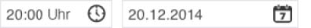

[[fig-84]]
.: Wertehilfe – Beispiel Bedienelement für Time Picker und Date Picker

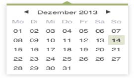

_______________________________________________________
[[fig-86]]
.: Wertehilfe – Zustände innerhalb des Menüs

_______________________________________________________

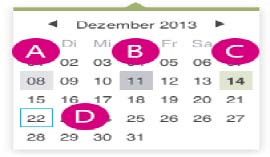

[[fig-85]]
.: Wertehilfe – Beispiel Date Picker Menü

a.  *A* – Hover
+
*B* – Pressed
+
*C* – Selektierter Tag

_____________________________________________________________
**D** – Focus
_____________________________________________________________

*Ist dies das Korrekte Pattern?*

a.  Wenn der einzugebende Wert Teil einer festen Wertemenge ist und diese Wertemenge zu groß für die Darstellung in einem normalen Dropdown Menü ist, so kann eine Wertehilfe zum Einsatz kommen.
+
Eine Wertehilfe kann den Benutzer in seinen Arbeitsabläufen unterstützen, indem sie alle zur Verfügung stehenden Werte auf einen Blick darstellt.
+
Wenn der Benutzer eine Mehrfachauswahl aus einer festen Wertemenge treffen muss, so kann eine Wertehilfe ihn dabei unterstützen.
+
Bietet die Wertehilfe einen wirklichen Vorteil? Wenn nein, sollte keine Wertehilfe verwendet werden.
+
Typische Anwendungen sind
a.  _____________
Auswahl Datum
_____________
+
_______________
Auswahl Uhrzeit
_______________
+
____________________
Auswahl von Objekten
____________________

*Richtlinien zur Anwendung*

a.  Rechts neben dem Eingabefeld wird ein Icon angezeigt, das den Typ der Wertehilfe symbolisiert.
+
Nach einem Klick auf das Icon öffnet sich die Wertehilfe.
+
Sobald der Benutzer außerhalb der Wertehilfe klickt oder innerhalb der Wertehilfe seine Auswahl trifft, wird die Wertehilfe wieder geschlossen.
+
Wurde eine Auswahl getätigt, wird diese anschließend in das Eingabefeld übertragen.
+
Für den Anwendungsfall einer Mehrfachauswahl wird auf der Wertehilfe ein Button mit der Beschriftung „Übernehmen" angebracht.
Der Benutzer kann mehrere Einträge selektieren, ohne dass sich das Fenster schließt. Sobald der Button geklickt wird, wird die Wertehilfe geschlossen und die Werte in das Eingabefeld übertragen.
+
Sollte nach einer Mehrfachauswahl nicht die komplette Selektion im Eingabefeld angezeigt werden können, so muss dennoch die Möglichkeit bestehen, mit Hilfe der Pfeil-Tasten zu den abgeschnittenen Informationen zu gelangen.
Ebenso ist wichtig, dass man per Tooltip die komplette Information einsehen kann.
+
Standardmäßig sind Wertehilfen geschlossen.
+
Bei einer Datumshilfe ist es typischerweise sinnvoll, den aktuellen Tag vorauszuwählen.
+
Alternativ kann der Benutzer immer noch manuell per Tastatur einen Wert in das Eingabefeld eingeben, es ist daher hilfreich einen Hinweis zum Format anzuzeigen, solange kein Wert ausgewählt wurde.

*Kein JavaScript*

Ohne JavaScript ist das anzeigen der Wertehilfen in einem extra Menü nicht möglich.
Zur Eingabe der Daten werden die normalen Eingabefelder genutzt.

*Date Picker*

Mit dem Date Picker kann der Benutzer per Klick auf das Kalender Icon ein Flyout öffnen, in dem der gewünschte Tag ausgewählt werden kann.
Im oberen Bereich kann der Benutzer zwischen den Monaten und Jahren wechseln.

[[fig-87]]
.: Date Picker Menü

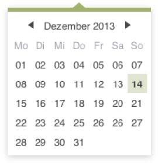

*Richtlinien zur Anwendung*

a.  Beim Wechsel des Monats oder der Jahreszahl wird der Picker nicht geschlossen.
+
Weitere allgemeingültige Richtlinien siehe Kapitel Wertehilfen.

*Hinweise zur Implementierung*

Der Date Picker wird über das Tag <isy:formDate> eingebunden und gehört zu den Formulareingabekomponenten.

Folgende Parameter sind zulässig:

__________________________________________________________________________________________________________________________________
reference: Die Referenz des Objekts für die Validierung.

value: Der Wert für das Databinding im Eingabefeld.

required: Ob die Eingabe ein Pflichteingabe ist.
Standard: false

label: Der Text für das Label.

labelStyleClass: Die CSS-Klasse für das Label.
Standard: col-lg-6

inputStyleClass: Die CSS-Klasse für den Eingabebereich.
Standard: col-lg-6

placeholder: Der Platzhalter, welcher im Eingabefeld angezeigt wird.

language: Die Sprache für den Datepicker.
Standard: de (Seit 3.1.x)

dateFormat: Das Datumsformat für den Datepicker.
Standard: dd.mm.yyyy (Seit 3.1.x)

inputMask: Das Maskenformat für das Eingabefeld.
Standard: 99.99.9999 (Seit 3.1.x)

validationModel: Ein spezifisches Validation-Model, falls benötigt

globalConfig: Eine spezifische globale Konfiguration, falls benötigt
__________________________________________________________________________________________________________________________________

Für den Datepicker wird ein externes Plug-In verwendet.
Das Feld an sich verhält sich also so, wie es das Plug-In vorgibt.

*Time Picker*

Mit Hilfe des Time Pickers kann der Benutzer Uhrzeiten auswählen.

[[fig-88]]
.: Time Picker Menü

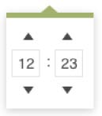

*Richtlinien zur Anwendung*

_____________________________________________________________________________________
Richtlinien siehe Kapitel Wertehilfen.
_____________________________________________________________________________________

*Hinweise zur Implementierung*

Derzeit noch nicht umgesetzt.

*Buchstaben Picker*

Der Buchstaben Picker kann den Benutzer bei der Auswahl bestimmter Buchstaben unterstützen z.B. zur Auswahl von Anfangsbuchstaben.

[[fig-89]]
.: Buchstaben Picker Menü

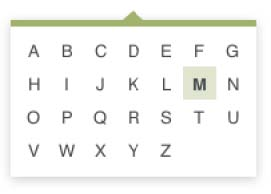

*Richtlinien zur Anwendung*

_____________________________________________________________________________________
Richtlinien siehe Kapitel Wertehilfen.
_____________________________________________________________________________________

*Hinweise zur Implementierung*

Ein Charpicker für Sonderzeichen kann durch die Angabe von charpicker=true in einem Formulareingabefeld (<isy:formInput>) aktiviert werden (seit 3.1.x).

*List Picker (Objektauswahl)*

Der List Picker kann den Benutzer bei der Auswahl bestimmter Objekte unterstützen, in dem weitere Zusatzinformationen die Identifikation von Werten vereinfachen.

[[fig-90]]
.: List Picker Menü

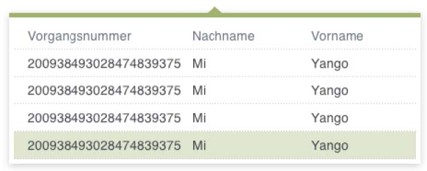

[[fig-91]]
.: List Picker Menü mit optionaler Filterzeile

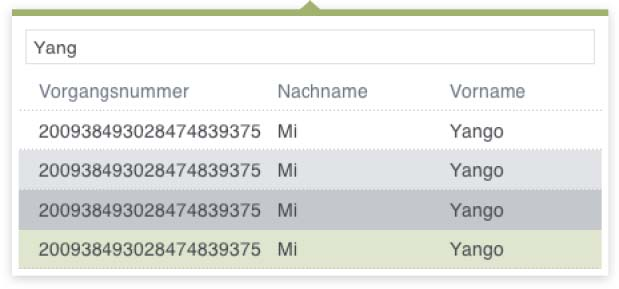

*Richtlinien zur Anwendung*

a.  Werden die Inhalte zu umfangreich (Anzahl zu groß) um sie sinnvoll innerhalb des Menüs darzustellen, so kann das List Picker Menü vertikal scrollbar werden.
+
Für lange Listen kann zudem eine Filterzeile eingefügt werden.
+
Weitere Richtlinien siehe Kapitel Wertehilfen.

*Hinweise zur Implementierung*

Ein List Picker wird über das Tag <isy:formListpicker> eingebunden und gehört zu den Formularkomponenten.

Folgende Parameter sind zulässig:

_______________________________________________________________________________________________________________________________________________________________________________________________________________________________________________________________________
reference: Die Referenz des Objekts für die Validierung

value: Der Wert für das Databinding im Eingabefeld

required: Ob die Eingabe ein Pflichteingabe ist.
Standard: false

label: Der Text für das Label.

labelStyleClass: Die CSS-Klasse für das Label.
Standard: col-lg-6

inputStyleClass: Die CSS-Klasse für den Eingabebereich.
Standard: col-lg-6

listpickerModel: Das Model für den Listpicker abgeleitet von ListpickerModel.

listpickerController: Der Controller für den Listpicker abgeleitet von ListpickerController.

header: Die sortierte Liste der Spaltenüberschriften.

placeholder: Der Platzhalter, welcher im Eingabefeld angezeigt wird.

inputmask: Die Eingabemaske für das Feld.

ajaxLoading: Ob Items dynamisch nachgeladen werden sollen.
Standard: false

ajaxForm: Die ID des Formulars, welches für das dynamische Nachladen von Items verwendet wird.

inputComplement: Die Nummer der Headerspalte, dessen Inhalt per Javascript im Eingabefeld ergänzt werden soll, sobald das Feld verlassen wird (z.B. Schlüsselwert zu Schlüssel anzeigen). Standardmäßig 0 = deaktiviert.

validationModel: Ein spezifisches Validation-Model, falls benötigt

globalConfig: Eine spezifische globale Konfiguration, falls benötigt
_______________________________________________________________________________________________________________________________________________________________________________________________________________________________________________________________________

Falls JavaScript nicht aktiviert ist, dann wird statt dem List Picker ein einfaches Dropdown angezeigt.

Beispiel für die Integration eines List-Pickers (ohne Ajax)

<isy:formListpicker reference="anfrageIdentifikation.gruppe" inputmask="99" listpickerModel="#\{identifikationModel.gruppeListpickerModel}" listpickerController="#\{behoerdeHelper.gruppeListpickerController}" label="#\{msg.MEL_Identifikation_Gruppe}" value="#\{identifikationModel.anfrageIdentifikation.gruppe}" header="#\{msg.MEL_Identifikation_Gruppe_Listpicker_Nummer},#\{msg.MEL_Identifikation_Gruppe_Listpicker_Name} "/>

Das spezifsche ListpickerModel enthält die Liste an Items, welche dargestellt werden sollen.
Die Filterung der Items geschieht automatisch über JavaScript.
Falls die Liste an Items zu groß wird, besteht die Möglichkeit die Auswahl über AJAX nachzuladen.
Dazu können die Attribute ajaxL oading="true" und ajaxForm="gruppeListpickerAjaxForm" ergänzt werden.
Zusätzlich muss im View State das entsprechende Form Element ergänzt werden:

<ui:define name="form"> <h:form id="gruppeListpickerAjaxForm"> <isy:formListpickerAjaxContent listpickerModel="#\{identifikationModel.gruppeListpickerModel}" /> </h:form> </ui:define>

Über das <ui:define> lassen sich Form-Elemente im Basis-Layout integrieren.
Das Tag <isy:formListpickerAjaxContent> lädt die entsprechend ListpickerItems in das Formular.
Das Formular an sich ist nicht sichtbar.
Das JavaScript Plugin übernimmt das entsprechende Laden der Elemente in den Listpicker.
Die Filterung der Elemente kann im spezifischen ListpickerController definiert werden.

Für die Auswahl von Behörden existiert bereits ein fertiger Behördenlistpicker (<isy:formBehoerdeListpicker>), welcher den normalen Listpicker instantziiert.
Der Behördenlistpicker ist ein AJAX Listpicker, d.h. es muss immer ajaxForm angegeben werden.
Als Dropdown zeigt er eine zweispaltige Tabelle mit Behördenkennzeichen und Namen der Behörde an, auf welcher gefiltert werden kann.
Er besitzt folgende Parameter:

__________________________________________________________________________________________________________________________________________________________________________________________________________
reference: Die Referenz des Objekts für die Validierung

value: Der Wert für das Databinding im Eingabefeld (muss vom Typ Listpickerangabe sein)

required: Ob die Eingabe ein Pflichteingabe ist.
Standard: false

label: Der Text für das Label.

labelStyleClass: Die CSS-Klasse für das Label.
Standard: col-lg-6

inputStyleClass: Die CSS-Klasse für den Eingabebereich.
Standard: col-lg-6

listpickerModel: Das Model für den Listpicker als Instanz von BehoerdeListpickerModel.

listpickerController: Der Controller für den Listpicker abgeleitet von AbstractBehoerdeListpickerController mit spezifischer Implementierung der Anwendung.

placeholder: Der Platzhalter, welcher im Eingabefeld angezeigt wird.

ajaxForm: Die ID des Formulars, welches für das dynamische Nachladen von Items verwendet wird.

validationModel: Ein spezifisches Validation-Model, falls benötigt

globalConfig: Eine spezifische globale Konfiguration, falls benötigt
__________________________________________________________________________________________________________________________________________________________________________________________________________

*Editable Row*

Editable Rows sind flexible Zeilen deren Inhalte separat bearbeitet werden können.

[[fig-92]]
.: Editable Row

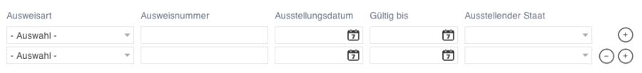

*Ist dies das korrekte Pattern?*

a.  Besitzt ein Objekt eine begrenzte Menge an Daten, die sich sinnvoll in einer Zeile darstellen lassen, so kann die Editable Row genutzt werden.
+
Die einzeilige Darstellung der Daten erlaubt den schnellen Vergleich mehrerer Datensätze / Informationen.
Mittels der Editable Row können außerdem schnell neue Daten zu einem Objekt angelegt werden.
+
Bestehen die Daten aus komplexen Informationen mit vielen Attributen oder vielen darzustellenden Zeilen, so sollte eine Tabelle benutzt werden.
+
Verfügt ein Objekt über weitere Detaildaten, sollte eine Tabelle in Kombination mit Detailseiten benutzt werden.

*Richtlinien zur Anwendung*

a.  Es dürfen keine weiteren Detaildaten (Preview oder Objektdetails) über die Editable Row aufgerufen werden.
+
Die Attribute eines Objektes werden in einer Zeile dargestellt.
+
Die Anzahl der Attribute für eine Zeile sollte auf ein sinnvolles Maß begrenzt werden.
Die Attribute müssen ohne zu scrollen auf einen Blick ersichtlich sein.
+
Einzelne Zeilen können nicht selektiert werden, um weitere Informationen zu dem Objekt anzuzeigen.
+
Editierbare Zeilen treten immer in einer Gruppe auf.
+
Die Anzahl der Zeilen sollten auf ein sinnvolles Maß (10) begrenzt werden.
+
Editierbare Zeilen im Editieren-Dialog
a.  _______________________________________________
Die Attribute können einzeln bearbeitet werden.
_______________________________________________
+
___________________________________________________________________________________
Die Attribute sind über Eingabefelder, Dropdown Menüs oder Wertehilfen bearbeitbar.
___________________________________________________________________________________
+
__________________________________________________
Es können Zeilen hinzugefügt oder gelöscht werden.
__________________________________________________

*Kein JavaScript*

Generell kann die Funktionalität auch ohne JavaScript beibehalten werden.
Jedes Hinzufügen oder Entfernen einer Zeile bedingt allerdings ein Neu-Laden der Seite.

*Hinweise zur Implementierung*

Derzeit nicht umgesetzt.

*Selektion*

Patterns zur Selektion von Daten

*Suche*

Die Suche wird benutzt um bestimmte Objekte anhand bestimmter Kriterien und Attribute in einer Applikation zu suchen.
Dies erfolgt über ein Suchformular, das für jede Applikation spezifisch angepasst werden kann.
Es gibt keine globale (applikationsübergreifende) Suche.

[[fig-93]]
.: Standard Suchformular

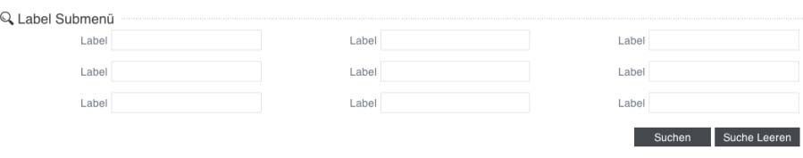

[[fig-94]]
.: Suchformular Beispiel 1

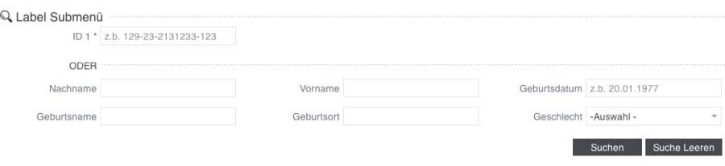

[[fig-95]]
.: Suchformular Beispiel 2

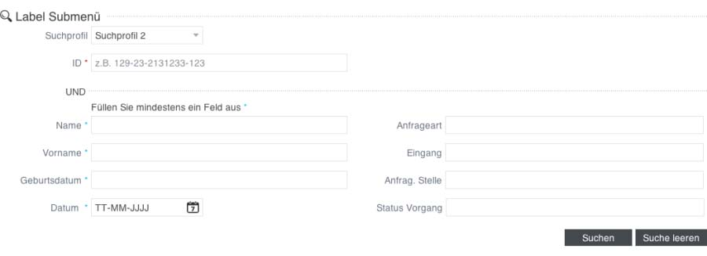

*Ist dies das korrekte Pattern?*

a.  Dieses Pattern wird eingesetzt, wenn der Benutzer nach einem Objekt mit bestimmten Kriterien und Attributen sucht.
+
Es wird vorausgesetzt, dass der Benutzer einige dieser Attribute kennt und genau weiß nach was er suchen muss.

*Richtlinien zur Anwendung*

a.  Die Inhalte von Suchformularen sollten so optimiert und gestaltet sein, dass dem Benutzer möglichst nur passende Ergebnisse angezeigt werden.
Um Ergebnisse schon beim Suchvorgang sinnvoll einzuschränken, können dem Benutzer Hilfsmittel wie z.B. Vorauswahl von Zeitgrenzen zur Verfügung gestellt werden.
+
Minimale Konfiguration eines Suchformulars:
a.  _______________________
Gruppierungsüberschrift
_______________________
+
______________________________________________
Ein Eingabefeld, Dropdown Menü oder Wertehilfe
______________________________________________
+
______________
_Suche_ Button
______________
+
_____________________
_Suche Leeren_ Button
_____________________
+
Formulare sollten nicht zu komplex und immer übersichtlich gestaltet sein.
+
____________________________________________________
Es können 2- oder 3-Spaltige Layouts benutzt werden.
____________________________________________________
+
_______________________________________________________________________________________________________________________________________________________________________________________________________________
Die Suchkriterien sollten nach ihrer Bedeutung/Wichtigkeit angeordnet werden.
Das wichtigste Suchkriterium wird oben links platziert, die anderen werden von links nach rechts und oben nach unten einsortiert.
_______________________________________________________________________________________________________________________________________________________________________________________________________________
+
______________________________________________________________________________________
Generell sollten die Layout-Regeln für Formulare in Kapitel Formulare beachtet werden.
______________________________________________________________________________________
+
_______________________________________________________________________________________________________________________________________________________________________________
In speziellen Fällen kann es sinnvoll sein gewisse Eingabefelder im Suchformular voneinander abzugrenzen zwei Beispiele hierfür sind in<<fig-94>> und<<fig-95>> zu sehen.
_______________________________________________________________________________________________________________________________________________________________________________
+
Es können Eingabefelder, Dropdown Menüs, Wertehilfen, Radio Buttons, Checkboxen zur Eingabe von Attributen genutzt werden.
+
Die Suche nach Wortfragmenten (Teil-String) sollte ermöglicht werden.
+
Ein Suchformular sollte immer zusammen mit einer Ergebnistabelle (siehe Kapitel Datentabelle) genutzt werden.
+
Die Gruppierungsüberschrift sollte mit dem aktuell aktiven Submenüpunkt identisch sein.
Befindet sich der Benutzer aktuell in der Navigationsebene 2 und hat Submenü A ausgewählt.
So entspricht die Gruppierungsüberschrift dem Label des aktiven Submenü A.
+
Der Suchvorgang wird durch das Klicken (alternativ Aktivierung per Tastatur) des Suchen Buttons ausgeführt.
+
Mit Hilfe des „Suche leeren" Buttons können alle Daten im Suchformular zurückgesetzt werden.
Wurde bereits eine Ergebnistabelle angezeigt, so wird diese ebenfalls geleert.
+
Buttons unterhalb eines Suchformulars sind immer am rechten Inhaltsende des Formulars ausgerichtet.
+
Resizing
a.  _____________________________________________________________________________________________________________________________________________________________________________________________________________
Wird die Größe Browserfenster verändert, so behalten die Bedienelemente des Formulars ihre Größe bei.
Die Abstände zwischen den Spalten können sich bis zu einer gewissen Grenze vergrößern bzw.
verkleinern.
_____________________________________________________________________________________________________________________________________________________________________________________________________________
+
__________________________________________________________________________________________________________________
Das genaue Verhalten von Formularen beim Resizing kann in Kapitel Formulare - Layout Verhalten nachgelesen werden.
__________________________________________________________________________________________________________________

*Hinweise zur Implementierung*

Ein Beispiel zur Umsetzung eines Suchformulars findet sich hier: Hinweise zur Implementierung von Formularen

*Filter*

Im Gegensatz zur Suche werden Filter immer auf bereits angezeigte Listen angewendet.
Sie dienen der Strukturierung umfangreicher Listen und vereinfachen das gezielte Auffinden bestimmter Objekte in einer Liste.

*Ist dies das korrekte Pattern?*

Filter werden zur Einschränkung von Objekten in bereits vorhandenen (meistens sehr langen) Listen oder Tabellen eingesetzt.

*Richtlinien zur Anwendung*

a.  Filter werden immer oberhalb einer Liste / Tabelle angezeigt.
+
Die Filterfunktion bezieht sich ausschließlich auf die in der dazugehörigen Liste / Tabelle angezeigten Objekte.
+
Wird ein Filter aktiviert, so werden alle anderen nicht zutreffenden Objekte ausgeblendet.

*Hinweise zur Implementierung*

Diese Funktion ist derzeit noch nicht umgesetzt.

*Toggle-Filter*

Mit dem Toggle-Filter kann durch einen Klick auf einen Button eine Liste von Objekten oder Formularen nach bestimmten vordefinierten Kriterien eingeschränkt werden.

[[fig-96]]
.: Toggle-Filter

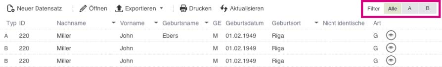

Der Filter kann auch für die Filterung von beliebigen Inhalten im Detail-Bereich verwendet werden.

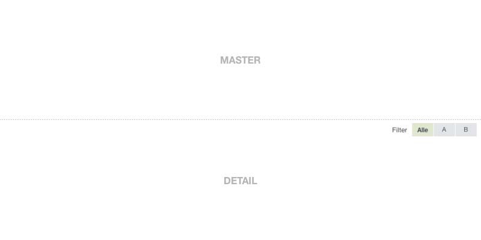

*Ist dies das korrekte Pattern?*

a.  Der Toggle-Filter kommt zum Einsatz wenn nach bestimmten vordefinierten Optionen gefiltert werden soll.
+
Der Toggle-Filter kann zur Filterung von langen Tabellen oder Listen genutzt werden.
+
Zur Umschaltung der verschiedenen Ansichten innerhalb des Detail-Bereichs.

*Richtlinien zur Anwendung*

a.  Ein Toggle-Filter sollte nicht mehr als 5 Filteroptionen enthalten.
+
Er setzt sich aus einem Label und einer Toggle-Button-Group zusammen.
+
Die Filteroptionen können z.B. Objekttypen, Werte oder Attribute sein.
+
Ist eine Filteroption aktiv (ausgewählt), so werden nur die passenden Objekte angezeigt.
+
Der Benutzer sollte immer die Möglichkeit haben sich alle Objekte einer Liste anzeigen zu lassen.
Hierfür wird eine Filteroption zur Verfügung gestellt z.B. „Alle".
+
Wird eine Filteroption per Klick auf den entsprechenden Button ausgewählt, so wird die Liste sofort neu aktualisiert.
+
Filter werden in der Toolbar oder, falls es diese nicht gibt, in der Kopfzeile des entsprechenden Elementes (z.B. Liste) platziert.
+
Nicht vorhandene und damit vom Benutzer nicht auswählbare Optionen (zum Beispiel Filter A) im Detailbereich werden nicht angezeigt.

*Kein JavaScript*

Generell kann die Funktionalität auch ohne JavaScript beibehalten werden.
Jeder Wechsel des Filters bedingt allerdings ein Neu-Laden der Seite.

*Hinweise zur Implementierung*

(Seit 4.0.x) Ein Toggle-Filter wird über das Tag <isy:toggleFilter> eingebunden.
Folgende Parameter sind zulässig:

_________________________________________________________________________________________________________________
action: Die auszuführende Aktion.

label: Der Text für das Label.

value: Der ausgewählt Filter.

styleClass: Optionale CSS Style Klasse.

execute: AJAX: Welche Felder ausgewertet werden sollen.

render: AJAX: Welcher Teilbereich aktualisiert werden soll.

globalConfig: Eine spezifische globale Konfiguration, falls nötig.
_________________________________________________________________________________________________________________

*Filter-Zeile*

In einer Tabelle können die Objekte auch mittels einer Filter-Zeile gefiltert werden.
Die Filter-Zeile besteht aus Eingabefeldern oder Dropdown Menüs. Jedes Attribut bzw.
jede Spalte kann eine Filteroption erhalten, sofern der Inhalt sinnvoll gefiltert werden kann.

[[fig-97]]
.: Filter-Zeile

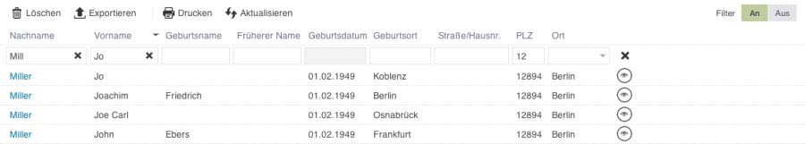

*Ist dies das korrekte Pattern?*

_______________________________________________________________________________________________________________________________________________________________________________________________________________________________________________
Filter-Zeilen werden in langen Tabellen mit vielen Objekten / Einträgen eingesetzt.

Die Filter-Zeile ermöglicht dem Benutzer ein bestimmtes Objekt in einer langen Tabelle (oft sind Objekte hier schon über eine vorangegangene Suche eingeschränkt) schnell und einfach zu finden.
_______________________________________________________________________________________________________________________________________________________________________________________________________________________________________________

*Richtlinien zur Anwendung*

a.  Die Filter-Zeile ist optional, nicht jede Tabelle muss zwangsläufig über eine Filter-Zeile verfügen.
Der Einsatz ist vor allem bei großen Datenmengen sinnvoll.
+
Die Filter-Zeile wird zwischen Tabellenkopf und dem ersten Tabelleneintrag eingefügt.
+
Die Filter-Zeile kann über einen Toggle-Button in der Toolbar der Tabelle ein- und ausgeblendet werden.
+
Wird die Filter-Zeile ausgeblendet so werden bereits eingegebene Daten zurückgesetzt.
Beim erneuten Ausklappen sind die Eingabefelder leer oder ggfls.
mit Platzhaltern versehen.
+
Gibt der Benutzer Text in eines der Eingabefelder ein, so wird der Inhalt dieser Spalte gefiltert.
Es werden nur die Objekte angezeigt welche die entsprechende Eingabe beinhalten.
+
Beinhaltet keines der Objekte den eingegebenen Text, so wird die Tabelle leer angezeigt.
+
Die Inhalte der Eingabefelder können durch Klicken auf ein Löschen-Icon links im Eingabefeld gelöscht werden.
Dieses Icon erscheint sobald der Benutzer mit der Texteingabe im Eingabefeld beginnt.
+
Es gibt eine zusätzliche Löschen-Funktion rechts vom letzten Eingabe-Feld. Über diese Funktion können alle Eingaben in den Eingabefeldern der Filter-Zeile gemeinsam zurückgesetzt werden.
+
Werden in einer Spalte nur Icons dargestellt, wird statt eines Eingabefeldes ein Dropdown Menü zur Filterung benutzt.
Das Menü enthält alle zur Auswahl stehenden Optionen als Text-Labels.
Wählt der Benutzer eine dieser Optionen, so werden nur die entsprechenden Objekte angezeigt, welche dem gewählten Kriterium entsprechen.
+
Dropdown Menüs können auch zur Filterung vordefinierter Werte wie z.B. Geschlecht, Status, Währung, Sprache o.ä. benutzt werden.
+
Eingabefelder werden für undefinierte Werte wie z.B. Namen, Titel, Beschreibungen o.ä. benutzt.
+
Es können gleichzeitig mehrere Filter benutzt werden.
Zum Beispiel kann es möglich sein nach Nachnamen und gleichzeitig nach Geschlecht zu filtern.
+
Die Eingabefelder der Filter-Zeile passen ihre Größe entsprechend der Spaltenbreite an.

*Hinweise zur Implementierung*

Die Implementierung erfolgt über das Facet

________________
 <f:tableFilter>
________________

, die Tags

__________________
 <dataTableFilter>
__________________

und

__________________________
 <dataTableFilterCleaner >
__________________________

und den dazugehörigen

______________________
 dataTableFilterModel.
______________________

Im Allgemeinen muss beim

<dataTableFilter>

Tag nur die Eigenschaft angegeben werden, nach der man filtern will.
Damit wird einen normalen Eingabefeld für die Filterung zur verfügung gestellt.
Es gibt auch die Möglichkeit die Filterung über eine Dropdownliste zu ermöglichen, dafür müssen die mögliche Einträge im Tag verschachtet angegeben werden.

**Hinweis**:Es ist besonders wichtig dass die Anzahl der Spalten im Header, Filter-Zeile und Body übereinstimmen.
Dies wird auch in Javascript überprüft, und ggf.
bekommt der Entwickler eine Fehlermeldung.
Bei Spalten die nicht gefiltert werden sollen (bzw.
können), wie z.B. die Spalte mit den Checkboxen, muss man einen Platzhalter mit dem Tag <dataTableFilter > ohne Attribute angeben.

*Beispiel:*

<f:facet name="tableFilter">

<!-- Platzhalter für checkbox Spalte -->

_________________________________________________________________________________________
<isy:dataTableFilter />

<isy:dataTableFilter property="anrede" dropdown="true">

<f:selectItem itemValue="" itemLabel="Wählen Sie aus:" />

<f:selectItems value="#\{dropdownHelper.anredeListe}" />

</isy:dataTableFilter>

<isy:dataTableFilter property="vorname" />

<isy:dataTableFilter property="nachname" />

<isy:dataTableFilter property="geburtsdatum" /> <isy:dataTableFilterClearer /> </f:facet>
_________________________________________________________________________________________

*Kein JavaScript*

Die Komfortfunktionen der Filter-Zeile können ohne JavaScript nicht zur Verfügung gestellt werden.
Die Filter-Zeile ist in diesem Fall nicht vorhanden und wird auch nicht angezeigt.

*Browse & Collect*

Mit Browse & Collect kann der Benutzer eine Liste von Objekten erstellen.
Hierbei werden Objekte von einer Quellliste in eine Zielliste übertragen.

[[fig-98]]
.: Browse & Collect

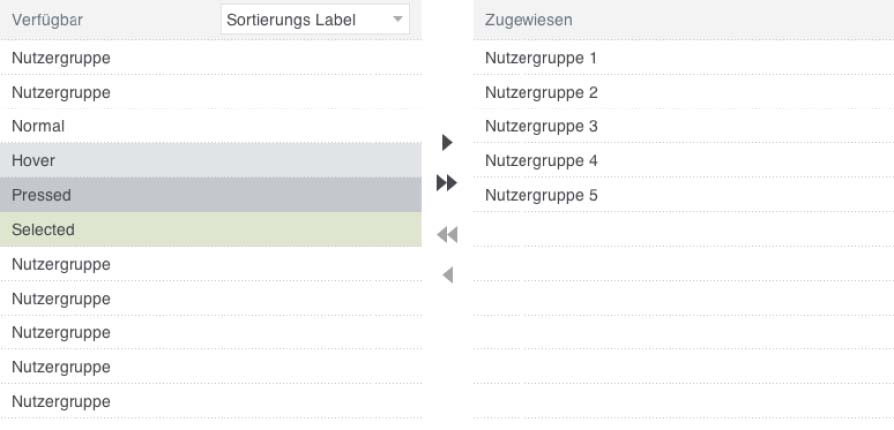

*Ist dies das korrekte Pattern?*

a.  Browse & Collect kann benutzt werden, um ein oder mehrere Objekte aus einer Liste auszuwählen.
+
Wenn die Liste der auszuwählenden Objekte sehr lang ist und gescrollt werden muss und die Auswahl der Werte direkt eingesehen werden sollte.

*Richtlinien zur Anwendung*

a.  Wird eine Browse & Collect Liste außerhalb des Editieren-Dialogs angezeigt (z.B. auf einer Detailseite) so ist stets nur die Zielliste zu sehen.
Die Quellliste wird nur im dazugehörigen Editier-Dialog angezeigt.
+
Die Quellliste wird immer links und die Zielliste rechts dargestellt.
+
Objekte (einzelne Zeilen) können selektiert und mittels des Hinzufügen- und Entfernen-Buttons von einer Liste in die andere verschoben werden.
a.  ____________________________
Schritt 1: Objekte Auswählen
____________________________
+
____________________________________________________________________________________
Schritt 2: Durch Klick auf Button Objekte von einer Liste in die andere verschieben.
____________________________________________________________________________________
+
Es ist eine Mehrfachauswahl von Objekten möglich.
+
Wenn es für den Inhalt der Liste sinnvoll erscheint, dann können die Funktionen „Alle hinzufügen" / „Alle entfernen" integriert werden.
+
Die Breite der Liste orientiert sich am längsten Objekt.
Die Labels der Objekte sollten so kurz wie möglich gehalten werden.
Zielliste und Quellliste sollten immer gleich breit sein.
+
Wenn nötig, können die Listen vertikal gescrollt werden.
+
Es sollten nur verfügbare Objekte angezeigt werden.
+
Objekte die in die Zielliste übernommen werden, sind aus der Quellliste auszublenden.
+
Sobald sich in einer Liste ein Objekt befindet, wird immer eine Selektion angezeigt, i.d.R. das zuletzt bewegte oder selektierte Objekt.
+
Sowohl Quell- als auch Zielliste können eine Filter-Zeile enthalten, mit der die Objekte sehr langer Listen eingegrenzt werden können.

*Kein JavaScript*

Ohne JavaScript kann zu optischen Abweichungen in der Darstellung kommen, die Funktionalität sollte allerdings beibehalten werden.

*Hinweise zur Implementierung*

(Seit 4.0.x) Browse and Collect kann über das Tag <isy:formBrowseAndCollect> und <isy:browseAndCollect> eingebunden werden.
Folgende Parameter sind für <isy:browseAndCollect> zulässig:

________________________________________________________________________________________________________________________________________________________________________________
reference: Die Referenz des Objekts.

value: Der Wert der Auswahl für das Databinding.

disabled: Ob die Liste deaktiviert ist.

browsecollectStyleClass: Die CSS-Klasse für die Komponente.

size: Dieses Attribut wird im Sinne von bootstrap-selectlist.js interpretiert, d.h. gibt die Anzahl der Zeilen die sichtbar sind.

globalConfig: Eine spezifische globale Konfiguration, falls notwendig.
________________________________________________________________________________________________________________________________________________________________________________

Folgende Parameter sind zusätzlich für <isy:formBrowseAndCollect> zulässig:

__________________________________________________________________________________________________________________
label: Der Text für das Label.

labelStyleClass: Die CSS-Klasse für das Label.

inputStyleClass: Die CSS-Klasse für den Eingabebereich.

validationModel: Ein spezifisches Validation-Model, falls benötigt.
__________________________________________________________________________________________________________________

*Ausgabe*

Patterns zur Ausgabe von Daten.

*Datentabelle*

Die Datentabelle nutzt das Bedienelement Tabelle um Ergebnisse von Suchen darzustellen.
Da Datentabellen sehr häufig in der Anwendung vorkommen, wird diese hier genauer beschrieben.
Die allgemeinen Regeln zur Benutzung von Tabellen können im Kapitel Tabelle nachgelesen werden.

[[fig-99]]
.: Datentabelle

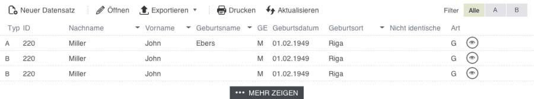

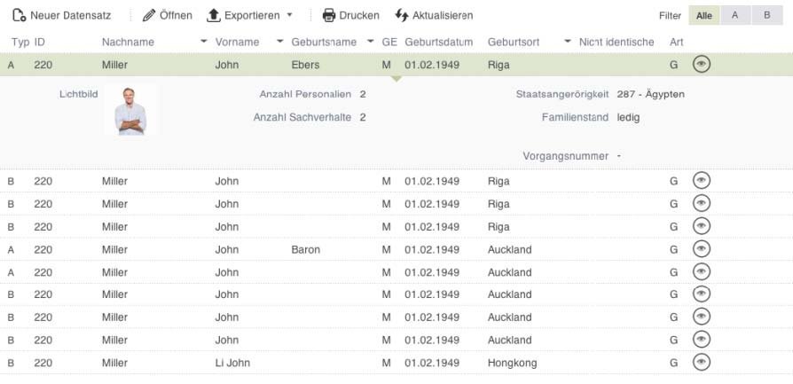

[[fig-100]]
.: Datentabelle – Vorschau geöffnet

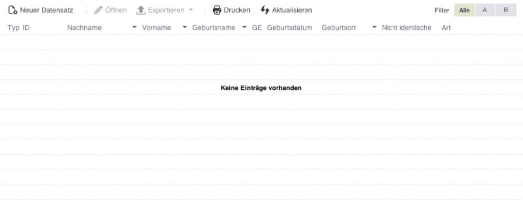

[[fig-101]]
.: Datentabelle – Leer

*Ist dies das korrekte Pattern?*

_____________________________________________________________________________________________________________
Datentabellen werden zur Anzeige von Suchergebnissen benutzt.
_____________________________________________________________________________________________________________

*Regeln zur Anwendung*

a.  Wurde noch keine Suche durchgeführt, so ist die Tabelle leer und es wird ein Hinweistext angezeigt.
+
Die Toolbar der Tabelle ist immer sichtbar.
Nicht mögliche Funktionalitäten, die durch die Durchführung der Suche freigeschalten werden, werden bei leeren Tabellen deaktiviert dargestellt.
+
Enthält eine Tabelle mehr Daten als auf den ersten Blick sinnvoll dargestellt werden können, so kann der Benutzer sich über den _Mehranzeigen_ Button weitere Ergebnisse anzeigen lassen (mehr Informationen siehe Kapitel Große Datenmengen in einer Tabelle).
+
Sofern sinnvoll, kann in der Ergebnistabelle eine Datenvorschau eingebunden werden.
Mit deren Hilfe kann der Benutzer genauer bestimmen, ob es sich um das von ihm gesuchte Objekt handelt oder nicht.

*Hinweise zur Implementierung*

Details zur Umsetzung finden sich hier: Tabelle

*Datenvorschau*

Die Datenvorschau kann zur Vorschau oder Zusammenfassung von komplexen Daten dienen.

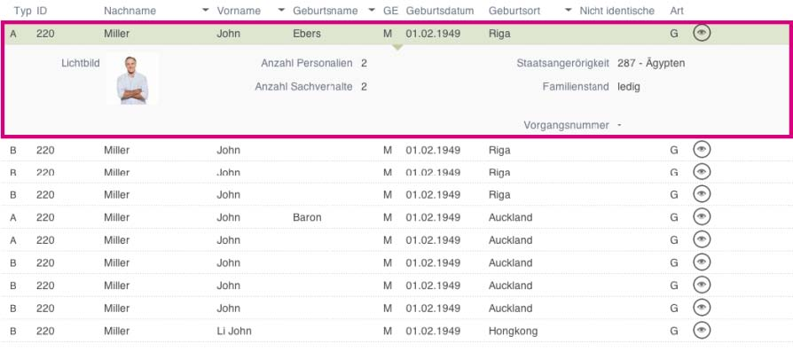

[[fig-102]]
.: Tabelle mit Datenvorschau

*Ist dies das korrekte Pattern?*

______________________________________________________________________________________________________________________________________________________________________________________
Innerhalb von Tabellen kann die Vorschau benutzt werden um ein Objekt näher zu beschreiben ohne auf die Detailseite wechseln zu müssen.
______________________________________________________________________________________________________________________________________________________________________________________

*Richtlinien zur Anwendung*

a.  In der Vorschau sollten für den Benutzer interessante Daten eines Objektes dargestellt werden.
+
Die Daten in der Vorschau können auch zusammenfassende Fakten enthalten (z.B. Anzahl bestimmter Objekte).
+
Die Vorschau nutzt das Pattern Expander (Progressive Disclosure), d.h. die Daten können ein- und ausgeblendet werden.
+
**Vorschau in einer Tabelle**
a.  __________________________________________________________________________________________
Die Vorschau wird, mittels Klick auf ein Icon in einer Tabellenzeile ein und ausgeblendet.
__________________________________________________________________________________________
+
___________________________________________________________________________________
Ruft der Benutzer eine Tabelle auf, so wird standardmäßig keine Vorschau angezeigt.
___________________________________________________________________________________
+
________________________________________________________________________________________________________________________________________________________________________________________________________________________________________________________________
Es kann immer nur die Vorschau eines Objektes angezeigt werden.
Ist die Vorschau von Objekt A geöffnet und der Benutzer lässt sich mittels Klick auf das entsprechende Icon die Vorschau von Objekt B anzeigen, dann wird die Vorschau von Objekt A geschlossen.
________________________________________________________________________________________________________________________________________________________________________________________________________________________________________________________________
+
_______________________________________________________________________________________________________________________________________________________________________________
Die Daten der Vorschau sind in Spalten angeordnet, ähnlich wie bei Formularen.
Das Layout sollte sich an den Regeln des Formular-Layouts orientieren (siehe Kapitel Formulare).
_______________________________________________________________________________________________________________________________________________________________________________
+
_______________________________________________________________________
In der Vorschau können auch Bilder (z.B. Lichtbilder) angezeigt werden.
_______________________________________________________________________

*Kein JavaScript*

Ohne JavaScript ist die Vorschau innerhalb einer Tabelle nicht möglich.
Die entsprechenden Buttons zum öffnen der Vorschau sollten nicht angezeigt werden.

*Hinweise zur Implementierung*

Details zur Umsetzung finden sich hier: Tabelle

*Master-Detail*

Bei dem Master-Detail Konzept werden Informationen eines Master-Objekts und dessen Details auf einer Seite dargestellt.
Zum Beispiel kann eine Liste von Objekten in einer Tabelle (Master) dargestellt werden.
Die dazugehörigen Informationen (Detail) werden je nach Layout in einem Bereich darunter oder daneben angezeigt.

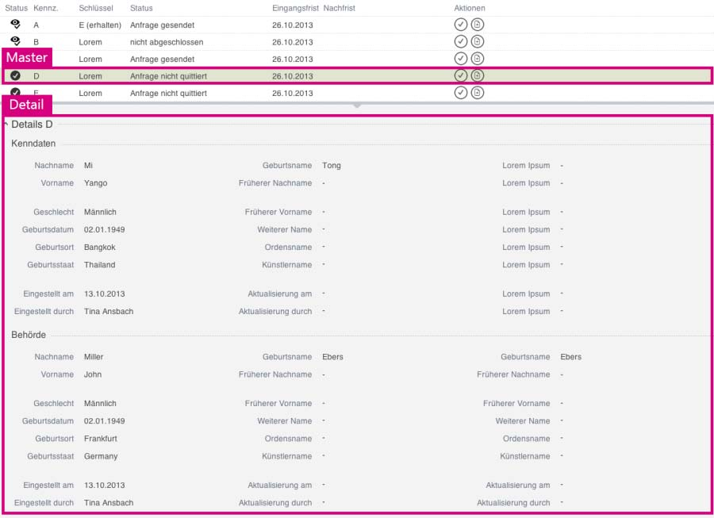

[[fig-103]]
.: Master (Tabelle) – Detail (Gruppierungs-Container)

*Ist dies das korrekte Pattern?*

__________________________________________________________________________________________________________________________________________________________________________________________________________________________________
Das Master-Detail Konzept kann genutzt werden, wenn detaillierte Informationen zu mehreren komplexen Objekten angezeigt werden sollen, ohne dass die Seite gewechselt werden muss.
__________________________________________________________________________________________________________________________________________________________________________________________________________________________________

*Richtlinien zur Anwendung*

a.  Sofern keine Ausnahmeregelung vorliegt, sollte immer initial das erste Objekt des Masters selektiert sein und die dazugehörigen Details angezeigt werden.
+
Selektiert der Benutzer ein anderes Master-Objekt so werden die entsprechenden Detaildaten angezeigt.
+
Zu einem Zeitpunkt kann immer nur ein Master-Objekt selektiert sein.
+
Das Master-Detail Konzept wird häufig mit anderen Patterns (z.B. Progressive Disclosure) oder Bedienelementen (Tabellen, Tabs) kombiniert.
+
Wird das Master-Detail Konzept auf der Detailseite benutzt, so können im Detail-Bereich weitere komplexe Objekte wie Tabellen auftreten.
Hierbei gilt zu beachten, dass aus diesen Objekten nur noch Dialoge, aber keine weiteren Unterseiten aufgerufen werden können.
+
Der Titel des Details sollte das Haupidentifikationsmerkmal des Masters wiederholen (z.B: Details von <Objektname / ID>)
+
Sollten das Master-Objekt oder dessen Details editierbar sein, erfolgt das Editieren immer über einen Dialog (siehe Kapitel Dialoge).
+
[[fig-103]]
.zeigt ein Beispiel für ein Master-Detail Konzept.

Hier stellt die Tabelle den Master dar und ein Gruppierungs-Container den Detail Bereich.
+
Redundante Informationen sollten vermieden werden.
+
Wichtige Informationen sollten im Master-Bereich und nicht ganz so wichtige Informationen im Detail-Bereich angezeigt werden.
+
Der Detail-Bereich kann sehr komplexe Daten enthalten z.B. Tabellen oder Formulare.
Für sehr komplexe Daten kann es sinnvoll sein einen Expander (Progressive Disclosure) einzusetzen.

_____________________________________________________________________________________________________________________________________________
Innerhalb des Detail-Bereiches des Master-Detail Konzepts sollten keine Tabs verwendet werden.
_____________________________________________________________________________________________________________________________________________

*Kein JavaScript*

Ohne JavaScript können die Detaildaten nur durch Klick auf einen Button oder Link angezeigt werden.
Hierfür kann zum Beispiel der Kennzeichner in einer Tabellenzeile genutzt werden (ähnlich wie beim Aufruf der Detailseite aus einer Tabelle heraus, siehe Kapitel Selektionsver halten in einer Tabelle).

*Hinweise zur Implementierung*

Die Master-Detail Ansicht kann durch die Nutzung von einfachen Elementen (Tabelle, Buttons, bedingtes Rendern (ui:fragment)) umgesetzt werden.

*Gruppierung*

Patterns zur Gruppierung von Daten

*Expander (Progressive Disclosure)*

Mit einem Expander können bestimmte Inhaltsbereiche per Mausklick dynamisch ein- und ausgeblendet werden, das zugrundeliegende Prinzip wird häufig als „Progressive Disclosure" (engl. „schrittweises Enthüllen") oder auch als Information Hiding (engl. „Ausblenden von Information") bezeichnet.
Ein Expander dient dazu die Informationskomplexität zu reduzieren.
In einem Expander können sowohl Daten als auch Bedien-Elemente oder Optionen angezeigt werden.

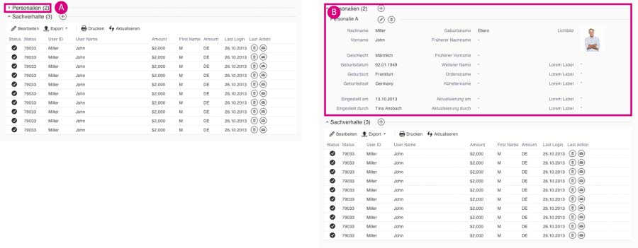

[[fig-104]]
.: Expander geschlossen und geöffnet

*Ist dies das korrekte Pattern?*

a.  Ein Expander kann genutzt werden um komplexe Inhalte zu strukturieren.
+
Komplexe Inhalte werden in logischen Gruppen zusammengefasst, die Gruppen lassen sich zur besseren Übersicht ein- (A) und ausklappen (B).
+
Wird genutzt um vertikal Platz zu sparen.

*Richtlinien zur Anwendung*

a.  Der Expander sollte eine prägnante Beschriftung erhalten.
+
Die Beschriftung ist eine gruppierende Überschrift kombiniert mit einem Icon (Pfeil nach oben / rechts).
+
Die Beschriftung bleibt im offenen und geschlossenen Zustand gleich.
+
Über das Icon und die Beschriftung kann der Expander geöffnet und geschlossen werden.
+
Das Icon deutet an, was nach einem Klick passiert und wird entsprechend nach einem Klick gewechselt, z. B.:
a.  ___________________________________________
Im geschlossenen Zustand: Pfeil nach rechts
___________________________________________
+
______________________________________
In geöffnetem Zustand: Pfeil nach oben
______________________________________
+
Es können sowohl Formulare, Tabellen, andere Daten, Bedienelemente oder Optionen entsprechend der weiteren Regeln der Seitengestaltung angezeigt werden.
+
Es können mehrere Expander gleichzeitig geöffnet sein (siehe<<fig-104>> (B) Personalien und Sachverhalte).
+
Expander nehmen immer die ihnen zur Verfügung stehende Breite ein.
Die Inhalte des Containers passen sich nur bis zu einer gewissen Größe an, und bleiben dann gleich.

*Kein JavaScript*

Ohne JavaScript werden alle Daten direkt angezeigt.
Elemente sind nicht ein- und ausklappbar.

*Hinweise zur Implementierung*

Ein Expander kann durch die Angabe von collapse="true" und der Angaben eines entsprechenden Panel Models in der Komponente <isy :panel> erzeugt werden. Über das PanelModel lässt sich auch der Initialzustand steuern.

*Gruppierungs-Container*

Gruppierungs-Container helfen dem Benutzer bei der Strukturierung und Einordnung von Informationen.

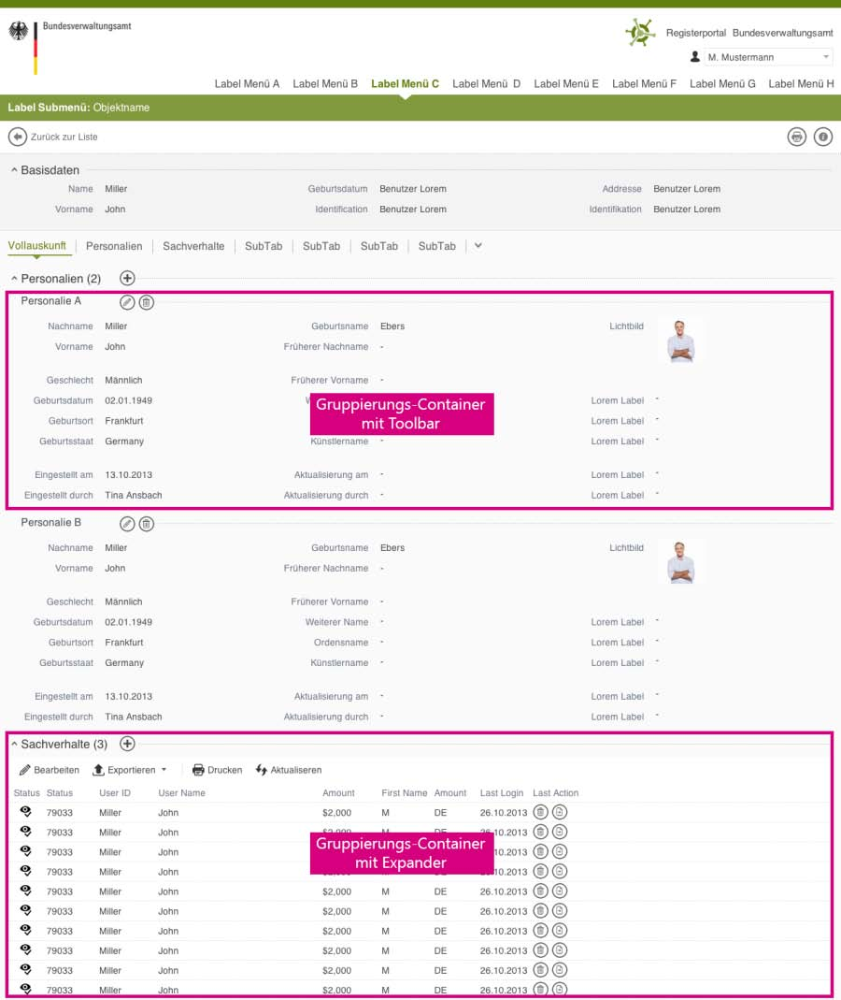

[[fig-105]]
.: Beispiele Gruppierungs-Container

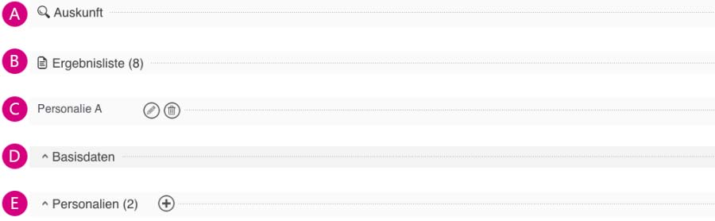

[[fig-106]]
.: Beispiele Gruppierungsüberschriften

*Ist dies das korrekte Pattern?*

1.   sollten zur Strukturierung des Inhaltes eingesetzt werden sobald umfangreiche Informationen auf einer Seite angezeigt werden müssen und diese sich zu logischen Gruppen zusammenfassen lassen.
+
 unterstützen das schnelle Erfassen von Informationen.

*Richtlinien zur Anwendung*

______________________________________________________________________________________________________________________________________________________
Gruppierungs-Container bestehen in der Regel aus eine Gruppierungsüberschrift und einem Inhaltsbereich.
______________________________________________________________________________________________________________________________________________________

a.  Die Gruppierungsüberschrift besteht aus Text und einer Trennlinie die bis zum Ende des Inhaltsbereiches führt.
Optional können Gruppierungsüberschriften Icons (vor Text) oder auch eine Toolbar beinhalten.
+
Es gibt unterschiedliche Varianten von Gruppierungsüberschriften.
Der Einsatz ist vom Inhalt des Gruppierungs-Containers abhängig.
a.  ______________________________________________________________________________________________
Die *einfache Gruppierungsüberschrift* (Abbildung 106 **A**) kann ein Icon und Text enthalten.
______________________________________________________________________________________________
+
_________________________________________________________________________________________________________________________________________________________
Eine *Gruppierungsüberschrift in Kombination mit Expander* (Progressive Disclosure) (Abbildung 106 **D + E**) wird für Gruppierungs-Container eingesetzt.
_________________________________________________________________________________________________________________________________________________________
+
________________________________________________________________________________________________________________________________________________________________________________________________________
Eine *Gruppierungsüberschrift mit Toolbar* (Abbildung 106 **C**) kommt zum Einsatz wenn die Objekte die in der Gruppe enthalten sind, bearbeitet werden können (genauere Details siehe Kapitel Toolbar).
________________________________________________________________________________________________________________________________________________________________________________________________________
+
Enthält ein Gruppierungs-Container weitere Objekte (Gruppierungen) so sollte die Anzahl der Objekte (Abbildung 106 **B**) hinter der Überschrift angezeigt werden.
Dies kann dem Benutzer den Überblick bei sehr umfangreichen Gruppierungen erleichtern.

_____________________________________________________________________________________________________________________________________________________________________________________________________________________________
Gruppierungs-Container nehmen immer die zur Verfügung stehende Breite ein.
Die Inhalte des Containers passen sich nur bis zu einer gewissen Größe an, und bleiben dann gleich.
_____________________________________________________________________________________________________________________________________________________________________________________________________________________________

*Hinweise zur Implementierung*

Durch die Angabe von <isy:panel> können entsprechene Gruppierungs-Container erstellt werden.
Das Tag hat folgende Parameter/Attribute:

____________________________________________________________________________________________________________________________________________________________________________________________________
collapse: Ob das Panel einklappbar sein soll.
Falls ja, so muss auch ein panelModel angegeben werden.

panelModel: Das Panel Model.
Das Panel Model.
Nur Notwendig falls das Panel einklappbar sein soll.
Das Panel Model sollte Teil des Seitenmodels sein.

globalConfig: Eine spezifische globale Konfiguration, falls notwendig.
____________________________________________________________________________________________________________________________________________________________________________________________________

Das Tag bietet folgende Facets:

__________________________________________________________________________________
panelHeader: Zur Angabe des Headers
__________________________________________________________________________________

__Hinweis__: Derzeit existiert noch kein vereinfachter Weg zur Angabe von Buttons/Icons im Panel.
Diese müssen also über den panelHeader eigenständig definiert werden.

Zur Gruppierung von mehreren Panels sollte das Tag <isy:panelGroup> verwendet werden.
In diesem können die anderen Panels geschachtelt werden.
Das Tag besitzt folgende Parameter:

___________________________________________________________________________________________________________________________________________________________________________________________________________
headerPanel: Ob die Gruppe als Container für den Header des Inhaltesbereichs dient.
Falls ja werden entsprechende CSS-Klassen für das Layouting eingebunden.
___________________________________________________________________________________________________________________________________________________________________________________________________________

*Toolbar*

*Allgemein*

Eine Toolbar stellt ein Set von Bedienelementen wie z. B. Buttons oder Dropdown Menüs in einer Leiste zur Verfügung.
Diese ist oberhalb eines

bestimmten Inhaltsbereichs angebracht.
Die Funktionen werden typischerweise durch ein Icon und Text repräsentiert.

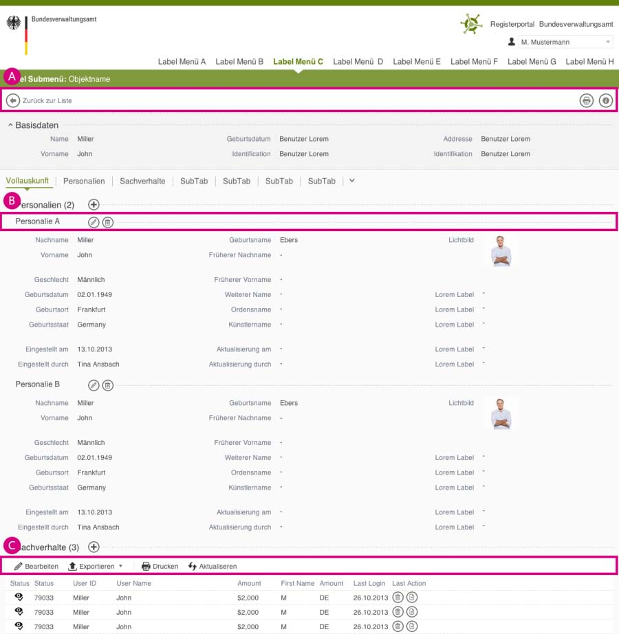

[[fig-107]]
.: Toolbar Beispiele

*Ist dies das korrekte Pattern?*

a.  Die Toolbar soll das Gefühl einer schnellen und simplen Interaktion vermitteln, daher sollten keine komplexen Funktionalitäten in der Toolbar untergebracht werden.
+
Wenn eine kleine bis mittlere Anzahl häufig verwendeter Funktionen vorhanden ist und diese sich mit intuitiven Icons abbilden lassen, können diese Funktionen in einer Toolbar gruppiert werden.
+
Im Vergleich zu einem Menü sind die Funktionen in einer Toolbar immer sichtbar und direkt erreichbar.

*Richtlinien zur Anwendung *

Mögliche Einsatzgebiete für Toolbars

Seiten-Toolbar auf Detailseite (Abbildung 107 **A**)

Toolbar in Gruppierungs-Container (Abbildung 107 **B**)

Tabellen-Toolbar (Abbildung 107 **C**)

a.  In einer Toolbar finden sich die wichtigsten oder am häufigsten genutzten Funktionen an einem zentralen Platz.
+
Bedienelemente in einer Toolbar sollten entsprechend ihrer Verfügbarkeit aktiviert oder deaktiviert werden.
+
Eine Toolbar sollte nicht mit allen zur Verfügung stehenden Bedienelementen überladen sein.
Stattdessen sollten die am häufigsten

_____________________________________________________________________________________________
benötigten Funktionen oder sehr wichtige Funktionen repräsentiert werden.

Mehrzeilige Toolbars sollten vermieden werden.
_____________________________________________________________________________________________

a.  Icons sollten nach Möglichkeit mit einer Beschriftung versehen werden.
+
Icons müssen immer über einen Tooltip verfügen – auch dann, wenn sie bereits eine Beschriftung haben.
Gibt es ein Tastaturkürzel für die entsprechende Funktion, so sollte dies im Tooltip angezeigt werden.
+
Sollte der Platz für eine Beschriftung aller Icons nicht vorhanden sein, so sollten zumindest die sehr häufig genutzten Funktionen eine Beschriftung erhalten.
Ist eine Beschriftung aus Platzgründen nicht möglich, sollten die verwendeten Icons möglichst selbsterklärend sein.
+
Die Anordnung der Elemente innerhalb einer Toolbar sollte nach deren Priorität bzw.
nach deren Nutzungsfrequenz erfolgen – häufig genutzte Funktionen links, weniger häufig genutzte Funktionen rechts.
+
Zur Strukturierung einer Toolbar können vertikale Trennlinien verwendet werden.
Diese grenzen Gruppen von zusammengehörigen Elementen voneinander ab.
+
Zusammengehörige Funktionen können aus Platzgründen in Menü Buttons zusammengefasst werden.
+
Wird die Größe des Browserfensters verändert, so wächst die Toolbar (in der Breite) mit.
Die Elemente in der Toolbar behalten ihre ursprüngliche Größe und Position bei.

*Seiten-Toolbar*

Die Seiten-Toolbar kommt auf Detailseiten von Dashboard oder Applikationen zum Einsatz.

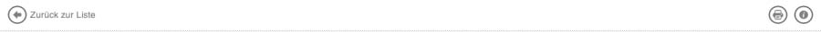

[[fig-108]]
.: Seiten-Toolbar auf Detailseite

*Richtlinien zur Anwendung*

a.  Die Seiten-Toolbar beinhaltet Funktionen, welche für die gesamte Seite gelten z.B. „Zurück zur Liste", „Seite drucken" oder „Hilfe".
+
Ganz links beinhaltet die Seiten-Toolbar immer eine Verlinkung, die zurück zur dazugehörigen Hauptseite führt.
Diese Verlinkung muss in jeder Seiten-Toolbar vorhanden sein.
+
Der Navigationslink ist eine Kombination aus Icon und Text, alle anderen Buttons sind Icon-Buttons.
+
Weitere allgemeine Richtlinien zur Toolbar siehe oben.

*Tabellen Toolbar*

Die Toolbar oberhalb einer Tabelle beinhaltet Funktionen, welche die Tabelle oder Objekte der Tabelle beeinflussen.

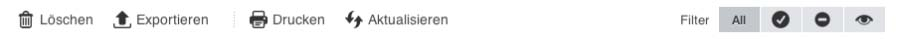

[[fig-109]]
.: Tabellen Toolbar

*Richtlinien zur Anwendung*

a.  In dieser Toolbar werden möglichst immer Toolbar-Buttons eingesetzt.
Diese stellen eine Kombination aus Icon und Text dar (siehe Kapitel Toolbar Button).
+
Diese Toolbar kann auch einen Toggle-Filter enthalten um die Ergebnisse in der Tabelle zu filtern.
Er ist immer rechts in der Toolbar ausgerichtet.
+
Alle anderen Funktionen der Toolbar werden links ausgerichtet.
+
Weitere allgemeine Richtlinien zur Toolbar siehe oben.

*Gruppierungs-Container mit Toolbar*

Auch im Zusammenhang mit Gruppierungs-Containern kann eine Toolbar eingesetzt werden.
Diese Kombination findet sich ausschließlich auf Detailseiten wieder.

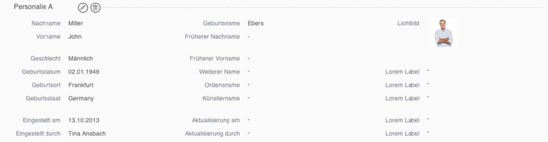

[[fig-110]]
.: Gruppierungs-Container mit Toolbar

*Richtlinien zur Anwendung*

______________________________________________________________________________________________________________________________________________________________________________________________________________________________________________________________________________________________________________________________________________________________________________________________________________________________________________________________________________________________________________________________________________________________________________________________________________________________________________________________________________________________________________________________________________________________________________________________________________________________________________________________________________________________
In dieser Toolbar werden ausschließlich Icon-Buttons eingesetzt.
Die Toolbar dient der Bearbeitung von Objekten, welche sich im Gruppierungs-Container befinden.
Die Funktionen der Toolbar beziehen sich immer auf alle Objekte und Untergruppen einer Gruppe.
Die Funktionalitäten können sich je nach Gruppentyp (siehe Kapitel Gruppierungs-Container) unterscheiden, sollten aber innerhalb eines Gruppentyps identisch sein.
So kann man beispielsweise über die Toolbar einer Hauptgruppe weitere Gruppenelemente hinzufügen, die Gruppenelemente lassen sich aber ausschließlich in der Toolbar ihrer eignen Überschrift bearbeiten (Löschen, Drucken etc.). Die Buttons werden rechts neben der Überschrift positioniert und sind immer so auszurichten, dass alle Toolbarbuttons auf einer Seite linksbündig angeordnet sind.
Weitere allgemeine Richtlinien zur Toolbar siehe oben.
______________________________________________________________________________________________________________________________________________________________________________________________________________________________________________________________________________________________________________________________________________________________________________________________________________________________________________________________________________________________________________________________________________________________________________________________________________________________________________________________________________________________________________________________________________________________________________________________________________________________________________________________________________________________

*Seiten-Toolbar*

Die Seiten-Toolbar kommt auf Detailseiten von Dashboard oder Applikationen zum Einsatz.

[[fig-108]]
.: Seiten-Toolbar auf Detailseite

*Richtlinien zur Anwendung*

______________________________________________________________________________________________________________________________________________________________________________________________________________________________________________________________________________________________________________________________________________________________________________________________________________________________________________________________________________________________________
Die Seiten-Toolbar beinhaltet Funktionen, welche für die gesamte Seite gelten z.B. „Zurück zur Liste", „Seite drucken" oder „Hilfe". Ganz links beinhaltet die Seiten-Toolbar immer eine Verlinkung, die zurück zur dazugehörigen Hauptseite führt.
Diese Verlinkung muss in jeder Seiten-Toolbar vorhanden sein.
Der Navigationslink ist eine Kombination aus Icon und Text, alle anderen Buttons sind Icon-Buttons.
Weitere Richtlinien sind bei der allgemeinen Beschreibung der Toolbar zu finden.
______________________________________________________________________________________________________________________________________________________________________________________________________________________________________________________________________________________________________________________________________________________________________________________________________________________________________________________________________________________________________

*Hinweise zur Implementierung*

Die Seitentoolbar ist Teil des BasisModel.
Auf das SeitentoolbarModel kann daher über den BasisController zuegriffen werden.
Der ApplikationseiteController und der DetailseiteController konfigurieren dieses Model entsprechend den Vorgaben automatisch.

Über die Template-Engine (ui:insert/ui:define) werden weiterhin folgende Bereiche zur Verfügung gestellt.
Konkrete Seiten können dadurch Einfluss auf das Aussehen der Seitentoolbar nehmen:

_______________________________________________________________________________________________________________________________________________________________________________________________________________________
seitentoolbarLinksButtons: Fügt Anpassungen auf der linken Seite ein.
seitentoolbarMitteButtons: Fügt Anpassungen in der Mitte (zentriert) ein.
seitentoolbarRechtsButtons: Fügt Anpassungen auf der rechten Seite ein.
_______________________________________________________________________________________________________________________________________________________________________________________________________________________

*Tabellen-Toolbar*

Die Toolbar oberhalb einer Tabelle beinhaltet Funktionen, welche die Tabelle oder Objekte der Tabelle beeinflussen.

[[fig-109]]
.: Tabellen Toolbar

*Richtlinien zur Anwendung*

a.  In dieser Toolbar werden möglichst immer Toolbar-Buttons eingesetzt.
Diese stellen eine Kombination aus Icon und Text dar (siehe Kapitel Toolbar Button).
+
Diese Toolbar kann auch einen Toggle-Filter enthalten um die Ergebnisse in der Tabelle zu filtern.
Er ist immer rechts in der Toolbar ausgerichtet.
+
Alle anderen Funktionen der Toolbar werden links ausgerichtet.
+
Weitere Richtlinien sind bei der allgemeinen Beschreibung der Toolbar zu finden.

*Hinweise zur Implementierung*

Derzeit noch nicht umgesetzt.

*Gruppierungs-Container mit Toolbar*

Auch im Zusammenhang mit Gruppierungs-Containern kann eine Toolbar eingesetzt werden.
Diese Kombination findet sich ausschließlich auf Detailseiten wieder.

[[fig-110]]
.: Gruppierungs-Container mit Toolbar

*Richtlinien zur Anwendung*

a.  In dieser Toolbar werden ausschließlich Icon-Buttons eingesetzt.
+
Die Toolbar dient der Bearbeitung von Objekten, welche sich im Gruppierungs-Container befinden.
Die Funktionen der Toolbar beziehen sich immer auf alle Objekte und Untergruppen einer Gruppe.
+
Die Funktionalitäten können sich je nach Gruppentyp (siehe Kapitel Gruppierungs-Container) unterscheiden, sollten aber innerhalb eines Gruppentyps identisch sein.
So kann man beispielsweise über die Toolbar einer Hauptgruppe weitere Gruppenelemente hinzufügen, die Gruppenelemente lassen sich aber ausschließlich in der Toolbar ihrer eignen Überschrift bearbeiten (Löschen, Drucken etc.).
+
Die Buttons werden rechts neben der Überschrift positioniert und sind immer so auszurichten, dass alle Toolbarbuttons auf einer Seite linksbündig angeordnet sind.
+
Weitere Richtlinien sind bei der allgemeinen Beschreibung der Toolbar zu finden.

*Hinweise zur Implementierung*

Derzeit noch nicht umgesetzt.

*Formulare*

_______________________________________________________________________________________________________________________________________________________________________________________________________________________________________________________________________________________________________________________________________________________________________________________
Ein gleichmäßiges und konsistentes Layout von Screens und Formularen ist essentiell, um dem Benutzer die Zugänglichkeit von Informationen zu erleichtern.
Klar strukturierte Inhalte erleichtern dem Benutzer das schnelles Scannen und Erfassen von Informationen.
Schlecht gelayoutete Screens können die Produktivität und die Zufriedenheit des Benutzers erheblich verschlechtern.
_______________________________________________________________________________________________________________________________________________________________________________________________________________________________________________________________________________________________________________________________________________________________________________________

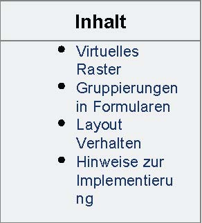

*Virtuelles Raster*

Inhalte von Formularen sollten sich an einem virtuellen, nicht sichtbaren Raster ausrichten.
Formulare können einem 1-spaltigen, 2-spaltigen oder 3-spaltigen Layout folgen.

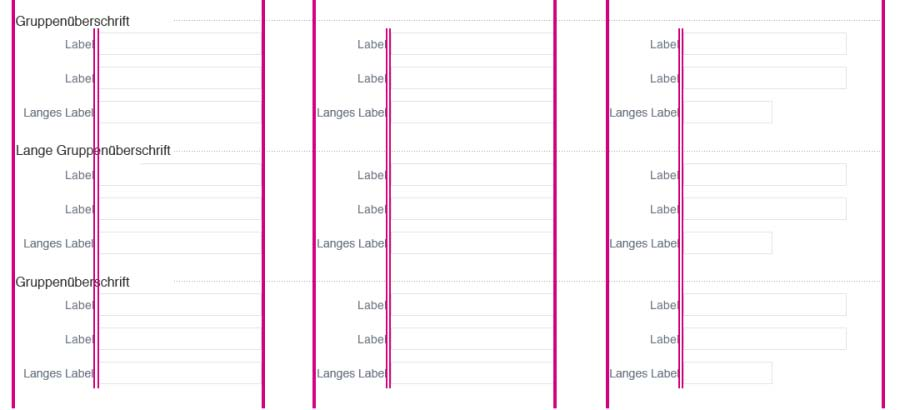

[[fig-111]]
.: Visuelles Raster für ein 3-spaltiges Formular

*Richtlinien zur Anwendung*

a.  Bei der Eingabe oder Anzeige von Inhalten sollte ein gleichmäßiges Leseraster verwendet werden, um visuelle Sprünge zu minimieren.
+
Formulare sind aus gleichmäßig breiten Spalten aufgebaut.
Es können bis zu 3 Spalten verwendet werden.
+
Labels sind immer rechtsbündig ausgerichtet und haben keinen abschließenden Doppelpunkt.
Die Nähe der Label zu den Bedienelementen erleichtert somit die Zuordnung.
+
Das längste Label in einer Spalte (gruppenübergreifend) bestimmt die Breite der Label-Spalte.
Bei sehr langen Labels sollten sinnvolle Abkürzungen verwendet werden, um die Spaltenbreiten so gering wie möglich zu halten.
+
Gleichmäßige Feld-Längen unterstützen den Lesefluss des Benutzers.
+
Die Feld-Längen sollten erwartungskonform gewählt werden.
Soll z.B. eine Postleitzahl innerhalb Deutschlands eingegeben werden, so macht es Sinn die Feld-Länge auf 5 Stellen zu begrenzen.

*Gruppierungen in Formularen*

Um komplexe Formular-Inhalte auf einem Screen zu positionieren, können Gruppierungsüberschriften und bewusste Freiflächen (Whitespace) zwischen den Elementen zum Einsatz kommen.
Dadurch ergibt sich eine logische Struktur, welche für den Benutzer einfacher zu erfassen ist.

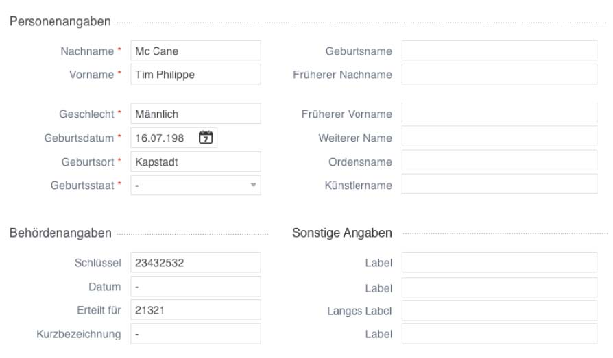

[[fig-112]]
.: Allgemeines Beispiel Formulargestaltung

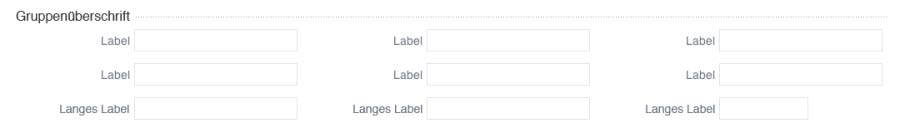

[[fig-113]]
.: Gruppierung über 3 Spalten

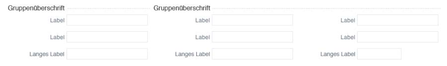

[[fig-114]]
.: Gruppierungen über 1 bzw.

2 Spalten

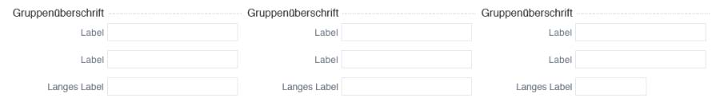

[[fig-115]]
.: Gruppierungen über 1 Spalte

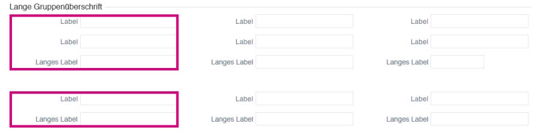

[[fig-116]]
.: Gruppierung mittels Whitespace

*Richtlinien zur Anwendung*

a.  Generell ist auf ein homogenes Formularlayout zu achten.
+
Logisch zusammengehörige Inhaltselemente werden über eine Gruppenüberschrift zusammengefasst.
+
Gruppierungsüberschriften
a.  ______________________________________________________________________________________________________
Innerhalb von Formularen können textuelle Überschriften zur Gruppierung von Inhalten verwendet werden.
______________________________________________________________________________________________________
+
______________________________________________________________________________________________________________________________________________________________________
Gruppierungsüberschriften können teilweise auch weitere Funktionen beinhalten, welche die Bearbeitung von Objekten ermöglichen (siehe Kapitel Gruppierungs-Container).
______________________________________________________________________________________________________________________________________________________________________
+
________________________________________________________________________________________________________________________________________________________________________________________________________________________________________________________________________________________________
Innerhalb eines Formulars können sich Gruppierungen über 1, 2 oder 3 Spalten (Abbildung 113,<<fig-114>>,<<fig-115>>) erstrecken.
Es sollte darauf geachtet werden, dass nicht zu viele verschiedene Layout-Kombinationen auf einer Seite vorkommen, da dies den Lesefluss erschweren kann.
________________________________________________________________________________________________________________________________________________________________________________________________________________________________________________________________________________________________
+
___________________________________________________________________________________________________________________________________________________________________________________________________________________________________________________________________________________________________
Gruppierungsüberschriften sollten mit Bedacht eingesetzt werden.
Viele Gruppen mit wenig Inhalt können zu einer unnötigen Komplexität beitragen.
In solchen Fällen sollte geprüft werden, ob eine sinnvolle Gruppierung der Elemente auch durch die Verwendung von Whitespace erreicht werden kann.
___________________________________________________________________________________________________________________________________________________________________________________________________________________________________________________________________________________________________
+
Whitespace (Abbildung 116)
+
________________________________________________________________________________________
Auch durch den Einsatz von Whitespace kann man eine Gruppierung von Elementen erreichen.
________________________________________________________________________________________
+
___________________________________________________________________________________
Dabei muss auf ausreichend Freiraum zwischen den einzelnen Gruppen geachtet werden.
___________________________________________________________________________________
+
_______________________________________________________________________________________________________________________________________________________________________________________________
Der Platzbedarf ist im Vergleich zum Einsatz von Gruppierungs-Elementen möglicherweise etwas höher.
Ein per Whitespace strukturiertes User Interface wirkt jedoch in der Regel weniger komplex.
_______________________________________________________________________________________________________________________________________________________________________________________________

*Layout Verhalten*

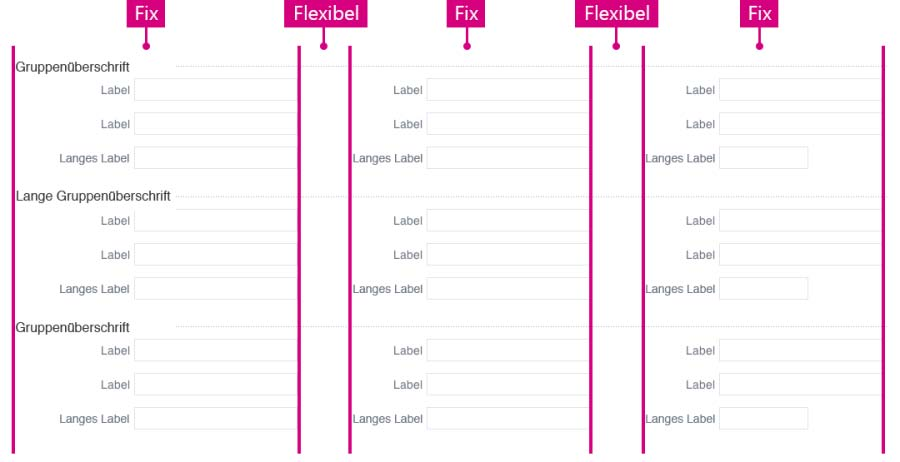

[[fig-117]]
.: Layout Verhalten von Formularen

*Richtlinien zur Anwendung*

a.  Einige Bereiche von Formularen sollten flexibel gestaltet werden.
So kann der Platz (horizontal) bei größeren Auflösungen optimal ausgenutzt werden.
+
Die Größenanpassung erfolgt innerhalb von gewissen Bereichen.
a.  __________________________________________________________________________________________________________________________
Wird das Browserfenster kleiner als der darzustellende Inhalt (i.d.R. 1024x768 px), so wird das gesamte Fenster scrollbar.
__________________________________________________________________________________________________________________________
+
__________________________________________________________________________________________________________________________________________________________________________________________________________________
Ab einer gewissen Entfernung zwischen den Elementen werden Inhalte schlecht lesbar. Überschreitet die Größe des Browserfensters eine gewisse Grenze (i.d.R. 1600x1200 px) so wächst das Formular nicht weiter mit.
__________________________________________________________________________________________________________________________________________________________________________________________________________________
+
Bei einer Größenveränderung des Browserfensters, passen sich die Abstände zwischen den Spalten des Formulars bis zu einem sinnvollen Grad an.
+
Die Spaltenbreite und die eigentlichen Formularinhalte (Eingabefelder, Labels) verändern ihre Größe nicht.
+
Der Abstand zwischen Eingabefeldern und Labels bleibt ebenfalls unverändert.
+
Der vertikale Abstand zwischen Gruppen und Formularinhalten verändert sich nicht.

*Hinweise zur Implementierung*

*Definition von Formularen*

Die Umsetzung von Formularen erfolgt mit den gängigen Bootstrap CSS Klassen.
Um ein einfaches Suchformular umzusetzen genügt z.B. folgender Code:

 
 
 <isy:formInput reference="vorname" ... /> <isy:formInput reference="nachname" .... /> 
 
 <isy:formInput reference="geburtsort" ... /> <isy:formSelectOneDropdown reference="geschlecht" ... />

 <isy:formListpicker reference="staatsangehoerigkeit" ... /> 
 
 
 ...

<isy:buttonRow alignRight="true"> <isy:button id="suchen" action="suchen" value="#\{msg_currentflow.MEL_Suchleiste_BTN_Suchen}" /> <isy:button id="suchfelderLeeren" action="suchfelderLeeren" value="#\{msg_currentflow.MEL_Suchleiste_BTN_SuchfelderLeeren}" /> </isy:buttonRow>

Durch die Angabe von form-horizontal wird der Bereich für das Formular definiert.
Mit Angabe von row row-df beginnt die Nutzung des Bootstrap Scaffoldings (row-df ist dabei eine Spezialanpassung zur Nutzung von Bootstrap unter IE8 ohne JavaScript).

*Formularkomponenten*

Neben den normalen Bedienkomponenten existieren auch Formularkomponenten (erkennbar an dem Präfix <isy:form...>). Diese Komponenten integrieren sich direkt in ein Formular.
Sie bringen ein Label sowie eine Integration in den Validierungsmechanismus mit sich.
Die einzelnen Formularkomponenten werden in den jeweiligen Kapiteln der Bedienelemente beschrieben.

(Seit 3.1.x) In den Formularen kann durch das Angeben von <isy:formDefaultButton> eine Standardbutton zur Auslösung definiert werden.
Beim Drücken auf "Enter" wird dann diese Aktion ausgeführt.
Die Funktionalität ist nur bei aktiviertem JavaScript verfügbar. 

(Seit 3.1.x) Um anwendungsspezifische Elemente in ein Formular zu integrieren, kann das Tag <isy:formCustom> verwendet werden.
Die Elemente innerhalb dieses Tags werden dann mit Label an der korrekten Stelle im Formular angezeigt (z.B. anstatt eines Eingabefelds bei Nutzung von formInput). Die Komponente unterstützt folgende Attribute:

____________________________________________________________________________________________________________________________________
reference: Die Referenz des Objekts für die Validierung

label: Der Text für das Label.

labelStyleClass: Die CSS-Klasse für das Label.
Standard: col-lg-6

inputStyleClass: Die CSS-Klasse für den Eingabebereich.
Standard: col-lg-6

breakWords: Erlaubt das Deaktivieren des Wrappings von Text innerhalb der Komponente.

globalConfig: Eine spezifische globale Konfiguration, falls benötigt
____________________________________________________________________________________________________________________________________

Die Komponente besitzt folgende Facets:

____________________________________________________________________________________________________________________________
contentRight: Der Inhalt, der rechts vom eingefügten Element angezeigt wird.
____________________________________________________________________________________________________________________________

*Benutzerhilfe & Unterstützung*

Das System sollte für den Benutzer möglichst intuitiv und einfach zu bedienen sein.
Die hier beschriebenen Möglichkeiten können den Benutzer beim Umgang mit dem System unterstützen und die Bedienung vereinfachen.

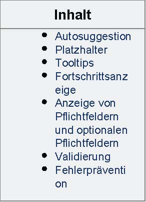

*Autosuggestion*

Autosuggestion ist eine Zusatzfunktion, um die normale Textfelder ergänzt werden können.
Sie dient dazu, Eingaben durch Vorschläge zu vervollständigen und somit zu beschleunigen.
Diese Eingabehilfe erscheint direkt unter dem Textfeld.
Sie schließt sich, wenn der Benutzer außerhalb der Eingabehilfe klickt oder innerhalb der Eingabehilfe seine Auswahl trifft.

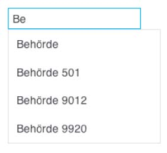

[[fig-118]]
.: Autosuggestion

Sobald der Benutzer mit der Eingabe beginnt, werden mögliche Werte, die mit der vom Benutzer gemachten Eingabe beginnen in einem Menü unterhalb des Textfelds angezeigt.
Der Benutzer kann nun weitertippen oder direkt einen Wert aus dem Menü auswählen und somit seine Eingabe verkürzen.
Gibt es mehr als 10 mögliche passende Werte, so werden die ersten 10 Werte angezeigt, gefolgt von einer Information, dass mehr als 10 Einträge existieren.

*Kein JavaScript*

Ohne JavaScript nicht vorhanden.

*Hinweise zur Implementierung*

Derzeit noch nicht umgesetzt.

*Platzhalter*

Platzhalter Texte dienen dem Benutzer als Unterstützung zur Eingabe von Daten in z.B. Eingabefeldern oder Suchfeldern.

[[fig-119]]
.: Beispiel Platzhalter für ID oder Kennzeichen

*Ist dies die korrekte Benutzerhilfe?*

_________________________________________________________________________________________________________________________________________________________________________________________________________________________________________
Platzhalter werden eingesetzt, wenn Daten in einem bestimmten Format eingegeben werden müssen (z.B. Datum, ID, Kennzeichen). Platzhalter können bei Suchfeldern eingesetzt werden, wenn unterschiedliche Attribute gesucht werden können.
_________________________________________________________________________________________________________________________________________________________________________________________________________________________________________

*Richtlinien zur Anwendung*

__________________________________________________________________________________________________________________________________________________________________________________________________________________
Sobald der Benutzer in das Eingabefeld klickt, wird der Platzhalter ausgeblendet.
Gibt der Benutzer keine Daten ein und klickt auf ein anderes Element (Fokuswechsel), dann wird der Platzhalter wieder angezeigt.
__________________________________________________________________________________________________________________________________________________________________________________________________________________

*Kein JavaScript*

Ohne JavaScript kann es bei der Anzeige von Platzhaltern in einigen Browsern kommen, wie zum Beispiel in IE8/IE9.

*Hinweise zur Implementierung*

Platzhalter können über das Attribut placeholder in den Eingabekomponenten angegeben werden.
Die Angabe von Platzhaltern ist derzeit noch nicht in allen Eingabekomponenten möglich.

*Tooltips*

Ein Tooltip ist ein kurzer Text, der zur Beschreibung einer Funktion oder eines Objekts dient.
Tooltips sind ein simples und zugleich wertvolles Werkzeug zur Benutzerführung.
Tooltips erscheinen automatisch bei Hover über ein Objekt und dienen der Informations-Anreicherung ohne zusätzlichen Platzbedarf.

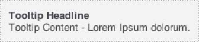

[[fig-120]]
.: Tooltip - Allgemeiner Aufbau

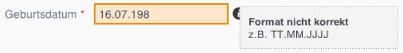

[[fig-121]]
.: Tooltip - Beispiel

*Ist dies die korrekte Benutzerhilfe?*

a.  Tooltips sind ein wichtiges Hilfsmittel und sollten daher umfangreich verwendet werden.
+
Alle Bedienelemente sollten mit einem Tooltip versehen werden.
+
Objekte wie Icons, Bilder oder Graphen sollten ebenso mit einem Tooltip ausgestattet werden.
+
Abgekürzte Texte, wie z. B. Texte in einer abgeschnittenen Tabellen-Zelle sollten in einem Tooltip vollständig angezeigt werden.

________________________________________________________________________________________________________________________
Menü-Einträge und andere selbsterklärende Elemente haben keine Tooltips.
________________________________________________________________________________________________________________________

*Richtlinien zur Anwendung*

a.  Der Name des Objekts wird nur angezeigt, wenn er relevant für das Verständnis der Funktion ist, und das Objekt nicht schon benannt ist.
+
Solange ein Tooltip lediglich das Label des entsprechenden Elements wiederholt, bietet er keinen Mehrwert.
Stattdessen sollte der Tooltip kurz und prägnant beschreiben, was ein Objekt bewirkt.
+
Ein Tooltip sollte möglichst spezifische Informationen geben, z.B. für den Button „Drucken" die Erklärung „Druckt die dargestellte Liste auf dem Standarddrucker XY aus.".
+
Wenn ein Element deaktiviert ist, sollte ein Tooltip zusätzlich erklären, warum es deaktiviert ist, z. B. „Absenden ist erst nach Ausfüllen aller Pflichteingaben möglich."

*Kein JavaScript*

Können ohne JavaScript nicht umgesetzt werden.

*Hinweise zur Implementierung*

(Seit 4.0.x) Für das einbinden eines Tooltips kann das Tag <isy:tooltip> verwendet werden.
Es besitzt folgende Parameter:

________________________________________________________________________________________________________________________
text: Der Text, der bei Hover über das Element angezeigt werden soll.

title: Eine optionale Überschrift die fett über den Text angezeigt wird.
________________________________________________________________________________________________________________________

*Fortschrittsanzeige*

Feedback-Konzepte für Ladezeiten sind ein sehr wichtiges Instrument zur Erreichung guter User Experience.
Für längere Operationen kann ein Fortschritts-Balken (Progress Bar) genutzt werden, der sich entsprechend dem Fortschritt des Vorgangs füllt.
Für kürzere Vorgänge kann ein Fortschritts-Spinner (kreisrunde Fortschrittsanzeige) verwendet werden.

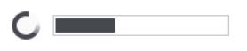

[[fig-122]]
.: Fortschritts-Spinner & Fortschritts-Balken<<fig-123>>: Beispiel: Fortschritts-Spinner in einer Objektliste

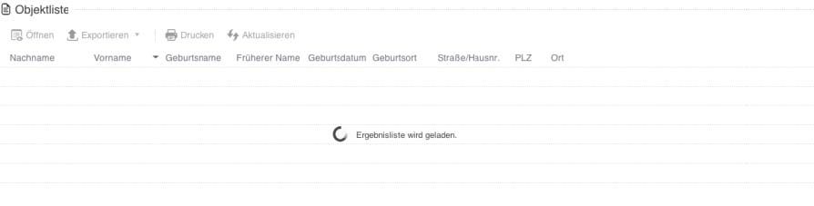

*Ist dies die korrekte Benutzerhilfe?*

a.  Generell sollten Vorgänge oder Operationen, die mehr als eine Sekunde in Anspruch nehmen, eine Rückmeldung in Form einer Fortschrittsanzeige an den Benutzer geben.
+
Die Form der Fortschrittsanzeige richtet sich dabei nach der Länge des Vorgangs und dem Anwendungskontext.
+
Fortschrittsanzeigen werden in der Regel nur für Wartezeiten verwendet, die sich aus System-Operationen ergeben.
Für Wartezeiten, die sich auf die Bedienung des Benutzers zurückführen lassen, werden keine Fortschrittsanzeigen eingesetzt.

*Richtlinien zur Anwendung*

___________________________________________________________________________________________________________________________________________________________________________________________________________________________________________________________________________________________________________________________________________________
**Fortschritts-Balken** (Progress Bar)

Fortschritts-Balken werden in der Regel für Ladevorgänge mit bestimmbarer Gesamtlänge verwendet.

Ein Balken zeigt den Grad der Zielerreichung an.
Dabei füllt sich der Balken von links (0%) nach rechts (100%).

**Fortschritts-Spinner** (kreisrunde Fortschrittsanzeige)

Fortschritts-Spinner werden für Ladevorgänge verwendet, deren Gesamtlänge unbekannt ist.

Für die Dauer der Operation dreht sich der Fortschritts-Spinner und signalisiert dem Benutzer damit, dass sich ein Prozess im Vorgang befindet.
Der Fortschritts-Spinner empfiehlt sich aufgrund seiner geringen Ausmaße insbesondere in Situationen, in denen Platzbedarf von großer Bedeutung ist.
___________________________________________________________________________________________________________________________________________________________________________________________________________________________________________________________________________________________________________________________________________________

*Kein JavaScript*

Ohne JavaScript nicht vorhanden.

*Hinweise zur Implementierung*

Derzeit noch nicht umgesetzt.

*Anzeige von Pflichtfeldern und optionalen Pflichtfeldern*

Bedienelemente, die Pflichteingaben darstellen, werden mit einem Stern (Asterisk) gekennzeichnet, der am Ende der Beschriftung hochgesetzt und mit einem Leerzeichen als Abstand angehängt wird.

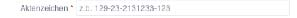

[[fig-124]]
.: Kennzeichnung Pflichtfelder (roter Stern)

[[fig-125]]
.: Kennzeichnung optionaler Pflichtfelder (blauer Stern)

Sofern nicht alle Pflichteingaben ausgefüllt sind bzw.
falls Eingaben des Benutzers nicht valide sind, kann der aktuelle Vorgang (z. B. Speichern)

nicht abgeschlossen werden.
Der Benutzer muss die fehlenden bzw.
nicht validen Eingaben korrigieren, damit die Aktion erfolgreich durchgeführt wird.

*Besonderheit: Optionale Pflichtfelder*

a.  Neben den Standardpflichtfeldern kann es auch „optionalen Pflichtfelder" geben.
+
Optionale Pflichtfelder sind immer an ein Standardpflichtfeld gekoppelt.
+
Bei optionalen Pflichtfeldern muss mindestens eine Anzahl X aus mehreren Eingabefeldern ausgefüllt werden.
+
Optionale Pflichtfelder sollten, wenn möglich immer in einer separaten Gruppe zusammengefasst werden.
Dies vereinfacht die Übersichtlichkeit.
+
Unterhalb der Gruppenüberschrift wird eine zusätzlich Hilfestellung/Information zum Ausfüllen der optionalen Pflichtfelder angezeigt.

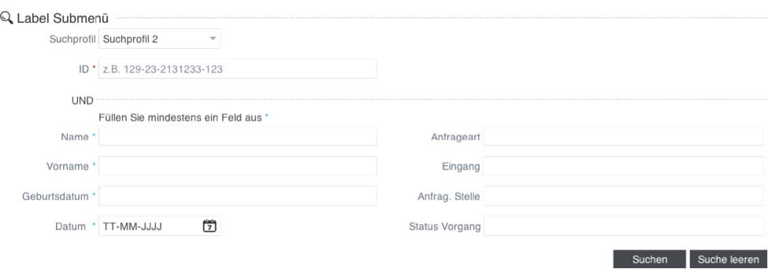

[[fig-126]]
.: Beispiel – Optionale Pflichtfelder in einem Suchformular

*Hinweise zur Implementierung*

Derzeit nur teilweise umgesetzt.
Pflichtfelder können über die Angabe des Attributs required in der entsprechenden Komponentendefinition gesetzt werden.

Eine Umsetzung für optionale Pflichtfelder fehlt derzeit.

*Validierung*

Aufgetretene Fehler sollen den Benutzer nach Möglichkeit nicht in seinem Workflow stören.
Amodales Feedback (siehe Kapitel https://wiki.accso.de/display/BVA/Allgemeine+Prinzipien#AllgemeinePrinzipien-VerwendungvonvisuellreichhaltigemundamodalemFeedback[Verwendung von]https://wiki.accso.de/display/BVA/Allgemeine+Prinzipien#AllgemeinePrinzipien-VerwendungvonvisuellreichhaltigemundamodalemFeedback[visuell reichhaltigem und amodalem Feedback]) gibt ihm die Möglichkeit ein Formular trotz aufgetretener Fehleingaben in beliebiger Reihenfolge und ohne Unterbrechung weiter zu bearbeiten.

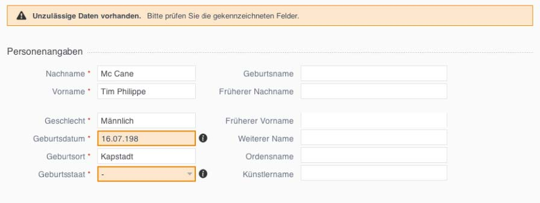

[[fig-127]]
.: Beispiel Validierung und Meldung in einem Formular Sobald durch das System ein Fehler in einem Formular erkannt wurde, wird das entsprechende Feld farblich markiert.

Zusätzlich zu der farblichen Markierung kann hinter dem Feld noch ein Informations-Icon angezeigt werden.

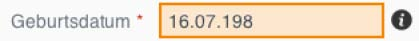

[[fig-128]]
.: Validierung eines Eingabefeldes

*Informations-Icon*

a.  Bei Hover über das Icon erscheint ein Tooltip
+
Dieser enthält weitere hilfreiche Informationen z.B. Formatierungsangaben, Zeichenbeschränkungen etc.

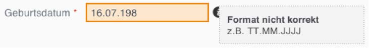

[[fig-129]]
.: Tooltip für Informations-Icon

Neben der direkten Markierung der Felder kann zusätzlich ein zusammenfassender Hinweis angezeigt werden.
Dies geschieht in einem festgeschriebenen Meldungsbereich oberhalb des Formulars.

*Meldungsarten*

a.  Hinweis
+
Warnung
+
Erfolg
+
Fehler

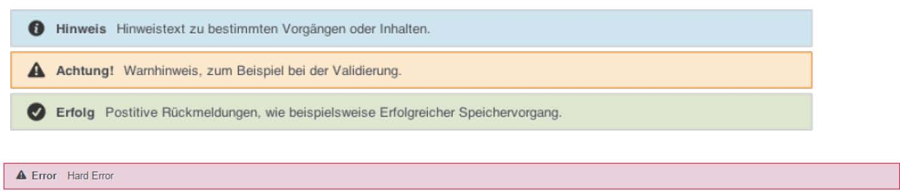

[[fig-130]]
.: Meldungsarten

*Kein JavaScript*

Ohne JavaScript können die Hinweise zu den Fehlermeldungen nicht über das Informationsicon dargestellt werden, da Tooltips nicht unterstützt werden.

a.  Die Informationen zu den fehlerhaften Feldern werden oberhalb des Formulars im allgemeinen Hinweis-Bereich dargestellt.
+
Das Informationsicon wird nicht angezeigt.
+
Um die Zuordnung zu den fehlerhaften Eingaben zu vereinfachen, sollte im Text das entsprechende Label mit angezeigt werden.

___________________________________________________________________________________________________________
Beispiel: „Geburtsdatum: Format nicht korrekt z.B. TT.MM.JJ"
___________________________________________________________________________________________________________

*Hinweise zur Implementierung*

_Nachrichten_

Der MessageController erlaubt es, Nachrichten auszugeben.
Folgende Methoden für Hinweismeldungen, Erfolgsmeldungen, Warnmeldungen und Fehlermeldungen werden angeboten:

a.  void writeInfoMessage(String information)
+
void writeSuccessMessage(String success)
+
void writeWarnMessage(String warning, String summary)
+
void writeErrorMessage(String error, String summary)

Weiterhin können die aktuell vorhandenen Meldungen ausgelesen werden:

1.   getCurrentInfoMessages()
+
 getCurrentSuccessMessages()
+
 getCurrentWarnMessages()
+
 getCurrentErrorMessages()

Nachrichten werden über das Tag <isy:messages> im Basis-Layout gerendert.
Dies geschieht automatisch und ohne weiteres zutun.

_Validierung_

Mit dem ValidierungController können Validierungsmeldungen hinzugefügt werden, indem folgende Methode aufgerufen wird:

_________________________________________________________________________________________________________________________
void processValidationMessages(List<ValidationMessage> validationMessages)
_________________________________________________________________________________________________________________________

Eine einzelne Validierungsmeldung besteht dabei aus folgenden Attributen:

_____________________________________________________________________________________________________________________________
code: Der (Fehler)Code der Nachricht (z. B. "XYZ")

reference: Die Referenz auf den Fehler ( z. B. "person.geburtsdatum")

readableReference: Die lesbare Darstellung der Referenz (z. B. "Geburtsdatum")

message: Die Fehlernachricht
_____________________________________________________________________________________________________________________________

Validierungsmeldungen werden nur für den aktuellen Aufruf (FlashScope) angezeigt.
Wenn JavaScript nicht aktiviert ist, werden alle Validierungsfehler in einer Liste angzeigt.
Auf den Tooltip wird verzichtet.
Für die Zuordnung von Validierungsfehler und Eingabefeld wird das Attribut reference verwendet, welches auch in der entsprechenden Formularkomponente <isy:form...> angegeben werden muss.

Für den Einsatz mit der plis-validation (Bean Validation) wird bereits ein GuiValidator mitgeliefert, welcher direkt ValidationMessages liefert.
Diese können dann dem ValidationController übergeben werden.
Als Referenz wird dabei automatisch der Property-Path der ConstraintViolation verwendet.

*Fehlerprävention*

Neben der adäquaten Behandlung von Ausnahmen und Fehlern ist die Vermeidung von Fehlern ein sehr wichtiges Designprinzip.
Ein gutes Design ist darauf ausgerichtet, Fehler möglichst nicht auftreten zu lassen.
Folgende Richtlinien dienen als Grundlage zur Fehlerprävention.

*Richtlinien*

a.  Verwendung von Bedienelementen, die im Kontext jeweils nur valide Werte liefern oder akzeptieren.
So liefern z.B. Radiobutton, Checkboxen oder Auswahllisten vordefinierte Werte, die nicht weiter validiert werden müssen.
Ein Eingabefeld ohne Eingabebeschränkung hingegen kann im Zweifelsfall Fehleingaben provozieren.
+
Falls möglich, werden verschiedene Eingabeformate akzeptiert.
Beispiel: Bei der Eingabe eines Datums können sowohl Trennstriche als auch Punkte als Trennelement akzeptiert werden.
+
Falls möglich, werden sinnvolle Voreinstellungen und Default-Werte vergeben.
+
Funktionen und Bedienelemente, die temporär nicht verfügbar sind, werden deaktiviert.

*Benutzereingaben*

*Tastatur*

Alle Bedienelemente und Funktionen sollten auch ohne Maus bedienbar sein.
Neben der Eingabe von Zeichen wird die Tastatur auch zur Navigation sowie zur Ausführung häufig genutzter Aktionen

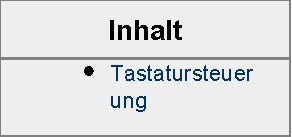

genutzt.

*Richtlinien*

a.  Um die Richtlinien der BITV zu erfüllen, müssen alle Funktionalitäten der Applikation über eine Tastaturschnittstelle zugänglich und bedienbar sein.
+
Die Standardfunktionen und Tastaturkürzel vom Browser sollten nicht unterbunden oder anderweitig belegt werden.
+
Die Tabulator-Reihenfolge, also die Reihenfolge in welcher der Fokus mit Hilfe der Tabulator-Taste verschoben werden kann, sollte an die Bedürfnisse des Benutzers angepasst werden.
In der Regel bedeutet dies, ein Ablauf von links nach rechts und von oben nach unten.
Insbesondere bei webbasierten Applikationen ist die

_________________________________________________________________________________________________________________________________________
Tabulator-Reihenfolge zu überprüfen, da es hier aufgrund von Layout-Mechanismen zu ungünstigen Abfolgen kommen kann.

Initial sollte immer das am häufigsten genutzte Element fokussiert werden.
Beispielsweise

sollte der Cursor sich bei Eingabefeldern im ersten Textfeld befinden.
_________________________________________________________________________________________________________________________________________

a.  Die Standardfunktionen von Tasten sollte nicht verändert werden.
+
Das Drücken der Enter-Taste sollte beispielsweise den Standard-Bestätigungsbutton eines Screens auslösen.

___________________________________________________________________________________________________________________________________________________________________________________________________________________________________________________________________________________________________________________________________________
Weitere Details zur Tastatursteuerung finden sich um Unterkapitel Tastatursteuerung.

*Maus*

Die Maus dient zur Bedienung von einzelnen Bereichen, Objekten und Formularen.
Um ein Objekt

(z. B. in einer Liste) auszuwählen, wird es mit der linken Maustaste einmal angeklickt.
Ein Doppelklick auf ein Objekt führt eine dem Objekt zugewiesene Standardfunktion aus.
In der Regel ist dies das Öffnen bzw.
Bearbeiten des Objekts.
Klicken mit der rechten Maustaste auf ein Objekt öffnet das Standard-Kontextmenü des Browsers.

*Formate*

*Richtlinien*
___________________________________________________________________________________________________________________________________________________________________________________________________________________________________________________________________________________________________________________________________________

a.  Für manche Eingabefelder ist es sinnvoll gewisse Formate vorzudefinieren.
+
Gibt der Benutzer ein Format oder eine Abkürzung ein, welche nicht dem Default-Format entspricht, so sollte das Eingabefeld zurück zum Default formatiert werden.
Die Formatierung erfolgt, wenn das Feld verlassen oder die _Enter_ Taste gedrückt wird.
+
Abkürzungen (z.B. „heute" bei einem Datumsfeld) werden immer sichtbar dargestellt.
+
Der Benutzer sollte nicht gezwungen werden Separatoren einzugeben.
Das System sollte das richtige Format automatisch zu erkennen.
+
Eingabe freier Werte
a.  __________________________________________________________________________________________________________________________________________________________________________________________________________________
Bei der Eingabe freier Werte, sollten beide Separatoren „." und „," akzeptiert werden.
Allerdings sollte das dargestellte Format nur mit „." Angezeigt werden, wenn das Feld verlassen wird oder gespeichert wird.
__________________________________________________________________________________________________________________________________________________________________________________________________________________
+
___________________________________________________________________________
Datumsformate werden wie folgt dargestellt: „TT.MM.JJJJ" (z.B. 25.03.2014).
___________________________________________________________________________
+
____________________________________________________________________
Alle Zeiten haben ein 24 Stunden Format: „HH:MM:SS" (z.B. 14:10:46).
____________________________________________________________________
+
____________________________________________________________________________________________________________________________________________________________________________________________________________________________________
Wenn der Benutzer beispielsweise in einem deutschsprachigen System „1000.00" eingibt, formatiert das System diese Eingabe in „1000,00" um oder wenn der Benutzer „25032014" eingibt, wird dieses Format in „25.03.2014" umgewandelt.
____________________________________________________________________________________________________________________________________________________________________________________________________________________________________
+
Unabhängig von den System Einstellungen, können für Datumsangaben Separatoren, Punkte, Schrägstriche „/" und Striche „-" eingegeben werden.

*Tastatursteuerung*

Diese Seite beschreibt Konzepte und Vorgaben zur Tastatursteuerung.

*Allgemeine Steuerung*

_*Tabulatorsteuerung*_

Für die Elemente des Inhaltsbereichs werden Tabulatorpositionen definiert.
Folgende Elemente des Inhaltsbereichs können durch Tabulatorpositionen erreicht werden:

Eingabefeld

Button (alle Arten)

a.  Dropdown
+
Paginierungselemente
+
Checkbox
+
Radio Button
+
Panel
+
Hyperlink
+
Text Box
+
List Picker
+
Buttons für Sortierung in der Trefferliste
+
Inner Tabs

In Formularen wird initial das erste Element aus dem Inhaltsbereich (links oben) fokussiert, das für Eingaben genutzt werden kann.
Der Ablauf der Tabulatoren erfolgt von links nach rechts und oben nach unten.
In der folgenden Abbildung wird beispielhaft der Ablauf der Tabulatorreihenfolge dargestellt:

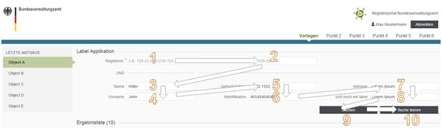

_*Seitenbereiche*_

*Header Bereich*

Die Hauptnavigation kann über den Shortcut Alt+Shift+M erreicht werden.
Initial wird das erste Hauptnavigationselement links fokussiert.
Mittels Tabulator kann zwischen den Hauptnavigationselementen navigiert werden.
Submenüs werden mit den Pfeiltasten (Pfeil oben und Pfeil unten) erreicht.
Mit der Taste Enter kann der selektierte Menüpunkt geöffnet werden.
Mit der Taste Escape wird der Header-Bereich wieder verlassen.
Das zuletzt fokussierte Element des Inhaltsbereichs ist dann fokussiert.

*Linksnavigation*

Die Linksnavigation kann über den Shortcut Alt+Shift+L erreicht werden.
Initial wird der oberste Menüpunkt fokussiert.
Mittels Tabulator kann zwischen den angezeigten Elementen navigiert werden.
Mit der Taste Enter wird die Aktion des fokussierten Elementes ausgelöst.
Mit der Taste Escape wird die Linksnavigation wieder verlassen.
Das zuletzt fokussierte Element des Inhaltsbereichs ist dann fokussiert.

*Seitentoolbar*

Die Seitentoolbar kann über den Shortcut Alt+Shift+S erreicht werden.
Initial wird das erste Element links fokussiert.
Mittels Tabulator kann zwischen den angezeigten Elementen navigiert werden.
Mit der Taste Enter wird die Aktion des fokussierten Elementes ausgelöst.
Mit der Taste Escape wird die Seitentoolbar wieder verlassen.
Das zuletzt fokussierte Element des Inhaltsbereichs ist dann fokussiert.

_*Shortcuts für Aktionen*_

Für bestimmte Aktionen werden Shortcuts definiert, die anwendungsübergreifend verwendet werden sollen.
Es handelt sich dabei nur um Aktionen, die vom Anwender in der Anwendung auch ohne Tastatursteuerung durchführbar sind.

Wenn in Seiten mehrere Datensätze angezeigt werden, dann gelten die folgenden Vorgaben zur Tastatursteuerung:

a.  Anzeige des ersten Datensatzes: Dies soll über den Shortcut Alt+Shift+X erreicht werden.
+
Anzeige des nächsten Datensatzes: Dies soll über den Shortcut Alt+Shift+X erreicht werden.
+
Anzeige des vorherigen Datensatzes: Dies soll über den Shortcut Alt+Shift+X erreicht werden.
+
Anzeige des letzten Datensatzes: Dies soll über den Shortcut Alt+Shift+X erreicht werden.
+
Speichern des aktuellen Datensatzes: Dies soll über den Shortcut Alt+Shift+X erreicht werden.
+
Löschen des aktuellen Datensatzes: Dies soll über den Shortcut Alt+Shift+X erreicht werden.
+
Bearbeiten des aktuellen Datensatzes: Dies soll über den Shortcut Alt+Shift+X erreicht werden.

Weiterhin gelten die folgenden Vorgaben:

_________________________________________________________________________________________________________________________________
Öffnen der Druckansicht: Dies soll über den Shortcut Alt+Shift+X erreicht werden.
_________________________________________________________________________________________________________________________________

Die konkreten Shortcuts müssen noch definiert werden.

*Tastatursteuerung und Fokussierung einzelner Widgets*

_*Panel*_

Ein fokussiertes Panel wird über die Taste Enter aufgeklappt oder zugeklappt.

_*List Picker*_

Ein fokussierter List Picker kann per Alt+Pfeil nach unten aufgeklappt werden und per Escape-Taste wieder geschlossen werden.
Dargestellte Elemente des List Pickers können mit den Pfeiltasten selektiert und mit der Enter-Taste ausgewählt werden.
Nach dem Auswählen durch Enter ist das eigentliche Eingabefeld selektiert.

_*Dropdown*_

Die Liste eines fokussierten Dropdown Steuerelementes kann per Pfeil nach unten aufgeklappt werden.
Die Elemente der Liste werden mit den Pfeiltasten durchlaufen und per Enter selektiert.

Das Dropdown Steuerelement nutzt ein externes Plug-In.

_*Inner Tabs*_

Ein fokussierter Inner Tab kann per Enter-Taste geöffnet werden.

_*Date Picker*_

Der Datepicker kann nicht per Tastatursteuerung bedient werden.

Der Datepicker nutzt ein externes Plug-In.

_*Buchstaben Picker*_

Ein fokussierter Buchstaben Picker kann per Alt+Pfeil nach unten geöffnet werden und per Escape-Taste wieder geschlossen werden.
Dargestellte Elemente des Buchstaben Pickers können mit den Pfeiltasten selektiert und mit der Taste Enter in das zugehörige Eingabefeld an der aktuellen Cursorposition übernommen werden.
Bis zum Schließen des Buchstaben Pickers erlaubt dieser die Auswahl weiterer Zeichen.

*UI Text und Grafiken Generelle Verwendung von Text*

_____________________________________________________________________________________________________________________________________________________________________________________________________________________________________________________________________________________________________________________________________________________________________________________
Die Bedeutung von Text und Bezeichnungen in Software darf nicht unterschätzt werden.
Große Teile eines User-Interface beruhen auf textuellen Informationen, wie z.B. der Beschriftung von Bedienelementen.
Die fehlerhafte Anwendung von Texten kann somit direkt zu einer Reduzierung der Usability des entsprechenden User-Interface führen.
Häufig auftretende Probleme sind z.B.:
_____________________________________________________________________________________________________________________________________________________________________________________________________________________________________________________________________________________________________________________________________________________________________________________

a.  Inkonsistente Terminologie.
+
Inkonsistente Groß- und Kleinschreibung.
+
Zu lange Texte.
+
Redundante Textinformationen.
+
Technischer Jargon statt der Sprache des Benutzers.

_____________________________________________________________________________________________________________________________________________________________________________________________________________________________________________________________________________________________________________________________________________________________________________________________________________________________________________________________________________________________________________________________________________________________________________________________________________________________________________________________________________________________________________________________________________________________________________
Um benutzerfreundliche User-Interface-Texte verfassen zu können, muss man sich zunächst mit der Art und Weise vertraut machen, wie Benutzer Texte auffassen und verarbeiten.
In westlichen Kulturen wird in der Regel von links nach rechts und von oben nach unten gelesen.
In Bezug auf Software und User-Interface Design kann auf diese Tatsache jedoch nur eingeschränkt zurückgegriffen werden, denn tatsächlich lesen Benutzer die Texte auf einem Screen nicht, vielmehr wird dieser nach relevanten Informationen gescannt.
Verschiedenartige Informationen rufen dabei unterschiedliche Aufmerksamkeitsstufen hervor.
So werden Schaltflächen, Labels und andere interaktive Elemente gewöhnlich zuerst gescannt, während statischer Text eher selten gelesen wird.
_____________________________________________________________________________________________________________________________________________________________________________________________________________________________________________________________________________________________________________________________________________________________________________________________________________________________________________________________________________________________________________________________________________________________________________________________________________________________________________________________________________________________________________________________________________________________________________

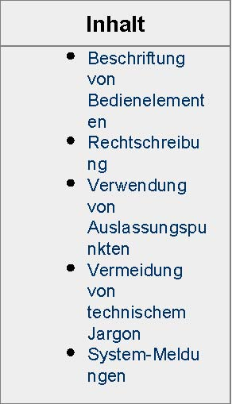

________________________
*Allgemeine Richtlinien*
________________________

a.  Die Sprache des Benutzers sprechen, niemals technischen Jargon verwenden.
+
Vermeiden von zu langen Textblöcken.
+
Einsatz von Überschriften und anderen Gliederungs-Elementen zur Strukturierung und besseren Übersicht.
+
Vermeiden von redundanten Informationen.
+
Fettschrift muss mit Bedacht verwendet werden, z.B. für Text, der gelesen werden **muss**.
+
Fließtexte dürfen nicht komplett groß geschrieben werden.
+
Unterstrichener Text darf nur für Hyperlinks benutzt werden.
+
Fachterminologie muss entsprechend konsistent verwendet werden.
+
Konsistente Verwendung von Groß- und Kleinschreibung.

___________________________________________________________________________________________________________________________________________________________________________________________________
*Verwendung von Grafiken*

Bei der Verwendung von Grafiken (Schematische Darstellungen oder Photographien) und Icons ist darauf zu achten, dass diese in Größe, Stil und Farbschema mit den restlichen Inhalten harmonisieren.

*Richtlinien*

Sollten sich harmonisch in das Gesamtlayout einfügen.
___________________________________________________________________________________________________________________________________________________________________________________________________

a.  Grafiken können zur Unterstützung bestimmter Aussagen oder Funktionen dienen.
+
Grafiken sollten sich wie die anderen Inhalte an dem optischen Raster ausrichten.
+
Um die Barrierefreiheit von Webanwendungen zu unterstützen, sollten Grafiken im Quellcode immer mit einem alternativen Text (Beschreibung) hinterlegt sein.
So können die Inhalte auch für alternative Ausgabegeräte zugänglich gemacht werden.

*Beschriftung von Bedienelementen*

Grundsätzlich werden alle Bedienelemente mit einem Label versehen, Ausnahmen sind z.B. Schaltflächen, die nur mit einem Icon versehen sind.
Das Label muss prägnant und leicht zu verstehen sein.
Weitere Hinweise und Richtlinien sind im Kapitel Label bei den Bedienelementen nachzul esen.

*Rechtschreibung*

Zu einem klaren, professionellen Gesamterscheinungsbild trägt auch eine korrekte Rechtschreibung sowie eine konsistente Groß- und Kleinschreibung bei.
Während für englischsprachige User-Interfaces zwischen verschiedenen Formen der Groß- und Kleinschreibung unterschieden wird, muss für deutschsprachige Applikationen lediglich die korrekte deutsche Rechtschreibung angewendet werden.
Eine Ausnahme besteht darin, dass das erste Wort der Beschriftung eines Bedienelements immer groß geschrieben wird, unabhängig von der jeweiligen Wortart.
Zudem werden keine vollständig korrekten Sätze gebildet und nicht mit einem Satzzeichen abgeschlossen.
Beispiele zur Benennung von Schaltflächen

a.  Kopieren
+
Speichern
+
Als Vorlage speichern

*Verwendung von Auslassungspunkten*

Auslassungspunkte („...") können eingesetzt werden, um deutlich zu machen, dass mehr Text vorhanden ist, als aus Platzgründen aktuell angezeigt werden kann.

*Richtlinien*

Auslassungspunkte können an zwei Positionen eingefügt werden:

a.  _______________________________________________________________________________________________________________________________
In der Mitte des Textes, wenn die Bedeutung von Anfang und Ende voraussichtlich wichtiger ist als der mittlere Teil des Textes.
_______________________________________________________________________________________________________________________________
+
__________________________________________________________________________________________
Am Ende des Textes, wenn der Anfang des Textes voraussichtlich wichtiger ist als das Ende.
__________________________________________________________________________________________

a.  Texte mit Auslassungspunkten sollten immer einen Tooltip erhalten, der den gesamten Text anzeigt.

*Vermeidung von technischem Jargon*

Text muss immer in der Sprache des Benutzers verfasst werden.
Im Folgenden werden einige Beispiele für technische Begriffe und ihre entsprechende Übersetzung in eine allgemein verständliche Sprache aufgezeigt.

_____________________________________________________________________________
Technischer Begriff Benutzer-Begriff

Dirty State

image:images/image273.jpeg[image]Nicht gespeicherte Änderungen

Mouse-up-Event

Maus-Klick

image:images/image276.jpeg[image]Reboot

image:images/image277.jpeg[image]Neustart

String-Länge

Anzahl der Zeichen

Datagrid

Tabelle
_____________________________________________________________________________

*System-Meldungen*

Beim Verfassen von System-Benachrichtigungen – wie z.B. Fehlermeldungen – muss auf eine verständliche und konsistente Formulierung geachtet werden.
Ein häufig auftretendes Problem ist dabei die Verwendung von negativ anmutenden Formulierungen, die den Benutzer demotivieren können.
Die folgende Liste zeigt einige negative Bezeichnungen und ihre neutralen Äquivalente:

_____________________________________________________________________________________________
Negativer Begriff

Illegal

Fehler, Fehlfunktion

Fehlschlagen („Speichern ist fehlgeschlagen")
_____________________________________________________________________________________________

*Richtlinien*

Neutraler Begriff

a.  Nicht korrekt
+
Problem
+
Nicht können („Es konnte nicht gespeichert werden")

a.  Vermeidung von redundanten Informationen
+
Vermeidung von mehrdeutigen Beschreibungen
+
Verwenden einer einfachen und konsistenten Satzstruktur
+
Nicht allein das Problem schildern, sondern auch eine mögliche Lösung formulieren.
+
Präzise Formulierungen
+
Inkorrekt: „Nichts selektiert"
+
Besser: „Bitte selektieren Sie ein Objekt in der Liste"
+
Positive Formulierungen

___________________________________________________________________________________________________________________________________
image:images/image67.jpeg[image]Positiver Tonfall (als würde man zu einem Freund sprechen)

Inkorrekt: „Illegale String-Länge aufgetreten."

Besser: „Es wurden zu viele Zeichen eingegeben.
Es sind maximal 20 Zeichen möglich."

Allgemeinverständliche, positive Sprache

Inkorrekt: „Soll das Objekt gelöscht werden?"

image:images/image67.jpeg[image]Besser: „Wollen Sie das gewählte Objekt XY löschen?"
___________________________________________________________________________________________________________________________________

*Visuelles Design*

__________________________________________________________________________________
Im Folgenden werden , und Schriften definiert, die für das Visuelle Design genutzt

Farben Icons

werden sollten.
__________________________________________________________________________________

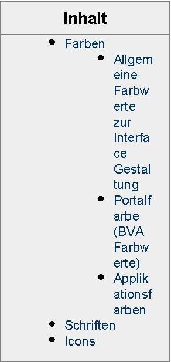

*Farben*

Farben sind wichtige Komponenten eines User Interface, die weit mehr darstellen als reine Ästhetik.
Sie kommunizieren als Teil der visuellen Sprache des User Interface.

*Allgemeine Richtlinien*

a.  Für das vorliegende User Interface werden hauptsächlich neutrale Weiß- und Grautöne verwendet.
Generell sollten nicht zu viele verschiedene Grundfarben für die Gestaltung eines User Interface benutzt werden.
+
Werden Farben zur Codierung von Informationen genutzt, sollte eine redundante Form der Codierung angeboten werden, wie z.B. unterschiedliche Formen oder Icons oder eine zusätzliche textuelle Beschreibung.
+
Beziehungen zwischen verwandten Objekten können durch die Verwendung der gleichen Farbe verdeutlicht werden.
+
Warnfarben wie rot, orange und gelb sollten für die Anzeige von Warnungen und Fehlern reserviert bleiben.
+
Stark gesättigte Farben sollten vermieden werden.
+
Eine übermäßige Verwendung von Komplementärfarben sollte vermieden werden.
Komplementärfarben der Primärfarbe eignen sich jedoch sehr gut als Aufmerksamkeits-Trigger für einen bestimmten Bereich des User Interface.
+
**Ausreichend hoher Kontrast**
a.  _______________________________________________________________________________________________________________________________
Bei der Verwendung von Farben sollte immer ein ausreichend hoher Kontrast von Vorder- zu Hintergrundfarbe gewährleistet werden.
_______________________________________________________________________________________________________________________________
+
________________________________________________________________________________________________________________________________________________________________________________________________________________________________________________________________________________________________________________________________________________
Die Web Accessibility Initiative (WAI), die Teil des World Wide Web Consortium (W3C) ist, hat die Web Content Accessibility Guidelines (WCAG) entwickelt, die unter anderem Referenzwerte für den Kontrast von Vorder- zu Hintergrundfarbe beinhalten.
So beschreiben die WCAG verschiedene Kontrastverhältnisse, abhängig von der Schriftgröße.
________________________________________________________________________________________________________________________________________________________________________________________________________________________________________________________________________________________________________________________________________________
+
________________________________________________________________________________________________________________
Die folgenden Links verweisen auf Hilfsmittel zur Kontrast-Analyse, die auf den Referenzwerten der WAI basieren:
________________________________________________________________________________________________________________
+
________________________________________________________________________________________________________________________________________________
Online-Werkzeug zur Kontrast-Analyse: http://juicystudio.com/services/luminositycontrastratio.php
________________________________________________________________________________________________________________________________________________
+
___________________________________________________________________________________________________________________________________________________________________________________________________________________________________________________________________________________________________________________________________
image:images/image175.jpeg[image]Colour Contrast Analyser: Freeware für Windows und Mac OS X: http://www.paciellogroup.com/resources/contrast-analyser.html#download[http://www.paciellogroup.com/resources/contrast-anal]http://www.paciellogroup.com/resources/contrast-analyser.html#download[yser.html#download]
___________________________________________________________________________________________________________________________________________________________________________________________________________________________________________________________________________________________________________________________________
+
**Berücksichtigung von Farbenfehlsichtigkeit**
+
______________________________________________________________________________________________________________
Bei der Auswahl der Farben sollte auch eine mögliche Farbenfehlsichtigkeit der Benutzer berücksichtigt werden.
______________________________________________________________________________________________________________
+
Etwa 8-9 % aller Männer sowie eine geringe Anzahl Frauen leiden unter einer Form von Farbenfehlsichtigkeit, häufig als Farbenblindheit bezeichnet.
Folgende Formen der Farbenfehlsichtigkeit werden unterschieden:
+
Rot-Grün-Sehschwäche (Fachbegriffe: Protanopie, Deuteranopie)
+
Blau-Gelb-Sehschwäche (Fachbegriff: Tritanopie)
+
________________________________________________________________________________________________________________________________________________________________________________________________________________________________________________________________________________________________________
Die Rot-Grün-Sehschwäche ist die am weitesten verbreitete Form der Farbenfehlsichtigkeit während die Blau-Gelb-Sehschwäche eher selten auftritt.
Menschen, die unter einer Sehschwäche leiden, nehmen die entsprechenden Farben nicht differenziert wahr, sondern lediglich unterschiedliche Graustufen.
________________________________________________________________________________________________________________________________________________________________________________________________________________________________________________________________________________________________________
+
_________________________________________________________________________________________________________________________________________________________
Auf der Webseite http://www.vischeck.com/finden sich hilfreiche Tools und Downloads, um die verschiedenen Formen der Farbenfehlsichtigkeit zu simulieren.
_________________________________________________________________________________________________________________________________________________________

*Richtlinien der Bundesregierung*

a.  Von Seiten der Bundesregierung wurden bereits zahlreiche Farben definiert.
Bei der Auswahl neuer Farben kann auf diese zurückgegriffen werden.
+
Dieser Styleguide orientiert sich an diesen Definitionen und verwendet hauptsächlich diese Farben.
+
Farbdefinitionen der Bundesregierung können hier nachgelesen werden: http://styleguide.bundesregierung.de/Webs/SG/DE/OnlineMedien/Webanwendung/Basiselemente/Farben/farben_node.html?__site=SG[http://styleguide.bundesregierung.de/Webs/SG/DE/OnlineMedie]http://styleguide.bundesregierung.de/Webs/SG/DE/OnlineMedien/Webanwendung/Basiselemente/Farben/farben_node.html?__site=SG[.]

*Allgemeine Farbwerte zur Interface Gestaltung*

Diese Farben werden für die generelle Gestaltung der Applikation verwendet.

_____
Farbe
_____

_____________
Grau A Grau B
_____________

_______________________________________________________________________________________________________________________
Grau 80 Grau 60 Grau 40 Grau 20 Hintergrundfarbe A Hintergrundfarbe B Orange 100 Orange 20 Hellblau 100 Blau 20 Grün 20
_______________________________________________________________________________________________________________________

*Portalfarbe (BVA Farbwerte)*

RGB hexadezimal #231F20 #45484D #B8B8B8 #EDEDED #6B7581 #89909A #A6ACB3 #C4C8CD #E1E3E6 #F3F3F3 #FAFAFA #F28502 #FCE7CC #00B8F2 #CDE4ED #E0E5CF RGB dezimal 35, 32, 31 69, 72, 77184, 184, 184237, 237, 237 107, 117, 129137, 144, 154166, 172, 179196, 200, 205225, 227, 230243, 243, 243250, 250, 250242, 133, 2252, 231, 2040, 184, 242205, 228, 237224, 229, 207

Die Farbe des Applikationsportals kann der Wiedererkennung einer Behörde dienen.
In diesem Fall sind es spezielle Grüntöne die das Bundesverwaltungsamt repräsentieren.
Wird das Applikationsportal für andere Behörden eingesetzt, kann dieser Farbwert entsprechend der Behörde angepasst werden.

*Richtlinien zur Anwendung*

a.  Bei der Wahl der Farbe sollte darauf geachtet werden, dass sie keiner Applikationsfarbe entspricht und die allgemeinen Regeln der Farbwahl befolgt.
+
Die Farbe des Applikationsportals wird im Header als Gestaltungselement verwendet.
+
Sie kann auch für das Logo der Behörde eingesetzt werden.
+
Die Farbe des Applikationsportals entspricht auch der Selektionsfarbe und zeigt dem Benutzer wenn Elemente aktiv ausgewählt sind.
+
An anderen Stellen oder für andere Zwecke sollte die Farbe des Applikationsportals nicht benutzt werden.

Pro Applikationsgruppe kann eine Farbe definiert werden, welche an verschiedenen Stellen der Applikationsportals eingesetzt wird und so einen Wiedererkennungswert schafft.
Kann eine Applikation keiner Gruppe zugeordnet werden, so kann sie ihre eigene Farbe erhalten.
Bei der Wahl der Farben sind die generellen Richtlinien zur Benutzung von Farben zu berücksichtigen.
Die Farben sollten auch so gewählt werden, dass ein harmonisches Gesamtbild erhalten bleibt.

*Richtlinien zur Anwendung*

a.  Die Applikationsfarbe repräsentiert eine Gruppe von Applikationen oder eine einzelne Applikation sofern sie keiner Gruppe zugeordnet werden kann.
+
Eine Applikationsgruppe kann immer nur eine Farbe annehmen.
Die Applikationen innerhalb einer Gruppe erhalten keine unterschiedlichen Farben.
+
Die Farben sollten so gewählt werden, dass ein harmonisches Gesamtbild erhalten bleibt.
+
image:images/image175.jpeg[image]Die Applikationsfarbe kommt an folgenden Stellen zum Einsatz:
a.  __________________________________________________
Hauptnavigation – Farbbalken unterhalb des Headers
__________________________________________________
+
______________________________________________________
Submenü (Flyout) – Farbbalken am oberen Rand des Menüs
______________________________________________________
+
________________________________________________
Widget auf Dashboard – Farbbalken am oberen Rand
________________________________________________
+
_____________________________________________________________
Titelzeile von Detailseiten – Hintergrundfarbe der Titelzeile
_____________________________________________________________
+
____________________________________________________________
Dialoge der Applikation – Farbbalken oberhalb der Titelzeile
____________________________________________________________

*Mögliche Farben für Applikationsgruppen*

Diese Farben sind aus dem http://styleguide.bundesregierung.de[Styleguide der Bundesregierung] entnommen.

Die Standard-Schriftart für Bedienelemente und Inhalte ist Helvetica 14 pt regular in Dunkelgrau.
Ausnahmen sind dem Stylesheet zu entnehmen.

*Richtlinien zur Anwendung*

a.  Die Verwendung verschiedener Schriftarten muss vermieden werden.
Mehr als zwei Schriftarten dürfen nicht verwendet werden.
+
Die Schriftgröße muss immer ausreichend groß sein.
Ein Unterschreiten von Mindestgrößen zugunsten des Platzgewinns muss vermieden werden.
Stattdessen werden andere, platzsparende Mechanismen angewandt, wie z.B. Expander (Progressive Disclosure).
+
Die Anzahl verschiedener Schriftgrößen muss auf ein notwendiges Minimum reduziert werden.
+
Es muss sichergestellt sein, dass der Kontrast der Schriftfarbe zur Hintergrundfarbe ausreichend groß ist.

*Icons*

Die Icons sollten alle einem einheitlichen Stil Folgen.
Innerhalb der Anwendung wird der Icon-Font Awesome benutzt.
Dieser Font muss in die Webanwendung eingebunden werden.
Die Icons sollten nur an Stellen verwendet werden, an denen der Styleguide den Einsatz von Icons vorsieht.

In der folgenden Tabelle sind mögliche Icons und deren Funktion dargestellt sowie die dazgehörige CSS-Klasse.

Eine Gesamtübersicht der zur Verfügung stehenden Icons finden Sie unter:http://fontawesome.io/icons/[ http://fontawesome.io/icons/]

*Übersicht verwendeter Icons*

__________________________
Icon CSS-Klasse Funktionen
__________________________

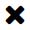

fa-times

___________________________________________________
Abbrechen, Ablehnen, Filterzelle leeren, Stornieren
___________________________________________________

fa-car

_______
Abholen
_______

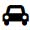

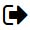

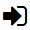

fa-sign-out

________
Abmelden
________

fa-sign-in

________
Anmelden
________

fa-unlock

________________________
Aktivieren, Freischalten
________________________

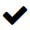

fa-refresh

Aktualisieren

fa-check

___________________________________________
Akzeptieren, Annehmen, Erledigen, Zustimmen
___________________________________________

fa-paperclip

_______
Anhänge
_______

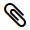

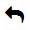

fa-reply

_________
Antworten
_________

fa-eye

________
Anzeigen
________

fa-file-archive-o

_______________________________
Archiv, aus Archiv zurück holen
_______________________________

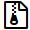

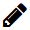

fa-pencil

__________________________________________________________
Bearbeiten, Bearbeitung fortsetzen, Editieren, Korrigieren
__________________________________________________________

fa-user

______________
Benutzer, User
______________

fa-file-image-o

___________________
Bild, Bild anzeigen
___________________

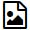

image:images/image308.jpeg[image,width=232,height=233]

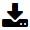

fa-font

_________________
Buchstaben-Picker
_________________

fa-download

_____________________________________________________
Datei laden, Download, Herunterladen, Laden von Daten
_____________________________________________________

fa-list-alt

__________________________________
Datensatz anzeigen, Detailauskunft
__________________________________

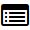

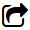

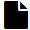

fa-share-square-o

__________________________________________________
Daten senden, Daten übermitteln, Senden, Versenden
__________________________________________________

fa-file

_______________________________
Dokument erstellen, Erstmeldung
_______________________________

fa-file-text-o

____________
Druckansicht
____________

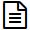

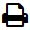

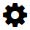

fa-print

_______
Drucken
_______

fa-cog

__________________________
Einstellung, Einstellungen
__________________________

fa-mouse-pointer

_________________
Eintrag auswählen
_________________

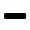

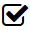

fa-file-minus

_________
Entfernen
_________

fa-check-square-o

___________
Entscheiden
___________

fa-plus

________
Ergänzen
________

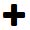

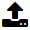

fa-bell

__________
Erinnerung
__________

fa-upload

___________
Exportieren
___________

fa-exclamation-triangle

__________________
Fehler, Fehlerhaft
__________________

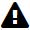

image:images/image323.jpeg[image,width=232,height=233]

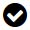

fa-eraser

_____________
Felder leeren
_____________

fa-check-circle

_____________________
Fertig, Abgeschlossen
_____________________

fa-filter

________________
Filter ausfüllen
________________

fa-history

________
Historie
________

fa-info-circle

____
Info
____

fa-arrow-circle-down

___________
Importieren
___________

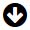

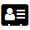

fa-calendar

________
Kalender
________

fa-address-card

_______
Kontakt
_______

fa-list

___________________________
List Picker (Objektauswahl)
___________________________

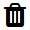

fa-trash

_______
Löschen
_______

fa-envelope

____
Mail
____

fa-envelope-o

___________
Nachrichten
___________

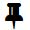

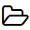

fa-thumb-tack

_____
Notiz
_____

fa-folder-open-o

____________
Seite öffnen
____________

fa-floppy-o

__________________
Sichern, Speichern
__________________

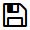

fa-arrow-circle-left

__________
Vorheriger
__________

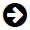

fa-arrow-circle-right

________________
Weiter, Nächster
________________

fa-repeat

___________
Wiederholen
___________

fa-star

_____________
Wiedervorlage
_____________

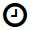

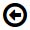

fa-clock-o

_________________
Zeit, Time Picker
_________________

fa-arrow-circle-o-left

___________________
Zurück (Navigation)
___________________

fa-share

_______________________
Zurückgeben (an Sender)
_______________________

image:images/image346.jpeg[image,width=232,height=233]

fa-user

_____________
Zuständigkeit
_____________

*Beispiel Screens*

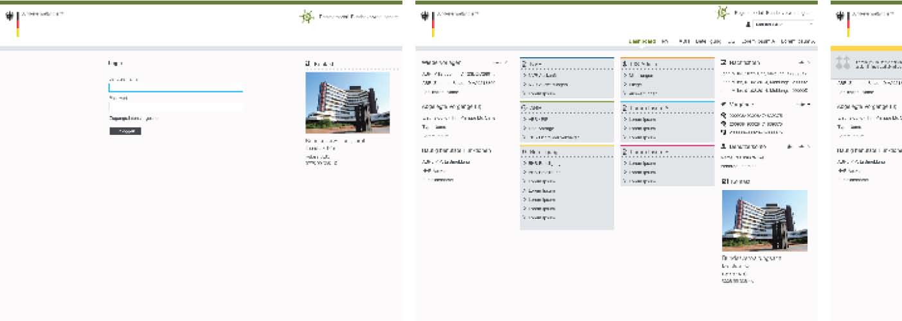

Login Seite Dashboard Dashboard – Hauptnavigation mit offenem Submenü Dashboard Unterseite Applikationsseite Applikationsseite – Beispiel Suchmaske mit optionalen

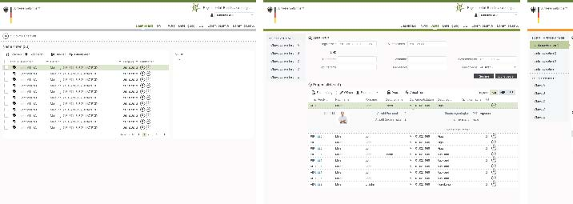

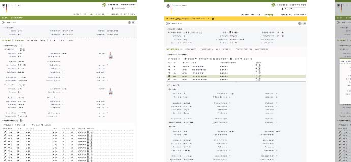

Applikation Detailseite – Beispiel A Applikation Detailseite – Beispiel B

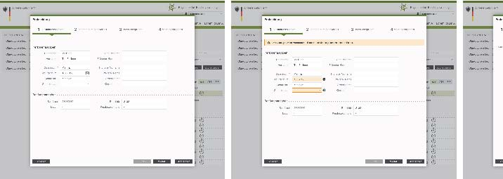

Wizard Objekt Anlage – Schritt 1a Wizard Objekt Anlage – Schritt 1b

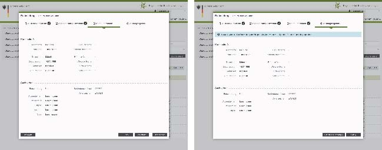

Wizard Objekt Anlage – Schritt 3 Wizard Objekt Anlage – Schritt 4

*PLIS-Webgui*

Die PLIS-Webgui ist eine kleine Beispielanwendung, die die Java-Bibliotheken PLIS-Web und PLIS-Style einsetzt.
Die Anwendung zeigt die Features der Bibliothek beispielhaft.
Bei Änderungen an der PLIS-Web und der PLIS-Style muss auch die PLIS-Webgui nachgezogen werden.

Erklärungen zur Nutzung der PLIS-Web (inkl.
PLIS-Style) sind unter Nutzung der Web-Bibliothek zu finden.

*Historie*

*Version Datum Änderung*

v1.0.0

13.02.2015

Initiale Auslieferung

*PLIS-Style*

In der PLIS-Style werden die CSS-, JavaScript- und Bilddateien des Styleguides abgelegt und für die Nutzung komprimiert und kompiliert.
Die Unterseiten dieser Seite enthalten die technische Dokumentation zur PLIS-Style mit den Themen WEB-UI-Entwicklung, Styles & Templates.

-added CSS for integration with JSF

v1.2.0 add support for IE8 without js

-changed all html5 elements (<nav>,<main>,<article>) to divs, as html5shiv for ie8 is js dependent

-patch bootstrap3 grid through stylesheets to circumvent missing media queries capability without respond.js

-added .row-df class to every .row element

-use only the large (lg) grid classes, converted all col-md,col-sm,col-xs to col-lg columns

-added error-alert in red color

-fixed no-js behaviour for disabled dropdowns on ie8, added .disabled class in markup

-improved the input divider layout markup in page-search-result.html for proper alignment

v1.1.0 final release

-added filechooser button style

-refactored a lot of code

__________________________________
v1.0.0

feature complete release

This release includes all features
__________________________________

*Einleitung*

Es wurden HTML5 Markup und Stylesheets sowie grafische Assets für eine webbasierte Benutzeroberfläche entwickelt.
Für die Entwicklung wurde der BVA User Interface Style Guide zugrunde gelegt.

Dieses Dokument beschreibt die technische Entwicklung seitens Ergosign und beinhaltet Informationen über die Projektstruktur sowie Richtlinien für Entwickler, die diese Styles und Templates implementieren.

*Gelieferte Dateien*

Es wird eine Sammlung von Dateien inklusive Quelldateien, Tools und auslieferungsfertigen Dateien mit der folgenden Dateistruktur zur Verfügung gestellt (die Einrückung und Verzeichnisse in Großbuchstaben spiegeln die Dateistruktur wider):

ICONLIBRARY (Quelldateien)

… .svg (SVG-Vektorgrafiken, die als Grundlage zum Aufbau des Icon-Fonts dienen)

SRC (Quelldateien)

image:images/image175.jpeg[image]ASSETS (Statische Dateien, die während eines Build-Prozesses in den www Ordner kopiert werden)

a.  ___
CSS
___
+
_________________________________________________________________________________________________________
bootstrap-timepicker.min.css (Style für ein jQuery Plugin)
_________________________________________________________________________________________________________
+
____________________________________________________________________________________________
datepicker.css (Style für ein jQuery Plugin)
____________________________________________________________________________________________
+
__________________________________________________________________________________________________________
ie8fixes.css (Stylesheet, das nur mit dem IE8 geladen wird)
__________________________________________________________________________________________________________
+
________________________________________________________________________________________________
image:images/image175.jpeg[image]magnific-popup.css (Style für ein jQuery Plugin)
________________________________________________________________________________________________
+
IMG
+
CONTROLS
+
… .png (Grafiken für Bedienelemente (Controls))
+
…. .png (Grafiken für das Seitenlayout und die Inhaltsdarstellung)
+
image:images/image175.jpeg[image]LIB (JavaScript-Bibliotheken wie jQuery)
+
… .js
+
PLUGINS (JavaScript Plugins für jQuery und Bootstrap, Layout-Skripte)
+
… .js
+
ICONFONT (Ein komplettes http://icomoon.io[icomoon.io] Icon-Font-Paket)
+
image:images/image175.jpeg[image]style.css (Stylesheet mit importierten Icon-Font-Angaben)
+
… (Sonstige Dateien)
+
JS (Applikationsspezifischer JavaScript-Code)
+
es.js (Code für prototypische Interaktionen)
+
onload.js (JavaScript-Code, der beim Öffnen einer Seite geladen wird)
+
image:images/image175.jpeg[image]LESS (Quelldateien der Stylesheets)
+
________________________________________________________________________
BOOTSTRAP (Original Stylesheet-Quelldateien von Bootstrap (unverändert))
________________________________________________________________________
+
___________________________________________________
ES (Applikationsspezifisch angepasste Less Dateien)
___________________________________________________
+
_____________________________________________
THIRDPARTY (Less Dateien aus anderen Quellen)
_____________________________________________
+
____________________________________________________________________________________
custom.less (Spezifische Anpassungen)
____________________________________________________________________________________
+
______________________________________________________________________________________________________
image:images/image175.jpeg[image]print.less (Anpassungen speziell für die Druckausgabe)
______________________________________________________________________________________________________
+
___________________________________________________________________________________________________
styles.less (Hauptdatei (less) für die Kompilierung)
___________________________________________________________________________________________________
+
___________________________________________________
TEMPLATES (Teilelemente der Seiten in HTML5 Markup)
___________________________________________________
+
________________________________________________________________________________________________
… .tpl (Kopf-, Fuß- und Inhaltsbereich getrennt)
________________________________________________________________________________________________
+
WWW (Verzeichnis für kompilierte Dateien – beinhaltet vorkomplierte Assets.
Dateien nicht bearbeiten!)
+
image:images/image175.jpeg[image]CSS (Stylesheets)
+
FONTS (Beinhaltet Web-Font-Dateien für den Icon-Font)
+
bootstrap-timepicker.min.css
+
datepicker.css
+
ie8fixes.css
+
image:images/image175.jpeg[image]magnific-popup.css
+
print.less (Stylesheet für die Druckausgabe)
+
styles.css (Hauptstylesheet)
+
_____________________
IMG (Bitmap Grafiken)
_____________________
+
JS (Applikationsspezifisches JavaScript)
+
image:images/image175.jpeg[image]es.js
+
onload.debug.js
+
onload.js
+
onload.js.map
+
________________________________________________
LIB (JavaScript Bibliotheken, iQuery, Bootstrap)
________________________________________________
+
___________________________________________
PLUGINS (Plugins für jQuery oder Bootstrap)
___________________________________________

___________________________________________________________________________________________________________________________________________
index.html (Übersicht über die Bedienelemente und Absprungseite für die einzelnen Templates)

… .html (Weitere statische Seitentemplates)
___________________________________________________________________________________________________________________________________________

**changelog.md** (detaillierte Änderungshistorie)

*package.json* (Definitionen der Projekt-Module inklusive Abhängigkeiten für das Grunt-BuildSystem)

*Gruntfile.js* (Ergosign spezifische Konfigurationen für das Grunt-Build-System, um das Frontend zu kompilieren)

*Technologien*

*Twitter Bootstrap*

Dieses Projekt baut auf dem Bootstrap CSS Framework in Version 3.1.1 auf.
Dieses stellt sowohl browserübergreifende, erweiterbare Styles für HTML-Elemente als auch wenige komplexere Steuerelemente mit zusätzlichem Javascript-Code zur Verfügung.

Die Bootstrap-Styles wurden entsprechend den Definitionen im Style Guide (Aussehen, Form, Farbe und Effekte) angepasst.
Hierbei wurden die originalen Quelldateien von Bootstrap im Verzeichnis src/less/bootstrap nicht verändert.
Stattdessen wurden für die applikationsspezifischen Anpassungen eigene Dateien im Verzeichnis src/less/es/ definiert, welche die vorhandenen Bootstrap Styledefinitionen überschreiben.
Im Browser werden die originalen Bootstrap-Styles geladen und von den applikationsspezifischen Styles überschrieben.
Diese Methode generiert zwar ein wenig Redundanz und Overhead, die Bootstrap Dateien bleiben aber für etwaige Versionsupdates von Bootstrap unverändert erhalten.

Bei der gesamten Entwicklung wurde darauf geachtet, dass die ursprünglichen Funktionalitäten von Bootstrap erhalten bleiben.
So können Entwickler bei aufkommenden Fragen die Bootstrap Dokumentation (http://getbootstrap.com) zu Rate ziehen.
Sollte diese Dokumentation für eine neuere Bootstrap Versionen angepasst werden und somit nicht mehr kompatibel mit dem BVA-Paket sein, werden die älteren Bootstrap-Dokumentationen in einem Archiv von einem Drittanbieter(http://bootstrapdocs.com) zur Verfügung gestellt.

*Erweiterung der Bootstrap-Basis*

Die Bootstrap-Quelldateien und die von Bootstrap bereitgestellten JavaScript-Dateien können unabhängig von den BVA-Styles und Templates aktualisiert werden.
Sollte eine neue Bootstrap Version erscheinen und es notwendig sein, neue Features und/oder Bug-Fixes zu implementieren, sollte folgendermaßen vorgegangen werden:

LESS

1.  Die neuen LESS-Quelldateien von folgender Seite herunterladen: https://github.com/twbs/bootstrap/tree/master/less.
2.  Die Dateien in src/less/bootstrap/ mit den neu heruntergeladenen Dateien ersetzen.
3.  Anpassungen und Aktualisierungen aus der neuen Less Datei less/bootstrap/variables.less per Kopieren und Einfügen in die less/es/custom-variables.less übertragen.
4.  Kompilieren der styles.less nach www/css/styles.css mit Hilfe eines Less-Compilers oder dem zur Verfügung gestellten GruntJS Build-Prozesses.
5.  Zum Abschluss müssen die Konformität mit dem Style Guide und die visuell fehlerfreie Darstellung der Applikation überprüft werden.
Möglicherweise sind noch zusätzliche Styledefinitionen oder Korrekturen nötig, um neue Bootstrap-Styles zu überschreiben.

JavaScript

1.  Die neue bootstrap.min.js-Datei von https://github.com/twbs/bootstrap/tree/master/js herunterladen.
2.  Die alte Datei src/assets/lib/bootstrap.min.js durch die neue ersetzen.
3.  Funktionalität überprüfen.

*LESS Stylesheets*

Bootstrap basiert auf der LESS Stylesheet-Sprache (http://lesscss.org) . Diese fügt Variablen, Funktionen und Operationen zur ursprünglichen CSS Funktionalität hinzu.
Dieses Projekt implementiert diese Funktionalitäten und baut darauf auf.

LESS Stylesheets müssen in CSS-Dateien kompiliert werden, damit sie für Browser lesbar sind.
Folgende Freeware-Lösungen können für diesen Schritt genutzt werden:

_______________________________________________________________________________________________
dotLess: http://www.dotlesscss.org (Windows)

Less.app: http://incident57.com/less (Mac OS)

GruntJS LESS task (Cross-platform) – siehe unten
_______________________________________________________________________________________________

Als Ergebnis der Stylesheet-Entwicklung werden Quelldateien im LESS-Format zur Verfügung gestellt.
Diese werden in die Datei www/css/styles.css kompiliert und enthält alle relevanten Styles.
Die Datei styles.less im Verzeichnis less/ ist die wichtigste CSS-Datei und Startpunkt für den CSSKompilierungsprozess.
Mit Hilfe eines LESS Compilers (dieser sollte möglichst die Importe berücksichtigen – „import aware“) wird die Datei styles.less in in die Datei styles.css kompiliert.
Es wird empfohlen, in den Einstellungen des Compilers die Funktionen „Minimieren“ und „Kommentare entfernen“ einzuschalten.
Dadurch kann die Dateigröße verkleinert werden.

Bei der von Ergosign gelieferten Datei styles.css handelt es sich um eine erste Version.
Sie kann bei Erweiterungen oder Änderungen im Projekt einfach durch Ergosign oder andere Entwickler aktualisiert werden.

Hierbei sollte beachtet werden, dass Styling-Änderungen nie in der Datei styles.css selbst angepasst werden, sondern immer die ihr zugrunde liegenden Quelldateien anzupassen sind.
Ansonsten gehen Änderungen bei einem neuen Kompilierungsprozess verloren, da die Datei styles.css wie oben beschrieben beim Kompilieren überschrieben wird.

LESS ermöglicht es, verschachtelte Selektoren zu benutzen, diese sind in den gelieferten Styles sehr häufig zu finden.
Diese Verschachtelung

erlaubt eine einfachere Wartbarkeit des Projektes, da so in den Styles teilweise die DOM-Struktur der Zielelemente widergespielt wird.

*GruntJS Build System*

GruntJS (http://gruntjs.com) ist ein modulares Kommandozeilen-Build-Programm für Webapplikationen.
Dieses Programm basiert auf JavaScript und baut auf NodeJS (http://nodejs.org) und auf der Node-eigenen Paketverwaltung NPM (Node Package Modules) auf.

GruntJS beinhaltet einen Task zur LESS-Kompilierung und einen Watch-Task.
Diese sind für die Frontend-Entwicklung sehr komfortabel.
Ergosign stellt die Datei package.json zur Verfügung.
Diese beinhaltet alle notwendigen Bibliotheken-Abhängikeiten um Grunt Tasks zu installieren und das Projekt neu zu erstellen.

Um GruntJS zur Kompilierung von BVA Stylesheets und Markup zu nutzen, muss als erstes NodeJS installiert werden.
Des Weiteren müssen Grunt und die benötigten Tasks (Es werden die folgenden Grunt-Tasks benutzt: grunt-contrib-less, grunt-contrib-watch, grunt-contribconcat, grunt-contrib-copy, grunt-contrib-clean, grunt-contrib-jshin) via npm installiert werden.
Dies kann über die Funktion „npm install“ direkt in das Hauptverzeichnis erfolgen.
Mit dem Befehl „grunt“ in einer Konsolenanwendung wird das Projekt neu erstellt.

Weitere Informationen finden sich in der GruntJS Dokumentation und in der von Ergosign gelieferten Gruntfile.js.

*Benennung der Komponenten*

Die Benennung von spezifischen Komponenten und Layout-Elementen im Code wurde der Dash-Case-Schreibweise von Bootstrap angepasst.

*CSS Raster-System*

Dieses Projekt benutzt das Bootstrap Raster-System, um das Layout und die Bedienelemente der Applikation zu strukturieren und zu positionieren.

Das Seiten-Layout wurde so optimiert, dass die Anforderungen aus dem BVA Interface Style Guide erfüllt werden.
Da keine Anpassungsfähigkeit (Responsivness) des Designs unterhalb der gängigen Desktop-Auflösung benötigt wird, wurden die „Mobile, „Small“, und „Medium“-Raster (in Bootstrap als „mobile grid“, „small grid“ und „medium grid“ gekennzeichnet) deaktiviert.

Da das Bootstrap3-Rastersystem im Internet Explorer Version 8 nur mit einem zusätzlichen Javascript (respond.js) funktioniert(http://getbootstrap.com/getting-started/#support[http://getbootstrap]http://getbootstrap.com/getting-started/#support[.com/getting-started/#support]) , haben wir zusätzliche Styledeklaration eingebaut um auf einer IE8 Umgebung ohne Javascriptfähigkeiten das Raster nutzen zu können.
Dafür bot sich das „Desktop First Grid Patch“- Projekt(https://github.com/dizzyn/bootstrap-grid-desktop-first) an.

Entwickler sollten ausschließlich die CSS-Klassen des Large (LG) Rasters benutzen (col-lg-x) um auch in diesem Fall das Spaltenraster nutzen zu können.

Weitere Informationen können der Bootstrap Dokumentation über das „grid system“ (http://getbootstrap.com/css/#grid) entnommen werden.

Die Einstellungen für das genutzte Raster (z. B. Spaltenbreite) können in der Datei src/less/es/customvariables.less nachgelesen werden.

*Zusätzliche Bibliotheken, Plugins und Skripte*

Um eine umfassendere Funktionalität zu gewährleisten, muss teilweise zusätzliches JavaScript eingesetzt werden.
Diese Skripte dienen beispielsweise zum Styling applikationsspezifischer Bedienelemente.
Optimieren der Browser-Kompatibilität oder Erweitung der Standardinteraktivität. Zu diesem Zweck wurden diverse Plugins mit freier (permissive) Software Lizenz integriert.
Diese können aktualisiert werden, wenn neue Versionen erscheinen.

*jQuery 1.11.0*

Bootstrap JS setzt jQuery voraus

*Bootstrap JS 3.1.1*

Zusätzliche JavaScript-Komponenten für erweiterte Bootstrap-Bedienelemente (affix, alert, button, carousel, collapse, dropdown, modal, popover, scrollspy,tab,tooltip,transition)

*html5shiv 3.7.0*

Erlaubt die Benutzung semantischer HTML5-Tags im Internet Explorer 8

*respond.js 1.4.2*

Ermöglicht die Darstellung des responsiven Bootstrap 3 Rasters im Internet Explorer 8 https://github.com/scottjehl/Respond

*Modernizr 2.7.1*

Ermöglicht es, herauszufinden, welche Features durch den Browser unterstützt werden und setzt dementesprechende CSS-Klassen. (- Bisher ungenutzt -)

*Bootstrap Datepicker*

Implementiert einen interaktiven Standard Date Picker. https://github.com/eternicode/bootstrap-datepicker/

*Bootstrap Select*

Implementiert eine Auswahlbox. http://silviomoreto.github.io/bootstrap-select/

*Bootstrap Timepicker*

Implementiert einen interaktiven Standard Time Picker. https://github.com/jdewit/bootstrap-timepicker/

*ExtendedBootstrapTab*

Eine erweiterte Version der Bootstrap Tabs, die das Anzeigen der Inhalte aller Tabs innnerhalb eines Tabs ermöglicht.

*harmonizePanelHeadlineWidth*

Gruppierungs-Container (panel groups) können Toolbars enthalten.
Diese wiederum können Funktionen in Form von Icon-Buttons enthalten.
Dieses Skript ermöglicht eine vertikale Ausrichtung dieser Buttons innerhalb von verschachtelten Gruppierungs-Containern unabhängig von der Länge der Gruppierungsüberschrift (Label).

*infoPanel*

Dieses Skript ermöglicht das Ein- und Ausblenden des optionalen Informationsbereiches auf den Applikationsdetailseiten.

*jquery.maskedinput.js*

Dieses Plugin unterstützt die Eingabe formatierter Daten (z. B. TT/MM/JJ) in Standard-Eingabefelder.
Zur besseren Orientierung werden Platzhalter in Form von Unterstrichen in dem entsprechenden Eingabefeld angezeigt.

*Magnific Popup 0.9.9*

Dieses Plugin ermöglicht die Verwendung einer Lightbox. 

*Functions*

Dieses Skript enthält eine Sammlung von allgemeinen Funktionen.

*Assets*

Alle benötigten Asstes wurden für die Benutzung in Browsern optimiert.
Hierfür wurden alle Dateigrößen minimiert und die Anzahl der benötigten Dateien auf ein Minimum reduziert.
Dieser Prozess beinhaltet auch die Entfernung von nicht benötigten Meta-Informationen aus dem Header von Bild-Dateien (smushit, svgmin).

*Icons*

Die Icon-Funktionalität von Bootstrap basierend auf Glyphicon-Sprites wurde entfernt, um Namenskonflikte von Icons zu verhindern.
Anstelle des Glyphicon-Sprites wurden vordefinierte Icons mittels einer Icon-Font-Technik integriert.
Ein eigens erstellter Webfont enthält die im Projekt benötigten Symbole. Über CSS-Klassen können die einzelnen Symbole referenziert werden.

Mittels eines von Ergosign definierten Workflows können neue Icons in das Interface eingefügt werden.
Das Icon-Font-Paket wird mit Hilfe der Icomoon10 Web-App aus SVG Dateien erzeugt.
Dieses Paket beinhaltet die Webfont Dateien, ein Stylesheet und eine Demo-Webseite.
Das komplette Paket wird direkt in die Struktur des Projektes eingebunden.

Als Referenz werden alle ursprünglichen Quelldateien als SVG in dem Verzeichnis /iconlibrary abgelegt.

**Neue Icons mittels **http://icomoon.io/[*Icomoon.io*]* hinzufügen*

Um ein neues Icon-Font-Paket mit icomoon zu erzeugen, sind folgende Schritte durchzuführen:

1.  http://www.icomoon.io/[www.icomoon.io] Web-App starten
2.  Die aktuelle src/iconfont/selection.json Datei importieren.
Diese enthält auch die Symbole als Vektoren im SVG Format.
3.  Neue Icons als SVG Dateien hinzufügen (Die neuen Symbole sollten immer auch im Verzeichnis /iconlibrary als Referenz abgelegt werden.)
4.  Um den neuen Web-Font zu generieren, müssen nun alle Icons in icomoon ausgewählt werden.
5.  Anpassen/Überprüfen der Einstellungen für den Web-Font, siehe Screenshot:
6.  Das neue Icon-Font-Paket herunterladen und das alte ersetzen src/iconfont.
7.  Kommen neue Icons hinzu, kann es sein, dass sich ein paar Icons verschieben und neue Unicodes erhalten.
Damit die Chevron-Icons richtig dargestellt werden, müssen in den Dateien src/less/es/expander.less und panels.less die LESS-Variablen entsprechend angepasst werden.
8.  Um die neuen Icons im Interface zu sehen, muss mittels Grunt ein neuer Build erfolgen.

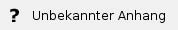

*Grafiken*

Für einige Bedien- und Layout-Elemente werden zusätzliche Bitmap Grafiken benötigt, zum Beispiel src/assets/img/controls/cb_checked_default.png (Bedienelement) und src/assets/img/bgInfoTile.png (Layout). Diese Grafiken sollten möglichst nicht verändert werden, da sie dann möglicherweise nicht mehr den Richtlinien des Interface Style Guides entsprechen.
In der Regel ist eine Bearbeitung aber auch nicht notwendig.

*Konventionen*

*HTML5 Markup*

Die Struktur des Markup der Applikationsbereich wurde mit Hilfe des W3C Validierers auf gültige Struktur überprüft („well-formed“).

*JavaScript*

Der von Ergosign erstellte Quellcode für die prototypischen Interaktionen in der Datei es.js wurde mit JSHint(http://www.jslint.com) validiert.

*Kommentare im Quellcode*

Ein Ausrufezeichen /*! innerhalb eines Kommentars zeigt an, dass dieser Kommentar auch nach der Minimierung erhalten bleibt.
Solche Kommentare werden in den publizierten Dateien aus lizenzrechtlichen Gründen angezeigt.

*Stylesheets*

LESS Stylesheets sollten im Verzeichnis /less abgelegt werden.
Um Styles besser lesen und verstehen zu können, sollten ein paar grundlegende Konventionen bei der Definition von neuen Styles und Stylesheets eingehalten werden:

______________________________________________________________________________________________________________________________________________________________________________________________________________________________
Es sollten keine IDs für das Styling benutzt werden, sondern immer Klassen.

Klassen-und ID-Namen sollten die semantische Bedeutung des Elements im Markup beschreiben und keine Styling-Informationen enthalten (z. B. eService-area statt center-column).
______________________________________________________________________________________________________________________________________________________________________________________________________________________________

Unnötige Klassen und Verschachtelungen („wrapper“-Elemente) sollten vermieden werden.

Es sollten keine Inline-Styles (style=”…”). im HTML-Dokument eingesetzt werden

Die Styles einzelner Elemente werden logisch auf verschiedene Dateien aufgeteilt, einige davon nutzen die Namen der Bootstrap Original-Dateien.

*Das LESS-Format*

Öffnende Klammern stehen in der gleichen Zeile wie die Bezeichnung des Styles.
Die schließende Klammer steht in einer neuen Zeile.

Klassen dürfen nur Kleinbuchstaben enthalten und einzelne Wörter sollten durch einen Bindestrich voneinander getrennt sein (z. B. „my-style“, „my-more-specfic-style“).

Bei Styles mit Definitionen von mehr als einer Eigenschaft steht jeder Bezeichner und Wertezuordnung in einer eigenen Zeile.
Sie sind mit dem Tabulator eingerückt und hinter dem Doppelpunkt folgt ein Leerzeichen.

Enthält ein Style nur eine Definition von einer Eigenschaft, kann alles in einer Zeile geschrieben werden.

Hexadezimalfarbwerte sollten möglichst kurz geschrieben werden (z. B. #fff).

Es werden nur Kleinbuchstaben verwendet

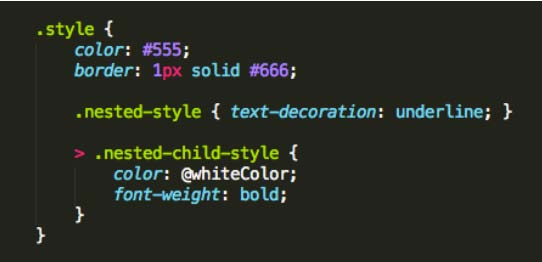

*Benutzungsrichtlinien*

Die gelieferten Styles und Templates können folgendermaßen zur Weiterentwicklung verwendet werden:

1.  Zunächst müssen die vorkompilierten Dateien aus dem Verzeichnis /www in die eigene Entwicklungsumgebung integriert werden.
Die Datei styles.css ist das wichtigste Styling-Asset.
Sie beinhaltet die Styles für alle Bedienelemente und das Layout.
Es können keine dauerhaften Änderungen an dieser Datei vorgenommen werden.
Wird die Datei verändert, so ist sie mit den LESS Quelldateien nicht mehr konform.
Wird das Projekt erneut kompiliert, so gehen die Änderungen an der styles.css verloren.
Oder
2.  Der bereitgestellte Build-Prozess kann in die eigene Entwicklungsumgebung integrierte werden sofern diese Grunt-JS unterstützt.
So können die Projekt-Assets basierend auf den Quelldateien direkt erstellt werden.
Es ist somit möglich, die Änderungen direkt in den LESS-Dateien vorzunehmen.
Die Gruntfile-Konfigurationen müssen evtl.
angepasst werden.
Es sollte darauf geachtet werden, dass die grundlegende Struktur im Verzeichnis src/ nicht verändert.
Oder
3.  Die gesamte Struktur des Prokjekts kann geändert und neue Quelldateien eingebunden werden.
Solche Änderungen sollten für Außenstehende (wie z. B. Ergosign) dokumentiert werden.
So sind alle Anpassungen gut nachvollziehbar, falls externer Support zu einem späteren Zeitpunkt notwendig sein sollte.

Weitere Informationen mit Details zur Implementierung können in den entsprechenden Quelldateien nachgelesen werden.

Die Bibliothek plis-style (https://risprepository/svns/factory-src/plis-style/) enthält alle Vorgaben und Ressourcen (CSS, JavaScript, Images, ...) des Styleguides.

Zum Aktualisieren der plis-web mit der aktuellen plis-style müssen derzeit noch folgende, manuelle Schritte durchgeführt werden:

1.  Bauen der aktuellen plis-style über grunt.
2.  Im Ordner <plis-style>/www werden alle benötigten Ressourcen generiert.
3.  Von Ordner <plis-style>/www/css die Dateien print.css, styles.css und ie8fixes.css nach <plis-web>/src/main/resources/META-INF/resources/css kopieren.
4.  Bei Änderung der Icon Fonts alle Dateien von Ordner <plis-style>/www/css/fonts nach <plis-web>/src/main/resources/META-INF/resources/css/fonts kopieren.
5.  Alle Dateien von Ordner <plis-style>/www/img nach <plis-web>/src/main/resources/META-INF/resources/img kopieren
6.  Vom Ordner <plis-style>/www/js die Datei onload.js nach <plis-web>/src/main/resources/META-INF/resources/js kopieren.
Die anderen Dateien können für das Debugging der Anwendung verwendet werden.
7.  Alle Dateien von Ordner <plis-style>/www/lib nach <plis-web>/src/main/resources/META-INF/resources/lib kopieren
8.  Alle Dateien von Ordner <plis-style>/www/plugins nach <plis-web>/src/main/resources/META-INF/resources/plugins kopieren
9.  Im Commit Kommentar die eingebaute Version der plis-style angeben.

Anmerkungen: Der Buildprozess wurde aus Aufwandsgründen derzeit noch nicht automatisiert.
Automatisierung ist z.B. über Grunt Artifactory Plug-In möglich.

